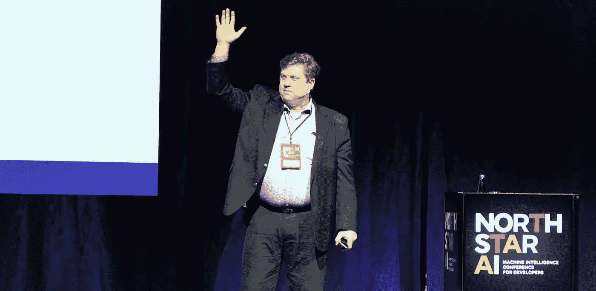
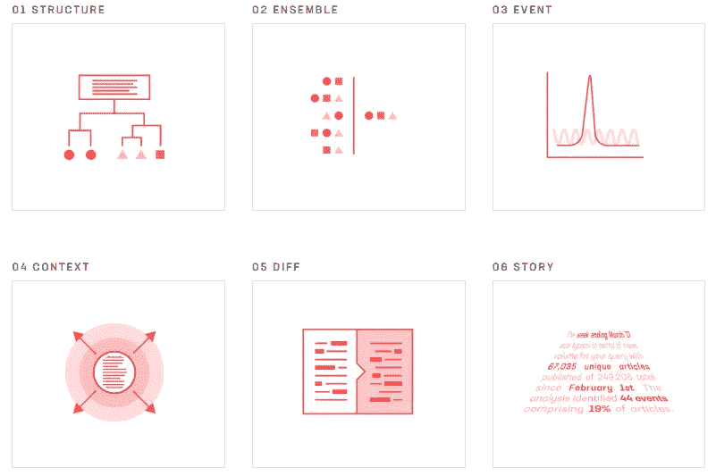
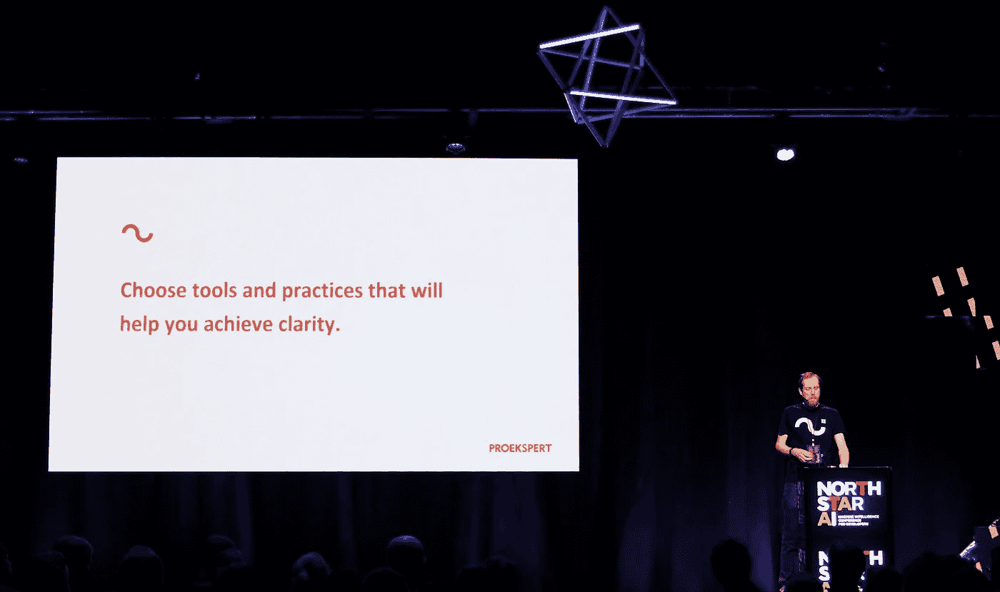

# 北极星人工智能的 5 个经验教训

> 原文：<https://towardsdatascience.com/5-lessons-learned-at-north-star-ai-11c57edcbc4d?source=collection_archive---------5----------------------->

Travis Oliphant on stage (photo credit: [Proekspert](https://proekspert.ee/))

这周我去了爱沙尼亚的塔林旅行。然而，这个城市本周最令人兴奋的不是它美丽的古镇、严寒的冬天或温和的人们——而是为开发者举办的机器智能大会 [North Star AI](https://aiconf.tech/) 的召开。

演讲时间表由人工智能和计算机科学的冠军组成，如[特拉维斯·奥列芬特](https://en.wikipedia.org/wiki/Travis_Oliphant)([NumPy](http://www.numpy.org/)的创造者)[萨扬·帕萨克](https://www.edx.org/bio/sayan-pathak-phd)([微软](http://www.microsoft.com/)的首席人工智能科学家)和[阿赫蒂·海因拉](https://en.wikipedia.org/wiki/Ahti_Heinla)([Skype](https://www.skype.com/)的联合开发者和[星际飞船](https://www.starship.xyz/)的联合创始人)等等。

我带着探索新观点、结识聪明人和向最优秀的人学习的愿望而来——你可能已经看到我在那里，急切地记笔记。在这篇文章中，我将试图从这次经历中提炼出五个教训。这些是演讲者讨论的主题中的共性模式，激发了我宝贵的见解。请注意，这些课程不一定反映演讲者的观点，而是我对他们观点的解释和总结。我们开始吧！

# 1:人工智能已经成为商业可行

Discussions at the booths (photo credit: [Proekspert](https://proekspert.ee/))

与会者本身就是人工智能技术在实际产品中新的实际可行性的证据。你会听说它在更大的公司中的应用，如 [Starship](https://www.starship.xyz/) (制造送货机器人) [Taxify](https://taxify.eu/) (将乘客与司机联系起来)和 [Elisa](https://www.elisa.com/) (一家使用人工智能创建聊天机器人以改善客户服务的电信提供商)，但也有一些初创公司和中型公司。对于许多科技初创公司来说，人工智能似乎是核心产品的一部分，在更大的公司中，这项技术通常被认为可以改善客户服务和商业智能。

这种发展的一个原因是许多机器学习框架的成熟，如 [Tensorflow](https://www.tensorflow.org/) 、 [CNTK](https://github.com/Microsoft/CNTK) 和 [PyTorch](http://pytorch.org/) 。正如特拉维斯·奥列芬特所强调的，另一个非常突出的原因是高级 API 变得可用，允许我们更快地勾画和评估模型，如 [Keras](https://keras.io/) 、 [Azure ML](https://azure.microsoft.com/en-us/services/machine-learning-studio/) 、[谷歌云 ML 引擎](https://cloud.google.com/ml-engine/)和 [AWS 机器学习](https://aws.amazon.com/machine-learning/)。这些 API 使得在一个抽象层次上开始构建机器学习模型变得非常实际，在这个抽象层次上，开发的前期成本与增加的商业价值之间取得了更好的平衡。

使人工智能更加实用的一个进展因素可能也是中介表示(IR)的标准，如 [ONNX](https://onnx.ai/) (开放神经网络交换):一种深度学习模型的开放格式，使框架之间的互操作成为可能。Travis 和 Sayan Pathak 都强调了这个观点。例如，使用 ONNX，您可以使用 CNTK 部署最初用 PyTorch 或 Caffe 构建的深度学习模型。这对于像我这样喜欢一起工作的人来说尤其令人兴奋。NET，我想，对于许多希望将深度学习集成到现有堆栈中的企业来说也是如此。ONNX 已经在许多框架中得到原生支持，并为其他一些框架提供了转换器，如 Tensorflow。

# 2:多代理系统产生巨大的力量

Primer’s six interacting agents (photo credit: [Primer](https://primer.ai/))

在那天快结束的时候，[Primer](https://www.linkedin.com/in/sgourley/)的首席执行官 Sean Gourley 对他们的产品做了一个非常有趣的介绍:一个机器学习系统，可以自动分析大型文本数据集，并生成沃尔玛等公司使用的自然语言报告。我可以推荐你去看看他们的网站，看看他们的报告——结果真的令人印象深刻。

为了实现这个雄心勃勃的目标，Primer 利用六个互动的*智能引擎—* 机器学习系统来执行不同的任务。一个引擎用于识别实体和结构化数据，而另一个引擎通过将实体关系作为时间的函数进行聚类来寻找事件。这些代理服务于不同的目的，并且可以合作使用来解决执行详尽的主题分析的更大问题。最后，他们的*故事引擎*将高维主题和事件信息放在一起，生成自然语言报告。

这种思维方式真的让我大开眼界，知道如何处理复杂的问题。就体系结构而言，多智能体系统可以相互作用，并可以以不同的方式重新组合，看起来非常强大。它将一个大问题分成较小的领域，并允许系统内的一种*群体交互*，同时使单个模块更容易测试和更新。这就像有一个多元化的团队在一起工作！

潘多拉盒子链(Pandora Boxchain)的创始人马克西姆·奥尔洛夫斯基(Maxim Orlovsky)也让人们注意到了多智能体系统的巨大力量。在实际意义上，我们很快就会发现自己处于一个互动主体的世界，就像路上的自动驾驶汽车一样。但是，随着这个独立代理生态系统的复杂性增加，我们如何保护自己免受恶意实例或恐怖分子的攻击？马克西姆强调，我们应该开始考虑管理交互代理的拜占庭容错系统——这意味着努力从不可靠的部件制造可靠的系统。

[Pandora Boxchain](https://pandoraboxchain.ai/) 是一个去中心化的区块链人工智能市场，其中机器学习模型可以通过网络来执行。在这样一个平台中，具有理性自利的网络参与者可以保护彼此免受恶意代理的侵害，激励他们的是去中心化经济学和博弈论，而不是政府监管。这是一个非常有趣和有远见的项目，我期待着在未来跟进。

# 3:人工智能不是银弹

What AI might seem like to the uninitiated (photo credit: [Markus Spiske](https://unsplash.com/@markusspiske?utm_source=medium&utm_medium=referral))

在讨论人工智能在商业中的实施时，我遇到的一个沟通挑战是，人们倾向于认为，尽管有待解决的实际问题尚未确定，但它本身将为公司做出非凡的贡献。我认为这是新技术的常见模式，因为炒作往往比理解传播得更快。

[Habib Adam](https://www.linkedin.com/in/bibzzzz),[transfer wise](https://transferwise.com/)的数据科学家很好地阐述了这一点:他建议我们应该记住是*问题驱动*而不是*解决方案驱动*。我们应该考虑我们正在经历的问题，以及哪种见解可能对我们有用，而不是试图寻找人工智能的“事情”。他强调了在考虑问题的机器学习解决方案时三个重要的因素:

> **1:随机性。我们认为这里有一种模式吗？
> **2:相关数据。我们有哪些(多少)相关数据？
> **3:行动能力**。我们可以从这些数据中采取哪些有用的行动？****

Habib 进一步解释说，当我们真正解决了一个问题，我们可以开始考虑如何使我们的解决方案更加灵活，并扩展到其他领域。

公平地说，理解如何定义这些问题可能具有挑战性，并且需要实践。为了消除误解，我们需要教育企业中的决策者，以便他们能够采取适当的行动。[人工智能咨询公司](https://www.linkedin.com/in/mlippus/) [MindTitan](https://www.mindtitan.com/) 的联合创始人 Markus Lippus 分享了一些面对这个问题的伟大观点。当与一家公司就人工智能或数据科学集成进行合作时，他们会举办研讨会。在这些方法中，重点是发现问题和找出公司的痛点——一种*问题驱动的*方法。当收集了必要的理解后，MindTitan 团队可以就人工智能解决方案在哪里以及如何为他们的业务带来价值向合作者提供适当的建议。

# 4:流程管理是扩展人工智能的关键

Andrus Kuus on stage (photo credit: [Proekspert](https://proekspert.ee/))

随着我们开始以更大的方式应用 AI/ML 解决方案，过程变得比以往任何时候都更加重要。这既是因为更广泛的系统，也是因为构建这些系统的数据科学团队越来越多。Proekspert 的软件分析师 Andrus Kuus 暗示，人工智能和数据科学领域的未来劳动力将是直接来自大学的学生(他们往往缺乏团队合作经验)，我们可以从实践中受益，以增强团队协作。他强调了他在发展数据科学团队时发现的一些观点:

> 选择有助于你实现清晰的工具和实践。
> 2:在尝试解决方案之前，提出正确的问题并验证想法。
> 3:定期讨论。

虽然我不能一字不差地记住他的建议，但我相信那是它的要点。在一个快速变化的世界中，专注于清晰性和内部沟通的批判性方法看起来绝对是一个很好的方法。

此外，我们需要记住为更大规模的人工智能系统提前做好计划。特拉维斯·奥列芬特说到重点了:**当你的模型过时时，你有计划吗？肯定会的，只是时间问题。世界一直在变化。数据以及我们与之互动的方式也是如此。因此，你应该确保你有一个计划来维护和更新你的久而久之模型。Travis 称这个过程为模型管理。**

当训练模型时，在数据分布的基础上发生一些关于决策边界的折衷。如果你处于不幸的境地，你的模型已经“过时”或者输入数据的分布已经改变，重新训练是不可行的， [DataRobot](https://www.datarobot.com/) 的数据科学家 [Peter Prettenhofer](https://www.linkedin.com/in/peterprettenhofer/) 建议研究*数据集转移。*这一概念涉及使用类似于*统计距离*和*重要性重新加权*的技术，以了解您的数据分布如何发生变化并进行纠正。

# 5:大自然是一位伟大的老师

A video from Curious AI on modeling the human brain.

好奇人工智能的首席技术官 Antti Rasmus 发表了一篇非常有趣的演讲，介绍了他们在模拟人类想象力方面所做的工作。他与丹尼尔·卡内曼的“*思考，快与慢”*做了比较，后者将人类的思维一分为二，分为两个系统:*系统 1* 用于快速和直觉的思考，系统 2 用于深思熟虑的计划和想象。在自动驾驶汽车中，这种行为的例子可以是保持在道路上(系统 1，直观且即时)同时还计划未来可能的结果，如如果行人或另一辆汽车行为异常该怎么办(系统 2，计划和想象)。好奇的人工智能已经通过他们所谓的*基于模型的强化学习*对此做出了很好的估计——他们用一种类似蜘蛛的数字生物来演示这一点，这种生物逐渐学会以非结构化的方式行走。

马克西姆·奥尔洛夫斯基在他富有远见的演讲中也强调了这一观点:在未来，我们可能会在进一步模拟生物系统方面受益匪浅。从某种意义上说，Pandora Boxchain 的去中心化思想也可以被理解为向多智能体人工智能系统引入一种类似人类的群体动力。

这些演讲引起了我的共鸣，因为我也相信理解和建模人类系统有很大的潜力等待释放。我的研究领域是利用认知科学来建模人类听觉系统，以便为音频信号处理创建更好的人工智能模型。到目前为止，这种观点对我来说非常强大，并且产生了新的想法和对问题领域更具指导性的方法。如果你有兴趣，你可以在这里阅读我的项目[的初级读本:*《AI 在音频处理中的承诺》*](/the-promise-of-ai-in-audio-processing-a7e4996eb2ca) 。

这是我从[北极星 AI](https://aiconf.tech/) 大会上获得的五个最有价值的收获。我应该向组织者和演讲者致以深深的谢意，他们开阔了我的眼界，为新思想开辟了道路。

如果这个总结对你有帮助，请留下一些掌声。