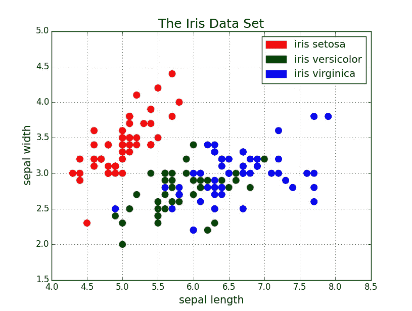
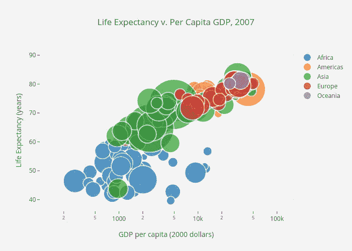
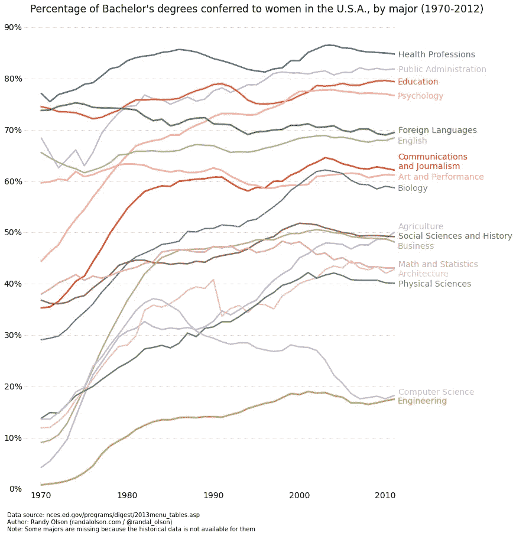
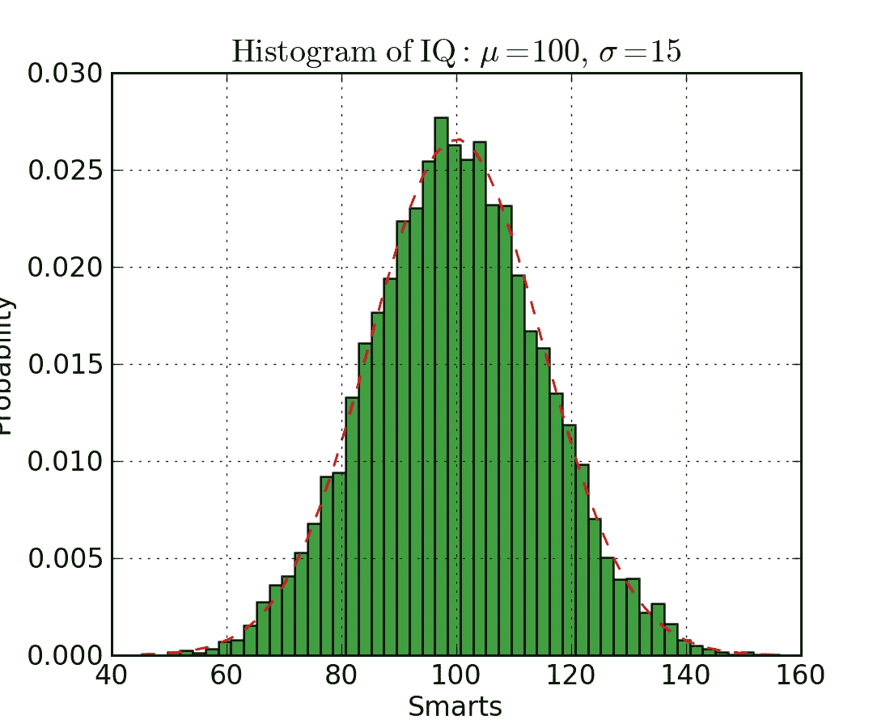
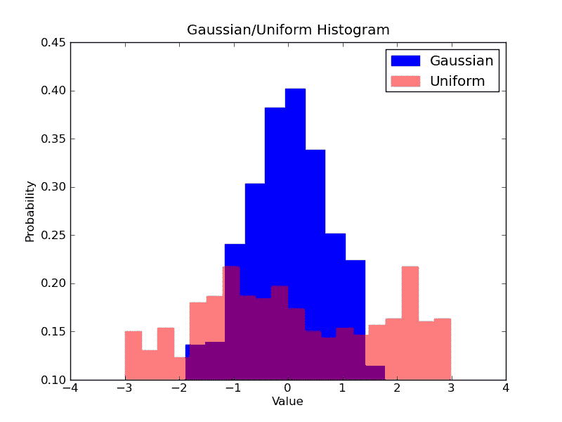
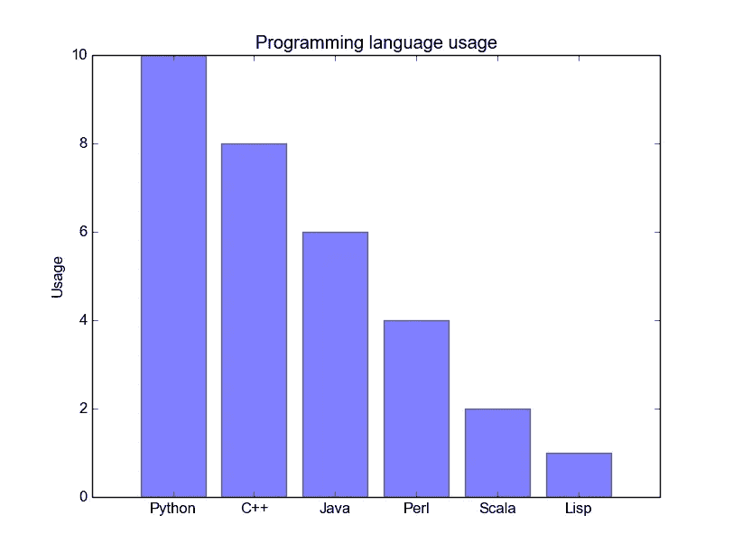
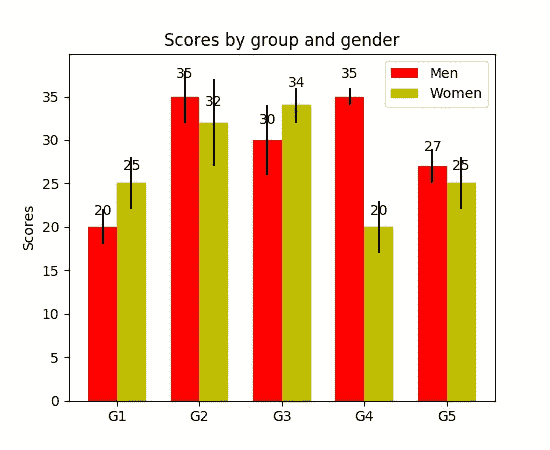
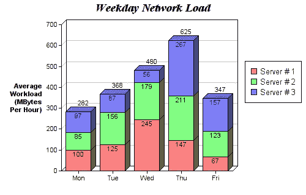
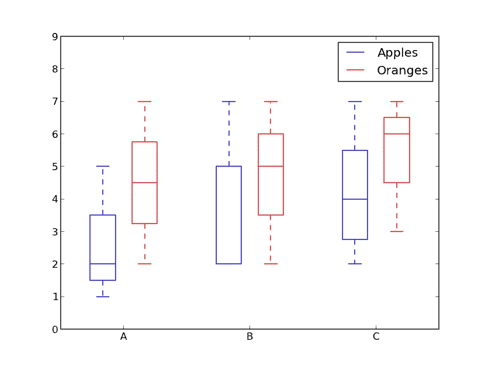

# 5 快速简单的 Python 数据可视化代码

> 原文：<https://towardsdatascience.com/5-quick-and-easy-data-visualizations-in-python-with-code-a2284bae952f?source=collection_archive---------0----------------------->

> 想获得灵感？快来加入我的 [**超级行情快讯**](https://www.superquotes.co/?utm_source=mediumtech&utm_medium=web&utm_campaign=sharing) 。😎

数据可视化是数据科学家工作的一大部分。在项目的早期阶段，您通常会进行探索性数据分析(EDA ),以获得对数据的一些见解。创建可视化确实有助于使事情更清晰、更容易理解，尤其是对于较大的高维数据集。在项目接近尾声时，能够以一种清晰、简洁、有说服力的方式展示最终结果是非常重要的，这样观众(通常是非技术客户)才能理解。

Matplotlib 是一个流行的 Python 库，可以用来非常容易地创建数据可视化。然而，每次做新项目时，设置数据、参数、图形和绘图可能会变得相当混乱和乏味。在这篇博文中，我们将看看 5 种数据可视化，并用 Python 的 Matplotlib 为它们编写一些快速简单的函数。

在我们开始之前，请查看 [***人工智能智能简讯***](https://aismart.substack.com/subscribe)*以阅读人工智能、机器学习和数据科学方面的最新和最棒的信息！*

## *散点图*

*散点图非常适合显示两个变量之间的关系，因为您可以直接看到数据的原始分布。您还可以通过对不同数据组进行颜色编码来查看这种关系，如下图所示。想要可视化三个变量之间的关系？没问题！只需使用另一个参数，如磅值，来编码第三个变量，如下图所示。我们刚刚讨论的所有这些点也与第一张图表一致。*

**

*Scatter plot with colour groupings*

**

*Scatter plot with colour groupings and size encoding for the third variable of country size*

*现在说说代码。我们先导入 Matplotlib 的 pyplot，别名为“plt”。创建一个新的绘图图形，我们称之为`plt.subplots()`。我们将 x 轴和 y 轴数据传递给函数，然后将它们传递给`ax.scatter()`来绘制散点图。我们还可以设置点大小、点颜色和 alpha 透明度。您甚至可以将 y 轴设置为对数刻度。然后专门为图形设置标题和轴标签。这是一个易于使用的功能，创建一个散点图端到端！*

## *线形图*

*当你能清楚地看到一个变量与另一个变量有很大差异时，最好使用线图，即它们有很高的协方差。让我们看下图来说明。我们可以清楚地看到，随着时间的推移，所有专业的百分比都有很大的变化。用散点图绘制这些图会非常混乱，很难真正理解和看到发生了什么。线图非常适合这种情况，因为它们基本上给了我们两个变量(百分比和时间)的协方差的快速总结。同样，我们也可以通过颜色编码来分组。从我们的第一个图表来看，折线图属于“随时间变化”类别。*

**

*Example line plot*

*这是线图的代码。和上面的散点挺像的。只有一些微小的变量变化。*

## *直方图*

*直方图对于查看(或真正发现)数据点的分布很有用。查看下面的直方图，我们在那里绘制了频率与智商的直方图。我们可以清楚地看到向中心的浓度，以及中位数是多少。我们还可以看到，它遵循高斯分布。使用条形图(而不是散点，例如)真的给了我们一个清晰的可视化，每个仓频率之间的相对差异。箱的使用(离散化)确实有助于我们看到“更大的画面”，如果我们使用没有离散箱的所有数据点，可视化中可能会有很多噪声，使我们很难看到真正发生了什么。*

**

*Histogram example*

*Matplotlib 中直方图的代码如下所示。有两个参数需要注意。首先，`n_bins`参数控制我们的直方图需要多少个离散仓。更多的垃圾箱会给我们更好的信息，但也可能引入噪音，让我们远离更大的画面；另一方面，更少的箱给了我们更多的“鸟瞰图”和更大的画面，没有更好的细节。其次，`cumulative`参数是一个布尔值，它允许我们选择直方图是否是累积的。这基本上是选择概率密度函数(PDF)或累积密度函数(CDF)。*

*假设我们想要比较数据中两个变量的分布。有人可能会认为，您必须制作两个独立的直方图，并将它们并排放在一起进行比较。但是，实际上有一个更好的方法:我们可以用不同的透明度覆盖直方图。查看下图。均匀分布的透明度设置为 0.5，这样我们可以看到它背后的东西。这使得用户可以在同一个图形上直接查看两个分布。*

**

*Overlaid Histogram*

*对于重叠直方图，需要在代码中进行一些设置。首先，我们设置水平范围来适应两种变量分布。根据这个范围和所需的箱数，我们可以实际计算每个箱的宽度。最后，我们在同一个图上绘制两个直方图，其中一个稍微透明一些。*

## *条形图*

*当您试图可视化具有很少(可能少于 10 个)类别的分类数据时，条形图最为有效。如果我们有太多的类别，那么图中的条形将会非常混乱，难以理解。它们对于分类数据来说很好，因为你可以很容易地根据条形的大小(即大小)看出类别之间的差异；类别也很容易划分和颜色编码。我们将会看到三种不同类型的条形图:常规条形图、分组条形图和堆积条形图。在我们进行的过程中，请查看数字下面的代码。*

*下面的第一张图是常规条形图。在`barplot()`功能中，`x_data`代表 x 轴上的滚动条，`y_data`代表 y 轴上的条形高度。误差线是一条额外的线，位于每条线的中心，可以用来显示标准偏差。*

*分组条形图允许我们比较多个分类变量。看看下面的第二个柱状图。我们比较的第一个变量是各组(G1 组，G2 组，...等等)。我们也用颜色代码来比较性别。看一下代码，`y_data_list`变量现在实际上是一个列表的列表，其中每个子列表代表一个不同的组。然后我们循环遍历每个组，对于每个组，我们在 x 轴上为每个刻度画一条线；每组都有颜色编码。*

*堆积条形图非常适合可视化不同变量的分类构成。在下面的堆积条形图中，我们比较了每天的服务器负载。使用彩色编码的堆栈，我们可以轻松地看到和了解每天哪些服务器工作最频繁，以及全天的负载与其他服务器相比如何。其代码遵循与分组条形图相同的样式。我们循环遍历每个组，只是这次我们在旧条的上面而不是旁边画新条。*

**

*Regular Bar Plot*

**

*Grouped Bar Plot*

**

*Stacked Bar Plot*

## *箱线图*

*我们之前看了直方图，它非常适合可视化变量的分布。但是如果我们需要更多的信息呢？也许我们想要对标准差有一个更清晰的认识？也许中间值与平均值有很大不同，因此我们有许多异常值？如果有这么大的偏斜，很多值都集中到一边怎么办？*

*这就是箱线图出现的原因。箱线图给了我们以上所有的信息。实线方框的底部和顶部始终是第一个和第三个四分位数(即数据的 25%和 75%)，方框内的波段始终是第二个[四分位数](https://en.wikipedia.org/wiki/Quartile)(中间值)。触须(即末端有条的虚线)从框中延伸出来以显示数据的范围。*

*因为盒状图是为每个组/变量绘制的，所以很容易设置。`x_data`是组/变量的列表。Matplotlib 函数`boxplot()`为`y_data`的每一列或者序列`y_data`中的每一个向量做一个方框图；因此`x_data`中的每个值对应于`y_data`中的一个列/向量。我们所要设定的就是剧情的美感。*

**

*Box plot example*

*Box plot code*

## *结论*

*使用 Matplotlib 有 5 个快速简单的数据可视化。将事物抽象成函数总是让你的代码更容易阅读和使用！我希望你喜欢这篇文章，并学到一些新的有用的东西。*