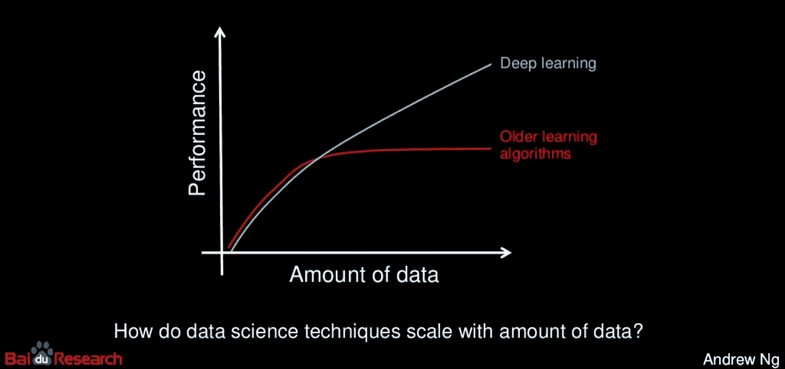
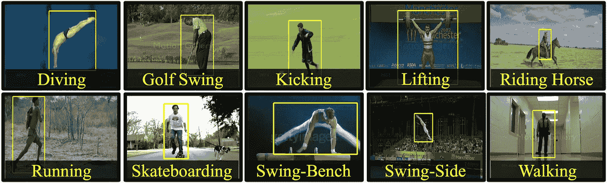
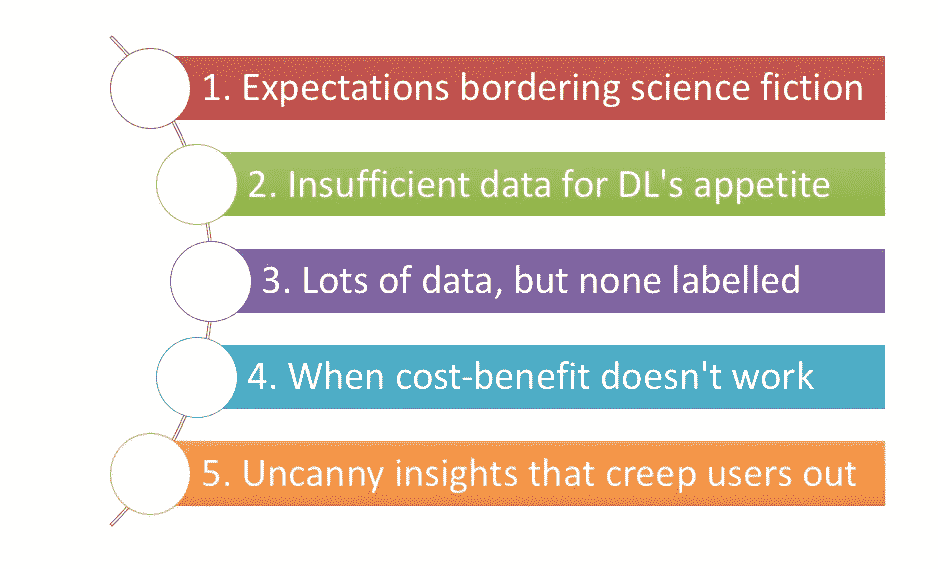

# 企业难以采用深度学习的 5 个原因

> 原文：<https://towardsdatascience.com/5-reasons-why-businesses-struggle-to-adopt-deep-learning-85205e11d69a?source=collection_archive---------7----------------------->

Photo by [John Baker](https://unsplash.com/photos/UzOKDfoRrDU?utm_source=unsplash&utm_medium=referral&utm_content=creditCopyText) on [Unsplash](https://unsplash.com/?utm_source=unsplash&utm_medium=referral&utm_content=creditCopyText)

## 当巨大的潜力不能转化为商业利益时

*更新:你现在可以用* [*日文*](http://ainow.ai/2019/02/12/162876/) *阅读这篇文章(感谢 Koki Yoshimoto)。*

所以，你已经听说了关于深度学习(DL)的令人眼花缭乱的推销，并且想知道它是否实际上在生产中有效。这是公司努力解决的首要问题。常年商业利益的乐土是现实吗？

在之前的一篇文章中，我们看到了深度学习的简单业务介绍，这种技术似乎对几乎任何问题都有一个整洁的解决方案。

 [## 深度学习热潮背后的真正原因

### 一个简单的英文解释，减去数学，统计和代码

towardsdatascience.com](/decoding-deep-learning-a-big-lie-or-the-next-big-thing-b924298f26d4) 

**但是，当橡胶落地时会发生什么？**

衡量一项创新成熟程度的一个好方法是，理解它在销售阶段过后很久在市场上的表现。在 Gramener [人工智能实验室](https://gramener.com/ailabs/)，我们一直在研究深度学习的进展，并将它们转化为映射到客户问题的具体项目。

我将分享过去一年我们在 DL 解决方案项目实施中的一些心得。这是一个大杂烩，有成功的故事，也有一些挫折，我们看到最初的魅力由于地面上的障碍而逐渐消失。

以下是 DL 项目嘎然而止的五个原因，尽管它们是怀着最美好的愿望开始的:

## 1.接近科幻小说的期望

Source: [GIPHY](https://media.giphy.com/media/gZEBpuOkPuydi/giphy.gif)

是的，随着自动驾驶汽车、无人机送披萨和机器读取大脑信号，人工智能正在迅速成为现实。但是，其中许多仍在研究实验室中，只能在精心策划的场景下工作。

生产就绪的产品和仍在想象中的产品之间只有一线之隔。企业经常误解这一点。在解决雄心勃勃的挑战的喜悦中，团队深入到另一边。

这就是人工智能觉醒可能发生的地方，促使企业变得过度谨慎，并后退许多步。通过一些尽职调查，必须确定业务就绪的 DL 用例。一个人可以雄心勃勃，挑战极限，但关键是少承诺多兑现。

## 2.缺乏数据来满足巨头的胃口

Performance of analytics techniques vs data volume, by [Andrew Ng](https://www.slideshare.net/ExtractConf)

分析带来魔力是因为数据，而不是尽管数据不存在。不，深度学习没有解决数据不可用这一日益恶化的挑战。如果说有什么不同的话，那就是 DL 对数据的胃口更加贪得无厌。

要建立一个简单的基于面部识别的考勤系统，员工的面部照片是所需的训练数据。这些照片可能是现场录制的，也可能是带有某些特征变化(方向、眼镜、面部毛发、灯光)提交的..).通常，这样的数据收集会很快变成一个小型项目。

项目发起人通常假定这些数据是可用的或容易收集的。在尽了最大努力之后，他们最终得到的只是部分数据，这些数据提供了中等的准确性。这种轻微的不足可能意味着生产级解决方案和一个有吸引力的研究原型之间的差异。

## 3.大量的训练数据，但没有标记

Labeled dataset on Sports actions from [UCF](http://crcv.ucf.edu/data/UCF_Sports_Action.php)

当一个由一百万个数据点组成的数据库可供个人使用时，这是否足以让 DL 展现魔力？嗯，没那么快。训练数据需要煞费苦心的标注才能让模型学习。这一点经常被忽视。

算法需要在图片周围画出方框来学习识别人物。面孔需要被贴上名字标签，情绪必须被标记，说话者的声音必须被识别，甚至一个数字表也应该用详细的元数据来描述。

有人可能会说，哇，工作量真大。但这是教授 DL 模型所需要付出的努力。后备选项是更痛苦的过程 [*特征提取*](/decoding-deep-learning-a-big-lie-or-the-next-big-thing-b924298f26d4) (判断眼睛或鼻子是否最能区分人脸的手工工作)。

## 4.当成本效益权衡不合理时

Photo by [rawpixel](https://unsplash.com/photos/ixqauhAL34o?utm_source=unsplash&utm_medium=referral&utm_content=creditCopyText) on [Unsplash](https://unsplash.com/search/photos/money?utm_source=unsplash&utm_medium=referral&utm_content=creditCopyText)

收集和标记数据的努力，加上 GPU 级别的计算可能会被证明是昂贵的。再加上持续的努力，通过贴标签、培训和调整来维护生产模型。现在，总拥有成本飙升。

在某些情况下，人们很晚才意识到，为人工检查和分类配备人员比进行这种繁琐的工作要便宜。谈到大容量和可伸缩性，DL 又开始有意义了。但是，并不是所有的企业在开始时都将这一需求作为优先事项。

随着 DL 研究的稳步发展，这种情况每天都在发生变化。因此，尽早检查 DL 总拥有成本至关重要。有时，推迟投资直到成本经济变得有利可能是明智的。

## 5.当洞察力如此聪明以至于人们被吓到时

Photo by [sebastiaan stam](https://unsplash.com/photos/KuMHZq-o6Zw?utm_source=unsplash&utm_medium=referral&utm_content=creditCopyText) on [Unsplash](https://unsplash.com/?utm_source=unsplash&utm_medium=referral&utm_content=creditCopyText)

这种担忧与此截然相反。有些用例被证明是 DL 的最佳选择，在这些用例中，数据可用性和业务需求已经成熟。当星星排成一线时，模型就变成了预言！

这里的挑战是，模型知道的太多了，甚至在人们说出它的必要性之前。这时它穿过了令人毛骨悚然的区域。在感觉到需求之前交叉销售产品，或者通过跟踪内部网聊天来检测更深层次的员工断开连接，这可能很有诱惑力。

但这些引发了道德困境的问题，或对客户或员工的数据隐私产生了怀疑。当怀疑一个用例是否会疏远目标受众时，公司必须让它通过，尽管潜在的可能性就在眼前。记住，权力越大，责任越大。

## 摘要

5 Reasons why Deep learning projects fizzle out

这是深度学习令人兴奋的日子，有着恒星般的进步和无限的承诺。但是，要将这种不受约束的力量转化为实际的商业利益，我们必须小心这五个陷阱。

确保数据的可用性、为培训进行标记的可行性，并验证企业的总拥有成本。最后，在不吓跑用户的情况下，找出能让用户兴奋和有能力的正确用例。

你可能想知道相对于其他技术，什么时候必须使用深度学习。总是从简单的分析开始，然后通过统计进行更深入的探索，只有在相关的时候才应用机器学习。当所有这些都不具备时，一些替代的专家工具集的时机已经成熟，拨入深度学习。

*如果你觉得这很有趣，你会喜欢我写的这些相关文章:*

*   [*每个数据科学团队需要雇佣的 3 个缺失角色*](/the-3-missing-roles-that-every-data-science-team-needs-to-hire-97154cc6c365)
*   [*让你在数据科学职业生涯中不可或缺的 4 种超能力*](/4-superpowers-that-will-make-you-indispensable-in-a-data-science-career-6571e8e7d504)

*对数据科学充满热情？随时在*[*LinkedIn*](https://www.linkedin.com/in/gkesari/)*上加我，订阅我的* [*简讯*](https://gkesari.substack.com/) *。*

下面是这篇文章的 4 分钟视频。