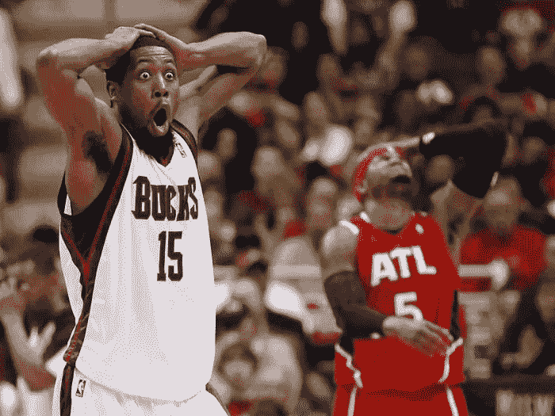
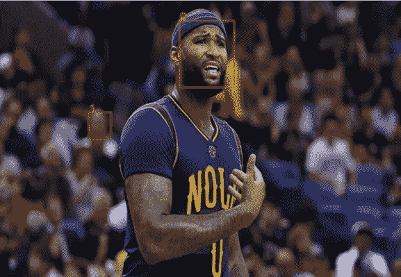

# 我在每个 NBA 球员身上训练人工智能模型学到的 5 件事

> 原文：<https://towardsdatascience.com/5-things-i-learned-training-an-ai-model-on-every-nba-player-32d906b28688?source=collection_archive---------5----------------------->

听起来很容易。只需在 2017 赛季的每个 NBA 球员身上训练一个面部识别模型。但是这真的很有挑战性。以下是我学到的可能会为你节省很多时间的东西。

**你需要高质量的面部识别**——我当然推荐 [Facebox](http://machinebox.io) 。它的技术水平[和我的测试](https://hackernoon.com/which-face-recognition-technology-performs-best-c2c839eb04e7)比任何其他商业面部识别工具都要好，包括大型云供应商(认知服务)。识别一张脸是一回事，但如果你要花一天时间收集每个 NBA 球员的每张照片，你不会希望你的时间浪费在训练一个表现不太好的模型上。

仔细想想你这么做的原因。不是作为一个存在的问题，而是作为对你的用例的一个现实的评估。如果您正在训练一个模型来检测正在踢足球的 NFL 球员，您可能需要三思而行，是否要用他们的脸来训练他们，并且可能需要更多地考虑他们的头盔是如何模糊识别的。当我们训练模型来检测美国政治家时，我们使用他们的官方肖像作为训练集。这很有效，因为在现实生活中，当他们在镜头前或照片中时，他们经常使用与拍摄专业照片时相同的面部表情。而对于 NBA 球员，我注意到比赛镜头中的画面经常会出现一些搞笑的面部表情，这些表情与他们的官方 NBA 肖像如此不同，以至于人脸识别技术可能很难识别他们。

[https://i.pinimg.com/originals/f5/29/61/f52961a1ad612b58244b924273f0a6da.jpg](https://i.pinimg.com/originals/f5/29/61/f52961a1ad612b58244b924273f0a6da.jpg)

你还会遇到出汗、受伤和很多脸远离镜头的问题。最好获得尽可能多的训练数据来考虑这些用例及场景。我使用了很多实际打篮球的每个球员的照片，这样我就能确保这个模型很好地表现了每个球员在不同场景下的脸。

**训练照片的质量**。这让我大吃一惊，不幸的是，收集训练集的时间增加了一倍。在我第一次去的时候，为了节省时间和磁盘空间，我为每个玩家提取了照片的缩略图。这些缩略图大约有 11KB。该模型的准确性不是我想要的，我能够跟踪问题到训练照片的文件大小和保真度。我煞费苦心地回去，拉了每个球员的高分辨率照片，文件大小不低于 70KB。这大大提高了模型的准确性，一旦它在这个新的数据集上进行训练。如果我一开始就知道这一点，我可以节省无数的工作时间。

**确保你的照片中有一张脸。**

[https://clutchpoints.com/wp-content/uploads/2017/03/DeMarcus-Cousins.jpg](https://clutchpoints.com/wp-content/uploads/2017/03/DeMarcus-Cousins.jpg)

这听起来可能是显而易见的，但你会惊讶于先进的面部识别模型能够获得什么。在篮球运动中，一些球员最伟大的投篮是在球场上，自然也有其他球员和观众。即使照片的景深只显示了对焦的玩家也是一个问题。失焦的人脸可能仍然会被注册为人脸，当然，模型将不会知道你想教哪张脸。

**数据收集是最难的部分。**像 [Machine Box](http://machinebox.io) 这样的工具让使用机器学习变得非常容易。这是因为真正困难的部分是收集好的训练数据。你必须像数据科学家一样思考，在某些方面，当开始训练模型时，你必须成为一名数据科学家(尽管是业余的)。你必须考虑你的用例，分析你选择的数据，也许在你花一天时间从网上下载每一个 NBA 球员的照片之前，先做一些测试。