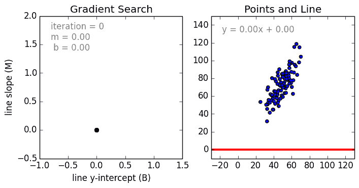
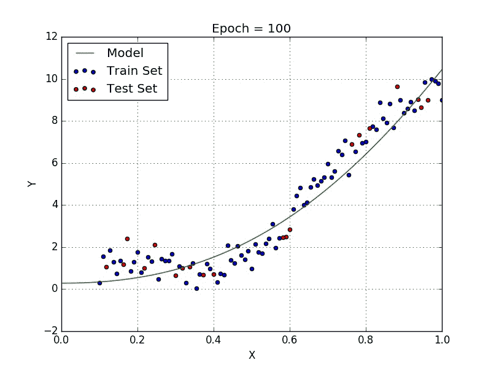

# 5 种回归类型及其性质

> 原文：<https://towardsdatascience.com/5-types-of-regression-and-their-properties-c5e1fa12d55e?source=collection_archive---------1----------------------->

> 想获得灵感？快来加入我的 [**超级行情快讯**](https://www.superquotes.co/?utm_source=mediumtech&utm_medium=web&utm_campaign=sharing) 。😎

线性和逻辑回归通常是人们学习机器学习和数据科学的第一个建模算法。两者都很棒，因为它们易于使用和解释。然而，它们固有的简单性也有一些缺点，在许多情况下，它们并不是回归模型的最佳选择。事实上有几种不同类型的回归，每一种都有自己的优点和缺点。

在本帖中，我们将探讨 5 种最常见的回归算法及其特性。我们很快就会发现，他们中的许多人偏向于在特定类型的情况下和特定类型的数据中工作良好。最后，这篇文章将为你的回归工具箱提供更多的工具，并从整体上给你回归模型更多的洞察力！

## 线性回归

回归是一种技术，用于建模和分析变量之间的关系，通常是它们如何共同产生特定的结果。线性回归是指完全由线性变量组成的回归模型。从简单的例子开始，单变量线性回归是一种使用线性模型(即直线)对单个输入自变量(特征变量)和输出因变量之间的关系进行建模的技术。

更一般的情况是多变量线性回归，其中为多个独立输入变量(特征变量)和一个输出因变量之间的关系创建模型。该模型保持线性，因为输出是输入变量的线性组合。我们可以按如下方式建立多变量线性回归模型:

*Y = a1 * x1+a2 * x2+a3 * x3……a_n*X_n + b*

其中 *a_n* 为系数， *X_n* 为变量， *b* 为偏差。正如我们所看到的，这个函数不包含任何非线性，因此只适合于建模线性可分的数据。这很容易理解，因为我们只是使用系数权重 *a_n* 来加权每个特征变量 *X_n* 的重要性。我们使用随机梯度下降(SGD)来确定这些权重 *a_n* 和偏差 *b* 。查看下图，获得更直观的图片！

Illustration of how Gradient Descent find the optimal parameters for a Linear Regression

关于线性回归的几个要点:

*   快速且易于建模，当要建模的关系不是非常复杂并且您没有大量数据时尤其有用。
*   非常直观的理解和解读。
*   线性回归对异常值非常敏感。

## 多项式回归

当我们想要创建一个适合处理非线性可分数据的模型时，我们需要使用多项式回归。在这种回归技术中，最佳拟合线不是直线。而是一条符合数据点的曲线。对于多项式回归，一些自变量的幂大于 1。例如，我们可以有这样的东西:

y = a1 * x1+(a2)* x2+(a_3)⁴*x_3……)。a_n*X_n + b

我们可以让一些变量有指数，另一些没有，也可以为每个变量选择我们想要的确切指数。然而，选择每个变量的确切指数自然需要了解数据与输出之间的关系。有关线性回归和多项式回归的直观比较，请参见下图。

Linear vs Polynomial Regression with data that is non-linearly separable

关于多项式回归的几个要点:

*   能够对非线性可分离数据建模；线性回归做不到这一点。一般来说，它更加灵活，可以模拟一些相当复杂的关系。
*   完全控制特征变量的建模(设置哪个指数)。
*   需要精心设计。需要一些数据知识，以便选择最佳指数。
*   如果指数选择不当，容易过度拟合。

## 里脊回归

在特征变量之间存在高度共线性的情况下，标准线性或多项式回归将会失败。共线性是独立变量之间存在近似线性的关系。高度共线性的存在可以通过几种不同的方法来确定:

*   回归系数并不显著，即使理论上该变量应该与 y 高度相关
*   添加或删除 X 特征变量时，回归系数会发生显著变化。
*   您的 X 特征变量具有高度的成对相关性(检查相关性矩阵)。

我们可以先看看标准线性回归的优化函数，以了解岭回归是如何帮助我们的:

*min || Xw - y ||*

其中 *X* 代表特征变量， *w* 代表权重， *y* 代表地面真实值。岭回归是一种补救措施，用于减轻模型中回归预测变量之间的共线性。共线性是一种现象，在这种现象中，多元回归模型中的一个特征变量可以通过其他特征变量以相当高的准确度进行线性预测。由于特征变量以这种方式如此相关，最终的回归模型在其近似中是非常受限和严格的，即它具有高方差。

为了缓解这一问题，岭回归为变量增加了一个小的平方偏差因子:

*最小|| Xw — y || + z|| w ||*

这种平方偏差因子使特征可变系数远离这种刚性，将少量偏差引入到模型中，但极大地减少了方差。

关于岭回归的几个要点:

*   该回归的假设与最小二乘回归相同，只是不假设正态性。
*   它缩小了系数的值，但没有达到零，这表明没有特征选择特征

## 套索回归

套索回归与岭回归非常相似，因为两种技术有相同的前提。我们再次向回归优化函数添加了一个偏置项，以减少共线性的影响，从而减少模型方差。但是，lasso 没有使用像岭回归这样的平方偏差，而是使用绝对值偏差:

*min || Xw — y || + z|| w ||*

岭回归和套索回归之间存在一些差异，这些差异本质上可以追溯到 L2 正则化和 L1 正则化的属性差异:

*   内置的特征选择:经常被认为是 L1 规范的一个有用的属性，而 L2 规范没有。这实际上是 L1 范数的结果，它倾向于产生稀疏系数。例如，假设模型有 100 个系数，但其中只有 10 个具有非零系数，这实际上是说“其他 90 个预测器在预测目标值时是无用的”。L2 范数产生非稀疏系数，所以不具有这个性质。因此，可以说套索回归是一种“参数选择”，因为未被选择的特征变量的总权重为 0。
*   稀疏性:指一个矩阵(或向量)中只有极少数的元素是非零的。L1 范数具有产生许多具有零值或非常小的值的系数以及很少的大系数的性质。这连接到 Lasso 执行一种特征选择的前一点。
*   计算效率:L1-诺姆没有解析解，但 L2-诺姆有。这允许高效地计算 L2 范数解。然而，L1 范数解确实具有稀疏特性，这允许它与稀疏算法一起使用，这使得计算在计算上更有效。

## 弹性网络回归

ElasticNet 是套索和脊回归技术的混合。它同时使用 L1 和 L2 正则化，并具有这两种技术的效果:

*min | | Xw—y | |+z _ 1 | | w | |+z _ 2 | | w | | |*

在套索和脊之间进行权衡的一个实际优势是，它允许弹性网在旋转下继承脊的一些稳定性。

关于 ElasticNet 回归的几个要点:

*   在变量高度相关的情况下，它鼓励群体效应，而不是像 Lasso 一样将一些变量置零。
*   所选变量的数量没有限制。

## 结论

你有它！5 种常见的回归类型及其性质。所有这些回归正则化方法(Lasso、Ridge 和 ElasticNet)在数据集中变量之间存在高维度和多重共线性的情况下都能很好地工作。我希望你喜欢这篇文章，并学到一些新的有用的东西。