# 数据可视化可能存在的 5 种方式

> 原文：<https://towardsdatascience.com/5-ways-data-visualizations-can-lie-46e54f41de37?source=collection_archive---------2----------------------->

在一个越来越受数据驱动的世界里，从新闻提要到活动跟踪，图表开始随处可见。有些很漂亮(纽约时报可视化实验室做了惊人的工作)，但更多的时候质量会有所欠缺，结果会令人困惑甚至误导。

我们使用可视化来压缩数据，以创建对趋势的直观理解。我们将讨论在展示数据时可能犯的一些基本错误，但首先快速浏览一下图表的结构:

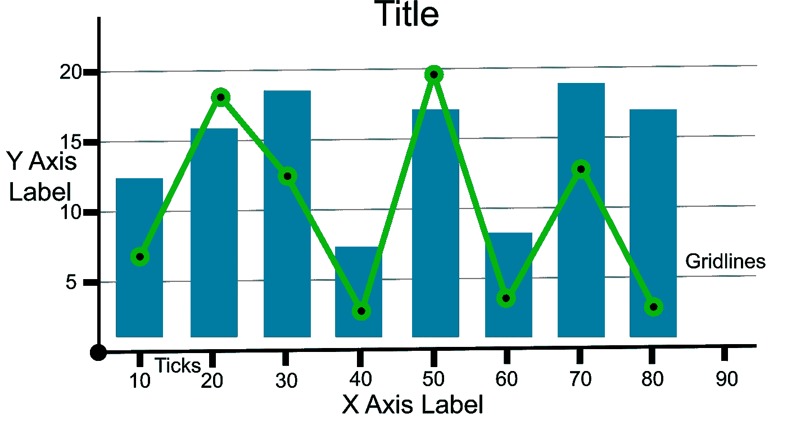

可视化的元素可以通过强调或减少数据影响的方式进行修改。网格线或刻度数量的变化可以强调粒度，标签可以精心制作以产生偏见，或者颜色选择可以唤起潜意识的情绪反应。我将探索修改可视化的方法，包括:

*   轴向裁剪
*   轴缩放
*   扔掉
*   饼图
*   2 轴图

对于其中的每一个都有特定的情况，这些技术也可以用来帮助可视化制作一个更清晰的故事，所以像数据科学中的大多数东西一样，它们是可以使用或滥用的工具。

# 轴向裁剪

X 和 Y 轴是理解图的比例和关系的关键。可以为 X 或 Y 维度(或两者)裁剪一个轴，以显示数据的子集。取决于什么样的节目和情节类型，这可能是偶然发生的，也可能是故意的。我想我们所有人都可以在这些数据中找到一些图表，让他们的观点看起来更有道理。

这是相同数据的三个直方图。通过限制轴，它不仅减少了多少是可见的比例也发生了变化。在中间的例子中，y 轴的裁剪使得增加看起来比未编辑时更陡。

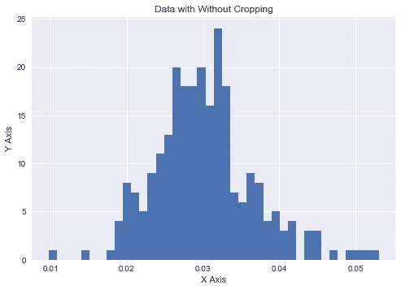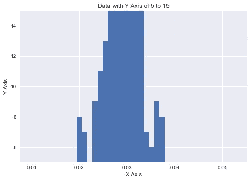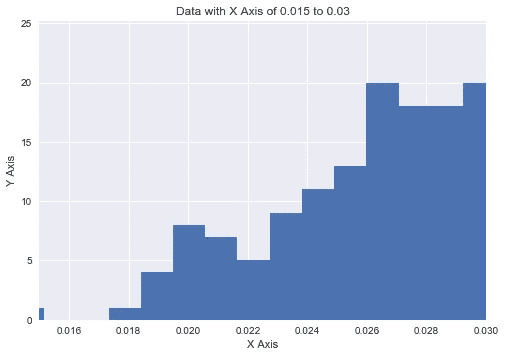

有时，有一个很好的理由进行裁剪。如果可视化的想法是讲述一个故事，这可能是一个无价的工具来强调一个变化。这是一篇很棒的文章，当它真正有帮助的时候:

 [## 不要从零开始你的 y 轴是可以的

### 在 Quartz，我们一年制作数千张图表，当我们收到关于它们的投诉时，通常是 y 轴…

qz.com](https://qz.com/418083/its-ok-not-to-start-your-y-axis-at-zero/) 

然而，我已经看到了许多这样的例子，它被用来通过过度夸大关系规模来混淆人们，使差异看起来比实际情况更大(当轴上的数字被完全省略时，情况会变得更糟)。这是一篇关于图表如何被大量编辑以使某些东西看起来与实际结果不同的惊人帖子:

 [## 肉商:你想要腿的哪一部分？我:全部，请分成五份

### 这张美国广播公司的新闻图表似乎占据了我的 Twitter feed 的顶部，所以我最好对它进行评论。ABC 新闻的某人…

junkcharts.typepad.com](http://junkcharts.typepad.com/junk_charts/2017/02/butcher-which-part-of-the-leg-do-you-want-dataviz-folly.html) 

裁剪图表的轴可以隐藏各种问题。当我在 [Kaggle 泰坦尼克号比赛](https://www.kaggle.com/kefortney/titanic/titanic-maritime-machine-learning)上尝试我的第一个机器学习问题时，在提供的数据集中有多个年龄缺失。下面的直方图显示了年龄的分布(对于那些有过的人)。

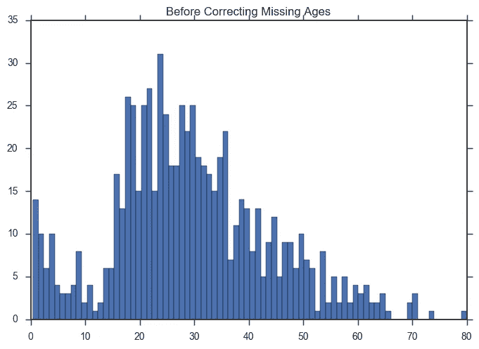

我通读了其他内核，并从他们解决问题的方法中获得了灵感。一份提交的材料特别使用了老鼠(R 中的一个包)来填写年龄。我复制了他们所做的，并运行它来理解它是如何工作的。在我 16 岁左右的时候，每次都有一个巨大的峰值，但是他们笔记本上的图像没有显示任何峰值。左边是我做的时候发现的，右边是我在他们笔记本上看到的:

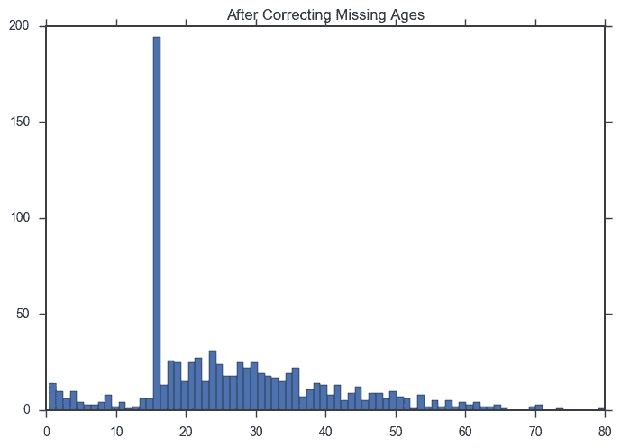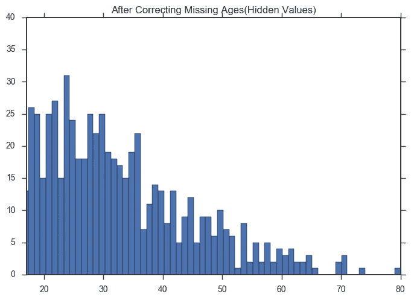

过了几个小时，我才意识到他们的直方图被设置为隐藏任何 16 岁以下的年龄，从而掩盖了数据中的峰值。我用了另一种方法来填写年龄，但这对我来说是一个教育时刻。

# 轴缩放

比较图表时，了解它们是否设置为相同的比例非常重要。根据所使用的可视化程序，轴通常会自动调整到最佳状态。如果有多个图表的数据不完全相同，那么一个图表中的一英寸可能等于 10，而另一个图表中的一英寸可能等于 30。

当我为一个客户处理数据集时，我曾经艰难地了解到这一点。得出几个结论后，我正准备完成演示，这时我意识到我比较的两个图表是完全不同的尺度。我及时发现了这一点，但是我在报告中的结论被修改得更加谨慎了。

我也一直在研究佛蒙特州[伯灵顿的警察违规公开数据](https://data.burlingtonvt.gov/)(见我的帖子[这里](https://medium.com/@kefortney/what-can-you-learn-from-burlington-police-data-8f541bdc845a))并遇到了同样的问题。伯灵顿有两条不同的街道，每条街道都有违章记录。

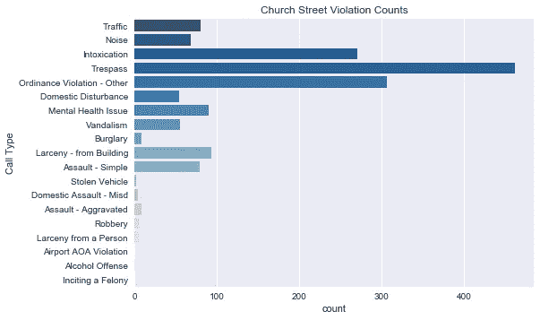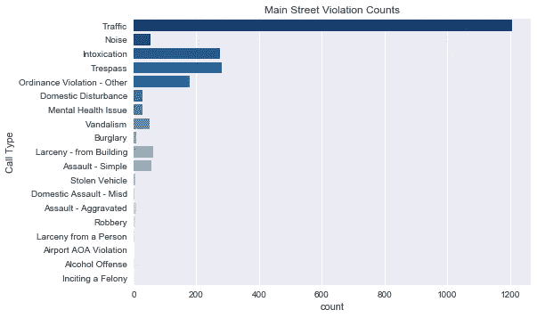

上面看起来教堂街比主街的非法侵入量大四倍，但是下面当我们把它们按同样的比例缩放时，很明显非法侵入的数量更接近相同。更清楚的是，由于那里的交通事故，Main Street 总共有更多的违规行为，这是最初的图表一眼不会告诉你的。

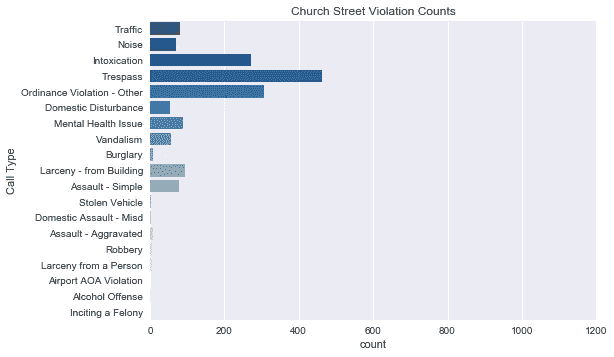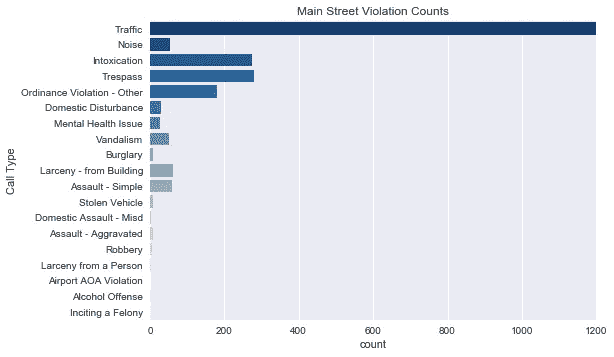

与第一个问题不同，这通常是一个错误。可视化的默认行为通常会自动引入问题。只需记住在比较图表时进行比较的重要性，并注意观察坐标轴。

# 扔掉

直方图是理解数据分布的非常有用的方法。在某些方面，它通过计算一定范围内的数据点数量来换取绝对的准确性。这被称为宁滨，bin 值 10 将从零到最大值拆分成 10 个桶。

有几个公式可用于确定容器大小；斯特奇斯公式、赖斯法则和弗里德曼-迪阿科尼斯选择都是很好的起点。但是，让我们首先考虑不同的宁滨可以是什么样的直方图序列:

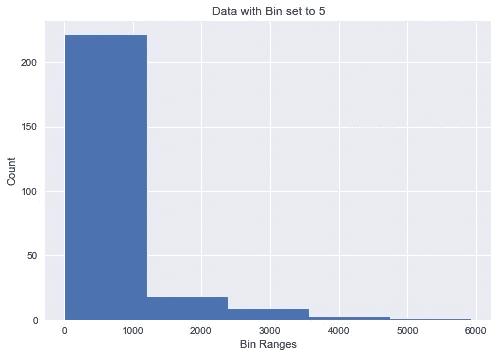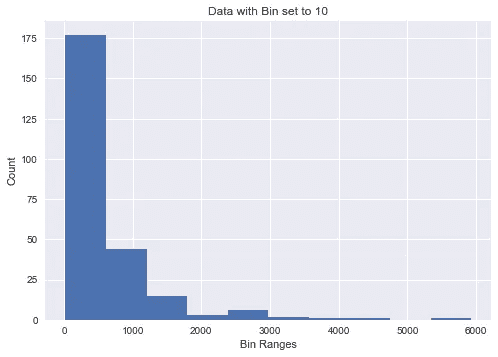

在上面的例子中，不难看出通过改变容器，洞察力会如何改变。通过仔细的宁滨，一些不规则性可以被掩盖，或者在特定值的异常值可以被平滑。

此外，还必须考虑 y 轴比例随频段的变化。如果将 500 个总值分成 5 个箱，而不是 100 个箱，那么会产生很大程度的缩放。如果相互比较直方图，请记住确保柱是相同的，轴也是相同的。

# 饼图

饼图通常是展示复杂信息的糟糕方式。当切片数量超过三个左右时，我们的大脑不太擅长比较切片。更糟糕的是，许多标签看起来很酷，但实际上很难辨认。

看一看左边没有标签的模拟饼图，试着猜测各种比例关系，然后在右边添加标签的位置。

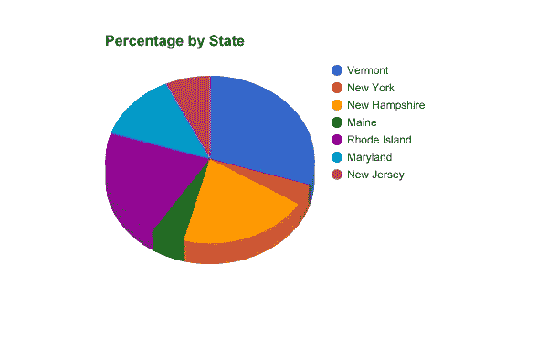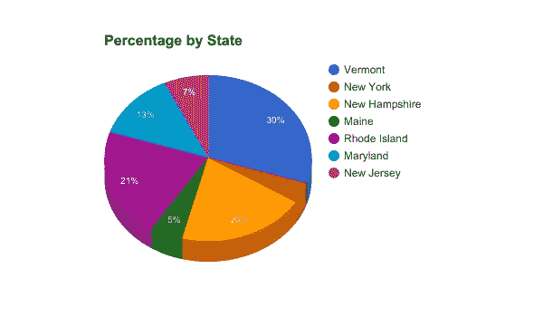

绿色切片实际上等于黄色切片的四分之一，粉红色是紫色切片值的三分之一。当它以饼状图的形式出现时，我们的品牌很难进行换位和比较。

对饼状图的厌恶被广泛分享，许多关于这个主题的文章被写成了。甚至切片的顺序也能玩出心理把戏。下面的缅因州和佛蒙特州实际上是相同的价值，但很难猜测。

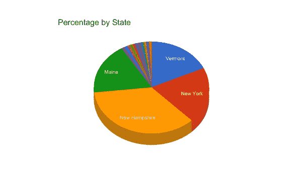

这是另一个例子，五个相当接近的切片，其中一个比其他的多 3%。猜猜是哪一个。

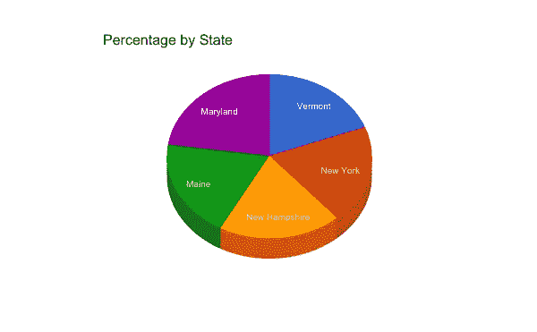

如果你选择新罕布什尔州，那你就错了，它实际上是马里兰州。3D 效果在视觉上增加了切片的体积，欺骗了你的眼睛。如果没有标签标明百分比，准确猜测的可能性微乎其微。

# 2 轴图

图表实际上可以有左右两个独立的垂直轴。有时这种图表可以用来显示两个图之间的相关性，但这种关系可能是微妙的，如果不是不存在的话。

通过使用上面提到的轴裁剪和轴缩放，小斜面可以变成悬崖，不一致的数据可以被截断，以得出错误的相关性和比较。下面是一个虚构的例子:

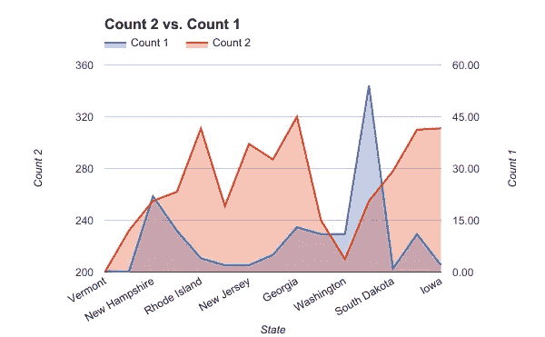

不难想象，当差异超过 250 时，有人可能不会注意到两个独立的尺度，并相信新罕布什尔州的计数 1 和计数 2 是相同的。当一个是百分比，另一个是类似货币的东西时，这种不明确性会进一步加剧。这里有一个特别好的[例子](http://www.politifact.com/truth-o-meter/statements/2015/oct/01/jason-chaffetz/chart-shown-planned-parenthood-hearing-misleading-/),说明糟糕的图表是如何被用来证明一个不准确的观点的。

在绘制两组数据之间的精确相关性时，使用两个轴可能会很有用，但当有人这样做时，请确保查看轴的比例，并了解可能已进行的任何其他修改。

# 结论

我们使用可视化来探索数据，理解错误是如何产生的，不管是有意还是无意，这将使我们更好地得出准确的结论。最好彻底地怀疑，在把可视化视为理所当然之前，看看所有的部分。

虽然这侧重于视觉技巧，但也有统计操纵的一面。这包括破解数据集、忽略相关的异常值，以及许多其他技术，这些技术甚至可以在它成为图表之前很久就被应用。

在一个“假新闻”被如此频繁地抛出的时代，很难写这篇文章而不关注政治和媒体。双方都操纵和歪曲了可视化，以支持数据无法支持的结论。

就像我们必须学会如何应对 90 年代的第一次互联网诈骗(那个可怜的尼日利亚王子……)，我们现在也必须发展理解数据背后的同样的复杂性。随着数据越来越深入到几乎所有事物的核心，不理解它将会给你带来危险。知道如何持怀疑态度会让一切变得不同。