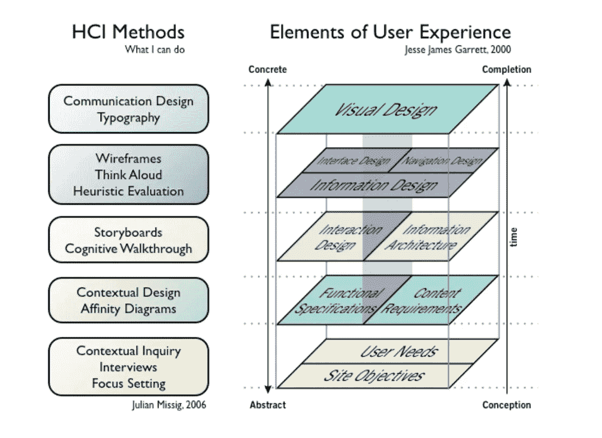
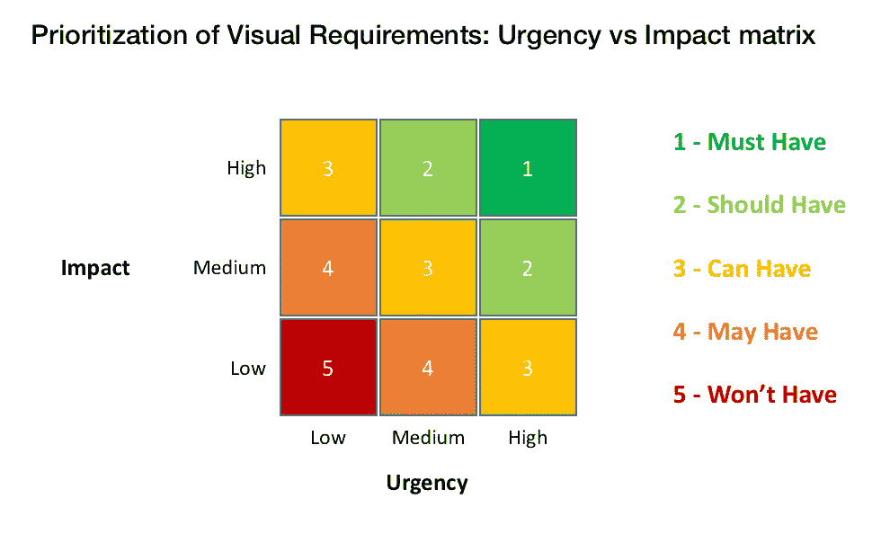
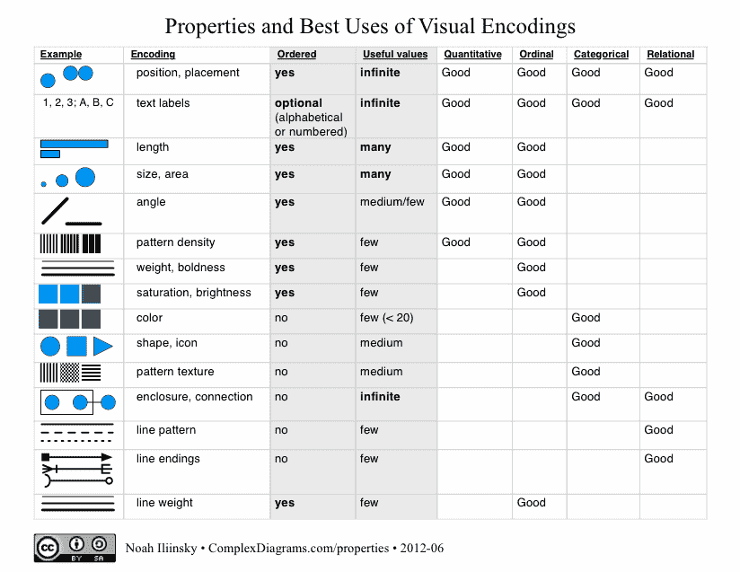
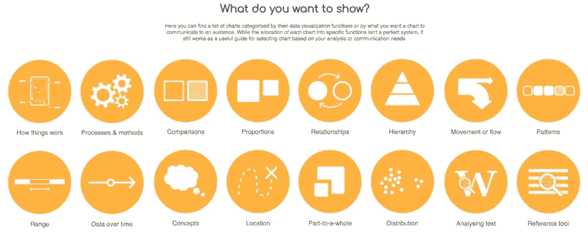
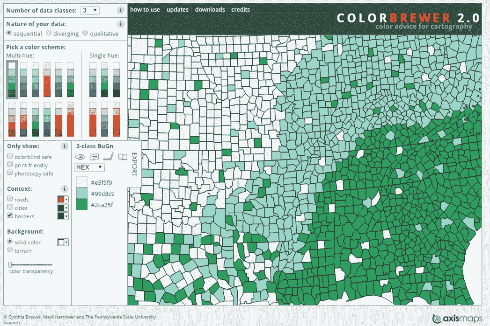
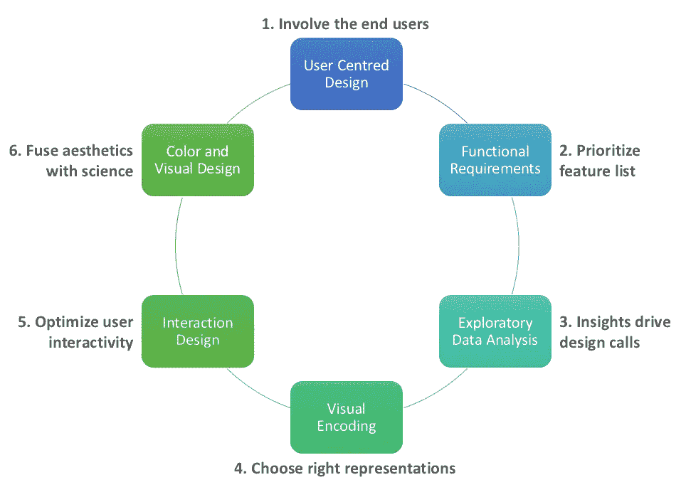

# 数据可视化项目失败的 6 个原因

> 原文：<https://towardsdatascience.com/6-reasons-why-data-visualisation-projects-fail-1ea7a56d7602?source=collection_archive---------0----------------------->

Photo: [Thomas Tucker](https://unsplash.com/photos/-HPhkZcJQNk) on Unsplash

> 一幅画最大的价值是当它迫使我们注意到我们从未期望看到的东西。约翰·w·图基

尽管数据可视化有着巨大的前景，并且这一学科成为主流已经有十年了，但它一点也不成熟。尽管有大量的可视化工具可供使用，也有出色的数据科学家在玩这些工具，但在企业中，数据可视化的有效使用仍然很少见。

由于从业者的持续进步和顶级玩家的营销闪电战，可视化已经深入到组织的深处。尽管有投资和意识，但从可视化计划或工具的长期采用中获得商业投资回报是很难的。

有时，人们想知道是什么使得信息的视觉显示如此困难。

*   也许这与信息设计的减少有关，信息设计是蹩脚的，但是光滑的仪表板显示各种 KPI。
*   也许是花哨的图表和令人眼花缭乱的功能在某个地方失去了用户的脉搏。
*   或者，由于优先级冲突和混乱的执行，善意的计划中途脱轨了。

我们能看看可视化项目中的主要失败点吗？或者，作为观想练习者，你想要一些分享挫折的有趣反映吗？请继续阅读我们在 Gramener 近十年来在企业中实施视觉智能的经验样本。让我们也讨论如何解决这些陷阱。

Photo: [Isaac Davis](https://unsplash.com/photos/rzCi3mD-6ho) on Unsplash

## **1。“我代表所有最终用户..**不要再看了

终端用户通常不直接参与定义可视化项目的需求。人们经常听到项目发起人或经理说他们*‘完全知道用户想要什么’*。要么用户的时间不容易获得(CXOs..)或者说他们人太多了(运营人员)。他们很容易被忽视，天真地认为其他人可以为他们开脱。

这是可视化仪表板在首次展示后经常被闲置的主要原因。如果仅仅列出常见问题或定义 KPI 就足够了，这个挑战就不会出现了。真正需要的是绘制用户故事图，并倾听用户如何解决业务问题。这是用户无法转移的实践智慧，与可操作性紧密相连。

让终端用户参与进来并收集他们细微的业务观点非常重要，这样才能将其构建到仪表盘中。通过访谈建立用户角色，通过温和的探索绘制用户旅程，并共同勾画出现有的业务场景。这也有助于列出观想将会回答的问题，并澄清那些不会回答的问题。

Keeping User at the foundation of Visual Experience (Source: Julian Missig, 2006, Jesse James Garrett 2000)

## **2。“我能拥有以上所有特征吗？”**

当提出各种不同的观想选项时，你多久会听到一次答案，*“以上都有”*？当被要求进行优先级排序时，用户会产生一种强烈的不安全感，担心未来的场景可能无法处理。如果这是一个企业的第一个可视化项目，融入所有可能的花哨功能的冲动就会增强。

赞助商忽略了一点，你投入到应用程序中的越多，它就越少被使用。当一个人通过检查所有的框得到一种错误的满足感时，认知负荷会变得如此之高，以至于用户干脆完全停止使用它。当谈到优先级时，最有见识的用户可能没有正确的观点来接受艰难的呼叫，或者没有勇气咬紧牙关。

扮演一个顾问的角色并帮助将特性列表削减到最关键的是很重要的。虽然屏幕空间在技术上是无限的，但对数据密度加以限制是有用的，比如*‘只不过是一个不可滚动的屏幕’*。船上的利益相关者知道事情的轻重缓急，他们能够做出艰难的决定，也能在说服其他用户的许多战斗中获胜。

UI Matrix — A framework for prioritisation of Visual Requirements

## **3。"你真的需要数据来观想吗？"**

当在数据可视化项目中对数据的需求受到质疑时，事情会变得非常奇怪。如果没有人告诉他们*“首先构建仪表板，然后在上线时直接插入数据”*，他们可以认为自己是幸运的。是的，在清理数据和准备提要方面存在挑战，但是设计没有任何数据的仪表板就像是本末倒置。

改装数据是最终导致不可操作的仪表板或看起来怪异的图表的根本原因。如果没有探索性分析，图表可能会被异常值扭曲，或者更糟，最终没有模式。图表的选择也是由数据决定的。例如，最多 4 个产品的收入分布可以是一个堆积条形图，但对于更多产品，类似 treemap 的图表是相关的。

作为项目规划的一部分，预先考虑数据非常重要。虽然获得标题行是一个有用的开始，但在做出关键的设计决策之前，完整的数据是必不可少的。必须教育客户，数据确实是可视化的关键路径，数据洞察推动设计决策。

Mapping the data types to their [Visual Encodings](http://complexdiagrams.com/properties) by Noah Illinsky

## **4。“请给我我的旭日”**

有时，人们会深深地爱上一张图表，以至于他们注定要将这种关系延伸到冷静的观想例子之外。这导致了无效的将图表强行拟合到解决方案中。为这种调整所做的妥协可能会对整个项目造成严重破坏。

那些即使在用例不支持的情况下也要求奇异或 3D 图表的人，这样做是为了他们自己的满足，最终疏远了用户。这不是自助餐，人们可以挑选各种各样的花式图表放在盘子里。人们可能会迷恋桑基图或 T2 和弦图，但如果把这些图表交给不懂数据的观众，那将是一场灾难。

图表的选择是一门科学，有像[图形语法](/murdering-a-legendary-data-story-what-can-we-learn-from-a-grammar-of-graphics-ad6ca42f5e30)这样强大的学科来管理它。选择图表的因素包括:表示类型*(分布，趋势..)*，数据点*(少，多..)*，用户角色*(运营，战略..)*，用户的数据熟悉度*(分析师，业务用户..)*等。必须积极地教育用户基本原理，并用例子解释。

A catalogue of Data visualisations: Source [datavizcatalogue](https://datavizcatalogue.com/search.html)

## 5.“我想要丰富的用户界面..你能让一切都可以点击吗？”

在设计导航和交互性时，一个常见的要求是*“能够深度钻取到最后一级，让一切都可以点击”*。如果把整个世界都放在一个屏幕上是一个普遍的幻想，那么让它都可以点击是密切相关的。当被要求在一个屏幕内优先显示功能时，一个常见的借口是用户试图将整个仪表盘隐藏在不相关的点击后面。

在一个屏幕上隐藏 100 次点击，将可视化变成了寻找复活节彩蛋。用户可能永远不知道有用的信息可能隐藏在仪表板的什么地方。在大多数应用程序中，超过 90%的点击从来没有被使用过，只有 10%的点击真正进入了用户的工作流程。

丰富的用户界面并不意味着大量的点击，它意味着正确和直观的放置。强加一些指导方针可能是有用的，比如说，每个屏幕不超过 8 次点击。静态格式的数据故事同样强大，所以要仔细考虑所需的交互性。用户会感谢这个电话。

A powerful visualisation - static, with a shelf life of 200 years: [Napoleon’s failed Russia campaign](https://en.wikipedia.org/wiki/Charles_Joseph_Minard#/media/File:Minard.png)

## **6。“我想要绿色和蓝色..并且，扔进去一些紫色的"**

虽然到目前为止所涉及的所有问题都可以被合理化，但颜色就不一样了。诸如*“仪表板中似乎缺少了什么东西”*或*“这种视觉效果缺少惊喜效果”*这样的陈述会让实践者起鸡皮疙瘩。如果有必要，鞭策我们，但不要让反馈悬而未决。

每个用户都有自己选择的颜色，他们可能会非常固执己见。不幸的是，这可能对应用程序的接受度有很大影响。颜色不仅仅是外观和感觉。我们在一个有红绿色盲用户的项目中学到了这个痛苦的教训。我们丰富的 RGB 调色板显示为一个单一的颜色斑点，使其无法使用。

色彩理论与其说是科学，不如说是一门艺术，尽管有处理美学、功能和社会方面的标准指南。最好遵循用户角色和应用程序需求，而不是试图取悦每个人。人们还必须努力阐明选择，并帮助解决脱节问题，因为大多数用户无法解释他们的颜色偏好。

Color advisor tool — [Colorbrewer](http://colorbrewer2.org/)

## **总结**

虽然我们已经看到了数据可视化项目失败的 6 个关键点，但它们也恰好落在可视化项目的 6 个关键阶段。因此，通过避免陷阱来使它们正确，可以使天平向计划的整体成功倾斜。

可视化应该被视为使用数据讲述故事的媒介。一个视觉故事是艺术和科学的完美结合。从业者必须磨练自己的技能，将正确的美学成分与科学元素融合在一起。这创建了与用户相关的输出，解决了特定的业务挑战，并为企业提供了 ROI。

> 数字有一个重要的故事要讲。他们依靠你给他们一个清晰而有说服力的声音。—斯蒂芬·诺

*对数据科学充满热情？随意在* [*LinkedIn*](https://www.linkedin.com/in/ganes-kesari/) *或者*[*Twitter*](http://twitter.com/kesaritweets)*上加我。*

 [## Ganes Kesari | LinkedIn

### 在其他网站上包含此 LinkedIn 个人资料

www.linkedin.com](https://www.linkedin.com/in/ganes-kesari/)