# 从头开始编写任何机器学习算法的 6 个步骤:感知器案例研究

> 原文：<https://towardsdatascience.com/6-steps-to-write-any-machine-learning-algorithm-from-scratch-perceptron-case-study-335f638a70f3?source=collection_archive---------4----------------------->

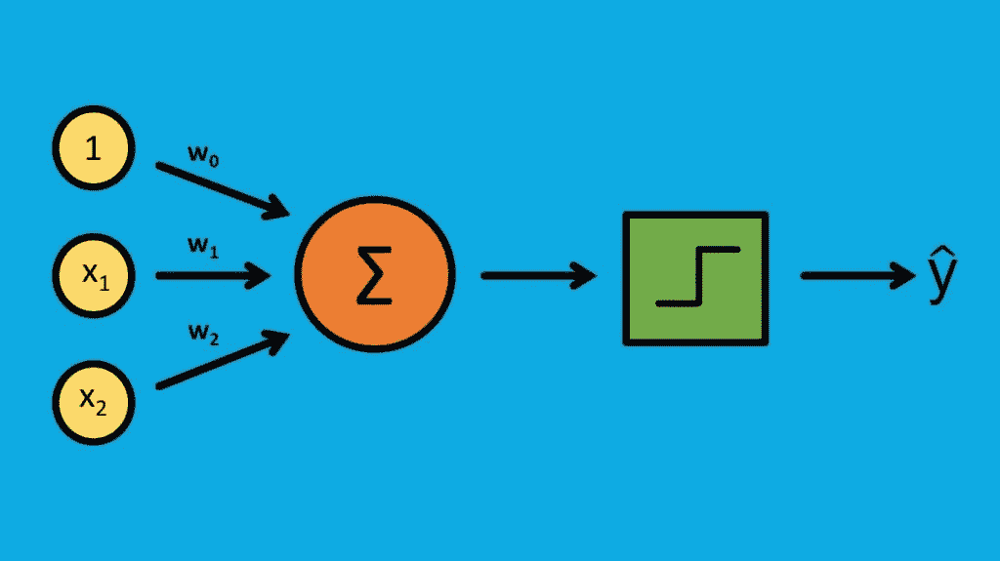

从零开始编写一个 [**机器学习算法**](https://www.dataoptimal.com/machine-learning-from-scratch/) 是一次极其有益的学习经历。

它为你提供了“啊哈！”当你终于明白时，你就会明白引擎盖下到底发生了什么。

一些算法只是比其他算法更复杂，所以从简单的开始，比如[单层感知器](https://en.wikipedia.org/wiki/Perceptron)。

我将使用感知器作为案例研究，带您通过以下 6 个步骤从头开始编写算法:

1.  对算法有基本的了解
2.  寻找一些不同的学习资源
3.  将算法分成块
4.  从一个简单的例子开始
5.  通过可信实施进行验证
6.  写下你的过程

# 获得基本的理解

这又回到了我最初的陈述。如果你不了解基础知识，不要从头开始研究算法。

至少，你应该能够回答以下问题:

*   这是什么？
*   它通常用于什么？
*   这个什么时候不能用？

对于感知器，让我们继续回答这些问题:

*   单层感知器是最基本的神经网络。它通常用于二元分类问题(1 或 0，“是”或“否”)。
*   一些简单的用途可能是情绪分析(正面或负面反应)或贷款违约预测(“将违约”、“不会违约”)。对于这两种情况，决策边界需要是线性的。
*   如果决策边界是非线性的，你真的不能用感知器。对于这些问题，您需要使用不同的方法。


# 使用不同的学习资源

对模型有了基本的了解之后，就该开始做研究了。

有些人用课本学得更好，有些人用视频学得更好。

就我个人而言，我喜欢反复使用各种类型的资源。

对于数学细节，[教科书](https://www.dataoptimal.com/data-science-books-2018/)做得很好，但是对于更实际的例子，我更喜欢博客帖子和 YouTube 视频。

对于感知器，这里有一些很好的来源:

**教科书**

*   [统计学习的要素](https://web.stanford.edu/~hastie/Papers/ESLII.pdf)，第。4.5.1
*   [理解机器学习:从理论到算法](https://www.cs.huji.ac.il/~shais/UnderstandingMachineLearning/understanding-machine-learning-theory-algorithms.pdf)，Sec。21.4

**博客**

*   [如何用 Python 从零开始实现感知器算法](https://machinelearningmastery.com/implement-perceptron-algorithm-scratch-python/)，作者 Jason Brownlee
*   [单层神经网络和梯度下降](https://sebastianraschka.com/Articles/2015_singlelayer_neurons.html)，塞巴斯蒂安·拉什卡

**视频**

*   [感知器训练](https://www.youtube.com/watch?v=5g0TPrxKK6o)
*   [感知器算法如何工作](https://www.youtube.com/watch?v=1XkjVl-j8MM)

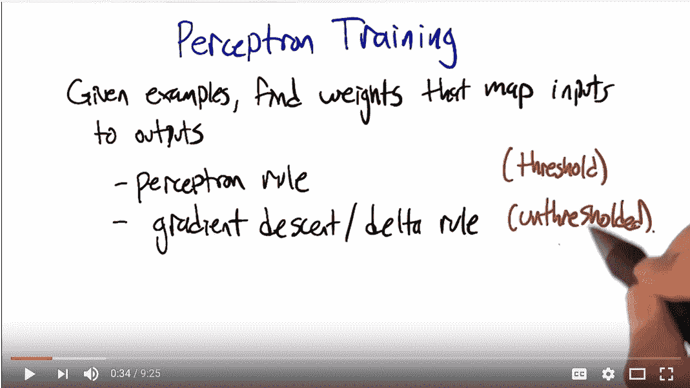

# 将算法分成块

现在我们已经收集了我们的资源，是时候开始学习了。

与其从头到尾阅读一章或一篇博文，不如从略读章节标题和其他重要信息开始。

写下要点，并尝试概述算法。

在浏览了源代码之后，我将感知器分成了以下 5 个部分:

1.  初始化权重
2.  用输入乘以权重，然后求和
3.  将结果与阈值进行比较，以计算输出(1 或 0)
4.  更新权重
5.  重复

让我们详细地看一下每一个。

**1。初始化权重**

首先，我们将初始化权重向量。

权重的数量需要与特征的数量相匹配。假设我们有三个特征，这就是权重向量的样子

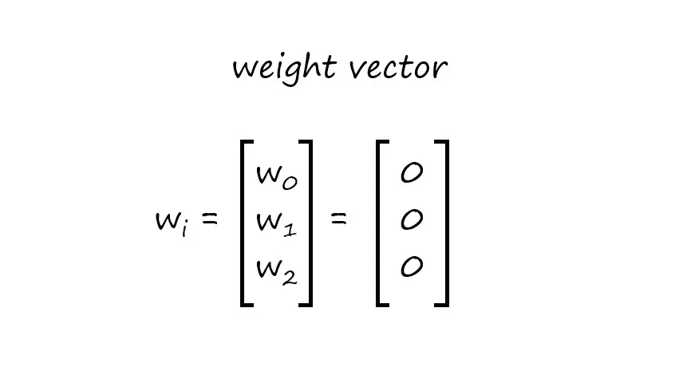

权重向量通常用零初始化，所以我将继续使用这个例子。

# 2.将权重乘以输入并求和

接下来，我们将权重乘以输入，然后求和。

为了更容易理解，我在第一行中给权重和它们相应的特征着色。

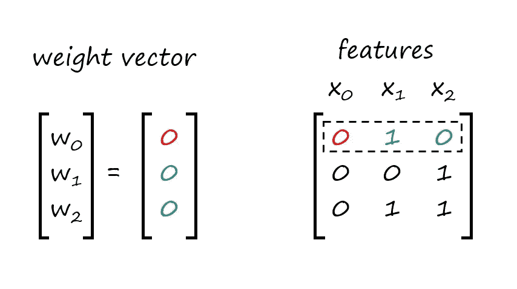

在我们将权重乘以特征之后，我们将它们相加。这也称为点积。

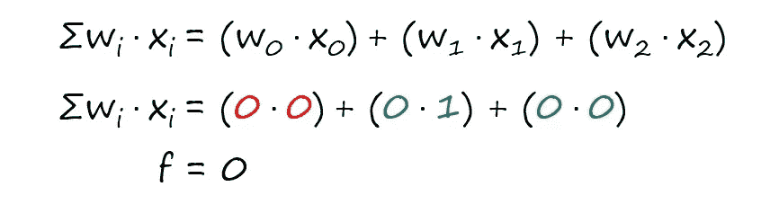

最终结果是 0。我将把这个临时结果称为“f”。

# 3.与阈值比较

计算完点积后，我们需要将其与阈值进行比较。

我已经选择使用 0 作为我的阈值，但是你可以使用它来尝试一些不同的数字。

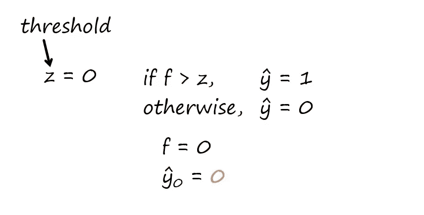

由于我们计算的点积“f ”( 0)不大于我们的阈值(0 ),所以我们的估计值等于零。

我将估算值表示为带帽子的 y(也称为“y 帽子”)，下标 0 对应于第一行。你可以用 1 代替第一行，这并不重要。我只是选择从 0 开始。

如果我们将这个结果与实际值进行比较，我们可以看到我们当前的权重没有正确预测实际输出。

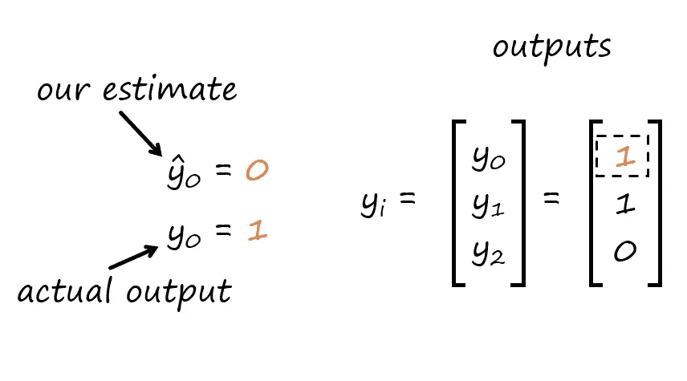

由于我们的预测是错误的，我们需要更新权重，这将我们带到下一步。

# 4.更新权重

接下来，我们将更新权重。这是我们要用的等式:

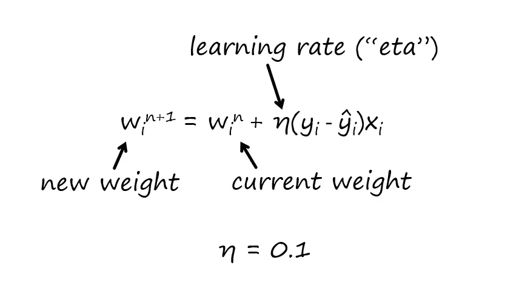

基本思想是，我们在迭代“n”时调整当前权重，以便我们获得新的权重用于下一次迭代“n+1”。

要调整权重，需要设定一个“学习率”。这由希腊字母“eta”表示。

我选择使用 0.1 作为学习率，但是你可以使用不同的数字，就像阈值一样。

以下是我们目前所掌握信息的简要总结:

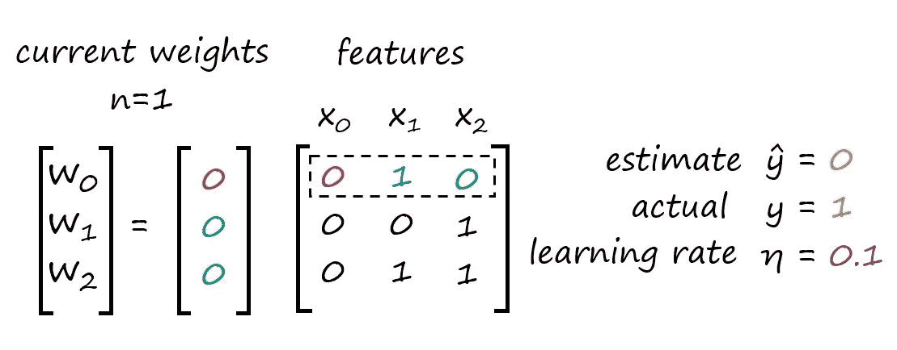

现在让我们继续计算迭代 n=2 的新权重。

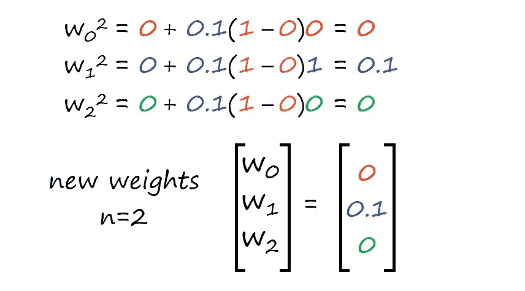

我们已经成功完成了感知器算法的第一次迭代。

# 5.重复

由于我们的算法没有计算出正确的输出，我们需要继续下去。

通常我们需要多次迭代。遍历数据集中的每一行，我们每次都会更新权重。

对数据集的一次完整扫描被称为“时期”

由于我们的数据集有 3 行，我们需要三次迭代来完成 1 个时期。

我们可以设置总的迭代次数或次数来继续执行算法。也许我们想要指定 30 次迭代(或者 10 个时期)。

与阈值和学习率一样，历元数也是一个可以随意使用的参数。

在下一次迭代中，我们移动到第二行特性。

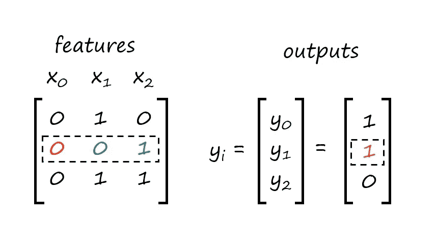

我不会重复每一步，但下面是点积的下一个计算:

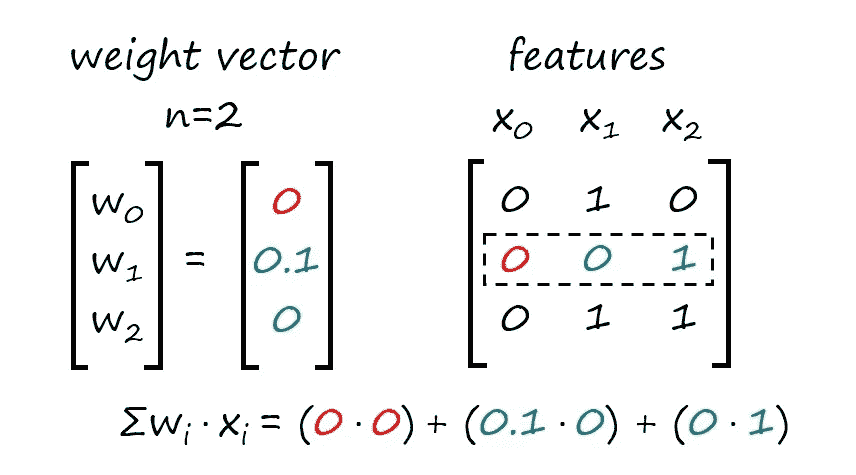

接下来，我们将比较点积和阈值来计算新的估计值，更新权重，然后继续。如果我们的数据是线性可分的，感知器就会收敛。

# 从一个简单的例子开始

既然我们已经手工将算法分成了几个块，是时候开始用代码实现它了。

为了简单起见，我总是喜欢从一个非常小的“玩具数据集”开始

对于这类问题，一个很好的小型线性可分数据集是一个[与非门](https://en.wikipedia.org/wiki/NAND_gate)。这是数字电子中常用的逻辑门。

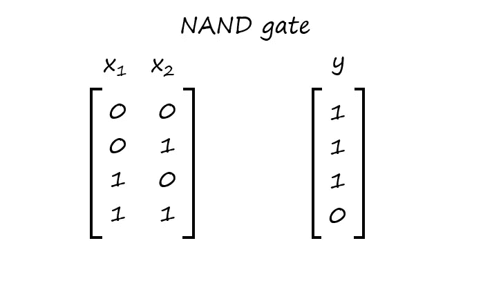

由于这是一个相当小的数据集，我们可以手工输入到 Python 中。

我将添加一个虚拟特征“x0 ”,它是一列 1。我这样做是为了让我们的模型计算偏置项。

您可以将偏差视为截距项，它正确地允许我们的模型将两个类别分开。

下面是输入数据的代码:

```
# Importing libraries
# NAND Gate
# Note: x0 is a dummy variable for the bias term
#     x0  x1  x2
x = [[1., 0., 0.],
     [1., 0., 1.],
     [1., 1., 0.],
     [1., 1., 1.]]y =[1.,
    1.,
    1.,
    0.]
```

与上一节一样，我将分块逐步完成算法，一边编写代码一边测试。

# 1.初始化权重

第一步是初始化权重。

```
# Initialize the weights
import numpy as np
w = np.zeros(len(x[0]))Out:
[ 0\.  0\.  0.]
```

请记住，权重向量的长度需要与特征的数量相匹配。对于这个与非门例子，长度是 3。

# 2.将权重乘以输入并求和

接下来，我们将权重乘以输入，然后求和。

另一个名称是“点积”

同样，我们可以使用 Numpy 轻松地执行这个操作。我们将使用的方法是`.dot()`。

让我们从权重向量和第一行特征的点积开始。

```
# Dot Product
f = np.dot(w, x[0])
print fOut:
0.0
```

不出所料，结果是 0。

为了与上一节的注释保持一致，我将点积赋给了变量“f”。

# 3.与阈值进行比较

计算完点积后，我们准备将结果与阈值进行比较，以预测输出。

同样，我将与上一节的笔记保持一致。

我将使阈值“z”等于 0。如果点积“f”大于 0，我们的预测将是 1。否则就是零。

请记住，预测通常用一克拉表示，也称为“帽子”。我将把预测赋给的变量是`yhat`。

```
# Activation Function
z = 0.0
if f > z:
    yhat = 1.
else:
    yhat = 0.

print yhatOut:
0.0
```

不出所料，预测值为 0。

你会注意到，在代码上方的注释中，我称之为“激活函数”。这是对我们正在做的事情的更正式的描述。

看一下 NAND 输出的第一行，我们可以看到实际值是 1。由于我们的预测是错误的，我们需要继续更新权重。

# 4.更新权重

现在我们已经做出了预测，我们准备更新权重。

在这样做之前，我们需要设定一个学习率。为了与前面的例子保持一致，我将学习率“eta”的值指定为 0.1。

我将对每个权重的更新进行硬编码，以便于阅读。

```
# Update the weights
eta = 0.1
w[0] = w[0] + eta*(y[0] - yhat)*x[0][0]
w[1] = w[1] + eta*(y[0] - yhat)*x[0][1]
w[2] = w[2] + eta*(y[0] - yhat)*x[0][2]

print wOut:
[ 0.1  0\.   0\. ]
```

我们可以看到我们的权重现在已经更新了，所以我们准备继续。

# 5.重复

现在我们已经完成了每一步，是时候把所有东西放在一起了。

我们还没有讨论的最后一点是我们的损失函数。这是我们试图最小化的函数，在我们的例子中是平方和(SSE)误差。

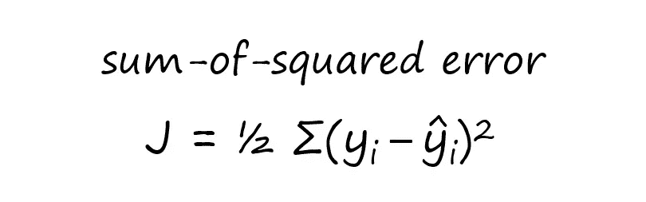

这是我们将用来计算我们的误差，并看看模型是如何执行的。

综合来看，完整的函数如下所示:

```
import numpy as np

# Perceptron function
def perceptron(x, y, z, eta, t):
    '''
    Input Parameters:
        x: data set of input features
        y: actual outputs
        z: activation function threshold
        eta: learning rate
        t: number of iterations
    '''

    # initializing the weights
    w = np.zeros(len(x[0]))      
    n = 0                        

    # initializing additional parameters to compute sum-of-squared errors
    yhat_vec = np.ones(len(y))     # vector for predictions
    errors = np.ones(len(y))       # vector for errors (actual - predictions)
    J = []                         # vector for the SSE cost function

    while n < t: for i in xrange(0, len(x)): # dot product f = np.dot(x[i], w) # activation function if f >= z:                               
                yhat = 1\.                               
            else:                                   
                yhat = 0.
            yhat_vec[i] = yhat

            # updating the weights
            for j in xrange(0, len(w)):             
                w[j] = w[j] + eta*(y[i]-yhat)*x[i][j]

        n += 1
        # computing the sum-of-squared errors
        for i in xrange(0,len(y)):     
           errors[i] = (y[i]-yhat_vec[i])**2
        J.append(0.5*np.sum(errors))

    return w, J
```

现在我们已经编写了完整的感知器，让我们继续运行它:

```
#     x0  x1  x2
x = [[1., 0., 0.],
     [1., 0., 1.],
     [1., 1., 0.],
     [1., 1., 1.]]

y =[1.,
    1.,
    1.,
    0.]

z = 0.0
eta = 0.1
t = 50

print "The weights are:"
print perceptron(x, y, z, eta, t)[0]

print "The errors are:"
print perceptron(x, y, z, eta, t)[0]Out:
The weights are:
[ 0.2 -0.2 -0.1]
The errors are:
[0.5, 1.5, 1.5, 1.0, 0.5, 0.0, 0.0, 0.0, 0.0, 0.0, 0.0, 0.0, 0.0, 0.0, 0.0, 0.0, 0.0, 0.0, 0.0, 0.0, 0.0, 0.0, 0.0, 0.0, 0.0, 0.0, 0.0, 0.0, 0.0, 0.0, 0.0, 0.0, 0.0, 0.0, 0.0, 0.0, 0.0, 0.0, 0.0, 0.0, 0.0, 0.0, 0.0, 0.0, 0.0, 0.0, 0.0, 0.0, 0.0, 0.0]
```

看一下误差，我们可以看到误差在第 6 次迭代时变为 0。对于剩余的迭代，它保持为 0。

当误差达到 0 并停留在那里时，我们知道我们的模型已经收敛。这告诉我们，我们的模型已经正确地“学习”了适当的权重。

在下一节中，我们将使用我们在更大的数据集
上计算的权重来进行预测。

# 通过可信实施进行验证

到目前为止，我们已经找到了不同的学习资源，手工完成了算法，并用一个简单的例子在代码中进行了测试。

现在是时候将我们的结果与可信的实现进行比较了。为了比较，我们将使用 scikit-learn 的[感知机](http://scikit-learn.org/stable/modules/generated/sklearn.linear_model.Perceptron.html)。

我们将通过以下步骤进行比较:

1.  导入数据
2.  将数据分成训练/测试集
3.  训练我们的感知器
4.  测试感知器
5.  比较 scikit-learn 感知器

# 1.导入数据

让我们从导入数据开始。你可以在这里获得数据集[的副本。](https://github.com/dataoptimal/posts/blob/master/algorithms%20from%20scratch/dataset.csv)

这是一个线性可分离的数据集，我创建它是为了确保感知器能够工作。为了确认，让我们继续绘制数据。

```
import pandas as pd
import numpy as np
import matplotlib.pyplot as plt

df = pd.read_csv("dataset.csv")
plt.scatter(df.values[:,1], df.values[:,2], c = df['3'], alpha=0.8)
```

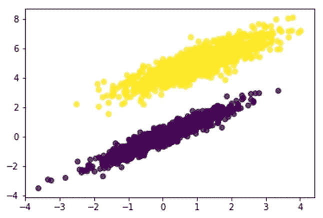

看一下这个图，很容易看出我们可以用一条直线将这些数据分开。

在我们继续之前，我将解释我上面的绘图代码。

我使用 Pandas 导入 csv，它会自动将数据放入 dataframe 中。

为了绘制数据，我必须从数据帧中提取值，这就是我使用`.values`方法的原因。

这些特性在第 1 列和第 2 列中，所以这就是我在散点图函数中使用它们的原因。列 0 是 1 的伪特征，我包括它是为了计算截距。这应该与我们在上一节中对与非门所做的事情很相似。

最后，我在散点图函数中使用`c = df['3'], alpha = 0.8`给两个类着色。输出是第 3 列中的数据(0 或 1)，所以我告诉函数使用第 3 列给两个类着色。

你可以在这里找到 Matplotlib 散点图函数[的更多信息](https://matplotlib.org/api/_as_gen/matplotlib.pyplot.scatter.html)。

# 2.将数据分成训练/测试集

既然我们已经确认了数据可以线性分离，那么是时候拆分数据了。

在与测试数据集不同的数据集上训练模型始终是一种很好的做法。这有助于避免过度拟合。

有不同的方法可以做到这一点，但是为了简单起见，我只使用一个训练集和一个测试集。

我将从整理我的数据开始。如果您看一下原始文件，您会看到数据是按行分组的，输出(第三列)中有 0，然后是所有的 1。我想改变一下，增加一些随机性，所以我要打乱它。

```
df = df.values  

np.random.seed(5)
np.random.shuffle(df)
```

我首先将数据从 dataframe 改为 numpy 数组。这将使我将要使用的许多 numpy 函数更容易使用，比如`.shuffle`。

为了使结果对你来说是可重复的，我设置了一个随机种子(5)。完成后，尝试改变随机种子，看看结果如何变化。

接下来，我将把 70%的数据分成一个训练集，30%的数据分成一个测试集。

```
train = df[0:int(0.7*len(df))]
test = df[int(0.7*len(df)):int(len(df))]
```

最后一步是分离出训练集和测试集的特征和输出。

```
x_train = train[:, 0:3]
y_train = train[:, 3]

x_test = test[:, 0:3]
y_test = test[:, 3]
```

为了这个例子，我为我的训练/测试集选择了 70%/30%，但是我鼓励你研究其他方法，比如 [k 倍交叉验证](https://en.wikipedia.org/wiki/Cross-validation_(statistics))。

# 3.训练我们的感知器

接下来，我们将训练我们的感知器。

这非常简单，我们只是要重用我们在上一节中构建的代码。

```
def perceptron_train(x, y, z, eta, t):
    '''
    Input Parameters:
        x: data set of input features
        y: actual outputs
        z: activation function threshold
        eta: learning rate
        t: number of iterations
    '''

    # initializing the weights
    w = np.zeros(len(x[0]))      
    n = 0                        

    # initializing additional parameters to compute sum-of-squared errors
    yhat_vec = np.ones(len(y))     # vector for predictions
    errors = np.ones(len(y))       # vector for errors (actual - predictions)
    J = []                         # vector for the SSE cost function

    while n < t:          for i in xrange(0, len(x)):                                           # dot product             f = np.dot(x[i], w)                                   # activation function             if f >= z:                               
                yhat = 1\.                               
            else:                                   
                yhat = 0.
            yhat_vec[i] = yhat

            # updating the weights
            for j in xrange(0, len(w)):             
                w[j] = w[j] + eta*(y[i]-yhat)*x[i][j]

        n += 1
        # computing the sum-of-squared errors
        for i in xrange(0,len(y)):     
           errors[i] = (y[i]-yhat_vec[i])**2
        J.append(0.5*np.sum(errors))

    return w, J

z = 0.0
eta = 0.1
t = 50

perceptron_train(x_train, y_train, z, eta, t)
```

让我们来看看权重和误差平方和。

```
w = perceptron_train(x_train, y_train, z, eta, t)[0]
J = perceptron_train(x_train, y_train, z, eta, t)[1]

print w
print JOut:
[-0.5        -0.29850122  0.35054929]
[4.5, 0.0, 0.0, 0.0, 0.0, 0.0, 0.0, 0.0, 0.0, 0.0, 0.0, 0.0, 0.0, 0.0, 0.0, 0.0, 0.0, 0.0, 0.0, 0.0, 0.0, 0.0, 0.0, 0.0, 0.0, 0.0, 0.0, 0.0, 0.0, 0.0, 0.0, 0.0, 0.0, 0.0, 0.0, 0.0, 0.0, 0.0, 0.0, 0.0, 0.0, 0.0, 0.0, 0.0, 0.0, 0.0, 0.0, 0.0, 0.0, 0.0]
```

权重现在对我们来说意义不大，但是我们将在下一节中使用这些数字来测试我们的感知机。我们还将使用权重来比较我们的模型和 scikit-learn 模型。

看一看误差平方和，我们可以看到我们的感知机已经收敛，这是我们所期望的，因为数据是线性可分的。

# 4.测试我们的感知机

现在是时候测试我们的感知机了。为此，我们将构建一个小的`perceptron_test`函数。

这与我们已经看到的非常相似。该函数采用我们使用`perceptron_train`函数和特性计算的权重的点积，以及激活函数来进行预测。

我们唯一没见过的是`accuracy_score`。这是 scikit-learn 的一个评估指标函数。你可以在这里了解更多。

将所有这些放在一起，代码如下所示:

```
from sklearn.metrics import accuracy_score

w = perceptron_train(x_train, y_train, z, eta, t)[0]

def perceptron_test(x, w, z, eta, t):
    y_pred = []
    for i in xrange(0, len(x-1)):
        f = np.dot(x[i], w)   

        # activation function
        if f > z:                               
            yhat = 1                               
        else:                                   
            yhat = 0
        y_pred.append(yhat)
    return y_pred

y_pred = perceptron_test(x_test, w, z, eta, t)

print "The accuracy score is:"
print accuracy_score(y_test, y_pred)Out:
The accuracy score is:
1.0
```

1.0 分表示我们的模型对所有测试数据做出了正确的预测。这个数据集显然是可分离的，所以我们可以预期这个结果。

# 5.比较 scikit-learn 感知器

最后一步是将我们的结果与 scikit-learn 的感知器进行比较。这是该模型的代码:

```
from sklearn.linear_model import Perceptron

# training the sklearn Perceptron
clf = Perceptron(random_state=None, eta0=0.1, shuffle=False, fit_intercept=False)
clf.fit(x_train, y_train)
y_predict = clf.predict(x_test)
```

现在我们已经训练了模型，让我们将权重与模型计算的权重进行比较。

```
Out:
sklearn weights:
[-0.5        -0.29850122  0.35054929]
my perceptron weights:
[-0.5        -0.29850122  0.35054929]
```

scikit-learn 模型的重量与我们的重量相同。这意味着我们的模型工作正常，这是个好消息。

在我们结束之前，还有几个小问题要讨论一下。在 scikit-learn 模型中，我们必须将随机状态设置为“None ”,并关闭洗牌。我们已经设置了一个随机种子并打乱了数据，所以我们不需要再次这样做。

我们还必须将学习率“eta0”设置为 0.1，以与我们的模型一致。

最后一点是截距。因为我们已经包含了一个 1 的伪特征列，我们正在自动拟合截距，所以我们不需要在 scikit-learn 感知器中打开它。

这些看起来都是次要的细节，但是如果我们不设置这些，我们将无法重现与我们的模型相同的结果。

这是很重要的一点。在使用模型之前，阅读文档并理解所有不同设置的作用是非常重要的。

# 写下你的过程

这个过程的最后一步可能是最重要的。

您已经完成了学习、做笔记、从头开始编写算法以及与可信实现进行比较的所有工作。不要让所有的好工作都白费了！

记录流程非常重要，原因有二:

*   你会获得更深的理解，因为你正在把你刚刚学到的东西教给别人。
*   你可以把它展示给潜在雇主。

表明你可以从机器学习库中实现一个算法是一回事，但如果你能从头开始自己实现它，那就更令人印象深刻了。

展示你的作品的一个很好的方式是使用 GitHub Pages 作品集。

# 结论

在这篇文章中，我们学习了如何从头开始实现[感知器](https://www.dataoptimal.com/machine-learning-from-scratch/)。

更重要的是，我们学会了如何找到有用的学习资源，以及如何将一个算法分解成块。

然后，我们学习了如何使用玩具数据集用代码实现和测试算法。

最后，我们将模型的结果与可信的实现进行了比较。

这是在更深层次上学习算法的一个很好的方法，这样你就可以自己实现它。

大多数时候你会使用一个可信的实现，但是如果你真的想更深入地了解底层发生了什么，从头实现它是一个很好的练习！