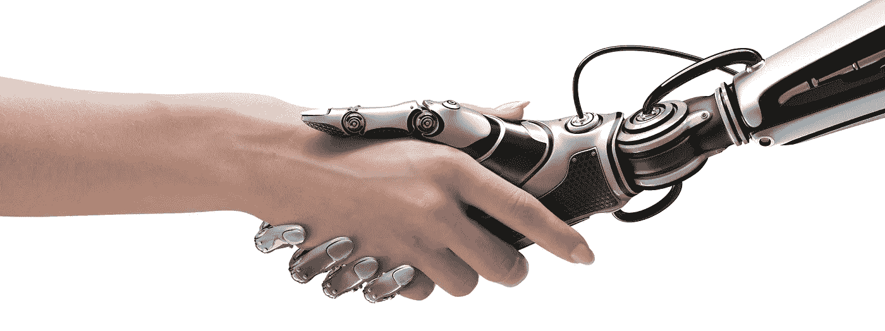

# 我们都需要从机器学习中学到的 6 课

> 原文：<https://towardsdatascience.com/6-things-we-all-need-to-learn-from-machine-learning-e88eac480b57?source=collection_archive---------0----------------------->

机器学习作为一个领域至少已经存在了几十年。由于深度学习，这个术语现在成为主流，不再局限于研究和学术界。

在所有激活函数和反向传播的复杂数学背后，深度学习是对我们大脑中神经元网络的抽象，并模拟它们学习和概括信息的迷人能力。

深度学习的巨大成功意味着，从人类那里获得灵感来设计算法是有价值的。反之呢？

> 机器学习的实践有什么值得我们学习和启发的地方吗？

机器学习不仅仅是神经网络和深度学习。这是一个拥有众多智能算法的领域，这些算法可以推导出复杂的模式，并对未知做出预测。

以下是我发现的六件在 ML 领域非常引人注目的事情，它们可能会给我们带来一些人生教训

1.  **相信多样性的力量(随机森林)**

随机森林的健壮性得益于其不同决策树的集合，每个决策树都试图解决问题的一部分。

> 没有只有一棵树的森林。

类似地，当来自不同背景的人和团体一起合作和工作时，结果是令人温暖的。如果我们把自己局限在与我们关系最密切的小圈子里，我们就限制了自己真正的潜力。

**2。从你的错误中学习，永远(梯度推进)**

梯度提升不是使用不同分类器的集合，而是利用错误并以迭代的方式不断改进基本分类器。

就像梯度推进机一样，我们需要意识到没有人是完美的，我们都会犯错。重要的是要找出错误并吸取生活教给你的教训。

> 不要被你的成就冲昏了头脑，而是要专注于纠正你人生每个阶段的缺陷。

**3。每个问题都有解决方案(内核方法& SVM)**

核方法在支持向量机中很流行。它们用于将低维中不可分的数据转换到高维中，并使用决策边界来分离类。

生活并不总是玫瑰和彩虹。它给我们带来了难以解决的难题，没有现成的解决办法。在那些绝望的时刻，令人欣慰的是知道有*更高的维度*是你不知道的，总会有出路。

> 保持冷静，向更高的维度祈祷

**4。接受改变个人信念(贝叶斯定理)**

贝叶斯定理在获得关于相关和条件事件的附加信息后更新事件的先验似然。

同样，我们都对人、文化和社会有先入为主的信念和假设。这些信念是基于我们的社会、经济和人口状况培养出来的。

当我们遇到挑战我们先前信念的新情况时，我们有意识地更新自己是至关重要的。

> 永远不要对变化持不可知论态度。

**5。应做出决定以说明当前的情况(梯度下降)**

从回归到神经网络，梯度下降是许多机器学习算法的*学习*部分。原则是始终沿着最陡下降的路径到达期望的目的地。

我们经常面临这样的情况，需要我们做出决定，在无数的选择中选择一个。这些决定对未知的未来有着潜在的影响。

梯度下降为我们提供了这种情况下的捷径，总是为现在做出最佳选择，而不是太担心你的未来课程。

> 不要等待理想的解决方案，你永远不知道会发生什么。

**6。关系随时间变化(k 均值)**

k-means 算法通过将数据分配和重新分配给不同的组来迭代地提高聚类质量，直到达到平衡。

人类的互动和情感在建立我们的关系中起着至关重要的作用。不足为奇的是，当这些关系紧张时，我们会崩溃。

我们应该意识到，即使是强大的关系也可能在没有明显过错的情况下随时改变或结束，就像 k-means 一样。接受事实，在可以的时候珍惜你爱的人。

如果你在算法和其他学习范式的经验中有类似的类比，请告诉我。我们都可以互相学习，包括机器学习。