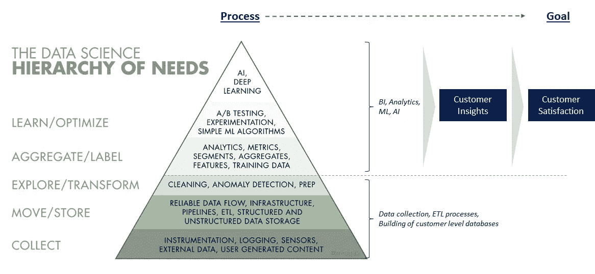
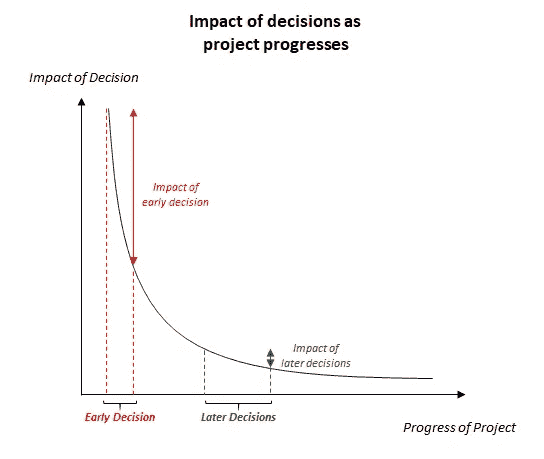
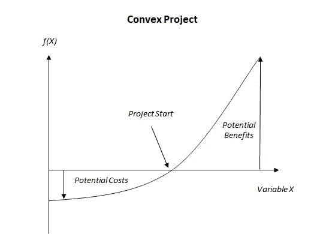
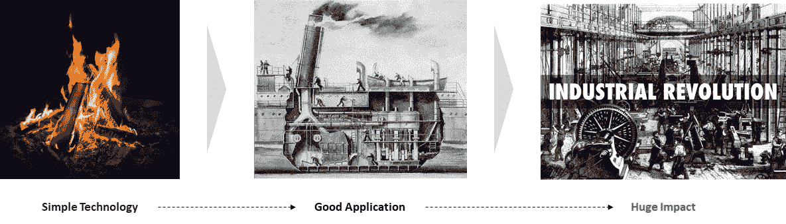

# 有效数据科学的 6 个不寻常原则

> 原文：<https://towardsdatascience.com/6-uncommon-principles-for-effective-data-sciences-7424a332c921?source=collection_archive---------12----------------------->

## *如何概念化和实施有效的数据科学项目*

Results, not hype

# **动机**

我对数据科学研究得越多，我就越确信，公司和数据科学从业者必须对如何打破机器学习和人工智能的宣传有一个清晰的看法，以实施一个有效的数据科学战略来推动商业价值。本文希望建立一个框架来概念化和实施有效的数据科学项目。

# **你为什么要在乎**

展示你作为一名数据科学家可以获得有意义的见解，从而提高收入和利润，这将使你对公司更有价值。借助高度优化且易于实现的机器学习和深度学习库，任何数据猴子都可以只用几行代码构建复杂的人工智能算法。然而，复杂的模型并不等同于有效的模型。了解模型输出如何转化为现实世界的应用是关键。

从公司的角度来看，数据科学家和任何其他员工一样，根据他们创造的价值获得报酬。如果一家公司支付给员工的薪酬高于他们带来的价值，那么这家公司就亏损了。显然不是一个可持续的长期战略。是的，数据科学家现在工资很高，但如果公司不能从数据科学中提取他们认为可以获得的价值，数据科学家的工资和需求最终会下降。

# 问题:数据科学家更倾向于关注手段而不是目的

由于人工智能研究人员在过去几年取得的成果([演奏 GTA](https://clips.twitch.tv/GlamorousSpikyWombatDBstyle) ，[创作肖邦风格的音乐作品](https://youtu.be/j60J1cGINX4) s)，许多公司都在赶潮流，宣告人工智能的新时代。

这一切都很好，但由于数据科学在商业环境中的新生应用，信息不对称是存在的。数据科学家从业者往往具有技术背景，并且通常将他们的主要目标视为构建最先进的算法。另一方面，其他员工将人工智能视为一个黑盒子，通常是通过人工智能研究人员高调突破的镜头(例如，人工智能能够击败顶级围棋选手)。由于业务的技术和商业部分之间的脱节，来自数据科学家的输出可能不具有可操作性或商业意义。

# 解决方法:不要只见树木不见森林；实用数据科学是关于推动价值，而不是优化准确性

我们可以把实用数据科学想象成一个有三条腿的凳子:编程、统计和业务理解，如果我们缺少任何一条腿，凳子就会倒塌。我们都知道这一点，但业务理解很少成为数据科学文章或论坛的焦点。

The three pillars of data science

编程和数学是必要的，但不足以成为一名有效的数据科学家，因为技术技能只是达到目的的一种手段。帮助公司提高客户保持率，帮助穷人获得贷款，通过更早地诊断疾病来改善健康状况——这些是数据科学家应该关注的目标；机器学习/人工智能只是实现这一目标的一种手段。

# 有效数据科学的 6 项原则

坚持以下六条原则将使数据科学家能够概念化和实施有效的项目。

# 1.理解人工智能的需求层次

就像人类在实现自我实现之前需要食物、水和空气一样，建立可靠的数据流是使用数据做任何事情的关键。只有当数据可以访问时，才能对其进行探索和转换。当清理后的数据可以很容易地被浏览时，就可以更好地理解客户。 [*莫妮卡·罗加蒂*](https://hackernoon.com/@mrogati?source=post_header_lockup)*的优秀文章， *'* [*人工智能需求层次*](https://hackernoon.com/the-ai-hierarchy-of-needs-18f111fcc007) *'* ，提供了一个清晰的框架来思考这一点。*

*许多公司希望人工智能带来的结果，但没有合适的基础设施来实施机器学习。公司应该意识到，机器学习/深度学习在整个数据堆栈中出现得较晚。数据首先必须可靠地*收集*，然后才能*转换*，随后*探索*。一个中断的上游流程(例如，如果跟踪不准确)将影响数据的清洁度，并最终影响从中获得的洞察力。只有当数据是干净的并且容易探索时，它才能用于商业智能、分析和人工智能。*

**

*Diagram adapted from [Monica Rogati’s excellent article, ‘The AI Hierarchy of Needs’](https://hackernoon.com/the-ai-hierarchy-of-needs-18f111fcc007)*

****人工智能需求层次的含义——在考虑机器学习或深度学习之前扩大数据基础设施****

*这种等级制度意味着公司应该按照需求的顺序招聘员工。这是什么意思？如果你的公司还没有建立规模机器学习，那么重点应该是那些任务，而不是深度学习。与编码一样，这是一个循序渐进的过程，在达到下一个级别之前，必须先准备好正确的构件。*

*灾难的一个原因是，一名在建模方面经验丰富的数据科学家被一家没有适当跟踪和数据库的初创企业聘用。在加入公司之前，员工还应该检查他们对工作的期望。*

*作为一名数据科学家，知道如何正确设计表模式或构建数据管道可能很重要，但却被低估了许多公司所需的技能，特别是因为大多数数据科学课程和机器学习竞赛往往专注于机器学习的“更性感”方面。*

# ***2。构建能够回答正确问题的模型***

*早期决策，以及随之而来的项目早期假设，通常会对整个项目产生不成比例的影响。您在项目开始的一天或一周内所做的决策——关于最终用户需求的假设，如何使用模型的输出——对模型的有效性有着最重要的影响。随着项目越来越晚做出决策，他们的影响力会降低。选择如何清理脏数据或使用什么功能会影响模型的准确性，但决定机器学习模型是否可以部署到生产中的最大因素来自于你在项目开始时提出的问题。*

**

*Early decisions have disproportionately large impact on projects*

*表面上很容易理解这一点，但很少有人考虑其中的含义。*

*为了构建一个具有可操作结果的模型，在键入一行代码之前必须完成以下工作:与最终用户沟通，了解已经到位的业务规则，查看现有数据并思考如何为要训练的模型定义“基础事实”,以使其对最终用户有意义，了解提议的模型的局限性，并与业务用户一起对模型的预测输出进行压力测试。*

*这里有一个例子来说明这一点。*

****建立流失预测模型****

*营销部门找到你，让你建立一个机器学习模型来预测哪些客户已经流失。营销部门告诉你，有这样一个输出是有用的，所以他们可以更好地重新定位客户，以提高客户保留率。作为一名数据科学家，这似乎是一项简单明了的任务。建立一个二进制分类模型，输出 1 为搅动的客户，0 为活跃的客户。事实上，你告诉你的同事，你可以通过给他们一个客户翻盘的可能性来超越他们的要求。*

*进一步的讨论发生了，你了解到市场营销将被搅动的客户定义为一年或一年以上没有订购的客户。您决定遵循他们现有的逻辑，并将您的模型的目标标记为这样。*

*你提出你的计划，然后营销部门给你建立模型的许可。你花了数周时间提取和清理数据，定义损失函数，确定交叉验证策略，训练和调整模型，验证结果，最终得到的 AUC 为 0.9。您对结果感到欢欣鼓舞，并自豪地向营销团队展示您的发现，告诉他们使用了什么数据和模型，以及如何解释 AUC。*

*市场部有意见:*

*   *最近注册但没有下订单的用户被模型贴上了“搅动用户”的标签。这种情况不应该发生，因为订单周期更长。更广泛地说，在不同时间注册的用户应该有不同的流失定义。六个月内没有购买的常客可能被认为是被搅动的，而六个月内没有购买的新用户可能不会被搅动，因为正常的购买周期是一年或更长时间。*
*   *营销部门意识到，模型预测的客户流失已经成为现有保留工作的目标。他们实施了一个简单的业务规则，即六个月内没有购买的客户已经获得了最大可能的折扣。模型输出能提供客户流失的原因吗？*

****从流失预测模型中得到的启示****

*无论模型有多精确，回答错误的问题都是浪费时间。*

**企业可能并不总是预先知道它需要什么，*因为企业经理可能不理解机器学习是如何工作的。挑战业务告诉你的东西。在这种情况下，预测流失有用吗？或者，我们是否希望预测客户对现有流失报价的反应程度，以便营销能够更好地针对他们现有的活动？能够有效地做到这一点需要了解业务和客户。*

**目标的定义极其重要。*企业如何定义客户流失，以及您希望如何训练您的模型可能会有所不同，因为用现有的客户流失定义训练模型可能会导致没有商业意义的预测。在这种情况下，了解不同的客户群(例如，顶级客户和新用户)及其不同的生命周期是获得有意义预测的关键。基于模型的训练方式来理解模型输出是必要的。*

# ****3。挑选最能增加业务价值的项目****

*在选择做什么项目时，问正确的问题也很重要。理想情况下，优先项目应该是那些对业务有最大机会*的项目。机器学习项目需要时间来推广，承担错误项目的成本可能会超过收益。**

*鉴于机器学习的经验性质，提出正确问题的重要性进一步凸显，因为结果无法得到保证。进行探索性数据分析可能不会产生太多的洞察力，并且构建模型可能不会产生比已实现的现有业务规则更好的结果。在承担一个项目的收益(*它们需要很大*)和成本(*很小或无害*)之间需要有一个显著的不对称，正是由于这种不对称，经验项目*(试错)*才能产生结果。凸性是表示这一点的数学性质。*

**

*Graphical representation of a convex strategy*

*机器学习项目可以比作烹饪，这在很大程度上依赖于试错，因为我们还不能直接从化学方程式中调制出一道菜。我们取大米，加入不同的配料组合，比如酱油和姜黄粉，尝一尝，看看配料之间的相互作用是否有所改善。然后，我们保留好的食谱，丢弃其余的。重要的是，我们有保留结果的选择权，而没有保留结果的义务，这让我们在保留优势的同时严格限制劣势。在机器学习的情况下，如果模型还没有在生产中实现，缺点是花在这些模型上的时间。这种“选择性”导致了机器学习项目的凸性，因为它允许数据科学家通过选择最佳模型并忘记其他模型来获得更多好处。至关重要的是，这意味着所选的项目必须具有很高的商业潜在收益。*

*在建立机器学习模型之前计算机会的大小可以帮助确定项目对业务的潜在影响。然后，可以将这种潜在影响与花费在项目上的估计时间进行权衡，以衡量项目的凸性。*

*计算商机规模的通用公式:*

> ***受影响的客户数量*目标影响规模=预计项目影响***

****着手直接影响业务杠杆的项目。*** 确保机器学习模型的输出直接影响商业杠杆也很重要。这将产生可直接操作的项目。例如，一家电子商务公司可能会要求其数据科学团队识别对某个品牌或商品类别有强烈意向的客户。仅仅预测客户是否有强烈的意图是不够的，因为意图不会直接影响任何商业杠杆。理想情况下，我们仍然希望给那些有强烈意向的人发送他们感兴趣的东西。识别有意向的客户只是等式的一半——识别为这些客户服务的产品同样重要。*

# *4.快速迭代*

*快速迭代几乎总是最好的凸策略。 为了利用机器学习的经验性质和我们必须保留最佳模型的可选性，我们应该降低每次尝试的成本。当我们处理一个凸函数，我们的成本是每次迭代花费的时间时，大规模的单次试验比小规模试验的投资组合有更低的预期回报。降低每次尝试的成本意味着进行更多的尝试，在 N 次尝试中分配 1/N 的时间可以让我们将失败的概率降至最低，而不是在成功的情况下将利润最大化。*

*在实践中，这意味着基线模型在实施之前不需要对全部数据进行训练(例如，模型可以仅针对单个地理位置进行训练)，或者首先构建简单的机器学习模型可以帮助衡量模型的输出是否可以在实践中实施。*

**

*Simple technologies can have a big impact when correctly applied*

****少即是多。从发现火到用火通过蒸汽机发电，经历了大约一百万年。有时最简单的技术也会被忽略。实际上，复杂化没有额外费用；在企业界是有的。查看人工智能研究中使用的最新技术会带来复杂性，在实践中，在数据探索后实施简单的业务规则可能是从数据中提取价值的全部内容。****

*拥有不同的视角很重要；俗话说:如果你只有一把锤子，那么一切看起来都像钉子。如果一个人过分依赖某个特定的工具、方法或心态，他可能看不清事物。在实践中，通过将数据探索与商业敏锐度相结合(例如，量身定制的客户细分)所实现的结果很快就会推出，而且机器学习模型很难超越。以这种方式使用数据使数据科学家能够快速迭代，并有助于建立一个良好的基线来衡量机器学习模型。*

# ***5。** **数据没有灵丹妙药(至少目前没有)***

*了解数据的局限性以及机器学习算法如何工作对于了解哪些模型值得建立很重要。机器学习算法的有效性取决于所使用的数据，很多时候，收集的数据并不能完全代表现实，尤其是在涉及人类行为的时候。*

*这就是为什么 AI 在一些领域有更大的突破，而在另一些领域没有。在计算机视觉问题中，用于表示图像或视频的数字准确地代表了模型试图预测的内容。换句话说，整个假设空间被编码在计算机视觉问题的数据中。相比之下，股票价格受人类偏见的影响很大，使用神经网络通过每日收盘价、交易量和新闻情绪分析来预测股票价格不会像计算机视觉问题那样产生好的结果，这正是因为股票和买卖背后的人类心理和情绪无法编码在数据中。*

****含义:缩小问题规模，并从业务中获得输入，以更好地在模型中编码信息****

****缩小问题的范围。*** 这并不意味着当涉及人类行为时，数据科学就不能应用，但它的使用必须缩小规模。例如，对冲基金使用 NLP 进行情绪分析，这只是用于增强投资决策的工具之一。或者在上述情况下，与其预测客户何时会流失，不如根据客户之前的电子邮件打开率和点击率来预测客户对流失电子邮件报价的回应可能性可能更有意义。*

****利用业务知识完善原始数据。*** 通过融入商业知识，可以从原始数据中创建新的变量，使机器学习模型能够更好地发现有用的模式。这提高了使用相同数据的模型性能。数据科学家是他们自己领域的专家，由数据科学家进行的探索性数据分析通常不会像来自业务专家的洞察力那样多。例如，一个电子商务企业的产品被标记为数千个子类别，其中许多都非常相似。有了商业知识，可以对产品进行更恰当的标记，以更好地代表不同的子类别。这允许模型更好地理解子类别中的差异，并产生更好的结果。*

*正如[**Tirthajyoti Sarkar**](https://www.linkedin.com/in/tirthajyoti-sarkar-2127aa7/)**在[这篇](https://www.kdnuggets.com/2018/09/when-bayes-ockham-shannon-come-together-define-machine-learning.html)中所言:***

> ***“对于实际的机器学习来说，对人类设计者来说，指定一种表示来捕捉关于假设的相对概率的知识有时可能比完全指定每个假设的概率更容易。***
> 
> ***这就是知识表示和领域专长变得至关重要的地方。它缩短了(通常)无限大的假设空间，并把我们引向一组极有可能的假设，我们可以对这些假设进行最佳编码，并努力从中找出一组映射假设。"***

# ***6.模型在部署前必须由业务部门仔细评估***

***最后一英里问题是部署机器学习模型的最后障碍。要求机器学习模型 100%的时间提供正确的答案是不可能的，从违反基本商业规则的模型中获得建议并不罕见。***

***再次以流失预测模型为例，预测用户在注册几周后流失是没有意义的。因此，商业利益相关者应该在部署之前仔细评估机器学习模型的输出。***

******应用商业规则当卫士******

***拥有一个额外的业务规则层对于质量保证来说是必不可少的，也有助于防止损害客户体验的错误机器学习模型的推出。决定实现什么样的业务规则源于业务部门进行的健全性检查。***

***具体而言，健全性检查可以包括:***

*   ***通过根据不同的客户特征验证模型输出，确保模型输出有意义。用于验证的确切客户特征高度依赖于模型的用例。如果模型预测顶级客户何时会流失，请检查模型输出是否仅包括顶级客户，并且包括诸如上次网站浏览日期、上次订单日期、平均购物篮大小、订单数量等特征有助于验证输出***

# *****结论*****

***有效数据科学背后的六个原则并不复杂。您可以将它们比作超参数调整，这些超参数在 0 到 100 的范围内确定模型输出对业务的价值。调整其中的任何一个都会影响项目带来的价值。***

***确保有一个人工智能需求层次，首先收集数据，然后在数据库中清理和转换数据，这对可扩展的机器学习至关重要。***

***在开始任何项目之前问正确的问题，并确保模型输出回答这些问题，将有助于确保项目的输出是有意义的。***

***考虑凸性和权衡项目的潜在成本和收益将有助于选择对业务价值最大的项目。***

***与此同时，快速迭代的心态让我们有更多的尝试，这将我们获得琐碎结果的可能性降至最低——这在本质上属于探索性的机器学习中尤为重要。快速迭代的一个扩展是旨在使用最有效但不一定最复杂的分析或机器学习技术。***

***能够理解数据的局限性将有助于定义项目的范围，以确保输出不是胡言乱语。从业务中获得洞察力以更好地设计功能有助于改进模型。***

***最后，由企业进行的健全性检查是必要的保障措施，以防止建议导致糟糕的客户体验。***

***感谢阅读，希望这篇文章对你有用。如果你不同意上面的任何观点，或者如果你对实现机器学习项目有更多有用的原则，让我们进行一次对话！***