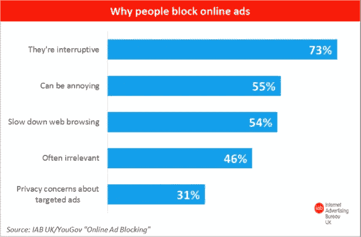

# 人们利用机器学习赚钱的 6 种方式

> 原文：<https://towardsdatascience.com/6-ways-people-are-making-money-with-machine-learning-db10575f3564?source=collection_archive---------1----------------------->

source: www.graymeta.com

机器学习绝对[非常酷](https://medium.com/towards-data-science/understand-these-5-basic-concepts-to-sound-like-a-machine-learning-expert-6221ec0fe960)，很像虚拟现实或者你键盘上的触控条。但是*酷*和*有用*有很大区别。对我来说，如果能解决问题、节省时间或金钱，那就是有用的。通常，这三件事是有联系的，并且与一个更宏大的想法有关；*投资回报*。

在人工智能和机器学习方面已经有了一些惊人的[飞跃](https://medium.com/working-for-change/i-didnt-worry-about-ai-taking-over-the-world-until-i-learned-about-this-3a8e15f04269)，但是如果它不能为你的投资提供回报，这些都没有意义。那么如何让机器学习变得有用呢？以下是机器学习如何为公司节省时间和金钱的一些真实例子:

1.  查找资料

[https://www.thunderstone.com/products-for-search/search-appliance/](https://www.thunderstone.com/products-for-search/search-appliance/)

我相信你已经花了时间去找一张照片或一封电子邮件。如果你全部加起来，那是多少时间？你每小时得到多少钱？公司也有这个问题。我们都完全淹没在数字内容中。我们到处都有文件和文件夹，它们被塞满了。更糟糕的是，我们也没有很好地跟踪它。类似于我的公司 GrayMeta 的平台被用来扫描企业拥有的一切，并运行诸如对象识别、文本分析、语音到文本、人脸识别等功能。来创建好的，可搜索的数据库。人们现在花在搜索和寻找东西上的时间大大减少了。这种节省远远大于平台的成本。Tadaaa！这就是 ROI 宝贝。

2.瞄准你的观众

如今广告商面临的最大问题之一是人们忽视了他们的产品。我承认我觉得 99%的广告都很烦人，而且不相关。我尽我所能不点击或不看广告。问题是广告还是太宽泛，而且通常不能反映我的个人兴趣。做广告的平台希望用机器学习来解决这个问题。

[http://neilpatel.com/blog/your-ads-are-getting-ignored-5-smart-strategies-to-overcome-banner-blindness/](http://neilpatel.com/blog/your-ads-are-getting-ignored-5-smart-strategies-to-overcome-banner-blindness/)

向观众提供内容的公司现在正在使用计算机视觉和语音转文本技术，以比以前更精细的方式理解他们自己的内容。然后，这些信息被动态地用于驱动你在内容中或内容旁边看到什么广告。你在看一部关于狗的电影吗？看到狗粮的广告不要惊讶。更多的相关广告意味着更多的参与，更多的参与意味着更多的钱。

3.提高存储效率

您知道吗，大多数云存储服务根据您需要内容的速度有不同的定价？存储在一个可以立即访问的地方的东西每 GB 大约要花 0.023 美元。但是你不介意等待的东西每 GB 要花费 0.004 美元。便宜五分之一。新闻机构有许多采访、b-roll 和其他重要的镜头，它们正在转移到云上。假设他们有 100TBs 的内容。为了快速访问(因为新闻发生得快)，他们将 100%的内容保存在更昂贵的层上。这让他们每月花费 2300 美元，每年 27600 美元。

现在，他们使用机器学习来决定哪些内容应该存储在更昂贵的层上。社交媒体上的趋势关键词在数据库中发起查询，该数据库具有每个视频的粒度元数据(多亏了机器学习)。对该查询的肯定匹配启动该视频到更昂贵的存储器的传输。该公司现在可以在更便宜的存储设备上存储 100TBs，每年节省 22，800 美元。

4.提高存储效率

使用上述公司存储在云中的 100TBs 数据也是要花钱的。让我们假设，到今年年底，100%的内容都需要被下载、编辑和用于新闻制作。那要花 84000 美元。如果你不知道你的云存储中有什么，你必须下载它来找出答案，这需要你花钱。你有没有一个标签为 b-roll 的文件夹，里面有很多视频文件，仅凭文件名无法识别？由于机器学习，人们可以知道每一个视频中有什么，而不必下载它。他们可以下载他们想要的确切文件，而不是整个文件夹或项目，每年节省数万美元的外出费用。

5.分析东西

大多数机器学习都是关于预测事物的。一家受欢迎的视频点播公司列出了你观看的所有内容，你观看它们的时间，你观看之前的趋势，并训练一个机器学习模型来尝试和预测你接下来要观看的内容。他们使用这种预测来确保该内容在离您最近的服务器上已经可用。对你来说，这意味着电影播放速度快，质量高。对于视频点播公司来说，这意味着他们不必将自己拥有的所有东西都存储在世界上的每一台服务器上。他们只在认为你会看的时候才会把视频内容转移到服务器上。这省下的钱是惊人的。

6.避免罚款和保全面子

联邦通信委员会和其他政府机构可以对广播公司进行罚款，因为它们有不雅或淫秽的内容，如裸体、性内容或图形语言。其他发行合作伙伴可能只是对他们能玩什么或不能玩什么有严格的规定。你可能会认为，在将有问题的内容发送出去之前，很容易就能发现它们，但事实证明，制片厂仅仅是在内容发布之前检查一下，就要花费超过 120 个工时！如果你每小时付给这些人 20 美元，那么每部电影，每个分销渠道就是 2400 美元！如果你认为每个国家至少有一个频道，那么每个国家都有机上娱乐、日间电视、黄金时间电视、点播等节目..变得疯狂。幸运的是，机器学习通过自动标记内容为这些公司节省了大量的时间和金钱。人类仍然需要审查和批准，但他们花在这方面的时间从几周减少到几分钟。这是我个人看到的机器学习投资的最大回报之一。

作为个人或大公司，机器学习可以成为实现目标的非常有用的工具。[弄清楚如何将一些很酷的技术和现实问题结合起来并不容易](https://medium.com/towards-data-science/how-to-fail-at-machine-learning-36cf26474398)。这就是为什么考虑想法的有用性和投资回报总是很重要。