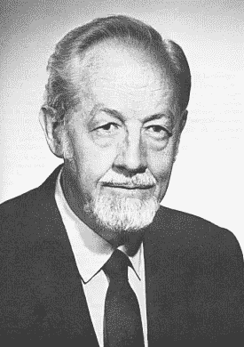
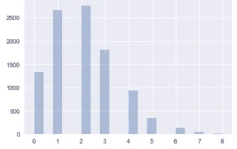

# 7 数据类型:思考机器学习数据类型的更好方式

> 原文：<https://towardsdatascience.com/7-data-types-a-better-way-to-think-about-data-types-for-machine-learning-939fae99a689?source=collection_archive---------2----------------------->

## 超越数字和范畴

在本文中，我为机器学习实践者提出了一个更有用的数据分组分类法:7 种数据类型。

关于机器学习的编码、输入和特征工程的在线课程、教程和文章通常将数据视为*分类*或*数字*。二进制和时间序列数据有时会被调出，偶尔,*序数*这个术语会溜进对话中。然而，需要一个更精细的框架来提供更丰富的公共词典，用于思考和交流机器学习中的数据。

我在这篇文章中提出的框架应该引导从业者，尤其是新的从业者，更快地开发更好的模型。有了 7 种数据类型作为参考，我们应该能够更快地评估和讨论可用的编码选项和插补策略。

# TL；DR；

将您的每个功能作为以下七种数据类型之一进行思考和讨论，以节省时间和传递知识:

1.  无效的
2.  名义上的
3.  二进制的
4.  序数
5.  数数
6.  时间
7.  间隔

## 更新

通读一遍，看看机器学习的另外 4 种数据类型。

# 当前状态

在机器学习的世界里，数据几乎总是被分成两组:[数值型和分类型](https://developers.google.com/machine-learning/glossary/#c)。

数字数据用来表示由数字(浮点或整数)表示的任何东西。分类数据通常意味着其他一切，特别是离散的标记组经常被调出。这两个主要的分组——数字分组和分类分组——使用起来不一致，并且没有提供关于应该如何操作数据的更多指导。

数据通常需要以数字形式输入，以便机器学习算法使用这些数据进行预测。在机器学习指南中，分类字符串数据通常是 [one-hot-encoded](http://scikit-learn.org/stable/modules/generated/sklearn.preprocessing.OneHotEncoder.html) (又名哑编码)。Dan Becker 在 Kaggle 的[机器学习教程系列](https://www.kaggle.com/dansbecker/using-categorical-data-with-one-hot-encoding)中将它称为“分类数据的标准方法”。

在教程中，经常会假设所有以数字形式到达的数据都可以直接使用，并且所有的字符串数据都需要进行一次热编码。虽然许多教程确实对数据类型进行了更深入的研究(例如专门处理时间、二进制或文本数据)，但这些更深入的研究通常不是以系统的方式进行的。事实上，我还没有找到明确的准则来根据本文提出的分类法转换数据。如果你知道这样的数据科学资源，请在评论中分享:)

在研究生院接受社会科学方法和统计学培训后，我来到机器学习，我发现很惊讶的是，没有太多关于序数数据的讨论。例如，我发现自己一直在试图找出最好的方法来编码和估算字符串形式的顺序标度数据和数字形式的名义(真正分类的)数据。如果没有清晰一致的数据类型分类，这将花费不必要的时间。

这 7 种数据类型的灵感来自 Steven 的测量尺度类型学和我自己对机器学习模型中需要特别考虑的数据类型的观察。在介绍 7 种数据类型之前，让我们先来看看正在使用的度量标准及其来源。

# 史蒂文斯的测量量表类型学

Stanley Smith Stevens

20 世纪 60 年代，哈佛大学心理学家 Stanley Smith Stevens 为数据创造了四个测量尺度:比率、区间、序数和名义值，这四个尺度是 T2。

*   比率(值和有意义的零值之间的等间距—平均值有意义)
*   Interval(值之间有相等的空格，但没有有意义的零值 mean 有意义)
*   序数(第一个、第二个、第三个值，但第一个和第二个以及第二个和第三个值之间的间距不相等—中间值有意义)
*   名义值(不同类别之间没有数字关系——平均值和中值没有意义)

史蒂文的类型学变得非常流行，尤其是在社会科学领域。此后，其他研究人员进一步扩大了音阶的数量( [Mosteller & Tukey)](https://en.wikipedia.org/wiki/Level_of_measurement) 包括多达十个类别( [Chrisman](https://en.wikipedia.org/wiki/Level_of_measurement) )。尽管如此，Steven 的类型学在社会科学中占据主导地位，偶尔也会在数据科学中被引用(例如[这里](/data-types-in-statistics-347e152e8bee))，尽管在许多情况下没有提供明确的指导。

其他机器学习和数据科学从业者已经以各种方式采用了史蒂文类型学的部分内容，导致了各种各样的术语。例如，Hastie、Tibshirani 和 Friedman 在《统计学习的要素》第二版中。将*比率*和*区间*组合成*定量*并分解出*序数*和*分类*在一个例子中(第 504 页)。哈斯蒂等人。艾尔。将*序数*称为*有序分类变量，将*分类变量称为*定性*、*离散、*或*因素*(第 10 页)*。* [假人统计](http://TYPES OF STATISTICAL DATA: NUMERICAL, CATEGORICAL, AND ORDINAL)将数据类型分解为*数值*、*序数*和*分类*——在*数值*下用*区间*集总*比率*。DataCamp 是指[教程](https://www.datacamp.com/community/tutorials/categorical-data)中的*连续*、*序数*和*名义*数据类型。

统计学中偶尔出现的一种分类是介于离散变量和连续变量之间的。离散数据有不同的值，而连续数据在一个范围内有无限个可能的值。

但是一般在机器学习中数值和分类就是你会看到的除法(比如这里的)。流行的 Pandas 库在其可选的 [*类别*](https://pandas.pydata.org/pandas-docs/stable/categorical.html) 数据类型中将序数和名义数据结合在一起。总的来说，目前机器学习数据类型的词典不一致，令人困惑。而不清楚的，学的慢。可以做些什么来改善事情？

# 机器学习的 7 种主要数据类型

虽然改进机器学习中的数据类型词典似乎是一个大胆的目标，但我希望这篇文章将提供一个有用的分组分类法，以便为数据科学家提供更可行的步骤。通过提供清晰的类别，我希望帮助我的同事，尤其是新人，更快地建立模型，并发现提高模型性能的新选项。

我建议对机器学习从业者最有用的 7 种数据类型进行如下分类:

1.  无效的
2.  名义上的
3.  二进制的
4.  序数
5.  数数
6.  时间
7.  间隔

## 1.无效的

无用数据是唯一的、离散的数据，与结果变量没有潜在关系。一个无用的特性可能有很高的基数。随机生成的银行账号就是一个例子。

That’s useless for machine learning, but kind of cool

如果特征由没有顺序和意义的唯一值组成，则该特征是无用的，并且在拟合模型时不需要包括在内。

没有变化的特性也是如此。如果数据集中的每个人都是成年人，那么用一列 1 来表示这些信息对模型没有帮助。

## 2.名义上的

名义数据由不同类别之间没有数值关系的离散值组成，平均值和中值没有意义。动物物种就是一个例子。比如，猪并不比鸟高，比鱼低。

Nominal data: animal groups

国籍是名义数据的另一个例子。群体成员没有数字顺序——法国人、墨西哥人或日本人本身并不意味着一种有序的关系。

您可以一次性热编码或散列名义特征。不要对它们进行顺序编码，因为组之间的关系不能简化为单调函数。值的分配将是随机的。

## 3.序数

序数数据是可以排序的离散整数。一个决定性的特征是任何两个数之间的距离都是未知的。

例如，第一和第二之间的距离可能不同于第二和第三之间的距离。想想 10 公里赛跑。获胜者可能跑了 30 分钟，第二名可能跑了 30 分 01 秒，第三名可能跑了 400 分钟。没有时间数据，我们不知道队伍之间的相对距离。

概括地说，序数数据可以用三种方式之一进行编码。可以假设它与区间数据足够接近，数值之间具有相对相等的幅度，从而将其视为区间数据。社会科学家一直用李克特量表做这个假设。例如，从 1 到 7，1 表示极不可能，4 表示既不可能也不太可能，7 表示极有可能，您向朋友推荐这部电影的可能性有多大？这里，3 和 4 之间的差以及 6 和 7 之间的差可以合理地假设为相似。

第二种选择是将有序数据视为名义数据，其中每个类别与任何其他类别都没有关系。在这种情况下，可以使用一键编码或类似的方案。

第三个选项将在以后的文章中更详细地探讨，它类似于[反向赫尔默特编码](http://www.statsmodels.org/dev/contrasts.html)，可用于对值之间的各种潜在大小进行编码。

将有序数据归类为它自己的数据类型是有好处的。

## 4.二进制的

二进制数据是离散数据，只能属于两类中的一类——是或否、1 或 0、开或关等。二进制可以被认为是序数、标称值、计数或区间数据的一种特殊情况。

二进制数据是机器学习分类问题中非常常见的结果变量。例如，我们可能希望创建一个监督学习模型来预测肿瘤是恶性的还是良性的。

二进制数据是常见的，当考虑您的数据时，应该有自己的类别。

## 5.数数

计数数据是离散的整数数据，这里没有负数。计数数据通常有许多小值，如零和一。

计数数据通常遵循[泊松分布](https://stats.stackexchange.com/questions/3024/why-is-poisson-regression-used-for-count-data)。

Poisson distribution drawn from random numbers

计数数据通常被视为类似于区间数据，但它足够独特和广泛，足以值得自己的类别。

## 6.时间

时间数据是一种循环的、重复的连续数据形式。相关的时间特征可以是任何时间段——每天、每周、每月、每年等等。

每个观察值可能是我们见过的任何其他数据类型。例如，您的数据可能包含按日期排列的单位销售额或总收入。

Pandas python 库的设计考虑了时间序列数据。财务和营销数据通常包含重要的时间序列部分。

时间序列数据通常需要一些争论和操作来创建可能对您的模型有意义的周期特征。

缺失的时间序列数据通常使用适合于季节或每日数据的独特方法来填充。

时间序列数据有一些自己的模型，绝对值得单独考虑。😀

## 7.间隔

间隔数据在数字之间有相等的空间，并且不代表时间模式。例子包括百分比、温度和收入。

区间数据是最精确的测量尺度数据，非常普遍。尽管每个值都是一个离散的数字，例如 3.1 英里，但对于机器学习来说，它是否是一个连续的范围(例如，无限小的测量大小是可能的)通常并不重要，是否存在绝对零度也不重要。

区间数据通常很容易处理，但您可能希望创建条柱来减少范围的数量。

这里有 7 种数据类型。

1.  无效的
2.  名义上的
3.  二进制的
4.  序数
5.  数数
6.  时间
7.  间隔

尽管许多有经验的机器学习实践者在实践中确实认为用这些标签描述的一些数据类型不同，但该领域缺乏明确的分类。我假设使用上面的分类法将帮助人们更快地评估编码、输入和分析数据的选项。

请注意，这七个类别中的大多数可以以几乎任何形式出现在您的原始数据中。我们不是在讨论 float 64 vs bool:Python 类型或(Numpy 或 Pandas dtype)与这里讨论的数据的*类型*不同。

# 这是正确的七类吗？

类型学被发明出来进行辩论。😀

在构建 7 种数据类型时，我问自己将计数数据与区间数据分开是否真的有用。最后，我认为这是因为文本数据是计数数据的一种常见形式，并且计数数据确实有一些[常见的不同统计方法](https://stats.stackexchange.com/questions/5571/comparing-regression-models-on-count-data)。

类似地，二进制数据可以被视为所有更高比例类型的子类型。然而，二进制数据在机器学习中非常常见，二进制结果变量具有一些其他多分类任务所不具有的潜在机器学习算法。您也不需要采取额外的步骤来编码二进制数据。

# **2018 年 12 月 7 日更新:**

在深度学习上花了更多时间并考虑了读者的评论后，我会再添加四种特定的数据类型，使机器学习的有用数据类型总数达到 11 种。

8.图像

9.录像

10.声音的

11.文本

这四种数据类型具有独特的特征和专为它们构建的库特性。我认为机器学习的数据类型的全面分类需要包含它们。

如果你想倡导不同的分类法，请在评论中提出。

# 我该如何记住这些 7̶数据类型呢？

1.  无效的
2.  名义上的
3.  二进制的
4.  序数
5.  数数
6.  时间
7.  间隔
8.  图像
9.  录像
10.  声音的
11.  文本

记忆是学习的关键。RNBOCTI 并不完全是脱口而出。

One of the eight or nine planets

从 [9 行星助记符](https://en.wikipedia.org/wiki/Planetary_mnemonic)中得到启示，让我们制作一个助记符来帮助记住 7 种数据类型。

*丑吵倭黑猩猩和老猫拿冰？*

或者

*傲慢吵闹的男孩常常无法接受指令*

或者

*新床底下老牛翻身*

你或许可以做得更好。😉想出你自己的助记符，包括四种额外的数据类型，并在评论中分享。👍

# 我应该传播关于数据类型的信息吗？

绝对的。

在本文中，我将数据类型归类为 s̶e̶v̶e̶n̶十一大类之一，以创建一个更连贯的词典，用于在数据科学中思考和交流数据类型。这些类别对我在本文的[中探索的编码选项有影响。](/smarter-ways-to-encode-categorical-data-for-machine-learning-part-1-of-3-6dca2f71b159)

当我们都使用相同的术语来表示相同的事情时，我们就节省了学习和传递知识的时间。听起来是不是很棒？如果您同意，请在您最喜爱的社交媒体上分享。

我写关于数据科学、T2、Python 和其他技术主题的文章。如果你对这些感兴趣，请关注我，在这里阅读更多。😀

感谢阅读！