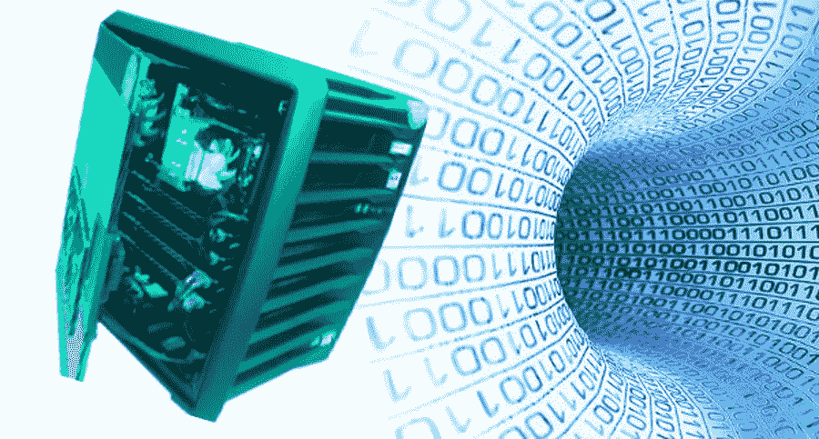
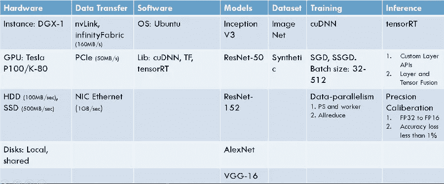

# 在使用 GPU 加速深度学习应用程序之前，需要思考 7 点

> 原文：<https://towardsdatascience.com/7-points-to-ponder-before-you-use-gpus-to-speed-up-deep-learning-apps-cfc53dc29b54?source=collection_archive---------19----------------------->

Deep Learning and GPUs

# 介绍

鉴于围绕其加速的宣传，使用[GPU](https://en.wikipedia.org/wiki/Graphics_processing_unit)进行深度学习训练和推理是很有诱惑力的。然而，为了有效地使用这些资源，更深入地了解加速的来源是很重要的。在本文中，我们将研究一个典型的 DL 应用程序的性能依赖性。我们将使用英伟达的大肆宣传的机器 DGX-1 作为例子，但以下几点是通用的，足以适用于通用 GPU 或 TPU。

# 1.五金器具

底层硬件规格在决定 DL 加速方面起着最重要的作用。对于典型的 DL 应用程序来说，拥有一个快速的硬件并不能自动转化为最好的加速，除非你非常小心。

1.  [GPU 数量](https://en.wikipedia.org/wiki/Graphics_processing_unit) (8 特斯拉 P100s)
2.  [CUDA](https://en.wikipedia.org/wiki/CUDA) 内核(28672 个 CUDA 内核)
3.  [张量](https://en.wikipedia.org/wiki/Tensor_processing_unit)核心(无)
4.  GPU 内存(128GB)
5.  [系统内存](https://en.wikipedia.org/wiki/Shared_graphics_memory) (512GB，2,133 MHz DDR4)

# 2.数据传送

由于 DL 应用程序执行数据密集型操作，因此在训练和推理过程中理解硬件组件之间的数据流非常重要。今天的高档机器中的数据传输范围从网络上的几千兆字节/秒到 GPU 集团内的超过 100 千兆字节/秒。这可能会对 DL 应用程序的性能产生高达 100 倍的影响。例如，采用 [nVLink](https://en.wikipedia.org/wiki/NVLink) 的特斯拉 P-100 架构允许 GPU 之间的数据传输速度高达 160GB/s，同时，它可以通过 HDD/SSD、NIC 或 RAM 接口来降低速度。

记住这一点很有帮助，数据传输链的速度与其最慢的链路一样快。下面是数据传输所依赖的速度的组成部分。

1.  硬盘驱动器或 HDD(典型速度 100MB/s)
2.  固态硬盘或 SSD(典型速度 500MB/s)
3.  [PCI express](https://en.wikipedia.org/wiki/PCI_Express) 5(典型速度 4GB/s-60GB/s)
4.  [网络接口卡](https://en.wikipedia.org/wiki/Network_interface_controller)(典型速度 16Gb/s)

# 3.基础设施软件

基础设施软件包括以下选项

1.  **操作系统:** Ubuntu 14.04 LTS 依然是热门选择。在将机器用于 DL 应用程序之前，请确保删除未使用的守护程序和服务(例如 ftp、防火墙等)。
2.  **编程语言和 DL 框架:** [Python](https://www.python.org/) 和支持多线程的 [Tensorflow](http://tensorflow.org) 是一个流行的组合。深度学习库中对优化算法(如 Allreduce、Parameter-Server & Worker 等)的本机支持可以平衡数据管道，这对于利用快速硬件有很大帮助。其他值得一提的流行 DL 库有 [Caffe](http://caffe.berkeleyvision.org/) 、 [CNTK](https://www.microsoft.com/en-us/cognitive-toolkit/) 和 [pyTorch](https://pytorch.org/) 。

# 4.深度学习模型

如果您使用现成的深度学习模型(如 VGG16、resNet50 等)进行推理，请考虑使用针对您选择的深度学习库优化的版本，以确保神经网络结构针对效率进行了优化。Tensorflow 社区继续支持新的 DL 模型，以实现更大的利益。你可以在这里[访问它们](https://github.com/tensorflow/models)。

# 5.数据集

数据集或样本的大小是一个重要的指标。一般来说，现实生活中的数据要比数据挖掘应用程序所需的数据大几个数量级。例如，VGG-16 仅拍摄 224x224 像素的图像，而典型的手机相机则拍摄 4000x3000 像素的图像。与在训练循环或推断中避免不必要的带宽消耗相反，在此之前减少一次大小是值得的。

# 6.培养

对 DL 训练原语和分发策略的原生 GPU 支持使得 DL 开发人员工作效率更高。

**样本 DL 训练原语**包括池化、批量标准化、丢弃、ReLU、Sigmoid、Softmax 等

**分发策略**涵盖镜像策略、PS-worker、All reduce 等技术。

**分布式**风味的**反向传播**算法如自动微分对计算效率起着至关重要的作用。

确保像 [nVidia](http://nvidia.com) 和 [AMD](http://amd.com) 这样的 GPU 提供商为你选择的深度学习库提供支持是很重要的。nVidia 为 DL 训练原语提供了成熟的 cuDNN，而 AMD 的 ROCM 还有很多需要赶上。

# 7.推理

DL 推断可能会拖累大型 DL 模型，如 [resNet152](https://arxiv.org/abs/1512.03385) ，并且可以在生产模式中使用 GPU。推理优化包括以下两种方法。

**层和张量融合**改变图的结构，在不影响输出精度的情况下提高推理性能。

**精度校准**降低神经元精度(从 FP32 到 FP24、FP16 或 INT8)会对 DL 模型精度产生不利影响，因此必须谨慎使用。

# 摘要

下图总结了我们上面讨论的 7 点。

## 信用

这些数据大部分是为《设计自动化中的机器智能》这本书收集的。