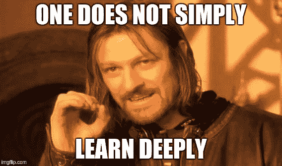
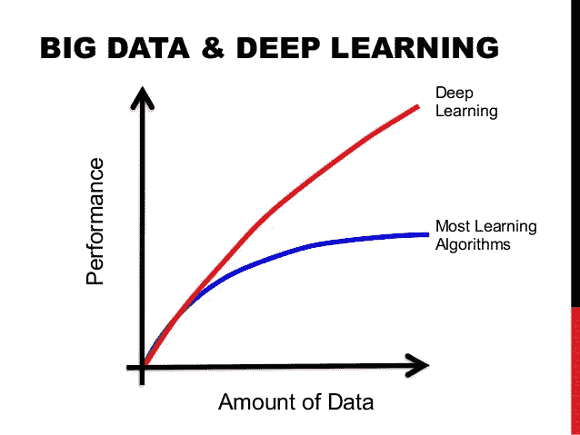
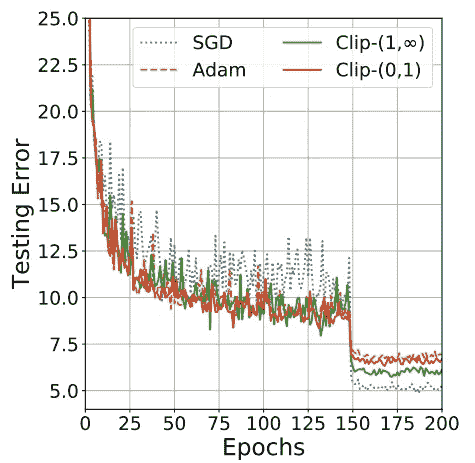
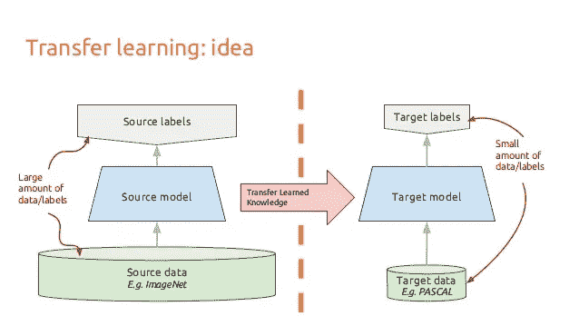
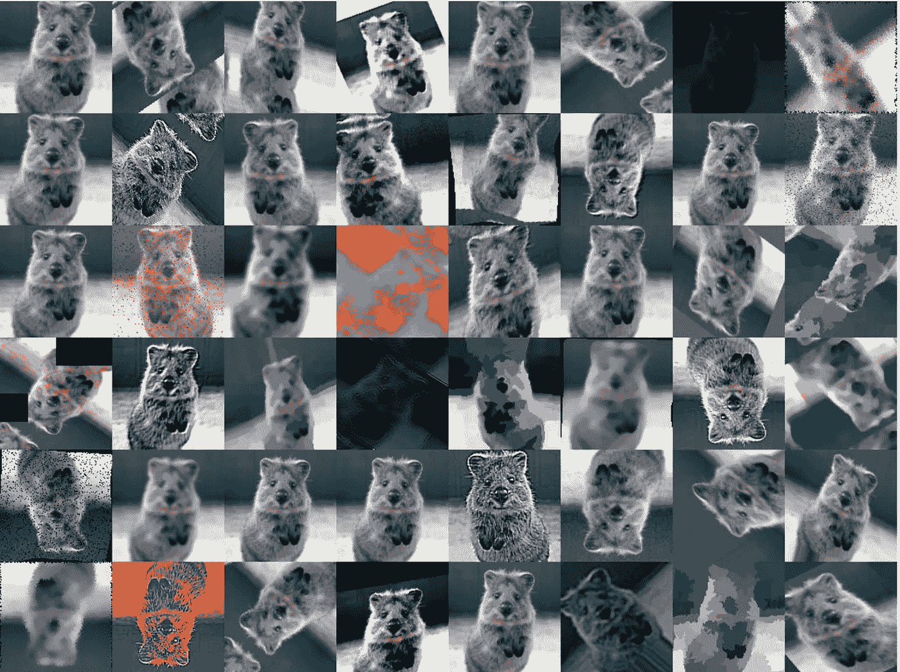

# 7 个实用的深度学习技巧

> 原文：<https://towardsdatascience.com/7-practical-deep-learning-tips-97a9f514100e?source=collection_archive---------4----------------------->

> 想获得灵感？快来加入我的 [**超级行情快讯**](https://www.superquotes.co/?utm_source=mediumtech&utm_medium=web&utm_campaign=sharing) 。😎

深度学习已经成为解决许多具有挑战性的现实世界问题的首选方法。对于物体检测、语音识别和语言翻译来说，这是迄今为止性能最好的方法。许多人将深度神经网络(DNNs)视为神奇的黑匣子，我们将一堆数据放入其中，然后我们的解决方案就出来了！实际上，事情实际上会变得复杂得多…

在针对特定问题设计和应用 DNN 时，可能会面临一系列挑战。为了达到实际应用所需的性能标准，管道中所有阶段的正确设计和执行至关重要，包括数据准备、网络设计、训练和推理。在这里，我将与你分享 7 个实用技巧，让你最大限度地利用你的深层神经网络。

## 1 —数据，数据，数据

这不是什么大秘密。一直运行良好的深度学习机器需要燃料——大量的燃料；这种燃料就是数据。我们拥有的**标签** **数据**越多，我们的模型表现就越好。更多的数据导致更好的性能的想法甚至已经被谷歌用 3 亿张图像的数据集进行了大规模的探索！

[重新审视深度学习时代数据的不合理有效性](https://arxiv.org/abs/1707.02968)

当在现实世界的应用中部署深度学习模型时，你应该不断地向它提供更多的数据并进行微调，以继续提高它的性能。下图很好地说明了这将如何影响你的准确性。传统的机器学习算法达到了早期饱和点，超过这个饱和点，更多的数据就没有帮助了(蓝线)。另一方面，深度学习可以带你走得更远，获得更多数据(红线)。

喂野兽:如果你想提高你的模型的性能，获得更多的数据！

Increasing data consistently yields better performance

## 2 —您应该使用哪种优化器？

多年来，已经开发了许多梯度下降优化算法，并且每个算法都有其优点和缺点。一些最受欢迎的包括:

*   带动量的随机梯度下降(SGD)
*   圣经》和《古兰经》传统中）亚当（人类第一人的名字
*   RMSprop
*   阿达德尔塔

RMSprop、Adadelta 和 Adam 被认为是*自适应*优化算法，因为它们**自动**更新学习率。使用 SGD，您必须手动**选择学习率和动量参数，通常学习率会随时间衰减。**

实际上，自适应优化器往往比 SGD 收敛得更快；但是，他们最后的表现通常会稍差一些。SGD 通常可以获得更好的最小值，从而获得更好的最终精度，但是它可能比某些优化器花费更长的时间。它还更加依赖于一个健壮的初始化和学习率衰减时间表，这在实践中很难调整。

因此，如果你需要一些快速的结果，或者只是想测试一种新的技术，那么就使用自适应优化器。我发现 Adam 非常容易使用，因为它对你选择完美的学习速度并不敏感。如果你想要绝对最好的最终性能，使用 SGD + Momentum 并使用学习率、衰减和动量值来最大化性能。

**两全其美**

最近的研究表明，你可以两全其美:**通过[从 Adam 切换到 SGD](https://arxiv.org/pdf/1712.07628.pdf) 进行高速训练和顶级表现**！这个想法是，训练的早期阶段实际上是 SGD 对参数调整和初始化非常敏感的时候。因此，我们可以通过使用 Adam 开始我们的训练，这将使您走得很远，而不必担心初始化和参数调整。然后，一旦亚当让我们滚动，我们可以切换到 SGD +动量优化，以实现最佳性能！论文[中的关键数字](https://arxiv.org/pdf/1712.07628.pdf)如下所示，展示了如何通过这种技术来提高精确度。

Adam vs SGD performance. Adam performs better at the beginning due to robustness and adaptive learning rate, while SGD reaches a better global minimum in the end.

## 3—如何处理不平衡的数据

在很多情况下，你会处理**不平衡的** **数据**，尤其是在现实世界的应用中。举一个简单但真实的例子:出于安全原因，你正在训练你的深层网络来预测视频中的某人是否持有致命武器。但是在你的训练数据里，你只有 50 个拿武器的人的视频，1000 个没拿武器的人的视频！如果你只是用这些数据马上训练你的网络，你的模型肯定会高度偏向于预测没有人曾经拥有过武器！

你可以做一些事情来解决这个问题:

*   在损失函数中使用**类** **权重**。本质上，代表不足的类别在损失函数中接收更高的权重，使得该特定类别的任何错误分类将导致损失函数中非常高的误差。
*   **过采样**:重复一些包含代表性不足的类的训练示例有助于均衡分布。如果可用数据很少，这种方法效果最好。
*   **欠采样**:您可以简单地跳过一些包含过度表示类的训练示例。如果可用数据非常大，这种方法效果最好。
*   **少数民族阶层的数据扩充**。你可以为代表性不足的班级综合创造更多的训练范例！例如，在前面检测致命武器的例子中，你可以改变视频的一些颜色和灯光，这些视频属于拥有致命武器的类别。

## 4 —迁移学习

正如我们在第一个技巧中看到的，深度网络需要大量数据。不幸的是，对于许多新的应用程序来说，这些数据很难获得，而且获取成本很高。如果我们希望我们的模型表现良好，我们可能需要数万或数十万个新的训练样本来进行训练。如果一个数据集不容易得到，它必须全部收集起来并手工标记为**。**

这就是[迁移学习](https://arxiv.org/abs/1411.1792)发挥作用的地方。有了迁移学习，我们就不需要很多数据了！这个想法是从一个之前在数百万张图像上训练过的网络开始，比如在 ImageNet 上预先训练过的 [ResNet](https://arxiv.org/abs/1512.03385) 。然后，我们将通过**只重新训练最后几层而不去管其他层**来微调 ResNet 模型。通过这种方式，我们获得了 ResNet 从数百万张图像中获得的信息(图像特征),并对其进行了微调，以便我们可以将其应用于不同的任务。这是可能的，因为跨域的图像的特征信息通常非常相似，但是对这些特征的分析可以根据应用而不同。整个过程如下图所示，它展示了我们如何获取源模型的特性，并将其作为全新目标模型的起点。

A basic transfer learning pipeline

## 5 —快速简单的数据扩充，以提高性能

我们已经说过几次了:更多的数据=更好的性能。除了迁移学习，另一种提高模型性能的快速简单的方法是**数据扩充**。数据扩充包括通过改变来自数据集的一些原始图像，同时使用原始类别标签来生成合成训练样本。例如，图像数据扩充的常见方式包括:

*   水平和垂直旋转和/或翻转图像
*   改变图像的亮度和颜色
*   随机模糊图像
*   从图像中随机裁剪补丁

基本上，你可以进行任何改变图像外观的改变，但不能改变整体内容，也就是说，你可以把一张狗的图片变成蓝色，但你仍然可以清楚地看到这是一张狗的图片。下图来自 [**imgaug**](https://github.com/aleju/imgaug) 库，显示了许多你可能想要尝试的图像增强选项，以提高你的模型的准确性。

Data augmentation galore!

## 6-用合奏来提升你的模型！

在机器学习中，**集合训练多个模型**，然后**将它们**组合在一起，以实现更高的性能。因此，想法是在相同的数据集上对相同的任务训练多个深度网络模型。然后可以通过投票方案将模型的结果结合起来，即票数最高的类别获胜。

为了确保所有模型都是不同的，可以使用随机权重初始化和随机数据增加。众所周知，集合通常比单个模型更精确，这是由于使用了多个模型，因此从不同的角度处理任务。在现实世界的应用中，尤其是挑战或比赛，几乎所有的顶级模型都使用系综。集成的一般要点如下所示，其中 3 个不同分类模型的输出被组合在一起。

Ensemble models

## 7 —通过修剪加快速度

我们知道模型精度随着深度增加，但是速度呢？层数越多意味着参数越多，参数越多意味着计算越多，内存消耗越大，速度越慢。理想情况下，我们希望在提高速度的同时保持高精度。我们可以通过**修剪**来做到这一点。

这个想法是，在网络的许多参数中，有些参数是冗余的，对输出没有太大贡献。如果你可以根据神经元的贡献大小对网络中的神经元进行排序，那么你就可以从网络中移除排序较低的神经元，从而形成一个更小、更快的网络。可以根据神经元权重的 L1/L2 均值、它们的平均激活度、某个验证集上神经元不为零的次数以及其他创造性方法来进行排序。获得更快/更小的网络对于在移动设备上运行深度学习网络很重要。

修剪网络的最基本方法是简单地丢弃某些卷积滤波器。这在最近的论文中做得相当成功。这项工作中的神经元排序相当简单:它是每个过滤器权重的 L1 范数。在每次修剪迭代中，他们对所有的过滤器进行排序，在所有层中全局地修剪 m 个最低排序的过滤器，重新训练并重复！

另一篇[最近发表的论文](https://arxiv.org/abs/1605.06431)提出了修剪过滤器的关键见解，该论文分析了残差网络的结构。作者表明，当删除图层时，具有残余快捷连接的网络(如 ResNets)在保持良好的准确性方面远比不使用任何快捷连接的网络(如 VGG 或 AlexNet)更强大。这一有趣的发现具有很大的实际意义，因为它告诉我们，在为部署和应用而修剪网络时，网络设计至关重要。).所以用最新最棒的方法总是好的！

## 这是一个总结！

这就是你深度学习的 7 个实用技巧！

# 喜欢学习？

在[推特](https://twitter.com/GeorgeSeif94)上关注我，我会在那里发布所有最新最棒的人工智能、技术和科学！