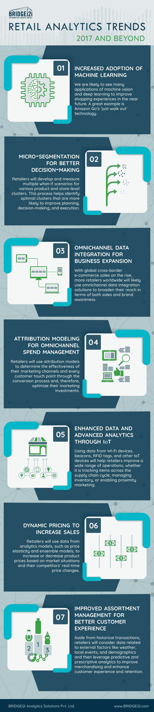

# 7 零售分析趋势塑造行业(信息图)

> 原文：<https://towardsdatascience.com/7-retail-analytics-trends-shaping-the-industry-infographic-cf5d320c728a?source=collection_archive---------3----------------------->

随着全球越来越多的零售商从使用 BI 和分析平台及服务中获得巨大回报，零售分析解决方案的采用率正在快速增长。因此，毫不奇怪，全球零售分析市场预计将在 2015-2020 年间翻一番，到 2020 年总额将达到 51 亿美元。

随着对机器学习和颠覆性创新的日益关注，零售领域正在不断发展。例如，Sailthru 在其报告中透露，在 2017 年和接下来的几年里，零售商打算利用人工智能能力来提升他们的营销游戏。

也就是说，下面是 BRIDGEi2i 的信息图，强调了影响行业并将在未来几年继续占据显著地位的最大[零售分析](http://www.bridgei2i.com/retail-analytics-solutions/)趋势。

*(首发于* [*BRIDGEi2i 博客*](http://bridgei2i.com/blog/retail-analytics-trends-2017-beyond-infographic/) *)。)*