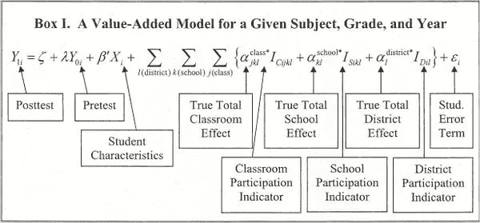
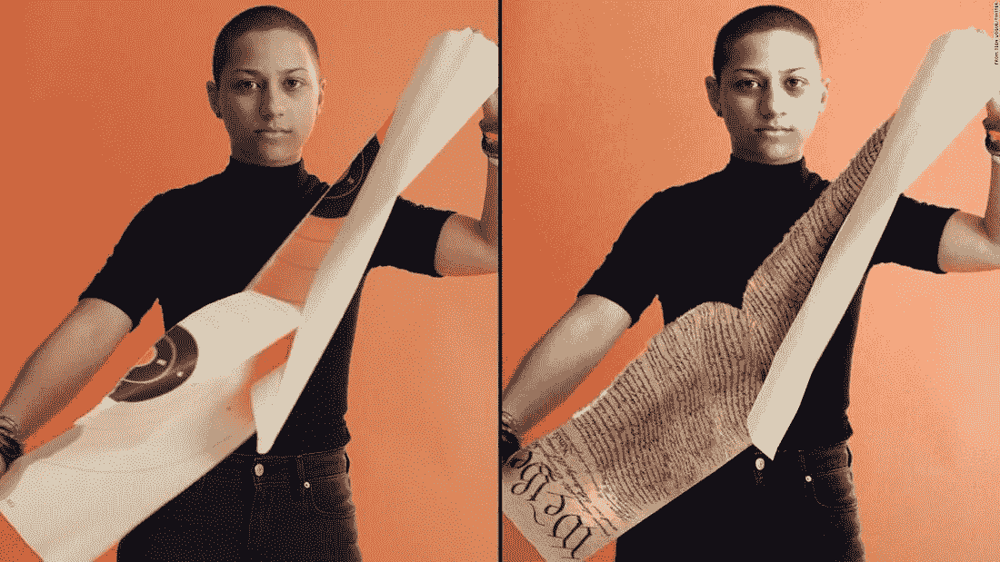
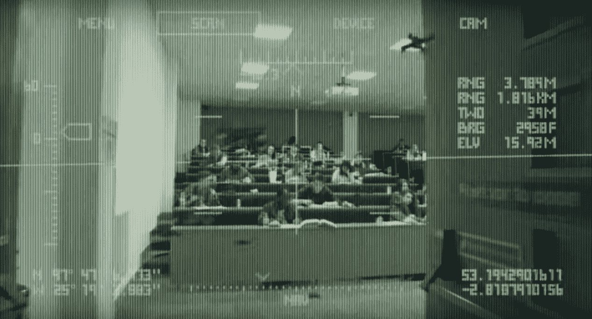
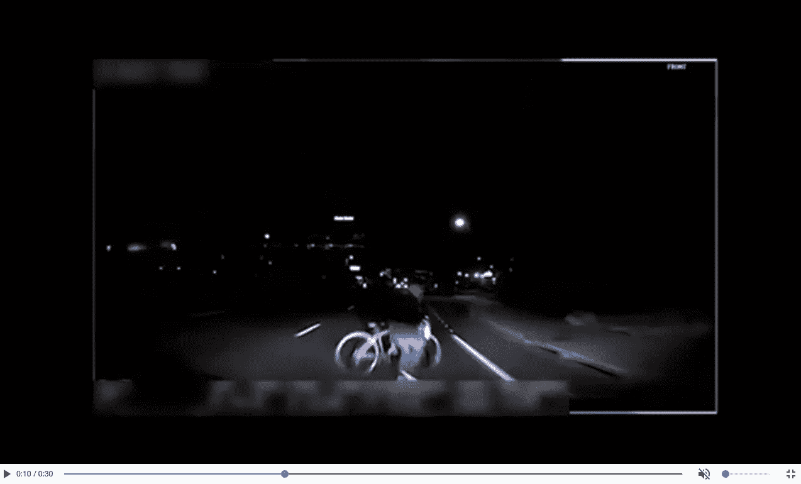
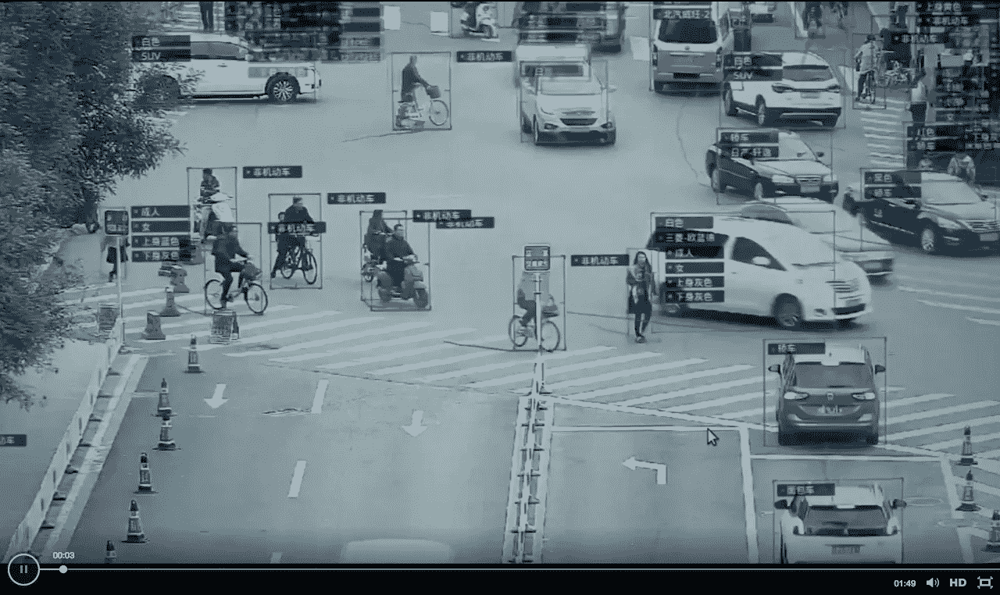

# 7 个短期人工智能伦理问题

> 原文：<https://towardsdatascience.com/7-short-term-ai-ethics-questions-32791956a6ad?source=collection_archive---------1----------------------->

当新技术变得广泛传播时，它们通常会引发伦理问题。例如:

1.  武器——应该允许谁拥有武器？
2.  印刷机——应该允许出版什么？
3.  无人机——应该允许它们去哪里？

这些问题的答案通常是在技术变得足够普遍以至于实际出现问题之后。随着我们的技术变得越来越强大，新技术带来的潜在危害也会越来越大。我认为，面对新的技术危险，我们必须从被动的反应转变为主动的 T2。

我们需要在到来之前开始识别我们的技术*的伦理问题和可能的影响。鉴于技术以指数级的速度增长，我们考虑伦理问题的时间会越来越少。*

我们需要就所有这些话题进行公开对话。这些是科学无法回答的问题——它们是关于我们价值观的问题。**这是哲学的领域，不是科学。**

尤其是人工智能引发了许多伦理问题——以下是我认为值得考虑的一些问题。我为那些想更深入了解的人提供了许多链接。

我只提供问题——作为一个社会，我们有责任找出最好的答案，并最终找到最好的立法。

# 1.算法中的偏差

机器学习算法从给定的训练数据中学习，而不考虑数据中任何不正确的假设。通过这种方式，这些算法可以反映甚至放大数据中存在的偏差。

例如，如果一个算法是根据种族主义或性别歧视的数据训练的，那么[产生的预测](https://www.propublica.org/article/breaking-the-black-box-how-machines-learn-to-be-racist?)也会反映这一点。一些现有的算法将黑人误标为“大猩猩”，或者向亚裔美国人收取更高的 SAT 辅导费用。试图避免像“种族”这样明显有问题的变量的算法，会发现越来越难以理清可能的种族替代物，比如邮政编码。算法已经被用于确定信用价值和雇佣，它们可能无法通过传统上用于确定歧视行为的[不同影响](https://en.wikipedia.org/wiki/Disparate_impact)测试。

我们如何确保算法[是公平的](https://www.technologyreview.com/s/601775/why-we-should-expect-algorithms-to-be-biased/)，尤其是当它们被公司私有，并且不被公众监督的时候？我们如何平衡开放性和知识产权？

Using Twitter to call out Google’s algorithmic bias

# 2.算法的透明度

比公司不允许他们的算法被公开审查这一事实更令人担忧的是，一些算法甚至对它们的创造者来说也是晦涩难懂的。
深度学习是机器学习中一种快速发展的技术，可以做出非常好的预测，但不能真正解释为什么会做出任何特定的预测。

例如，一些算法已经被用于[解雇教师](https://www.bloomberg.com/view/articles/2017-05-15/don-t-grade-teachers-with-a-bad-algorithm)，却无法给他们一个解释为什么模型显示他们应该被解雇。

我们如何平衡对更精确算法的需求和对受这些算法影响的人透明的需求？如果有必要，我们是否愿意牺牲[准确性来换取](https://arxiv.org/pdf/1606.08813v1.pdf)透明度，就像欧洲新的通用数据保护条例可能做的那样？如果人类真的可能[不知道他们行动的真实动机](https://medium.com/conversations-with-tyler/robin-hanson-tyler-cowen-signaling-the-elephant-in-the-brain-e1444b69baa7)，我们应该要求机器在这方面比我们实际做得更好吗？

​

An algorithm that is much more transparent than deep learning

# 3.算法至上

前两个问题引起了类似但略有不同的关注。如果我们开始信任算法来做决定，谁将对重要的决定拥有最终决定权？会是人类，还是算法？

例如，一些算法已经被用于确定刑期。鉴于我们知道法官的判决会受到他们情绪的影响，一些人可能会认为应该用“机器人法官”来取代“T4”法官。然而，ProPublica 的一项研究发现，这些流行的判决算法之一对黑人有很大的偏见。为了找到一个“风险分数”，该算法使用关于被告熟人的输入，这些输入永远不会被接受为传统证据。

人们应该能够上诉，因为他们的法官不是人吗？如果人类法官和量刑算法都有偏差，我们该用哪个？最高法院未来的“机器人法官”应该扮演什么角色？

​

A case study from the ProPublica investigation into the COMPAS sentencing algorithm

# 4.假新闻和假视频

另一个伦理问题出现在(错误)信息的话题上。机器学习用于确定向不同观众展示什么内容。鉴于广告模式是大多数社交媒体平台的基础，屏幕时间被用作衡量成功的典型标准。鉴于人类更有可能接触更具煽动性的内容，有偏见的故事会像病毒一样传播。与此相关的是，我们即将使用 ML 工具来创建病毒式的[假视频，这些视频如此逼真](http://www.latimes.com/business/technology/la-fi-tn-fake-videos-20180219-story.html)以至于人类无法将它们区分开来。

例如，最近的一项研究表明，假新闻比真新闻传播得更快。虚假新闻被转发的可能性比真实新闻高出 70%。有鉴于此，许多人试图利用假新闻来影响选举和政治观点。最近对《剑桥分析》的秘密调查拍到了他们吹嘘利用假新闻影响选举的录像带。

如果我们知道视频是可以伪造的，那么在法庭上我们会接受什么样的证据呢？我们如何才能减缓虚假信息的传播，谁来决定哪些新闻算“真”呢？

Left: real image of Parkland shooting survivor Emma González. Right: Fake image that went viral

**5。致命自主武器系统** 
人工智能研究人员表示，我们将能够在不到十年的时间内创造出致命的自主武器系统。这可能是能够部署的小型无人机的形式，与目前的军用无人机不同，能够在没有人类批准的情况下做出杀人的决定。

例如，最近由人工智能研究人员制作的一个[视频](https://www.youtube.com/watch?v=ecClODh4zYk)展示了小型自主无人机，即屠宰机器人，如何被用于杀害目标人群，即种族灭绝。近 4000 名人工智能/机器人研究人员签署了一封公开信，要求禁止攻击性自主武器。

当个别国家想要利用这些武器时，我们应该根据什么来禁止这些类型的武器？如果我们真的禁止这些，我们如何确保它不会驱使研究转入地下，导致个人自己创造这些？

还是来自《屠宰机器人》，点击图片观看完整视频。

# 6.无人驾驶汽车

谷歌、优步、特斯拉和许多其他公司正在加入这个快速增长的领域，但许多伦理问题仍然没有答案。

例如，最近一辆优步自动驾驶车辆[在 2018 年 3 月撞死了一名行人](https://www.theguardian.com/technology/2018/mar/22/video-released-of-uber-self-driving-crash-that-killed-woman-in-arizona)。即使有紧急情况下的“安全司机”，他们也不够快，不能及时停下车。

随着自动驾驶汽车被更广泛地部署，当事故发生时，谁应该承担责任？应该是制造汽车的公司，在代码中犯了错误的工程师，应该被监视的操作员吗？如果一辆自动驾驶汽车开得太快，必须在撞人和坠崖之间做出选择，汽车该怎么办？(这是一个*字面* [台车问题](https://en.wikipedia.org/wiki/Trolley_problem))一旦自动驾驶汽车比一般人类司机安全(与一般人类司机比酒驾司机安全的比例相同)我们是否应该将人类驾驶定为非法？

A dashcam still from Uber’s self-driving accident

# 7.隐私 vs 监控

无处不在的安全摄像头和面部识别算法将围绕监控产生新的伦理问题。很快，摄像机将能够发现和跟踪街上的人。在面部识别之前，即使是 ominpresent 相机也考虑到了隐私，因为让人类一直观看所有镜头是不可能的。通过面部识别，算法可以更快地查看大量镜头。

例如，闭路电视摄像机已经开始在中国被用来监控公民的位置。一些警察甚至收到了[面部识别眼镜](https://www.theverge.com/2018/2/8/16990030/china-facial-recognition-sunglasses-surveillance)，这种眼镜可以给他们在街上看到的人提供实时信息。

是否应该对这些技术的使用进行监管？鉴于社会变革往往始于对现状的挑战和非暴力反抗，圆形监狱会导致自由的丧失和社会变革吗？

Surveillance cameras in China using machine vision

# 有期限的哲学

现实中的人们目前正遭受这些技术的折磨:被不公平地跟踪、解雇、监禁，甚至被有偏见和难以理解的算法杀死。

我们需要在这些领域为人工智能找到适当的立法。但是，在社会形成意见之前，我们不能立法。在我们开始这些道德对话和辩论之前，我们不能有自己的观点。让我们开始吧。让我们养成习惯，在构思新技术的同时，开始思考道德含义。​

**另一篇:长期伦理问题** 
设计师婴儿
工作自动化
AGI 对齐
AI 权利
意识上传