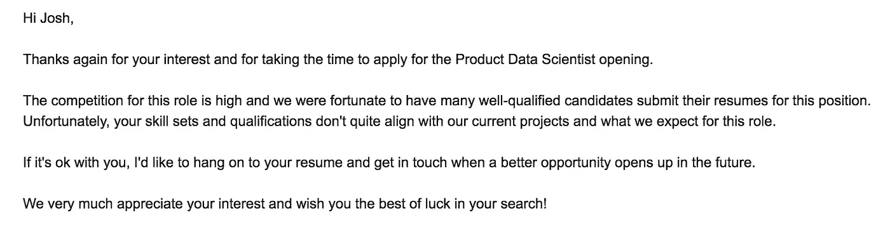

# 实现数据科学家梦想工作的 7 个步骤

> 原文：<https://towardsdatascience.com/7-steps-to-landing-your-dream-job-as-a-data-scientist-5ef1724c4137?source=collection_archive---------6----------------------->

## 浏览数据科学面试流程

找工作很难。我最近经历了寻找数据科学家这一新角色的过程，我想通过几个关键技巧来帮助其他人成功实现他们作为数据科学家的梦想角色:

*   技巧一:找到自己想要的角色。
*   秘诀 2:找工作意味着应对拒绝。要坚持。
*   技巧三:学习统计学、机器学习、SQL、Python。
*   秘诀 4:如果你想要这份工作，就要超越自我。
*   提示 5:研究公司文化、人员和商业模式。
*   技巧 6:谈判和利用。
*   技巧 7:选择最适合你的角色。
*   额外:帮助您准备的有用资源

## 技巧一:找到自己想要的角色。

数据科学家这个头衔通常意味着不同公司的不同职责，有时这个头衔甚至意味着同一家公司内部的不同职责。AirBnB 的数据科学负责人讨论了他们在 AirBnB 中的[三个数据科学家角色，这可能与其他公司不同。AirBnB 的数据科学家要么从事*分析*、*算法*，要么从事*推理*。](https://www.linkedin.com/pulse/one-data-science-job-doesnt-fit-all-elena-grewal)

Dan Frank (Data Scientist at Coinbase) discusses the roles of Data Scientists at AirBnB

在 Lyft，他们将数据科学家的角色分为两组。研究复杂算法的数据科学家被称为*研究数据科学家*，这些算法与匹配骑手和驾驶员以及扩展这些系统相关。第二组数据科学家在内部被称为数据科学家，这是我申请和面试的一个角色。

从我与这个数据科学家团队的互动来看，他们在很大程度上扮演了*产品数据科学家*的角色，决定哪些指标对衡量产品的成功最重要，如何衡量这些指标，如何改进现有产品，以及追求哪些新产品。

我面试的其他公司的数据科学团队规模较小，角色也不太明确。在这些公司，我关心的是数据科学家试图为公司解决的问题。对我来说很重要的一点是，他们的系统已经到位，以确保这些公司的数据科学家的努力能够成功。

*   例如，他们是否已经雇佣了工程人才来收集必要的数据，以回答他们感兴趣的问题并构建数据科学产品？
*   领导层中是否有人创造了与数据科学应用相关的正确的*宣传*？
*   是否对构建某些数据科学应用程序的时间表有现实的预期，以及是否了解数据科学将如何集成到公司的各个组织中？

> 询问您(和您团队中的其他数据科学家)将如何对公司目标产生影响。

这些问题让公司了解你带来了什么，也让你了解他们对你的期望是什么。考虑到与*数据科学家这个头衔相关的技能的多样性，*你和你未来的雇主保持一致是很重要的。

## 秘诀 2:找工作意味着应对拒绝。要坚持。

一旦你完成了找出你应该申请的角色类型的过程，你就需要申请这些角色。以我的经验来看，从为某个职位提交的一堆申请中抽离出来是一项不可能完成的任务。

> 这并不意味着您可以跳过将您的申请输入到正在提交的申请堆中的步骤。

相反，这意味着除了提交申请之外，你还必须找到一个联系人。下面是 Udacity 招聘人员和招聘经理关于招聘的讨论；注意网络会出现几次，以及找到与空缺职位相关的招聘经理的重要性。具体来说，您可以查看时间戳 5:00–9:40(尽管这段视频对于您的入门非常有用)。

我发现一些有助于人际交往和获得推荐的资源:

*   [**【LinkedIn】**](https://www.linkedin.com/in/joshuabernhard/):我联系了以前的同事、朋友和我网络中发布工作的其他人。
*   [**AngelList**](https://angel.co/) :我在创业公司用天使名单搜索工作。

此外，我还利用以上两种方法找到与我申请的工作相关的招聘人员和招聘经理，与他们取得联系。你不要指望这些人会给你回复。然而，你应该向他们展示你是专业的、有礼貌的、坚持不懈的，如果你非常适合一个公开的职位，他们通常会做出回应。

如果你在你感兴趣的公司内部认识某人，利用你和那个人的关系，看看他们是否能了解你申请的职位。同时，不要损害你将来与个人合作的机会。如果他们认为你不合适， ***感谢他们的时间******继续*** 。

我们都经历过拒绝。下面是我收到的众多拒绝之一的例子。我选择了一个特别好的，因为它让我对我收到的所有拒绝感觉更好！有很多！

有些公司不会对你的申请做出回应，甚至在完成现场面试后也不会拒绝你。他们可能会让你处于一种不知情的状态。作为候选人，你的目标不是痛斥任何公司的面试过程。 ***你的目标是得到一份工作。保持专注。***

面试进行到什么程度并不重要；如果一家公司认为你不合适，再次感谢他们的时间*。*

*下面是 Greg Kamardt 的演讲，他现在是 Salesforce 的数据科学家。如果你认真并致力于你的求职，他有一些非常有用的技巧来建立一个与你的求职相关的漏斗。在视频的前 2 分钟，你可以了解格雷格的坚持能力。为了得到一份对他和公司都合适的工作，他能够承受拒绝。*

*你对这一领域的了解越多，你就越难进入这个领域。有些人很幸运，很快就得到一个角色，但我可以告诉你那是少数。对大多数人来说，找到一份工作意味着经历许多拒绝。你必须*坚持*。*

## *技巧三:学习统计学、机器学习、SQL、Python。*

*一旦你成功吸引了一家对你的技能感兴趣的公司的注意，你就进入了我称之为“面试管道”的环节。大多数职位的筛选过程都遵循类似的模式。*

1.  *初次电话面试*
2.  *技术电话面试*
3.  *带回家评估*
4.  *现场面试*
5.  *最终谈判电话*

*在这一部分的剩余部分，我将深入了解面试流程中每一部分的细节。如果你正在面试，这篇文章的这一部分可能与你最相关。*

****第一步:初次电话面试****

*候选人在面试过程中的第一个接触点通常是与招聘人员或招聘经理的非正式谈话。在这次谈话中，您将获得更多关于该职位的背景信息。你也会被告知面试过程的步骤。*

*在这个阶段，准备一些关于角色的问题以及关于公司的问题是很有用的。关于公司文化和价值观、团队中的个人以及特定角色的职责的问题都适合在这次面试中提出。*

*在面试结束时，您将为您的第一次技术电话面试设定日期和时间。电子邮件通常也包含这些信息。你应该确保对面试中给出的时间和解释心存感激，并让他们知道你期待着面试过程的下一步。*

*在这一点上，你希望对这个角色和加入公司更加兴奋。*

****第二步:技术电话面试****

*第二步，你很可能会被问到与统计学和机器学习相关的问题。重要的是，你不仅要得到有正确答案的问题，而且要清楚简洁地表达你的想法。*

*我被问及与贝叶斯统计、线性回归、解释分析结果和定义指标相关的问题。在许多情况下，问题简单明了。我被问到的问题没有技巧，但我听说过其他人有这样的经历，他们的问题需要一个特定的、巧妙的答案才能通过。*

*在我的面试案例中，面试官似乎在检查我是否具备处理数据的基础知识，以及我是否能够与非技术和技术受众沟通。这些公司通常将这些想法与他们自己的商业目标联系在一起，但有时这些问题你可以在一本书或博客的[面试问题清单上找到。](https://www.dezyre.com/article/100-data-science-interview-questions-and-answers-general-for-2018/184)*

*下面我提供了几个与我回答的问题相似的问题*。**

***示例(a 部分):**
*你会如何向非技术员工描述线性回归和逻辑回归之间的区别？你可以选择提供一些例子来说明你什么时候会使用其中的一个来帮助你的描述。**

***可能答案(a 部分):**
*无论是线性回归还是逻辑回归，你都是用输入变量来预测某个输出变量。例如，您可以使用星期和月份来预测每天的销售额。销售额是输出变量，星期几和月份是输入变量。**

**此示例是一个使用线性回归的问题示例，因为输出变量(每天收集的销售额)是一个类似于年龄或身高的连续值。对于逻辑回归，逻辑回归中的输出变量通常只有两个可能的值。例如，我们可以使用逻辑回归来预测客户是否会购买某个特定的产品。**

***例子(b 部分):** *从这个回归中，你会得到系数。你如何描述从这个模型中得到的系数。你知道对于逻辑回归模型，系数的解释会有什么不同吗？**

***可能答案(b 部分):** *我选择日和月作为模型的输入，它们是分类变量。定量变量往往更容易解释。但是没关系。我们想把它们转换成一个数字，其中的顺序给出了日期的顺序，或者我们想把它们虚拟化。**

**假设我将它们虚拟化，那么其中一个值就是基线。对于一周中的每一天，基线可能是星期日。然后，这些系数将被附加到一周其他 6 天的虚拟变量上。如果星期一的系数是 12，这意味着在同一个月中，星期一的销售额预计比星期天高 12。如果星期二的系数是-15，这将意味着星期二的销售额预计比星期天少 15。它总是一天与基线的比较。**

**对于逻辑回归模型，响应是对数概率，而不仅仅是预测响应。通常取系数的指数，然后将结果值解释为 1 类与 0 类相比的几率的倍增变化。如果 1 是某人正在购物，12 是与星期一相关联的系数，那么 exp(12)将是在星期一与星期日的基线相比进行购物的几率的倍增变化。**

***举例(c 部分):**
*说明你的模型中的系数是如何计算的。是什么让这些值比每个系数的随机值更好呢？**

***可能的答案(c 部分):** *实际上，通常是用系数的随机值来开始你的模型。然后使用梯度下降更新这些值。您可以将系数的更新视为以某种方式移动，从而最小化您想要最小化的任何误差。在回归分析中，误差通常是实际值和预测值的平方差之和。**

**然后，您可以将梯度下降视为一种算法，它通过多次迭代来改变系数，以小的方式降低损失函数(在这种情况下是实际值和预测值之间的平方差)。因此，在算法开始的时候，它们并不比 random 好。然而，在算法的最后，它们在最小化你感兴趣的任何损失函数方面会更好。**

*在本示例通知中，回答每个问题所用的语言。在回答问题时，我尽量使用非技术性语言。如果面试官想让你深入了解技术细节，他们会问一个问题，让你深入了解他们关心的技术部分。第一次回答更容易保持较低的技术性，但通常面试官会继续推动更多的技术方面，以衡量你对每个主题的理解水平。*

*在我面试结束时，许多公司称赞我的回答平易近人。有些人试图用专业术语淹没他们的面试官；我不推荐这种方法。我经常试图利用面试来展示我可以向组织中的技术人员和非技术人员传达我的想法。*

*在此过程中，此时提出的其他问题示例包括:*

*1.你会如何设计一个实验来测试 __________？*

*2.想象你有一个装有一些蓝色、红色和白色球的骨灰盒；在选择一个白色或蓝色之前选择两个红色的概率有多大？*

*3.想象你有两个硬币，一个是公平的，另一个有两个头。你随机选择其中一枚硬币，并掷 5 次。所有的抛硬币都是正面的，有多大的概率是公平的？*

*4.估计感兴趣参数的后验区间与使用 frequentist 方法得到的区间有何不同？*

****第三步:带回家评估****

*不同的公司对带回家的评估差别很大。在某些情况下，一家公司明确提供了一个“带回家”的项目，以确保候选人能够编写代码，找到解决方案，并且能够在不需要有人监督的情况下做出贡献。在第一种情况下，创建任何基本的端到端解决方案都足以“通过”。在其他情况下，带回家的东西是获得工作的关键，尽可能在整个解决方案中投入更多的时间和精力也是非常重要的(这只是稍微有点夸张)。*

*考虑到这一点，我将在这里介绍另一个技巧。*

## *秘诀 4:如果你想要这份工作，就要超越自我。*

*对我来说，询问你的招聘人员或招聘经理如何给带回家的评估“打分”似乎是公平的。如果带回家的评估由多位评估者进行评分，并且/或者他们确保在检查评估时匿名以避免可能的偏见，那么可以肯定地说，公司非常重视带回家的评估。或者，如果招聘经理只是要求你完成它，并试图展示你的技能，面试的这一部分只是对你技能的简单检查。*

*不管是哪种情况，你都应该全力以赴。然而，在一种情况下，你可能会花整个周末从早到晚检查每个可能感兴趣的想法，而在另一种情况下，你可能会在几个小时内拼凑出一个合理的解决方案，这将使你进入下一步的过程。*

*我发现有趣的是，在过程的这一部分，我认为编写真正干净的代码，包括文档字符串，添加单元测试，并确保我所做的事情遵循 [DRY](https://en.wikipedia.org/wiki/Don%27t_repeat_yourself) 原则是非常重要的，但我的采访对象似乎都不太关心这一点。也许这是因为完成的时间有限。*

*不管公司有多重视带回家的评估，你都可以利用这个评估从其他应聘者中脱颖而出。多做些带回家的事情会给招聘经理留下深刻印象，增加你获得现场面试的机会。如果你真的想得到这份工作，你就应该努力脱颖而出。*

*在所有情况下，采访者似乎都关心:*

1.  *我的解决方案有多有创意？(我是否设计了有趣的功能)*
2.  *我是否传达了我正在做的事情以及原因？*
3.  *我回答了他们问的问题吗？(与一个没有被问到的问题相反)*

****第四步:现场面试****

*完成“带回家”后，流程的下一步是现场面试。在现场采访中，你会经常遇到许多你经常共事的人。对每家公司来说，在现场表现出色对获得一个职位至关重要。即使你提供了“带回家评估”中有史以来最令人惊叹的解决方案，如果现场面试不顺利，你也不会被录用。*

*我知道这听起来压力很大，但老实说，这是面试过程中我最喜欢的部分。你得到有趣的问题，你可以和另一个人讨论如何解决有趣的问题。对我来说，那很有趣！*

*考虑到这一点，您如何确保现场顺利进行？首先，让我们考虑一下现场的不同方面。以我的经验来看，我有 4-6 次会议，涵盖了一系列的主题。通常，这些主题包括本部分标题中列出的内容。此外，还有一些对话，看看你如何将这些想法与每个公司的业务联系起来。在这里，我将添加我们的下一个技巧，但这与前面的观点有点混合。*

## *提示 5:研究公司文化、人员和商业模式。*

*虽然这个建议没有出现在下面的所有要点中，但它出现在了列表的最后，这可能是整个现场面试中要记住的最重要的事情。*

*所有访谈都包含以下内容:*

1.  ***SQL:** 在白板上写出 SQL 来组合数据源。在我的经历中，我被**而不是**询问任何与执行自连接或窗口功能相关的问题。我从其他人那里听说，有些公司确实会问与这些话题相关的问题。*
2.  ***Python:** 问我的很多问题都有与时间相关的数据。事实证明，知道如何处理日、月、年，并创建适当的指标变量，对于带回家和面对面的访谈非常有用。*
3.  *统计:很好地掌握某些相似性或差异性的度量标准是如何计算的非常有帮助。我还被问到一些关于概率和概率分布的基本问题，包括在一些面试中使用贝叶斯法则。*
4.  ***机器学习:**能够谈论为什么在某些情况下使用欧几里德距离可能比 Spearman 或 Pearson 相关系数更好，如何在决策树中进行拆分，或者随机梯度下降与批量梯度下降相比的利弊，这些都被证明是有用的话题。你不必知道每一个细节，但是你知道的越多，可以利用的就越好。*
5.  ***Python:** 对于所有带回家的评估，我大量使用了 Python。与数据分析相关的主要库是用来帮助我的:numpy、pandas、scikit-learn 等。看起来大多数公司都不太关心我是否想使用 r。然而，看起来一旦你进入公司，你很可能会使用 Python。许多面对面的面试都有一个组成部分，即使没有要求你写，你也可以思考如何用 Python 解决问题。*
6.  ***业务:**这部分我再强调也不为过— *研究公司*。他们是怎么赚钱的？你的角色如何与业务目标相联系？尽可能多地了解这家公司。了解他们做什么，他们的客户是谁，以及你如何帮助他们维持和发展。了解他们的竞争对手也有帮助！*

*我非常确信，一些我没有得到的面试机会或者我在面试过程中失败的原因是我没有足够好地研究公司的商业和文化。你对公司和公司里的人了解得越多，你在面试的各个环节就会表现得越好。*

*了解产品，并确定如何改进产品。*

****第五步:最终谈判电话****

*如果一切顺利，你将进入最后一轮面试，你将得到一份工作邀请。虽然这个电话没有技术细节，但做好准备是很重要的。以我的经验来看，面试进行顺利的时候，一些围绕薪资的谈判甚至发生在现场面试过程中。这又引出了另一个提示。*

## *技巧 6:谈判和利用。*

*不可否认，我不擅长这个过程的这一部分，但以下是我的建议。当你被问到你期望的薪水时，*

1.  *给个范围。*
2.  *谈谈你对相似职位和头衔的薪酬的真实调查。*
3.  *充分利用你的优势，让你从其他候选人中脱颖而出。*
4.  *强调你对工作和团队有多兴奋。钱是工作的一个因素；这不应该是你选择角色的主要原因。如果是的话，你和公司都应该担心。*
5.  *我们当然欢迎你来谈判，许多公司都希望你去尝试和谈判。他们可能会说不，但他们不会仅仅因为你谈判就取消报价。提供理由会有所帮助；有没有一项福利是没有提供的，你需要为自己投保？你得到了竞争报价，你想匹配吗？*
6.  *有些人建议让他们总是说第一个数字。我认为，如果你给出一个你真正期望落地的范围，至少你对双方都有一个起点。*
7.  *请注意，在世界上的一些地区，他们问你目前在做什么是违法的。他们应该根据你对公司的贡献付给你报酬。*

*示例:*

*现场面试过程结束时:*

**招聘人员:*所以，我们已经到了需要谈谈薪资期望的时候了。看起来事情进行得很顺利，从我目前的谈话来看，车队很喜欢你。你心里有数吗？*

**你:*以我的经验水平，这个职位的起薪范围是 10 万到 14 万英镑。因为我有与团队使用的工具相关的额外经验，我希望这也能有所帮助。*

**招聘人员:*好的，我会和我们的财务团队谈谈，看看我们在哪里落地。*

*然后在最后一次通话中:*

*招聘人员:我和每个人都聊过了，我们想向你发出邀请。首先，让我们看看好处…谈谈好处…(此外，你可能还有)我们还应该谈谈股票期权…关于这一部分，你有什么问题吗？*

*你:不，我觉得这些都不错(或者有问题就问)。*

**招聘人员:*我跟我们财务部谈过了，我们可以给你一个 88000 的报价。考虑到所有其他的好处，你肯定会落入你提供的窗口。*

**你:*我真的很喜欢这个团队，我想加入。然而，我真的期望在我们谈论的范围内。考虑到我几乎可以立即给团队增加多少价值，我实际上预计会达到上限。*

**招聘人员:*给了我一点回旋的余地，我可以出到 9.5 万。*

*在这一点上，这完全取决于你想推动多少，但你不应该威胁或说一些你没有坚持到底的事情。此外，你不应该谎报你目前的薪水，试图把门槛推得更高。通常公司会在你被雇佣的时候要求 w2，所以他们会知道你撒谎了。这可不是你想和新雇主开始交往的第一步。*

**你:*不幸的是，我真的很希望能完成这项工作，但这仍然低于我对行业标准的预期。有没有办法 125000 左右见面。*

*你可以继续这个过程，直到你达成一个协议，或者你决定你不能做一些工作。假设事情进展顺利，你可以要求时间来做最后的决定和考虑事情。这是完全合理的。大多数公司对你花一两周时间做最终决定感到满意。*

*如果你幸运的话，你甚至可以选择。一旦你打开了第一扇门，建立了正确的关系，就会有很多机会。在这些情况下，我有一个最后的提示。*

## *技巧 7:选择最适合你的角色。*

*确定你想加入的团队，你想解决的问题，你想产生的影响。对每个人来说，没有一个正确的决定。做出对你最有利的决定。*

## *额外:帮助您准备的资源*

*在这里，我提供了一些有用的(免费)资源，帮助你准备数据科学家职位面试的不同部分。*

***SQL** [Udacity 的 SQL 课程](https://classroom.udacity.com/courses/ud198)
[w3schools 上的 SQL](https://www.w3schools.com/sql/)
[SQL 动物园](https://sqlzoo.net/)*

***Python** [Python Codecademy](https://www.codecademy.com/learn/learn-python-3)
[Python I uda city](https://classroom.udacity.com/courses/ud1110)
[Python II uda city](https://classroom.udacity.com/courses/ud036)
[Codewars for Python 与 SQL](https://www.codewars.com/)
[hacker rank](https://www.hackerrank.com/)
[leet code](https://leetcode.com/)*

***机器学习** [Luis Serrano 的 Youtube 频道](https://www.youtube.com/channel/UCgBncpylJ1kiVaPyP-PZauQ)
[统计学习简介正文](https://www-bcf.usc.edu/~gareth/ISL/ISLR%20Seventh%20Printing.pdf)
[Udacity 机器学习](https://www.udacity.com/course/intro-to-machine-learning--ud120)
[uda city 上的技术面试算法](https://classroom.udacity.com/courses/ud513)*

***统计** [描述性统计](https://www.udacity.com/course/intro-to-descriptive-statistics--ud827)
[推断性统计](https://www.udacity.com/course/intro-to-inferential-statistics--ud201)
[可汗学院统计](https://www.khanacademy.org/math/statistics-probability)*

***软技能
软技能**上[艾莉森](https://alison.com/courses/communications)*

*随着时间的推移，我将继续添加到列表中，但这只是一个开始。如果您有其他有用的资源，请随时在评论中添加。然后，我可以更新列表，以帮助其他人准备！为了让你对未来作为数据科学家的角色感到兴奋，请查看下面的视频，其中讨论了许多主题(包括更多关于面试的内容)！*

*感谢阅读！*