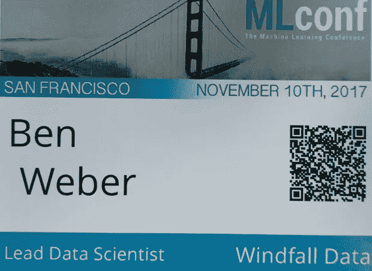

# MLconf SF 的 7 个要点

> 原文：<https://towardsdatascience.com/7-takeaways-from-mlconf-sf-1b2703db5ecb?source=collection_archive---------0----------------------->

我在 MLConf 参加了几年来第一次以人工智能为主题的会议。赶上机器学习和数据科学的最先进水平真是太棒了。虽然会议的大部分时间都集中在深度学习上，但从这次活动中可以学到更广泛的经验。以下是我从会议中获得的主要收获:

1.  构建数据产品不仅仅是构建模型
2.  张量是 ML 工作的新原语
3.  准备好为了空间和时间的限制而牺牲精确性
4.  深度学习是跨学科的
5.  深度学习正在越来越多地影响我们的日常生活
6.  如果您想要推动采用，请提供笔记本电脑
7.  ML 公司都在招人！

我将在下面更详细地讨论每一点。在接下来的几周里，所有的幻灯片都将在[的 SlideShare](https://www.slideshare.net/SessionsEvents) 上发布。

**构建数据产品远不止构建模型** 对我来说，大会的亮点是 [June Andrews 的](https://mlconf.com/mlconf-2017-san-francisco/#June)关于构建直观机器学习系统的演讲。她提出了一个框架，在这个框架中，许多学科都参与到了决定构建什么样的数据产品以及如何将产品投放市场的过程中。她介绍了一个过程，详细说明了哪些团队应该负责各种任务，包括:如何收集模型的需求，如何研究模型提案，如何评估模型的部署，如何确定是否推出模型，如何扩展到模型的完全部署，以及如何随着时间的推移维护模型。她承认，对于哪个团队负责数据产品的不同阶段，较小的团队不会有如此严格的规则，但她明确表示，将人工智能发布到世界上比仅仅在训练数据集上训练模型要复杂得多。她提供了航空领域的例子，人工智能系统需要健壮和高度准确才能被采用。

June’s slide on the many stages of releasing Data Products.

张量是 ML 工作的新原语
会议的主题之一是倡导在 ML 工作中使用[张量](https://en.wikipedia.org/wiki/Tensor)。张量是矩阵的自然扩展，它不是用二维来表示数据，而是用三维来表示数据。 [Tamara Kolda](https://mlconf.com/mlconf-2017-san-francisco/#tammy) 提到它的使用可以追溯到 90 年代初的化学领域，但直到最近张量才被广泛用作 ML 工作的数据结构。 [Anima Anadkumar](https://mlconf.com/mlconf-2017-san-francisco/#anima) 也主张使用张量作为原语，并提到采用新的原语将需要创作新的库。

**准备好权衡空间和时间限制的准确性** 在 MLconf 上的几次会谈讨论了在求解最优解时所涉及的权衡。有时最优解是难以处理的，团队需要找到新的方法来减少所用算法的空间或时间复杂性。例如， [Tamara Kolda](https://mlconf.com/mlconf-2017-san-francisco/#tammy) 谈到了可用于在每次迭代中不使用完整数据集的情况下解决模型拟合问题的采样方法， [Anima Anadkumar](http://mlconf.com/mlconf-2017-san-francisco/#anima) 谈到了从张量表示中删除秩以节省空间，而 [Rushin Shah](https://mlconf.com/mlconf-2017-san-francisco/#Rushin) 谈到了脸书用于精确语言理解的 [fastText](https://research.fb.com/fasttext/) 算法，该算法比以前的方法快得多。

**深度学习是跨学科的** 会议的新奇之处之一是看到科技公司以外的研究人员如何利用深度学习来创造新的发现。Ted Willke 做了一个非常有启发性的演讲，讲的是深度学习如何被应用到海洋生物学领域，并使科学家能够比以前的方法更准确地跟踪鲸鱼的迁徙，而且侵入性更小。还有关于将深度学习应用于其他领域的会谈，包括[化学](https://mlconf.com/mlconf-2017-san-francisco/#tammy)、[医学](https://mlconf.com/mlconf-2017-san-francisco/#xavier)和[约会](https://mlconf.com/mlconf-2017-san-francisco/#Steve)。

**深度学习正在影响我们越来越多的日常生活** 在手机上发送的电子邮件中，有 12%使用了 gmail 新的自动回复功能。这只是大会上许多例子中的一个，深度学习正在被用来影响我们更多的日常活动。有[6 月的演讲](https://mlconf.com/mlconf-2017-san-francisco/#June)关于通用电气如何提高飞往该活动的任何参与者的航空旅行安全性，有 [Xavier Amatriain 关于深度学习对医学诊断的影响的](https://mlconf.com/mlconf-2017-san-francisco/#xavier)演讲，以及 [Rushin Shah 关于 FB 关于旅行建议的帖子如何被用来影响决策的](https://mlconf.com/mlconf-2017-san-francisco/#Rushin)演讲。

**提供笔记本如果你想推动采用** 今天的一些演讲者，包括[道格·埃克](https://mlconf.com/mlconf-2017-san-francisco/#doug)，谈到了早期的人工智能，所有的代码都是用 C++编写的，没有人想接触现有的代码库。我们现在有更好的工具来使 ML 和笔记本环境大众化，比如 Jupyter 提供了如何使用 ML 框架的例子。Anima Anadkumar 谈到了 Jupyter 是如何被用来让 Gluon 这样的 ML 库变得更加平易近人的。

**ML 公司在招人！** 今天活动中的大多数演讲者都提到他们的公司正在招聘 ML 职位。MLconf 有一个[清单列出了](https://mlconf.com/jobs/)的工作岗位，而意外之财数据公司也在招聘一个专注于数据治理的[数据科学家](https://angel.co/windfall-data/jobs/295441-data-scientist-governance)职位。

