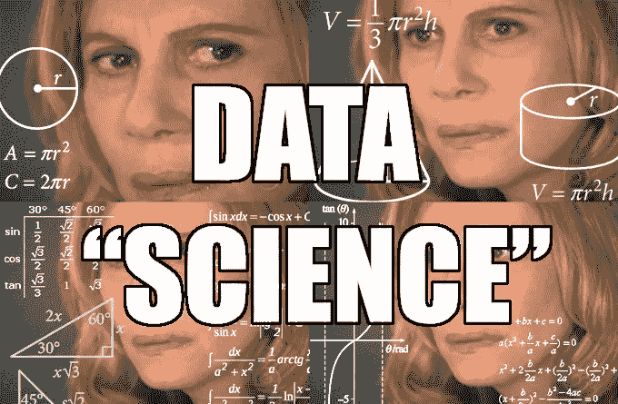
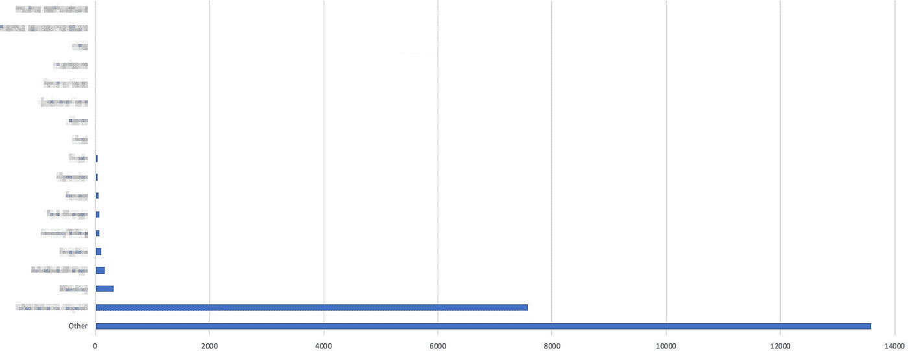

# 建立成功数据团队的 8 种方法

> 原文：<https://towardsdatascience.com/8-ways-to-set-up-a-data-team-for-success-b223c5e8e674?source=collection_archive---------3----------------------->

我们生活在数据驱动型组织的黄金时代。算法！大数据！为什么，你甚至可能有一两个数据科学家！**但是……**

如果你的数据人员花大部分时间在复杂的商业概念上做简单的算术，那么你称之为**数据科学**就太慷慨了。真的只是**商业智能**。你的团队在做什么？

老实说，希望介于两者之间。区别并不重要。如果学术严谨不影响商业成果，那它就毫无用处。另一方面，重要的是他们正在做的很多事情可能没有科学或商业价值。这可能与他们在复杂数学方面的能力无关。知道是什么阻碍了他们吗？

VP of Businessing

是你。运营团队的领导者。有计划的人，不管有多不成熟。Cherrypicked 数字是你执行的烟幕和镜子。*“是啊，但不是我！”。*这是你在仪表盘上的自我形象:

How ‘bout them KPIs?

好吧，我越来越夸张这些流行文化参考。关键是，你可能低估了在不犯灾难性分析错误的情况下使用数据的难度。

就像一个工程师和一个糟糕的产品经理一样，你的数据团队将会失败，除非你，企业所有者，已经在上游为他们的成功做好了准备。不要做骗子，做一个**真正的**‘数字人’。

8 相当简单的直觉检查策略可以避免最危险的错误。

# 僵尸实验的故事

我们的第一个策略以故事的形式出现:

## 1)知道分析是否值得做

这似乎是显而易见的，但从我的经验来看，它是最常被忽略的一个。它会悄悄靠近你。对我来说是的，但我会告诉你如何抓住它。这是一个真实的故事，讲述了我把事情搞砸的时候，以及为什么会这样。

When it just isn’t worth doing

作为我们的 CRM 管理员，我正在帮助扩展一个支持团队，该团队将在不到 3 年的时间里通过我们的 CRM 处理超过 22，000 个线程。代理可以在结案时按原因标记案例。关键是:至少有一个标签是**必需的**。管理人员设定要求时并不太关心运营成本。我写了代码在我们的 CRM 中验证这一点。运营成本见鬼去吧。我们将成为一个数据驱动的组织。

运营成本是多少？三年来，人们标记了大约 22000 条这样的线索。保守估计标记一个案例需要 5 秒钟(可能更长)，估计这项工作需要大约 **30 个小时的数据输入**。这可能看起来不多，但想象一下，让某人坐下来，告诉他们一整周的工作仅仅是创建这些数据。我们基本上做到了这一点，那么经理们从这一昂贵的努力中得到了什么呢？

没有人发表过这份报告。我怎么知道？如果他们这样做了，即使**曾经**，他们也会看到一个非常典型的数据模式:

告诉他们我们的主要问题是…

…‘其他’。

公平地说，对话很难分类！不公平的是，我们的代理人不明白这一点。但是让我们更进一步。想象一个完美的标签系统，没有代理人的困惑和冷漠。

一个过于简单的代理就是排除“其他”标签。我们在剩下的列表中看到了什么？我们的**第二**最常见的各种问题**仍然**完全让其他人相形见绌。你知道它是什么并不重要。但对我们来说，这是一个公司大部分人已经在着手解决的明显的、非常棘手的问题。没有什么是我们不知道的。

所以，让我们继续看图表。在我们的前两个无用标签(占数据的 90%)之后，也许我们可以在长尾理论中找到价值。在尾部，大约有 5 个令人惊讶的标签断断续续地出现。其余的标签(比如我们手机应用的问题)非常罕见。代理人可以告诉我们的所有趣闻。如果数字分布更加均匀，也许我们可以仔细检查他们的排名(比如移动应用程序问题是否比预期的高)。但是这些数据是如此的杂乱无章，毫无用处。

> 通常，现实世界中的数据远没有你事先想象的结果有趣

收集数据是白费力气。不仅仅是 30 个小时的集体标记。但是，使这成为我们过程的一部分的所有精神开销。训练特工。不断变化的分类法。数据维护。机会成本。

**通常，“计算数字”不值得花费时间，尤其是耗时的时候。**那么，我应该从一开始就注意什么，以便更早地发现这一点呢？

我一直反复强调的一个明显的观点是，总是从分析中寻求**学习**，如果没有东西可学，就放弃努力。但是除此之外，我们还缺少一个更重要的策略:没有任何我们想要通知的决定。

> ***作为一个操作者，我绝对讨厌*** *过程* ***没有目的***

更多的数据比更少的数据好*，但获取数据的成本往往比你意识到的要高。轻率地委派他人(通常是您的数据团队或初级代表)在数据上的时间是一个危险的领域。总是:

> *1)有* ***的决定*** *你打算通知*
> 
> *2)保持努力向* ***学习*** *反对那个决定*

总结一下这个故事，符合这个框架:

> ***决定:*** 无。*我们做这个分析不是为了给任何具体的决策或未来的计划决策提供信息。有用的愿望从未实现。*
> 
> ***方法*** *:用标签的 MECE 分类法来标记每个客户服务案例*
> 
> ***学习:*** 无。*我们没看。如果我们这样做了，我们只会学到显而易见的东西。我们可以从代理商那里得到更好的轶事色彩。*

Know If It’s Worth Doing

***问题*** *:显然，这个例子的问题在于我们没有* ***决定*** *的目标或者* ***学习*** *的反对。*

*数据多总比少好吗？分析会在数据团队得到它之前就被毁掉吗？即使有明确的目标来指导决策，天才数学家也可能失败。以下是(使用我们的新框架)需要注意的其他七个问题:

# 其他最佳实践

此后，我创建了一些虚构的场景，展示了经理们应该使用的常见策略，以确保他们不会削弱他们的数据团队。

## 2)注意生存偏差

*(因优秀图书* [*如何不被看错*](https://www.amazon.com/How-Not-Be-Wrong-Mathematical/dp/0143127535) *)*

> ***决策:*** *一家 B2B 软件公司正在准备他们的路线图。他们的主要目标是跨越从最初的 200 名早期用户到下一千名客户的鸿沟。*
> 
> ***方法:*** *他们建立并分发一份客户调查。“20%的受访者投票支持下一步添加该功能”。*
> 
> ***学习:*** *“通过对客户驱动的功能集进行优先级排序，这种分析将帮助我们赢得更多优势”*

Survivorship Bias

***问题:*** *这种方法与保留或追加销售目标非常匹配。但目标是获得* ***新的*** *客户。这种方法并没有准确地衡量这些观众。它采访了购买产品的人，而不是没有购买产品的人。为了提高点击率，他们反而需要听到为什么人们* ***没有*** *购买。*

# 3)对照对照组判断有效性

> ***决策:*** *一位经理想知道 SLA 是否会改善 SDR 的平均提案响应时间*
> 
> ***方法:*** *经理制定了一个内部 SLA，要求所有入站查询在 24 小时内得到一个详细的建议，数据团队对业务时间调整后的平均响应时间进行建模，并构建一个控制面板。*
> 
> ***学习:*** *“响应次数下降了！SLA 起作用了！”*

No Control Group

***问题:*** *众所周知，您的 SDR 最近的入站/代表更少，所以他们的队列更短，这可以解释更快的响应时间。有没有可能他们几乎总是满足 SLA，而这一切只是在高压力时期惩罚他们？*

# 4)不要忘记机会成本

> ***决策:*** *公司希望分析“相关项目”功能的有效性，以增加追加采购*
> 
> ***方法:*** *产品 A/B 测试产品页面上建议订购补充项目的功能。数据工程师构建并显示这个新的 KPI。*
> 
> ***学习:*** *“大家正在添加相关项！我们应该投资于“相关商品”功能，以最大限度地提高购物车附加组件”*

Opportunity Cost

**我们已经证明了在忽略机会成本的情况下投资该特性的合理性。每天，我们都在房租、工资等方面烧钱。如果同一个团队可以在 4 周内建立一个“捆绑”购物体验，并且有可能创建 200%以上的多商品购物车，会怎么样？我们在相关项目上浪费时间做什么？！？！**

# 5)始终承认假设

> ***决策:*** *一个财务主管需要预算雇佣多少工资管理人员来支持一个新的市场(加拿大)*
> 
> ***方法:*** *数据团队利用销售数字来推算需求。然后模型提供人数增长，推断需要多少工资人员。*

****

**Unacknowledged Assumptions**

*****问题:*** *我们承认增长过快可能会影响我们的估计。但是我们忽略的一个重要假设是* **【我们新市场的薪资需求将与现有市场大致相同】** *。货币呢？税法？也许每个员工都要支持两倍的工作！***

# **6)问题统计显著性**

> *****决定:*** *三名 Eng 考生在同一季度拒绝录取通知书。招聘经理想知道如何减少求职者流失***
> 
> *****方法:*** *一个人力资源代表问每个人为什么他们通过了。这三个人都描述了在“我能发挥更大影响力的小团队”中选择机会。有了共识，这次谁还需要数据团队？***
> 
> *****学习:*** *“只有当候选人没有意识到我们的子团队是灵活和独立的，我们才会失败。我们 40 人的工程团队听起来势不可挡。我们应该强调候选人所在的子团队的规模，并避免对整个工程团队的规模提出质疑***

****

**Stastistical Significance**

*****问题:*** *甚至有足够的数据得出结论吗？零假设是:* **“如果我们提到了小的子团队，考生绝对不会拒绝”** *。你不需要复习 p 值就可以问:*“这闻起来对吗？”***有时你会连续翻转头部五次。*****

# **7)寻找缺失的数据**

> *****决策:*** *某 CX 经理团队有早/晚班；他们想在轮班期间给明星特工配备最困难、最紧急的问题。***
> 
> *****方法:*** *支持案例升级率由数据团队划分到班次中，一个控制面板显示这些时段随时间的变化***
> 
> *****学习:*** *“我们最紧迫的问题是 55%的夜晚，45%的白天。我们实际上需要将我们最好的人员分散到两个班次”***

****

**Missing Data**

*****问题:*** *只看紧急邮件忽略了全貌。我们忘了计算打给代理帮助热线的电话，这很可能是如何* ***许多*** *紧急问题进来的。有没有可能这些偏向晚上的数据，再加上电子邮件数据，强烈支持全明星的夜班工作人员？***

# **8)小心错误的选择**

> *****决策:*** *一家公司希望研究客户对其核心产品的潜在新定价模式的偏好***
> 
> *****方法:*** *进行一项调查，询问他们最喜欢哪个新选项。***
> 
> *****学习:****“5 个选项中，80%表示选项 3。这是一个明显的赢家。”***

****

**False Choices**

*****问题:*** *那些你调查中没有的选项呢？如果他们想要选择一个以上的选项(75%的人会选择选项 2***)。如果 100%的人更喜欢你当前的定价模式而不是新的选择，会怎么样？****

# ***摘要***

***不要认为聘请一个博士和在复杂的数学上投入大量时间会拯救你的数据团队。在编辑草稿期间，我以前的同事(data all star)[Ryan Brennan](https://medium.com/u/bf0f527cb0b3?source=post_page-----b223c5e8e674--------------------------------)明智地阐明了所有这些例子都只是抽象的问题。当我们用日常数字表达想法时，企业所有者有责任确保表达的准确性。不要逃避你的责任。不要让你的团队失败。***