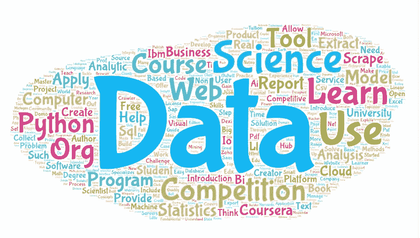

# 成为数据科学家的 88 种资源和工具

> 原文：<https://towardsdatascience.com/88-resources-tools-to-become-a-data-scientist-c28008bf8fdf?source=collection_archive---------13----------------------->

《哈佛商业评论》认为数据科学家是 21 世纪最性感的工作。在本文中，借助于最好的免费网络数据抓取工具之一[***octo parse V7***](https://www.octoparse.com/product)，我们汇总了成为数据科学家可能需要的资源和工具。

1.学习资源:**课程**、**学位** / **证书**、**书籍**；

2.工具:**数据提取器**、**数据分析**、**报告**。

3.**数据科学竞赛/计划**

*您可以查看* [*原帖*](https://www.octoparse.com/blog/88-data-science-resources-tools)

**

# ***20 门关于数据科学的在线课程***

***1。数据科学专业***

*创作者:约翰·霍普斯金大学*

*这一专业化涵盖了您在整个数据科学管道中需要的概念和工具，从提出正确的问题到做出推论和发布结果。在最终的顶点项目中，您将应用通过使用真实世界的数据构建数据产品而学到的技能。完成后，学生将有一个文件夹，展示他们对材料的掌握。*

*[https://www.coursera.org/specializations/jhu-data-science](https://www.coursera.org/specializations/jhu-data-science)*

***2。Python 中的数据科学简介***

*创作者:密歇根大学*

*本课程将向学习者介绍 python 编程环境的基础知识，包括基本的 python 编程技术，如 lambdas、读取和操作 csv 文件以及 numpy 库。*

*[https://www.coursera.org/learn/python-data-analysis](https://www.coursera.org/learn/python-data-analysis)*

***3。应用绘图、制图&Python 中的数据表示***

*创作者:密歇根大学*

*本课程将向学习者介绍信息可视化基础知识，重点是使用 matplotlib 库进行报告和制图。*

*[https://www.coursera.org/learn/python-plotting](https://www.coursera.org/learn/python-plotting)*

***4。Python 中的应用机器学习***

*创作者:密歇根大学*

*本课程将向学习者介绍应用机器学习，更侧重于技术和方法，而不是这些方法背后的统计数据。*

*https://www.coursera.org/learn/python-machine-learning*

***5。在 Python 中应用文本挖掘***

*创作者:密歇根大学*

*本课程将向学习者介绍文本挖掘和文本操作的基础知识。*

*[https://www.coursera.org/learn/python-text-mining](https://www.coursera.org/learn/python-text-mining)*

***6。Python 中的应用社会网络分析***

*创作者:密歇根大学*

*本课程将通过使用 NetworkX 库的教程向学习者介绍网络分析。*

*本课程应该在以下课程之后学习:Python 中的数据科学导论、Python 中的应用绘图、图表和数据表示，以及 Python 中的应用机器学习。*

*[https://www . coursera . org/learn/python-social-network-analysis](https://www.coursera.org/learn/python-social-network-analysis)*

***7。什么是数据科学？***

*创建者:IBM*

*在本课程中，我们将会见一些数据科学从业者，并大致了解当今的数据科学。*

*[https://www.coursera.org/learn/what-is-datascience](https://www.coursera.org/learn/what-is-datascience)*

***8。数据科学开源工具***

*创建者:IBM*

*在本课程中，您将了解 Jupyter 笔记本电脑、RStudio IDE、Apache Zeppelin 和数据科学体验。*

*[https://www . coursera . org/learn/opensource-tools-for-data-science](https://www.coursera.org/learn/open-source-tools-for-data-science)*

*9。数据科学方法论*

*创建者:IBM*

*您将了解:—解决数据科学问题的主要步骤。—实践数据科学的主要步骤，从形成具体的业务或研究问题，到收集和分析数据，到构建模型，以及了解模型部署后的反馈。—数据科学家如何思考！*

*[https://www.coursera.org/learn/data-science-methodology](https://www.coursera.org/learn/data-science-methodology)*

*10。应用数据科学*

*创建者:IBM*

*这是一个充满活力的专业，面向希望获得现实世界数据问题实用技能的数据科学爱好者。它对任何有兴趣从事数据科学职业的人都有吸引力，并且已经具备基本技能(或者已经完成了应用数据科学专业化入门)。您将学习 Python——不需要任何编程知识。然后你将学习数据可视化和数据分析。通过我们的指导讲座、实验室和项目，您将获得处理有趣数据问题的实践经验。*

*[https://www . coursera . org/specializations/applied-data-science](https://www.coursera.org/specializations/applied-data-science)*

***11。用于数据科学的数据库和 SQL***

*本课程的目的是介绍关系数据库的概念，并帮助您学习和应用 SQL 语言的知识。它还旨在帮助您开始在数据科学环境中执行 SQL 访问。*

*【https://www.coursera.org/learn/sql-data-science *

*12。数据科学数学技能*

*杜克大学*

*本课程旨在向学习者传授在几乎所有数据科学数学课程中取得成功所需的基本数学知识，面向拥有基本数学技能但可能没有学过代数或微积分预科的学习者。*

*[https://www.coursera.org/learn/datasciencemathskills](https://www.coursera.org/learn/datasciencemathskills)*

***13。数据科学:争论***

*[哈弗 dX](https://www.edx.org/school/harvardx)*

*本课程涵盖了数据争论过程的几个标准步骤，如将数据导入 R、整理数据、字符串处理、HTML 解析、处理日期和时间以及文本挖掘。*

*[https://www . EDX . org/course/data-science-wrangling-harvardx-ph 125-6x](https://www.edx.org/course/data-science-wrangling-harvardx-ph125-6x)*

***14。数据科学:生产力工具***

*哈佛大学*

*[https://www . EDX . org/course/data-science-productivity-tools-harvardx-ph 125-5x](https://www.edx.org/course/data-science-productivity-tools-harvardx-ph125-5x)*

*15。数据科学研究方法:Python 版*

*微软*

*[https://www . EDX . org/course/research-methods-for-data-science-python-edition](https://www.edx.org/course/research-methods-for-data-science-python-edition)*

*16。如何赢得数据科学竞赛:向顶尖高手学习*

*创建者:国立研究大学高等经济学院*

*如果你想进入竞争激烈的数据科学领域，那么这门课程就是为你准备的！参加预测建模竞赛可以帮助您获得实践经验，提高和利用您在各个领域的数据建模技能，例如信贷、保险、营销、自然语言处理、销售预测和计算机视觉等。*

*[https://www.coursera.org/learn/competitive-data-science](https://www.coursera.org/learn/competitive-data-science)*

***17。计算思维和数据科学简介***

*指导教师:埃里克·格里姆森教授；约翰·古塔格教授；安娜·贝尔博士*

*6 0002 是 6 0001 计算机科学和 Python 编程入门的继续，面向很少或没有编程经验的学生。它旨在让学生了解计算在解决问题中的作用，并帮助学生，无论他们的专业如何，对他们编写小程序以实现有用目标的能力充满信心。该类使用 Python 25 编程语言。*

*[https://OCW . MIT . edu/courses/electrical-engineering-and-computer-science/6-0002-introduction-to-computational-thinking-and-data-science-fall-2016/](https://ocw.mit.edu/courses/electrical-engineering-and-computer-science/6-0002-introduction-to-computational-thinking-and-data-science-fall-2016/)*

*18。计算机科学导论和 Python 编程*

*指导老师:安娜·贝尔博士；埃里克·格里姆森教授；约翰·古塔格教授*

*《计算机科学和 Python 编程导论》面向很少或没有编程经验的学生。它旨在让学生了解计算在解决问题中的作用，并帮助学生，无论他们的专业如何，对他们编写小程序以实现有用目标的能力充满信心。该类使用 Python 25 编程语言。*

*[https://OCW . MIT . edu/courses/electrical-engineering-and-computer-science/6-0001-introduction-to-computer-science-and-programming-in-python-fall-2016/](https://ocw.mit.edu/courses/electrical-engineering-and-computer-science/6-0001-introduction-to-computer-science-and-programming-in-python-fall-2016/)*

***19。统计思维和数据分析***

*讲师:辛西娅·鲁丁教授；Allison Chang(助教)；Dimitrios Bisias(助教)*

*本课程介绍统计数据分析。主题选自应用概率、抽样、估计、假设检验、线性回归、方差分析、分类数据分析和非参数统计。*

*[https://OCW . MIT . edu/courses/Sloan-school-of-management/15-075j-statistical-thinking-and-data-analysis-fall-2011/](https://ocw.mit.edu/courses/sloan-school-of-management/15-075j-statistical-thinking-and-data-analysis-fall-2011/)*

***20。用于数据科学的 SQL***

*加州大学戴维斯分校*

*本课程旨在为您提供 SQL 和数据处理基础的入门知识，以便您可以开始出于数据科学的目的对其进行分析。*

*【https://www.coursera.org/learn/sql-for-data-science *

# ***数据科学学位/证书***

1.  ***计算机科学硕士***

*伊利诺伊大学厄巴纳-香槟分校*

*学费:21000 美元*

*计算机科学硕士是一个非论文学位，需要 32 个学分的课程。学生可以按照自己的进度完成计算机硕士所需的八门课程，少则一年，多则五年。学生通过 Coursera 平台接受讲座，但伊利诺伊州的教师和助教会就大学学位学分所需的一系列严格的作业、项目和考试进行建议和评估。*

*计算机科学硕士学位 32 个学分的学费为 19，200 美元。*

*[https://www . coursera . org/degrees/伊利诺伊州计算机科学硕士](https://www.coursera.org/degrees/master-of-computer-science-illinois)*

***2。计算机科学学士***

*伦敦大学*

*学费:9600-17000，取决于学生的地理位置。*

*该学位由伦敦大学戈德史密斯团队设计，旨在为您提供计算机科学的坚实基础和数据科学、人工智能、虚拟现实和网络开发等主题的专业知识。你的学习将涉及行业和学术案例研究，以帮助你从现实世界问题的角度理解你的研究*

*[https://www . coursera . org/degrees/学士-科学-计算机-科学-伦敦](https://www.coursera.org/degrees/bachelor-of-science-computer-science-london)*

***3。数据科学***

*哈佛大学*

*学费:整个项目 441.90 美元。*

*你将学到:基本的 R 编程技巧；统计概念，如概率、推理和建模，以及如何在实践中应用它们；获得使用 tidyverse 的经验，包括使用 ggplot2 的数据可视化和使用 dplyr 的数据辩论；熟悉实践数据科学家的必备工具，如 Unix/Linux、git 和 GitHub、RStudio 实现机器学习算法；通过激励真实世界的案例研究，深入了解基本的数据科学概念。*

*[https://www . EDX . org/professional-certificate/harvardx-data-science](https://www.edx.org/professional-certificate/harvardx-data-science)*

***4。微软数据科学专业计划***

*创建者:微软*

*学费:整个项目 1089 美元*

*你将学会:使用微软 Excel 探索数据；使用 Transact-SQL 查询关系数据库；使用 Excel 或 Power BI 创建数据模型并可视化数据；将统计方法应用于数据；使用 R 或 Python 进行数据的探索和转换；遵循数据科学方法；用 Azure 机器学习创建和验证机器学习模型；写 R 或 Python 代码，构建机器学习模型；将数据科学技术应用于常见场景；针对给定的数据问题实现机器学习解决方案。*

*[https://www . EDX . org/微软-专业-程序-数据-科学](https://www.edx.org/microsoft-professional-program-data-science)*

***6。计算机科学硕士***

*亚利桑那州立大学*

*学费:15000 美元*

*您将从 20 门课程选项中选择 10 门课程，以发展新兴按需技术方面的专业知识。从人工智能、软件工程、云计算、大数据和网络安全等重点领域中进行选择。你还将创建一个项目组合，用来向未来的雇主展示你的经历。*

*[https://www . coursera . org/degrees/master-of-computer-science-ASU](https://www.coursera.org/degrees/master-of-computer-science-asu)*

# ***书籍***

***1。数据科学手册:来自 25 位了不起的数据科学家的建议和见解***

*作者:卡尔·山*

*25 位业内专家在这本手册中给出了一些建议，对初学者很有帮助。*

***2。商业数据科学:你需要了解的数据挖掘和数据分析思维***

*作者:福斯特教务长和汤姆·福塞特*

*面向企业的数据科学介绍了数据科学的基本原理，并引导您完成从收集的数据中提取有用知识和商业价值所需的“数据分析思维”。本指南还帮助您理解当今使用的许多数据挖掘技术。*

***3。做数据科学:从一线直说***

*作者:凯茜·奥尼尔和瑞秋·舒特*

*在这些长达一章的讲座中，来自谷歌、微软和易贝等公司的数据科学家通过展示案例研究和他们使用的代码来分享新的算法、方法和模型。如果你熟悉线性代数、概率和统计，并且有编程经验，这本书是数据科学的理想入门。*

***4。使用 Python 从零开始的数据科学:逐步指南***

*作者:彼得斯·摩根*

*如果你正在寻找一个完整的从零开始使用 Python 的一步一步的数据科学指南，这本书是给你的。在他的第一本书《用 Python 从零开始进行数据分析》获得巨大成功之后，Peters Morgan 出版了他的第二本书，现在专注于数据科学和机器学习。从业者认为这是这个领域中最简单的指南。*

***5。假人数据科学(假人(计算机))***

*作者:莉莲·皮尔森*

*虚拟数据科学是 IT 专业人员和学生的完美起点，他们希望快速入门广阔的数据科学空间的所有领域。这本书以商业案例为重点，探讨了大数据、数据科学和数据工程方面的主题，以及这三个领域如何结合起来产生巨大的价值。*

***6。概率、统计和随机过程介绍***

*作者:侯赛因·皮什罗-尼克*

*这本书向学生介绍了概率、统计和随机过程。学生和工程、各种科学、金融和其他相关领域的从业者都可以使用它。它为这些主题提供了一种清晰直观的方法，同时保持了数学的准确性。你也可以在网上找到课程和视频。*

*[https://www.probabilitycourse.com](https://www.probabilitycourse.com)*

***7。OpenIntro 统计数据***

*作者:大卫·迭斯和克里斯托弗·巴尔*

*OpenIntro 项目成立于 2009 年，旨在通过制作免费使用且易于修改的优秀书籍和教学工具来提高教育质量和可用性。他的处女作是 OpenIntro Statistics。相应的课程和视频可在以下位置找到:*

*[https://www.openintro.org](https://www.openintro.org)*

***8。统计推断***

*作者:乔治·卡塞拉*

*是很多高校应届毕业生的教材。*

*讨论理论统计和理论发展的实际应用。包括大量涵盖理论和应用的练习。*

***9。应用线性统计模型***

*作者:考特纳*

*应用线性统计模型是长期建立的统计建模的主要权威文本和参考。第五版增加了计算和图形分析的使用，而没有牺牲概念或严谨性。一般来说，5e 在例子和练习中使用更大的数据集，如果方法可以在软件中自动化而不丧失理解，它就这样做了。*

*10。广义线性模型介绍*

*作者:安妮特·j·多布森和阿德里安·g·巴尼特*

*它为统计建模提供了一个连贯的框架，重点是数字和图形方法。这本畅销书的新版本已经更新了非线性关联的新部分，模型选择的策略，以及关于良好统计实践的海报。*

# ***数据提取器:通过聚合网站的大数据来创建自己的数据库。***

1.  *[**八分音符**](https://www.octoparse.com/product)*

*许可证:免费*

*网址:[https://www.octoparse.com/](https://www.octoparse.com/)*

*数据导出格式:Excel、HTML、CSV、JSON 和数据库*

*Octoparse 是最好的免费网络数据提取器，功能全面，支持从网站上提取几乎所有类型的数据。有两种应用模式——向导模式和高级模式——供非程序员快速习惯 Octoparse。*

*此外，其**云提取**能够在云端运行刮刀，并将数据保存在八分云，使得每个人都能够实时访问[刮刀动态信息](https://www.octoparse.com/blog/extracting-dynamic-data-with-octoparse)。Octoparse 不仅提供 SAAS，还提供 web scraper 设置和数据收集的定制服务。*

***2。莫曾达***

*许可证:商业*

*网址:[https://www.mozenda.com/](https://www.mozenda.com/)*

*Mozenda 是一个云网络抓取服务(SaaS ),具有用于数据提取的实用功能。Mozenda Web Console 是一个基于 Web 的应用程序，允许您运行您的代理(scrape 项目)，查看和组织您的结果，并将提取的数据导出或发布到 Dropbox、Amazon 和 Microsoft Azue 等云存储中。代理生成器是一个用于生成数据项目的 Windows 应用程序。*

***3。刮刀***

*许可证:免费*

*[https://chrome.google.com/webstore/category/extensions](https://chrome.google.com/webstore/category/extensions)*

*Scraper 是一个 Chrome 扩展，具有有限的数据提取功能，但它有助于进行在线研究，并将数据导出到谷歌电子表格。该工具适用于初学者以及能够使用 OAuth 轻松地将数据复制到剪贴板或存储到电子表格的专家。Scraper 是一个免费的网络爬虫工具，它可以在你的浏览器中工作，并自动生成较小的 XPaths 来定义要爬行的 URL。它可能不提供包罗万象的爬行服务，但新手也不必处理混乱的配置。*

***4。文档解析器***

*起价:25 美元/月/用户*

*Docparser 允许您从 PDF 和扫描的文档中提取特定的数据字段，将 PDF 转换为文本，PDF 转换为 JSON，PDF 转换为 XML，将 PDF 表格转换为 CSV 或 Excel 等。*

***5。可视刮刀***

*VisualScraper 是另一个伟大的免费和非编码的 web scraper，具有简单的点击式界面，可用于从 web 上收集数据。您可以从多个网页获取实时数据，并将提取的数据导出为 CSV、XML、JSON 或 SQL 文件。除了 SaaS，VisualScraper 还提供网络抓取服务，如数据传送服务和创建软件提取器服务。*

***6。数据小屋***

*起价:2000 美元/月*

*不需要编码、不需要服务器或昂贵的 DIY 软件，Datahut 是一种完全托管的 web 数据提取服务，它支持从 web 提供随时可用的数据馈送，以帮助快速构建应用程序和进行业务分析。*

*[http://datahut.co](http://datahut.co)*

***7。WebHarvy***

*WebHarvy 单用户许可证:129 美元/年*

*WebHarvy 是一个点击式网页抓取软件。它是为非程序员设计的。WebHarvy 可以自动从网站上抓取文本、图像、URL 和电子邮件，并以各种格式保存抓取的内容。它还提供内置的调度程序和代理支持，支持匿名抓取和防止网络抓取软件被网络服务器阻止，您可以选择通过代理服务器或 VPN 访问目标网站。*

*[https://www.webharvy.com](https://www.webharvy.com/)*

***8。智胜枢纽***

*许可证:免费*

*[https://www.outwit.com/products/hub](https://www.outwit.com/products/hub)*

*OutWit Hub 是 Firefox 的一个插件，它有几十个数据提取功能，可以简化你的网络搜索。这个网络爬虫工具可以浏览网页并以适当的格式存储提取的信息。OutWit Hub 提供了一个单一的接口，可以根据需要抓取少量或大量的数据。OutWit Hub 允许您从浏览器本身抓取任何网页，甚至创建自动代理来提取数据并根据设置格式化。*

***9。数据整合***

*免费版:是*

*[https://www.talend.com](https://www.talend.com)*

*Talend Data Fabric 是一个集成平台，可让客户在内部、云中或使用大数据运行时，在批处理、流和实时之间无缝移动。它可以通过安全的云集成平台即服务(iPaaS)轻松连接大数据源、云应用程序和数据库。*

***10。Dexi.io***

*【https://dexi.io/ *

*作为一个基于浏览器的网络爬虫，Dexi.io 允许你从任何网站抓取基于你的浏览器的数据，并提供三种类型的机器人供你创建抓取任务——提取器、爬虫和管道。免费软件为您的网络抓取提供匿名网络代理服务器，您提取的数据将在 Dexi.io 的服务器上托管两周，然后数据将被存档，或者您可以直接将提取的数据导出到 JSON 或 CSV 文件。它提供付费服务来满足你获取实时数据的需求。*

# ***数据分析工具***

***1。网络焦点***

*由信息建设者*

*Information Builders WebFOCUS 是业内最灵活、最普及的 BI 和分析平台，能够向任何和所有业务利益相关方提供广泛的治理分析工具、应用程序、报告和文档。*

*[www.ibi.com](http://www.ibi.com/)*

***2。迷你标签 18***

*通过 Minitab*

*起价:1，495.00 美元/一次性/用户*

*Minitab 是全球用于质量改进和统计教育的领先统计软件。*

***3。Stata***

*由 StataCorp*

*Stata 是满足您数据科学需求的解决方案。获取和操作数据。探索。想象一下。模型。做出推论。将您的结果收集到可重复的报告中。*

*[https://www.stata.com/](https://www.stata.com/)*

***4。SAS/STAT***

*由 SAS 研究所提供*

*统计分析系统提供了广泛的统计软件，从传统的方差分析到精确方法和动态数据可视化技术。*

*[https://www.sas.com/en_us/home.html](https://www.sas.com/en_us/home.html)*

***5。MicroStrategy 企业分析***

*通过微观战略*

*全面的企业分析和移动平台，提供全方位的分析和报告功能*

*[www.microstrategy.com](http://www.microstrategy.com)*

*6。想法*

*CaseWare 国际公司*

*CaseWare IDEA 是一款全面、强大且易于使用的数据分析工具，可快速分析 100%的数据，保证数据完整性并加快分析速度，为更快、更有效的审计铺平道路。*

*[https://www . caseware analytics . com/products/idea-data-analysis](https://www.casewareanalytics.com/products/idea-data-analysis)*

***7。NVivo***

*QSR 国际公司*

*NVivo 不仅仅是一个组织和管理数据的工具，它还可以帮助您以不同的方式思考您的研究，发现更多信息，并以严格的证据支持所有信息。*

*【http://www.qsrinternational.com/nvivo/nvivo-products *

***8。ATLAS.ti***

*通过科学软件开发*

*ti 是一个复杂的工具，可以帮助你以创造性的、系统的方式来安排、重组和管理你的材料。*

*[https://atlasti.com/](https://atlasti.com/)*

***9。查询表单***

*通过暴风范围软件*

*免费版是*

*QueryStorm 是一个用于 Excel 的开发和数据处理插件。它在 Excel 中提供了 SQL 和 C#支持，使技术人员更容易与电子表格中的数据进行交互。*

*[https://www.querystorm.com/](https://www.querystorm.com/)*

***10。巨嘴鸟托科***

*由巨嘴鸟托科*

*Gartner 的评论:Toucan 是一家很好的合作公司。该工具用户友好，易于安装，易于部署，并且在使数据易于理解方面做得很好。这个团队很有帮助，很专业，带你了解他们的敏捷方法，这使得我们能够快速地将项目推出，并把它交给我们的合作者。*

*[https://toucantoco.com/en/](https://toucantoco.com/en/)*

# ***报告工具***

***1。QlikView***

*由 Qlik 提供*

*QlikView 将 ETL、数据存储、多维分析和最终用户界面结合在同一个包中，因此部署速度极快，日常维护也很简单。*

*[www.qlik.com](http://www.qlik.com)*

***2。点击报告***

*敲击声*

*TapReports 是一个基于云的协作和报告解决方案，允许企业管理与其客户的通信，并为其客户生成可定制的营销报告和交互式销售报告。*

*[**https://www.tapclicks.com/**](https://www.tapclicks.com/)*

***3。IBM Cognos Analytics***

*由 IBM 提供*

*IBM Cognos Analytics 是一个内聚的性能管理和商业智能解决方案，具有预算、战略规划、预测和整合功能。*

*[www.ibm.com/products/cognos-analytics](http://www.ibm.com/products/cognos-analytics)*

***4。Zoho 报道***

*作者 Zoho*

*Zoho Reports 是一个自助式商业智能和分析软件，允许您创建有洞察力的仪表板和数据可视化。*

*【https://www.zoho.com/reports/ *

***5。SAP Crystal Reports***

*由 SAP Crystal 报告*

*借助 SAP Crystal Reports，您可以创建功能强大、格式丰富的动态报表，这些报表来自以多种格式、多达 24 种语言交付的虚拟数据源和数据源。*

*[www.sap.com](http://www.sap.com)*

***6。BI360***

*按求解程序*

*Solver 专门提供世界一流的财务报告、预算和分析，通过一键访问所有数据源来提高公司的盈利能力。BI360 可用于云和内部部署，侧重于报告、预算、仪表板和数据仓库。*

*[www.solverglobal.com](http://www.solverglobal.com)*

***7。Domo***

*多莫公司*

*Domo 是一个基于云的业务管理套件，集成了多个数据源，包括电子表格、数据库、社交媒体和任何现有的基于云的或内部部署的软件解决方案。*

*[https://www.domo.com/product](https://www.domo.com/product)*

***8。交流记者加***

*按管理引擎*

*在大多数使用 Active Directory 技术的公司环境中，Microsoft Exchange 充当所有电子邮件通信的中心。*

*[https://www.manageengine.com/products/exchange-reports](https://www.manageengine.com/products/exchange-reports)*

*9。伊泽达报道*

*Izenda 是一个商业智能(BI)平台，支持实时数据探索和报告创建。*

*[https://www.izenda.com/](https://www.izenda.com/)*

*10。增长 BI 仪表板*

*Grow 是一款基于云的业务分析和报告解决方案，适合中小型企业。该解决方案允许用户创建可定制的控制面板来监控业务工作流和关键活动。*

*[https://www.domo.com/product](https://www.domo.com/product)*

# ***12 项数据科学竞赛/计划***

***1。卡格尔***

*Kaggle 是 Alphabet now 的子公司，它是一个预测建模和分析竞赛的平台，统计学家和数据挖掘者在这个平台上竞争，以产生最佳模型来预测和描述公司和用户上传的数据集。*

*【www.kaggle.com 号*

***2。克劳代***

*CrowdAI 是瑞士洛桑联邦理工学院的一个开源平台，用于举办开放数据挑战赛，并深入了解问题是如何解决的。*

*[https://crowdai.com/](https://crowdai.com/)*

***3。CrowdANALYTIX***

*CrowdANALYTIX 是一个众包平台，用于构建由众多数据科学家组成的全球社区构建的定制人工智能解决方案。它也是一个人工智能驱动的平台，用于自动创建零售产品目录的上下文感知产品属性和元标签。*

*[https://crowdanalytix.com/community](https://crowdanalytix.com/community)*

***4。Datascience.net***

*Datascience.net 是第一个法语数据科学平台，由一群数据专家于 2013 年推出。它在面临复杂数据中心问题的组织和愿意解决这些问题的最佳数据科学家之间架起了一座桥梁。*

*[https://www.datascience.net/fr/challenge#](https://www.datascience.net/fr/challenge#)*

***5。黑客排名***

*HackerRank 专注于消费者和企业的竞争性编程挑战，其中开发人员通过尝试根据提供的规范编程来竞争。HackerRank 的编程挑战可以用多种编程语言(包括 Java、C++、PHP、Python、SQL、JavaScript)解决，并且跨越多个计算机科学领域。(维基百科)*

*[https://www.hackerrank.com/contests](https://www.hackerrank.com/contests)*

*6。创新*

*InnoCentive 是一家开放式创新和众包公司，其全球总部位于马萨诸塞州沃尔瑟姆。它们使组织能够将他们未解决的问题和未满足的需求(被框定为“挑战”)公开给大众来解决。*

*[https://www.innocentive.com/ar/challenge/browse](https://www.innocentive.com/ar/challenge/browse)*

*7。顶部编码器*

*Topcoder 是一家众包公司，拥有一个由设计师、开发人员、数据科学家和有竞争力的程序员组成的开放的全球社区。Topcoder 向公司、中型企业和小型企业客户出售社区服务，并向社区成员支付项目工作报酬。Topcoder 还组织一年一度的 Topcoder 公开赛和一系列较小的地区性赛事。(维基百科)*

*[https://www.topcoder.com/](https://www.topcoder.com/)*

***8。黑客地球***

*Hacker Earth 是一家位于印度班加罗尔的初创科技公司，提供招聘解决方案。其客户包括 Adobe、Altimetrik、Citrix Systems、InMobi、Symantec 和 Wipro。它有一个有竞争力的编程平台，支持超过 32 种编程语言(包括 C、C++、Python、Java 和 Ruby)。(维基百科)*

*【https://www.hackerearth.com/challenges/ *

***9。分析 Vidhya***

*[https://datahack.analyticsvidhya.com/contest/all/](https://datahack.analyticsvidhya.com/contest/all/)*

***10。驱动数据***

*[https://www.drivendata.org/competitions/](https://www.drivendata.org/competitions/)*

***11。编码***

*[https://app.codility.com/programmers/challenges/](https://app.codility.com/programmers/challenges/)*

***12。CodaLab***

*[https://competitions.codalab.org/competitions/](https://competitions.codalab.org/competitions/)*

**原载于*[*www.octoparse.com*](https://www.octoparse.com/blog/88-data-science-resources-tools)*。**