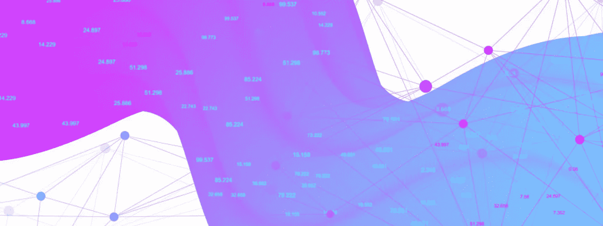

# 面向数据科学家的 9 份重要简讯

> 原文：<https://towardsdatascience.com/9-essential-newsletters-for-data-scientists-e225e4227318?source=collection_archive---------3----------------------->

## 简讯对 2018 年内容监管的重要性

[Conor’s Newsletter](https://www.conordewey.com/newsletter)

# 问题是

一段时间以来，数字媒体就是未来，这一点已经很清楚了。然而，只有在过去的几年里，我们才真正体验到大规模数字媒体的后果。虽然假新闻可能因影响力和各种丑闻而占据中心舞台，但问题不仅仅是假新闻。

> 真正的问题在于区分信号和噪声。

我们不断被信息轰炸，以至于在互联网大小的干草堆中找到隐喻的“价值针”变得越来越困难。

目前这种困境留给我们的问题多于答案。

在一个充斥着点击诱饵标题和假新闻的世界里，我们如何毫发无损地躲过这些地雷？如今，网络上有无穷无尽的内容，哇，我们是不是要筛选所有的内容，并把注意力集中在重要的内容上？

这些无疑是难题。事实上非常困难，每天都有成千上万有才华的人试图解决这些问题。

# 解决方案

我越来越清楚，这些问题的解决方案都依赖于完善一个高于一切的概念——内容监管。

> "内容监管是收集与特定主题或感兴趣的领域相关的信息的过程."

在一个完美的世界里，你不应该仅仅为了找到一个特定主题的真实的、有价值的信息或资源而搜索万维网。这项任务可以而且应该委托给其他人。

在这篇文章的其余部分，我将重点关注我最喜欢的内容管理形式——时事通讯。我们将回顾为什么简讯对数据科学特别有用，然后我将分享我目前订阅的每一份数据科学简讯。

# 数据科学呢？

由于数据科学技能集的快速增长和多维度性质，简讯可以提供巨大的价值。

这个领域目前没有放缓的迹象。似乎每隔一周就有一个有趣的突破或项目。新技术和技巧也非常普遍。

为了让你的数据驱动技能保持最佳状态，你需要培养一种[成长心态](https://www.youtube.com/watch?v=M1CHPnZfFmU)并乐于学习新事物。时事通讯是帮助你了解该领域最新动态的最佳方式。

> 把你订阅的时事通讯想象成一群聪明、专业的精英，他们为你提供值得你花费时间的信息。

幸运的是，对于数据科学家来说，有大量优秀的时事通讯可供研究。你会在下面找到我的订阅列表，没有特定的顺序，关于数据科学、机器学习、人工智能或一般黑客的任何内容。在过去的三年中，这种方法不断被迭代和发展。

作者注:我只订阅了一小部分优秀的时事通讯，所以不要害怕拓展和尝试其他的。此外，如果不符合标准，您可以在一期后退订。没什么可失去的！

 [## 数据科学周刊-第 239 期

### 我们的资源页面。

mailchi.mp](https://mailchi.mp/datascienceweekly/data-science-weekly-issue-927097?e=2c2014787d)  [## 获取奥赖利数据通讯-奥赖利媒体

### 在 1，969 个评级中，平均每五颗星中有四颗保持消息灵通。从业内人士那里获得每周见解，此外…

www.oreilly.com](https://www.oreilly.com/data/newsletter.html?mkt_tok=eyJpIjoiT1dJNU1qUTFaVGd3WTJGaiIsInQiOiJkTmVucm1rTG4wc0R2NVFiTEE3a1wvXC9sRXVLM28yUVpUXC9KaXdUXC93SmplR3B4QkJFc0VCN2VadW85Z3MrYXU3aHZkZmtuc01ZKzNoXC9TVkRzOGI5bFZNUXZSMTVORFhTZ0E4ZnFPVko5R3FwTlY2b2hJaXFMVXROODlJUHBSakluIn0%3D)  [## 存档问题|数据灵丹妙药

### 有关策划的数据科学新闻和工具，请浏览 Data Elixir 的时事通讯档案。

dataelixir.com](https://dataelixir.com/issue/?num=187?sid=ShnzrOJ#start)  [## 玛奇纳数据-第 133 期

### 这里有一个新的重要的东西:TD= DP + MC 时间差分学习:结合动态规划和蒙特卡罗…

www.getrevue.co](https://www.getrevue.co/profile/datamachina/issues/data-machina-issue-133-119481?utm_campaign=Issue&utm_content=view_in_browser&utm_medium=email&utm_source=Data+Machina)  [## 模式:分析调度

### 注册我们的每周时事通讯，里面充满了关于数据、数据科学和分析的相关文章。

about.modeanalytics.com](https://about.modeanalytics.com/newsletter/?utm_source=dispatch-send&utm_campaign=dispatch-subscribe&utm_medium=email&mkt_tok=eyJpIjoiTVRRNFpURXhNbVF5TUdFeiIsInQiOiIrbjV5Y2V0K05FTWV5WURPWEFZQ1BDRUI1bnRTZm1DTEt1a1o0dWgyb015WjJhZUJiK2JjcW1zMDJJQTMyN0hSNFpmdmZWQVI1TnNpaVVYc3pvZGVRSTh3Nk1jU0NyVFRDM2kraVwvZjJXTm5rUENYNm5mTEhUMWVpWGd2XC9STndRIn0%3D)  [## 争夺机器学习霸权的国家

### “工业机器人能够杀死一个人....[但是]传感器、计算和软件的进步正在改变…

mailchi.mp](https://mailchi.mp/usejournal/deception-964925?e=8489f0e7ea)  [## 嵌入式 ML。值得信赖的分析。ML @ Twitter。雪花& BigQuery。[DSR 第 140 位]

### 数据科学综述- ❤️想要支持我们吗？转发这封邮件给三个朋友！🚀从一个朋友那里转发来的…

roundup.fishtownanalytics.com](http://roundup.fishtownanalytics.com/issues/embedded-ml-trustworthy-analysis-ml-twitter-snowflake-bigquery-dsr-140-119218)  [## 黑客新闻摘要

### 我们会定期发送电子邮件，内容包括黑客新闻，这样您就不会经常分心，并且可以随时了解…

www.hndigest.com](https://www.hndigest.com/)  [## Kaggle 时事通讯:音频样本 GAN、MDPs 教程和 CERN 竞赛指南

### 你好！复制研究论文是提高机器学习技能的一种有益方式。但是实践可以是…

us1.campaign-archive.com](https://us1.campaign-archive.com/?u=e4c8fb8b43860678deab268e5&id=c810091291&e=abeaa8fb3e) 

# 包扎

感谢阅读！如果你喜欢这篇文章，请继续向鼓掌按钮展示你的爱。对更多的帖子感兴趣吗？请确保[关注我](https://twitter.com/cdeweyx)并订阅下面的[我的简讯](https://www.conordewey.com/)以接收任何新内容。更多关于我和我在做什么的信息，请查看我的网站。