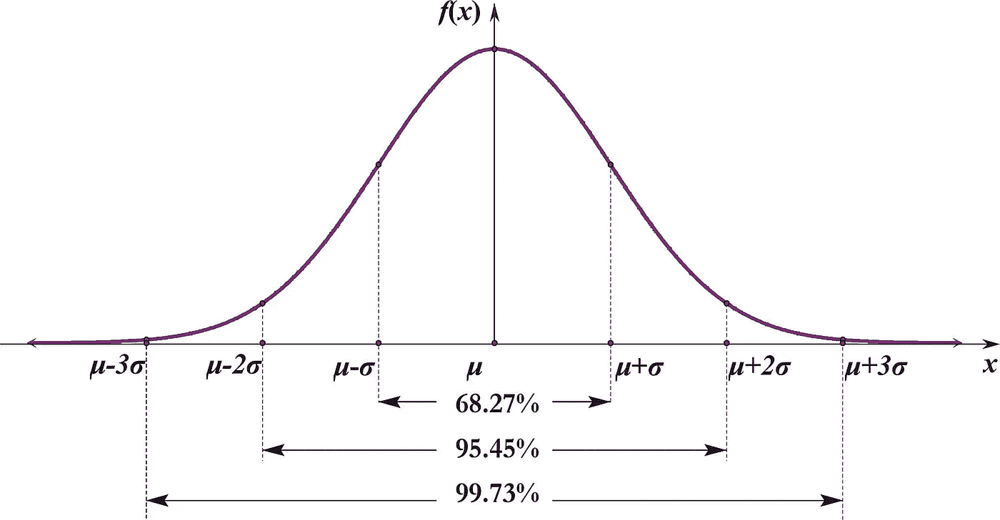
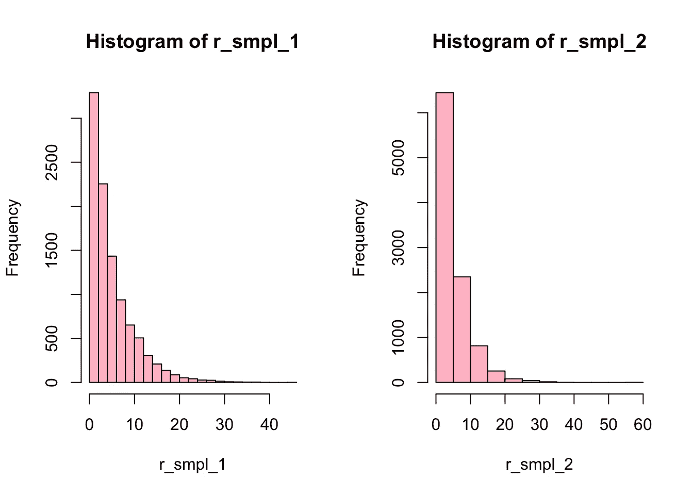
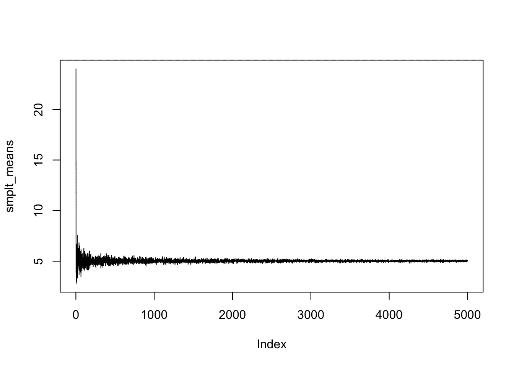
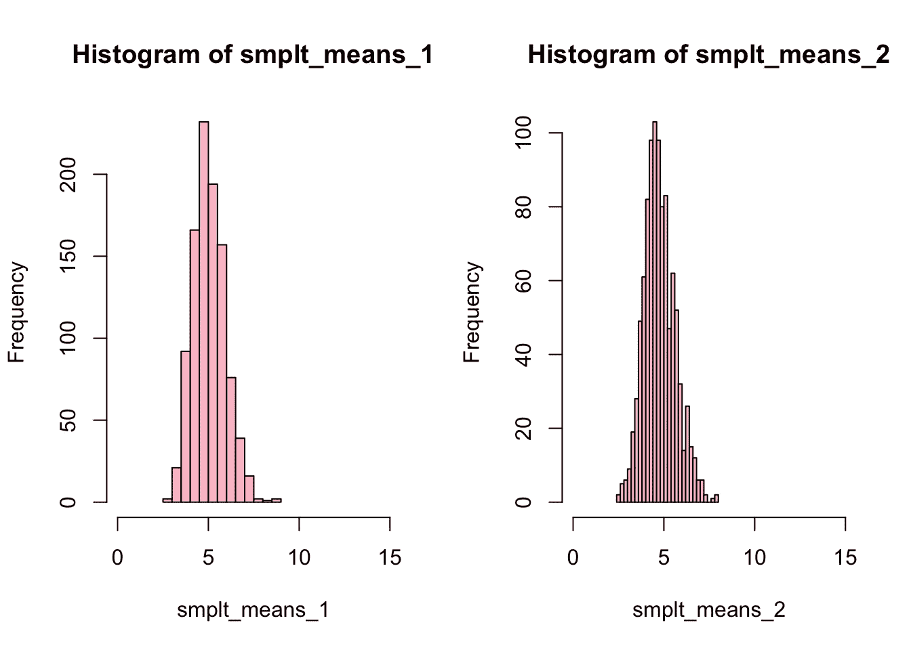
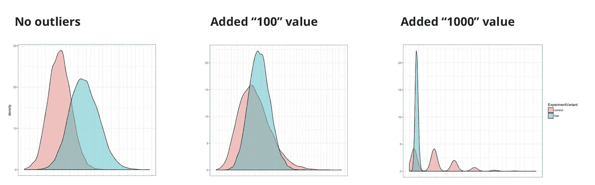

# A/B 测试:中心极限定理的重要性

> 原文：<https://towardsdatascience.com/a-b-testing-the-importance-of-central-limit-theorem-362f6843bf55?source=collection_archive---------12----------------------->

数据分析需要准确甚至尊重的数据处理。当 AB 测试已经完成，并且已经收集了统计上显著数量的数据时，就到了确定获胜者的时候了。然而，在分析之前，[清理和准备 AB 测试数据集](https://awsmd.com/how-to-clean-data.html)至关重要。此外，研究数据的性质和特征并选择合适的统计评估方法也是极其重要的。

中心极限定理是处理数据和样本的基本要素。没有对中心极限定理的理解，一般情况下就不可能形成和评价 A/B 测试样本和数据分析。在本文中，我将解释这个定理的实际好处及其在 A/B 测试中的重要性。

中心极限定理是分析师装备中的有力工具。

# 一些定理论文

*   从任何总体中形成大的随机样本倾向于按照正态律分布其平均值，并且接近我们从中取样的一般总体的平均值，而不管一般总体的分布形式如何。即使总体分布是指数分布，多重随机样本抽取也趋向于正态分布。
*   大多数样本的平均值将足够接近总体的平均值。究竟什么应该被认为是“足够接近”是由标准误差决定的。
*   样本平均值距离总体平均值超过两个标准误差的可能性相对较小，样本平均值距离总体平均值超过三个或更多标准误差的可能性极小。
*   一些结果纯粹是随机的可能性越小，我们就越能确定有其他因素的影响。

假设我们启动了一个实验，目标度量是平均检查。零假设是对照组和实验组之间的平均检查值没有差异。另一个假设是，差异是存在的。

众所周知，小样本量会导致对统计数据的不准确评估。根据大数定律，样本量越大，样本均值越接近总体均值。这意味着，为了更准确地评估总体均值，我们需要足够大的样本。

这可以通过下面的图表来理解，图表显示随着样本量的增加，样本均值越来越接近总体均值:

我们可以使用 bootstrap 来确定指数分布平均检查数据的置信区间。我们可以看到，算术样本平均值的平均值大约等于从中提取统计数据的样本平均值。标准偏差变小了，因为观察值现在尽可能接近真实的总体平均值。

在这种情况下，平均值的标准偏差是之前绘制的置信区间的标准误差。现在，使用置信区间，我们可以评估统计数据。这是中心极限定理的主要实用价值之一。

如果目标是获得更精确的均值估计，那么有必要最小化方差。价差越小，平均值越准确。要使均值的标准差足够小，需要足够大的样本量。

# 底线

上面的例子假设我们对分布的形式有所了解。在现实中，有许多情况下，观测值不能用任何分布规律来解释。这些情况很可能与异常值有关。伦理问题是，将数据调整到所需的分布形式，以获得充分的评估或保持原样。在 A/B 测试中，这个决定取决于假设、抽样和度量。在某些情况下，剔除离群值是有意义的，但在另一种情况下，考虑“鲸鱼”是值得的。

例如，Bootstrap 在处理异常值时并不完美。看看如果我们将值 100 和 1000 添加到要重新采样的样本中会发生什么

# 结论

为了执行稳健的数据分析，了解统计基础知识至关重要，否则，获得误导性结果的风险极高。在具有非正态分布的数据集上使用适用于正态分布数据的评估方法会导致做出错误的决策。

# 下一步是什么

在接下来的文章中，我们将回顾哪些指标通常具有正态和非正态分布形式，以及在每种情况下应该应用什么统计标准来测试假设。

*最初发表于*[*【awsmd.com】*](https://awsmd.com/ab-testing-central-limit-theorem.html)*。*