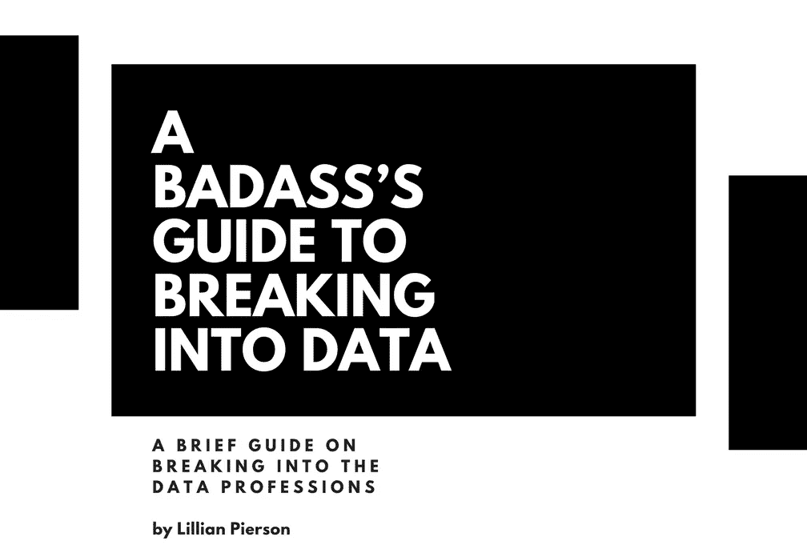

# 闯入数据的坏蛋指南

> 原文：<https://towardsdatascience.com/a-badasss-guide-to-breaking-into-data-5d1a7258ef4e?source=collection_archive---------15----------------------->

## 一个由环境工程师转变为数据科学家的故事

这不是我的故事。

这是一个关于数据科学家、数据战略家、培训师和技术业务教练的故事，他激励了数据领域的许多专业人士。她是[莉莲·皮尔森](https://www.linkedin.com/in/lillianpierson/)—[数据狂热](http://www.data-mania.com/)的创始人和 [LinkedIn Learning](https://www.linkedin.com/learning/instructors/lillian-pierson-p-e) 的讲师——她还写了几本书，为数据科学的初学者提供指导。

如果你想在数据领域进一步发展自己的事业，或者想在数据科学领域成为一名成功的企业家，那么她写的《一个坏蛋进入数据的指南》是另一部杰作，强烈推荐。

## 为什么我觉得这本书是必读书？

[Book — A Badass’s Guide to Breaking Into Data](http://www.data-mania.com/blog/guide-to-breaking-into-data/)

简单。书是 ***实用*** 。没什么特别的。

尽管提供的内容很简短，但它实际上会分解为对您真正重要的内容，即作为一名有抱负的数据专业人员，从最佳资源中学习，以及如何一步一步地建立您的产品组合和个人品牌。

令我惊讶的是，这本书甚至更进一步，向你展示了数据专业人士在不同的社交媒体上应该关注哪些技术影响者。我就想，什么？真的吗？Lillian Pierson[采取的大规模行动不仅帮助人们从最好的资源中学习，也帮助人们从行业中最优秀的人那里学习，这绝对是鼓舞人心的！](https://www.linkedin.com/in/lillianpierson/)

## 建立一个数据科学博客

[(Source)](https://unsplash.com/photos/hRZDd1ekhrA)

事实上，最吸引我注意力的章节是如何建立一个数据科学博客。

对我来说，这一切都可以归结为一个词——分享。

思维的类比——假设您分析了一个数据集，得出了一些有趣的结果，从而产生了见解和行动计划。但是最后，你没有机会向利益相关者展示你的结果，或者，你的分析根本没有听众给你反馈。

> 所以问题是——你做过分析吗？

嗯…在你内心深处，你知道你花了很多时间来分析数据集，但机会没有敲门让你分享和展示结果。

回到写你的数据科学博客。尽管您可能有突破性的解决方案或从数据集获得的见解来解决问题，但如果解决方案孤立存在，什么也不会发生，因为没有人知道它。

**分享。**这是打开在数据领域获得成功的机会之门的钥匙。人们通过把你的学习历程或分析放入 ***词语*** 中来了解你做了什么和你有什么能力。通过分享，你也可以向他人学习。

# 结论

感谢您的阅读。希望你会发现这本书很有用，我很想听听你从内容中学到了什么，以及你将如何应用这些概念。在下面留下你的评论吧！

这里 可以免费获得电子书 [**。**](http://www.data-mania.com/blog/guide-to-breaking-into-data/)

一如既往，如果您有任何问题或意见，请随时在下面留下您的反馈，或者您可以随时通过 [LinkedIn](https://www.linkedin.com/in/admond1994/) 联系我。在那之前，下一篇文章再见！😄

## 关于作者

[**Admond Lee**](https://www.admondlee.com/) 现在的使命是让每个人都能接触到数据科学。他正在帮助公司和数字营销机构通过创新的数据驱动方法，利用可操作的见解实现营销投资回报。

凭借其在高级社会分析和机器学习方面的专业知识，Admond 旨在弥合数字营销和数据科学之间的差距。

如果你想了解更多关于 Admond 的故事、数据科学服务以及他如何在营销领域帮助你，请查看他的 [**网站**](https://www.admondlee.com/) 。

你可以在 [LinkedIn](https://www.linkedin.com/in/admond1994/) 、 [Medium](https://medium.com/@admond1994) 、 [Twitter](https://twitter.com/admond1994) 、[脸书](https://www.facebook.com/admond1994)上和他联系。

 [## 阿德蒙德·李

### 让每个人都能接触到数据科学。Admond 正在通过先进的社交分析和机器学习，利用可操作的见解帮助公司和数字营销机构实现营销投资回报。

www.admondlee.com](https://www.admondlee.com/)