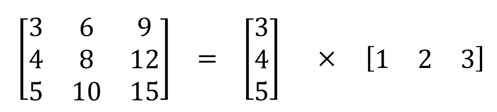
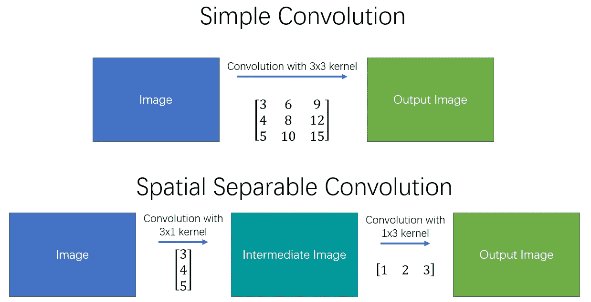
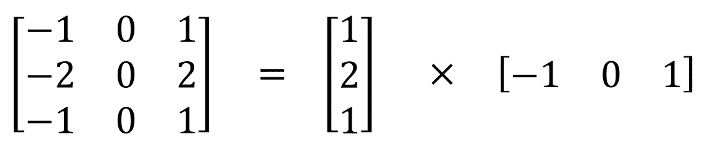
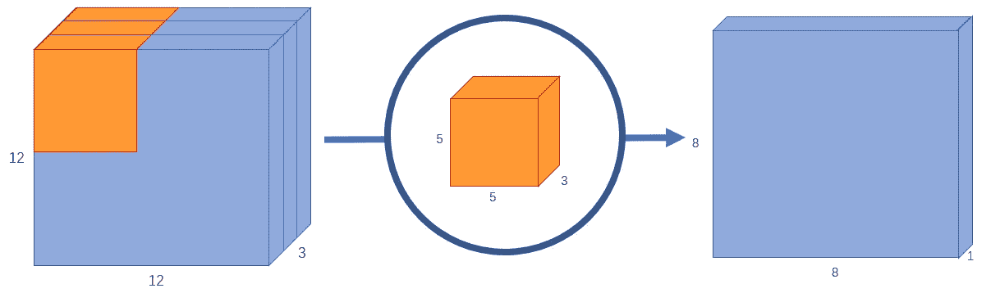
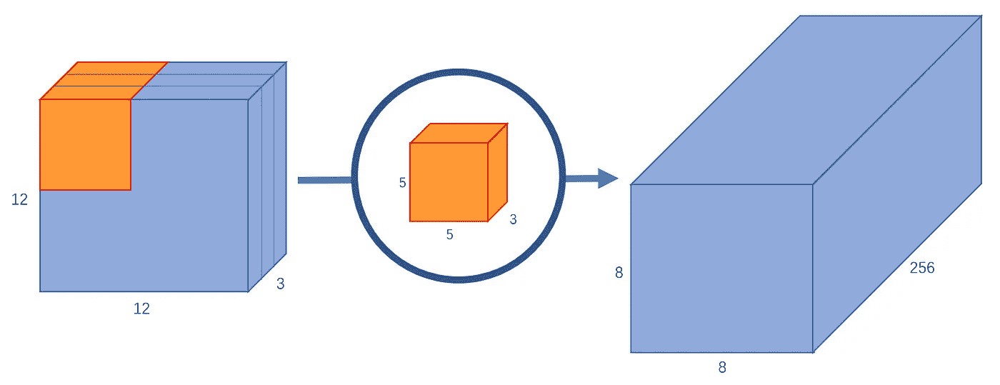
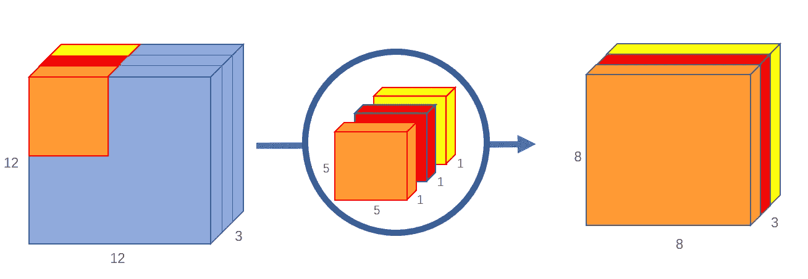
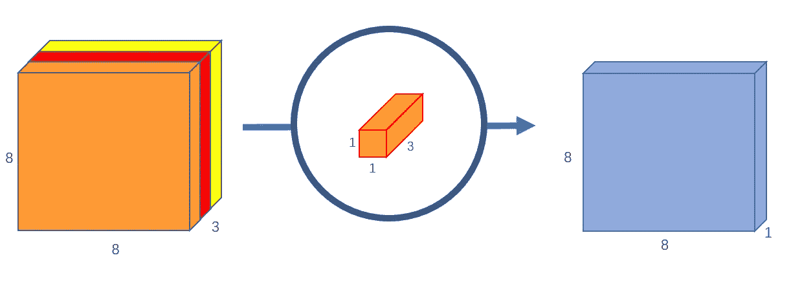
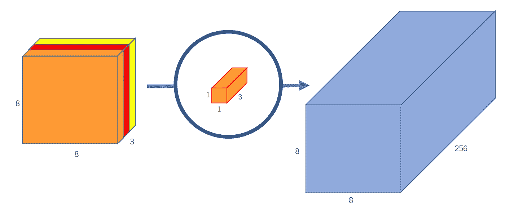

# 可分卷积的基本介绍

> 原文：<https://towardsdatascience.com/a-basic-introduction-to-separable-convolutions-b99ec3102728?source=collection_archive---------0----------------------->

任何人只要看一看 MobileNet 的架构，就会毫无疑问地遇到可分卷积的概念。但那是什么，它和普通的卷积有什么不同？

有两种主要类型的可分离卷积:空间可分离卷积和深度可分离卷积。

# 空间可分卷积

从概念上来说，这是两个中较容易的一个，并且说明了将一个卷积分成两个的想法，所以我将从这个开始。不幸的是，空间可分卷积有一些明显的限制，这意味着它在深度学习中没有被大量使用。

空间可分卷积之所以如此命名，是因为它主要处理图像和内核的**空间维度**:宽度和高度。(另一个维度，即“深度”维度，是每个图像的通道数)。

空间可分离卷积简单地将一个核分成两个更小的核。最常见的情况是将 3x3 内核分为 3x1 和 1x3 内核，如下所示:

Image 1: Separating a 3x3 kernel spatially

现在，我们不是用 9 次乘法进行一次卷积，而是用两次卷积，每次 3 次乘法(总共 6 次)来达到相同的效果。随着乘法运算的减少，计算复杂度降低，网络能够运行得更快。

Image 2: Simple and spatial separable convolution

可以在空间上分离的最著名的卷积之一是 Sobel 核，用于检测边缘:

Image 3: Separating the Sobel kernel

空间可分离卷积的主要问题是，不是所有的核都可以被“分离”成两个更小的核。这在训练期间变得特别麻烦，因为在网络可以采用的所有可能的核中，它最终只能使用可以分成两个更小的核的微小部分中的一个。

# 深度可分卷积

与空间可分离卷积不同，深度可分离卷积与不能被“分解”成两个更小内核的内核一起工作。因此，它更常用。这是在 keras.layers.SeparableConv2D 或 tf.layers.separable_conv2d 中看到的可分离卷积类型。

深度方向可分离卷积之所以如此命名，是因为它不仅处理空间维度，还处理深度维度——通道的数量。一个输入图像可能有 3 个通道:RGB。经过几次卷积后，一幅图像可能有多个通道。您可以将每个通道想象成该图像的特定解释；例如，“红色”通道解释每个像素的“红色”，“蓝色”通道解释每个像素的“蓝色”，“绿色”通道解释每个像素的“绿色”。具有 64 个通道的图像对该图像有 64 种不同的解释。

与空间可分离卷积类似，深度方向可分离卷积将一个核分割成两个独立的核，进行两种卷积:深度方向卷积和点方向卷积。但首先，让我们看看一个正常的卷积是如何工作的。

## 正常卷积:

如果你不知道从二维角度看卷积是如何工作的，请阅读[这篇文章](/what-is-a-neural-network-6010edabde2b)或查看[这个网站](http://setosa.io/ev/image-kernels/)。

然而，典型的图像不是二维的；它也有深度以及宽度和高度。假设我们有一个 12×12×3 像素的输入图像，一个大小为 12×12 的 RGB 图像。

让我们对图像进行 5x5 卷积，没有填充，步幅为 1。如果只考虑图像的宽度和高度，卷积过程有点像这样:12x12 — (5x5) — >8x8。5x5 内核每 25 个像素进行一次标量乘法，每次产生 1 个数字。我们最终得到一个 8×8 像素的图像，因为没有填充(12–5+1 = 8)。

然而，因为图像有 3 个通道，我们的卷积核也需要有 3 个通道。这意味着，每次内核移动时，我们实际上执行 5x5x3=75 次乘法，而不是执行 5x5=25 次乘法。

就像 2d 解释一样，我们对每 25 个像素进行标量矩阵乘法，输出 1 个数字。经过一个 5x5x3 的内核，12x12x3 的镜像会变成一个 8x8x1 的镜像。

Image 4: A normal convolution with 8x8x1 output

如果我们想增加输出图像中的通道数量，该怎么办？如果我们想要 8x8x256 大小的输出呢？

嗯，我们可以创建 256 个内核来创建 256 个 8x8x1 图像，然后将它们堆叠在一起，创建一个 8x8x256 图像输出。

Image 5: A normal convolution with 8x8x256 output

这就是普通卷积的工作原理。我喜欢把它想象成一个函数:12x12x3 — (5x5x3x256) — >12x12x256(其中 5x5x3x256 代表内核的高度、宽度、输入通道数和输出通道数)。不是说这不是矩阵乘法；我们不是将整个图像乘以内核，而是将内核移动通过图像的每个部分，并分别乘以图像的小部分。

深度方向可分离卷积将该过程分成两部分:深度方向卷积和点方向卷积。

## 第 1 部分—深度方向卷积:

在第一部分，深度方向卷积，我们给输入图像一个不改变深度的卷积。我们通过使用 3 个形状为 5x5x1 的内核来实现这一点。

Video 1: Iterating 3 kernels through a 3 channel image

Image 6: Depthwise convolution, uses 3 kernels to transform a 12x12x3 image to a 8x8x3 image

每个 5x5x1 内核迭代图像的 1 个通道(注: **1 个通道**，不是所有通道)，得到每 25 个像素组的标量积，给出一个 8x8x1 的图像。将这些图像堆叠在一起会创建一个 8x8x3 的图像。

## 第 2 部分—逐点卷积:

请记住，原始卷积将 12x12x3 图像转换为 8x8x256 图像。目前，深度方向卷积已将 12x12x3 图像转换为 8x8x3 图像。现在，我们需要增加每个图像的通道数。

逐点卷积之所以这样命名，是因为它使用了一个 1x1 内核，或者说是一个遍历每一个点的内核。无论输入图像有多少通道，该内核都具有深度；在我们的例子中，是 3。因此，我们通过 8x8x3 图像迭代 1x1x3 内核，得到 8x8x1 图像。

Image 7: Pointwise convolution, transforms an image of 3 channels to an image of 1 channel

我们可以创建 256 个 1×1×3 的内核，每个内核输出一个 8×8×1 的图像，从而得到形状为 8×8×256 的最终图像。

Image 8: Pointwise convolution with 256 kernels, outputting an image with 256 channels

就是这样！我们已经将卷积分成两部分:深度方向卷积和点方向卷积。再抽象一点，如果原卷积函数是 12x12x3 — (5x5x3x256) →12x12x256，我们可以把这个新卷积图解为 12 x12 x3—(5x 5x 1 x1)—>(1x1 x3 x256)—> 12 x12 x256。

## 好吧，但是创建深度方向可分离卷积有什么意义呢？

让我们计算一下计算机在原始卷积中要做的乘法次数。有 256 个 5x5x3 内核移动 8x8 次。也就是 256x3x5x5x8x8=1，228，800 次乘法运算。

可分卷积呢？在深度方向卷积中，我们有 3 个移动 8x8 次的 5x5x1 内核。也就是 3x5x5x8x8 = 4，800 次乘法。在逐点卷积中，我们有 256 个移动 8×8 次的 1×1×3 内核。也就是 256x1x1x3x8x8=49，152 次乘法。把它们加在一起，就是 53，952 次乘法。

52952 比 1228800 少很多。随着计算量的减少，网络能够在更短的时间内处理更多的数据。

但是，这是怎么做到的呢？第一次碰到这种解释，直觉上对我来说真的没什么意义。这两个卷积不是在做同样的事情吗？在这两种情况下，我们通过 5x5 内核传递图像，将其缩小到一个通道，然后扩展到 256 个通道。为什么一个比另一个快两倍多？

思考了一段时间后，我意识到主要的区别是这样的:在正常卷积中，我们对图像进行了 256 次的**变换。并且每一次变换使用多达 5x5x3x8x8=4800 次乘法。在可分离卷积中，我们只真正地**变换图像一次**——在深度方向卷积中。然后，我们把变换后的图像**简单地拉长到 256 通道**。不必一次又一次地变换图像，我们可以节省计算能力。**

值得注意的是，在 Keras 和 Tensorflow 中，都有一个被称为“深度乘数”的论点。默认设置为 1。通过更改此参数，我们可以更改深度方向卷积中的输出通道数量。例如，如果我们将深度乘数设置为 2，每个 5x5x1 内核将给出 8x8x2 的输出图像，使得深度方向卷积的总(堆叠)输出为 8x8x6，而不是 8x8x3。有些人可能会选择手动设置深度乘数，以增加其神经网络中的参数数量，从而更好地学习更多特征。

深度方向可分卷积的缺点是什么？肯定！因为它减少了卷积中的参数数量，所以如果您的网络已经很小了，您可能会因为参数太少而结束，并且您的网络可能无法在训练期间正确学习。然而，如果使用得当，它能够在不显著降低效率的情况下提高效率，这使得它成为一个非常受欢迎的选择。

## 1x1 内核:

最后，因为逐点卷积使用了这个概念，所以我想谈谈 1x1 内核的用法。

可以在可分离卷积之外使用 1x1 内核，或者说 n 个 1x1xm 内核，其中 n 是输出通道的数量，m 是输入通道的数量。1x1 内核的一个明显目的是增加或减少图像的深度。如果你发现你的卷积有太多或太少的通道，1x1 内核可以帮助平衡它。

然而，对我来说，1x1 内核的主要目的是应用非线性。在神经网络的每一层之后，我们可以应用一个激活层。无论是 ReLU、PReLU、Softmax 还是其他，激活层都是非线性的，不像卷积层。"直线的线性组合仍然是一条直线."非线性层扩展了模型的可能性，这通常使得“深”网络比“宽”网络更好。为了在不显著增加参数和计算的数量的情况下增加非线性层的数量，我们可以应用 1x1 内核并在它之后添加激活层。这有助于给网络增加一层深度。

如果您有任何进一步的问题，请在下面留下评论！别忘了给这个故事一些掌声！