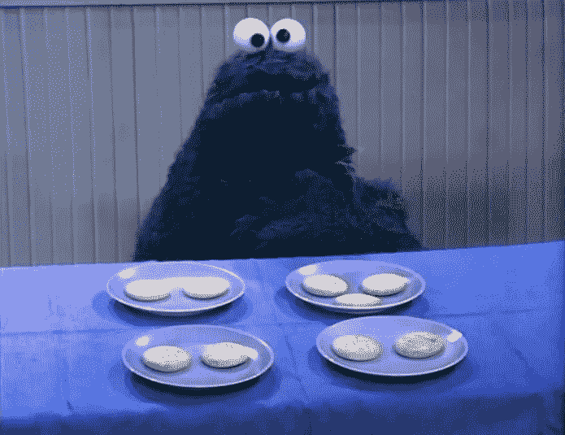
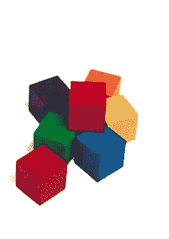
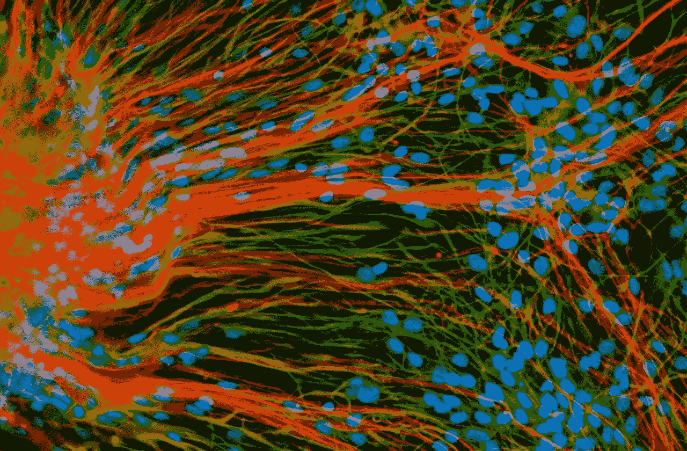

# 机器学习的基本模型——概述

> 原文：<https://towardsdatascience.com/a-basic-model-for-machine-learning-an-overview-3854ea77e919?source=collection_archive---------6----------------------->

## 第 1 部分，共 2 部分

如今软件中最常见的“机器学习”形式是算法，*可以从中学习并对数据*做出预测。 [Arthur Samuel](https://en.wikipedia.org/wiki/Arthur_Samuel) 在 1959 年创造了“机器学习”这个术语，意思是赋予“计算机无需明确编程就能学习的能力”

今天，随着计算和数据的大幅增长，机器学习算法被有效地用于狭窄的任务，如“识别”[图像](https://medium.freecodecamp.org/image-recognition-demystified-fc9c89b894ce)，口语和[书面语](https://chatbotsmagazine.com/contextual-chat-bots-with-tensorflow-4391749d0077)和[许多其他事情](https://chatbotslife.com/deep-learning-in-7-lines-of-code-7879a8ef8cfb)。

所有这些都非常有用，但是这种方法不会导致*对事物*的理解，并且它在*学习*的方式上有根本性的限制:

*   通常需要非常大量的数据来获得有用的结果
*   算法往往是“黑箱”，它们的工作**不可内省**
*   新的学习经常迫使整个**模型的重建**

这与幼儿(和动物)的学习方式毫无相似之处。

*   从单一的信息中学习(**“一次性学习”**)
*   关联和决定是可以解释的
*   新的学习可以是**渐进的**也可以是**从错误中产生的**

麻省理工学院最近的一篇研究论文简洁地描述了“一次性学习”的想法:

> “尽管机器学习已经解决了一些人们毫不费力就能解决的相同的分类和识别问题，但标准算法需要数百或数千个例子才能达到良好的性能。虽然用于数字识别的标准 MNIST 基准数据集每类有 6000 个训练样本，但人们可以仅从一个样本中对外国手写字符的新图像进行分类。”

除了一次性学习，*从错误中学习*的概念也是元素。神经网络在反向传播中使用梯度损失函数，然而这是建立模型的大规模强力迭代的一部分，*而不是应用学习*的自然部分。

反思做出决定的原因，因为这是由有意识的“T0”缓慢思考“T1”引起的，这与富有成效的学习循环是不可分割的。一个孩子被问到“这个东西属于吗？”她说是的，并能解释原因。她讲述了一个原因。老师解释答案，在这个过程中，学生形成新的理解，或强化现有的概念。

> “为什么，”学习者最有力的问题是一个故事。

我在这里的目的是概述一个学习的基本模型，认识到机器和动物的大脑非常不同，但*学习的基本概念和过程*不一定如此。

## 学习的“无限循环”

给定角色*学习者*和*教师*，人/动物的基本学习循环可以总结如下。

> **a .图案采集:**

**a.1** 学习者获得符号模式*(图像、形状……)*

**a.2** 图案被赋予了某种东西*(一个名字)*

> **b .模式理解:**

**b.1** 学习者被问及一个模式是否“属于”一个事物

**b.2** 学员根据所学模式提供最佳答案

教师提供强化或纠正，从而获得更多信息

一个模式不属于某样东西是学习的一个要素。

Cookie Monster on Sesame Street ‘a thing that does not belong’

孩子们通过看到“不属于”的例子来学习。

让我们从想象一个基本学习模型开始，该模型*识别基本模式*，学习如何*识别模式组的区别特征*，并确定模式*是否可归因于某个事物。*

## 标志

我们用字母做符号，顺序符号一起表示一个比较简单的模式。这是一个最基本的出发点。

符号是一个简单的字符串。

> *符号:*一**一**

另一个

> *符号:* **x**

一个符号内部可以有其他符号，*更低层次的抽象。*

> *符号:* **x，(x1)**

更深一层…

> *符号:* **x，(x1，(x1a，(x1a！)))**

我们可以将一组符号排列成一个*符号结构*(一个有序的符号列表):

> *符号结构:* **a b c**

现在让我们想象另一个:

> *符号结构:* **x y z i j k**

出现的是在机器学习中有用的基本编程类和相关数据结构。符号结构可以包含同类的其他实例，符号结构是一个符号列表，每个符号都可以包含一个符号列表，依此类推。

> *事物可以被认为是其他事物的具体化*。

注意:这些例子中使用的字母数字可以是形状、色块，无论什么——它们是象征性的。我们实际上并没有将*称为字母 a* ，它只是作为一个方便的符号。

## 模式匹配

模式可以被匹配以产生它们相似性的“面具”(如果有的话)。我们可以使用数学中的技术[(集合论](https://en.wikipedia.org/wiki/Set_theory))来寻找相似性。

> *象征结构:* **a b c** *和象征结构:* **x y c**

共享符号: **c** ，在第三个位置

> *象征结构:* **1 1 9** *象征结构:*9 8 7 6 5

分享符号: **9**

> *符号结构:* **1 0 1** *和符号结构:* **1 1 1**

份额: **1** (位置 0)和 **1** (位置 2)。注意位置是从零开始的。

因为模式匹配掩码是符号结构的列表，所以它们可以与其他掩码进行模式匹配，以*将*模式列表简化为公共特征。在集合论中，这被称为*幂集*的交集。

the intersection of a powerset

## 模式归属

现在让我们想象一个符号模式可以被赋予一个属性，也就是说我们将一个模式与某个“事物”联系起来或者不联系起来。归属的性质，就目前而言，将是“**是**”，但显然可能是其他方式。

注意:我们现在将符号模式表示为有序的 **[** 符号列表 **]** 。

> *符号结构:***【a b c】*是*a‘foo’**
> 
> *符号结构:***【x y z I j k】*不是*一个‘foo’**

这是幼儿常用的基本学习方法。他们看到一只兔子的照片，听到“兔子”，他们看到另一只兔子的照片，再次听到这个词。一张袋鼠的照片不会发出“兔子”的声音。孩子正在从小数据中逐渐学习。

当然，一只兔子的图像是一个比单一字母符号复杂得多的符号，但它们都是象征性的。

> 只有和孩子们在一起，我们才有最好的机会研究逻辑知识、数学知识、物理知识等等的发展。—让·皮亚杰

在我们的学习模型中接下来发生的是模式的识别，其中固有的是识别模式中的*区别特征*。

## 模式和显著特征

假设向您展示了以下符号模式，为了方便起见，再次使用字母符号(忽略字母的含义)。

> *象征结构:* **【公元前】**
> 
> *符号结构:***【x y c】**
> 
> *符号结构:***【n o c】**

你被告知这些模式代表了事物“foo”，也就是说，它们每个都带有后缀**“is a‘foo’”**

**‘foo’**的特点是什么？

> 答:最后一个位置的**‘c’**符号。

再:**“喷火”是:**

> ***象征结构:***【x b c c a】****
> 
> ***象征结构:***【x c c y】****
> 
> ***符号结构:***【y n c c x】****

****‘foo’**有什么特点？**

> **答:**‘c c’**符号的共同存在。这种符号组合本身就是象征性的。你可能也注意到了所有的模式都有一个**‘x’****

**如果你随后看到另一种模式:**

> ***象征模式:***【x p q n c c o p】****

**你可能会断言，根据你的理解，这也是一个“foo”。你可能是对的，也可能是错的，但是你断言的基础是存在被称为*的属性*的模式的区别特征。**

> **事物实例中固有的符号模式成为模式匹配的基础。**

**为什么你认为那是一个“foo”？**

**因为它既展示了**‘c c’**图案，也展示了在所有其他被识别为‘foo’的图案中看到的**‘x’**图案。**

**当你浏览了上面的模式并理解了给出的问题时，你的大脑有意识地去寻找共同的模式。您浏览了前两个模式，注意到它们都以**‘x’**符号开始，然后立即注意到第三个模式缺少这个特性，但仍然包含那个**‘x’**符号(AND 构造)。快速重新扫描显示，所有 3 个图案都包含**‘c c’**，您可能会将这一对视为一个集合符号(不再需要 2 个单独的符号)。**

**再做一次，并在过程中意识到你的心理过程。在推理中反省自己的思维过程，或者所谓的[‘慢思考’](https://www.scientificamerican.com/article/kahneman-excerpt-thinking-fast-and-slow/)，并不困难。**

**现在你得到了另一种模式，即*是*‘foo’**

> ***象征结构:***【I t c c o v】****

**现在**【foo】**的特点是什么？**

> **答:**‘c c’**符号结构的存在是区别特征。符号“x”现在不再是一个显著的特征。**

**你对‘foo’有了更多的了解。以前被认为是显著特征的东西立即被抛弃了。当然，符号**‘x’**仍有可能在‘foo’的模式匹配中发挥一些作用，但让我们暂时把它放在一边，坚持基本原则。**

**有可能用与或逻辑来表达区别特征。如果属性的符号结构被放入子组中以维持幂集交集，就会出现这种情况。**

## **从反面例子中学习**

**到目前为止，我们已经了解到“foo”由几种符号模式表示:**

**是**‘foo’**:**

> ***符号结构:***【x b c c a】****
> 
> ***象征结构:***【x c c y】****
> 
> ***象征结构:***【y n c c x】****
> 
> ***象征结构:***【x p q n c c o p】****
> 
> ***符号结构:***【I t c c o v】****

**现在假设你在上面的级数中被告知*符号模式:***【x p q n c c o p】**不是‘foo’，你被给了几个其他的模式代表一个事物不是‘foo’。**

****不是‘foo’**:**

> ***象征结构:***【x p q n c c o p】****
> 
> ***符号结构:***【o p a t g】****
> 
> ***象征结构:***【w q o p I】****

**不‘foo’的区别特征似乎是**‘o p’**符号。**

**现在我们对一个符号模式是否是“foo”有了更强烈的感觉。**

## **抽象**

**对于符号来说，有抽象是很常见的，对于模式匹配来说，在抽象的层次上形成是很常见的。**

> ***符号:* **梗，(狗)****
> 
> ***符号:* **鳟鱼，(鱼)****
> 
> ***符号:* **乌鸦，(鸟)****
> 
> ***符号:* **知更鸟，(鸟)****
> 
> ***象征结构:* **[(梗、[狗])、(鳟鱼、[鱼])、(乌鸦、[鸟])】****

**符号“知更鸟”(一种鸟)应该与包含“乌鸦”(另一种鸟)的符号模式相匹配(在动物类型的抽象层次上)。**

**可以有几个抽象层，每个层中有多个符号。可以在模式的转换中建立新的底层数据，产生额外的模式匹配机会。**

## **机器学习算法和认知系统**

**常用的 ML 算法缺乏这些基本的学习品质:*一次性学习、内省、应用学习循环。*而常用的数学库，包括那些有集合论支持的，缺乏实现我们这里所描述的功能和数据结构。**

**你在文本编码解码中使用的递归 LSTM 神经网络不能告诉你为什么它提供了某个术语，也不能在它出错时进行纠正。它的*模型必须从头开始重建*，通过数十万次数据迭代来微调它的许多突触权重。**

**用于识别手写数字的“最近森林”算法或卷积 ANN 也有同样的缺陷。它不能说明为什么有些东西是“8”而不是“7”。它通过查看成千上万的数字，并针对这一特定目的在 10⁶迭代中进行自我调整，来确定一个东西更有可能是“8”而不是另一个数字。**

**这里概述的学习模式是一个潜在的起点。它提出了一种结构，可以识别图案和表面的区别特征，并对它们进行仔细检查。一种软件系统，它通过练习和问题的过程进行学习，并能够确定一组模式是否可归因于某个事物。一个类和数据结构有助于理解*一个事物*。**

**德国哲学家马丁·海德格尔写道:“在西方思想过程中占主导地位的对事物实在性的解释早已不言而喻，现在也在日常生活中使用……”**

> **一个事物的实体——一个事物是“围绕着它集合了属性”—马丁·海德格尔**

****

**如果我们有一个事物的例子(一只兔子，一封手写的信，一个形状，等等)。)然后我们形成事物是什么的模式。**

*   ***这是什么东西？有哪些模式被归因于它？***
*   ***这不是什么东西？***
*   ***这个东西有什么让它像或者不像别的东西？***
*   **我们对这个事物的理解让我们相信另一个事物是相似的还是不同的呢？**
*   **关于我们对这个东西的理解，可以讲什么故事？**

**大多数当前的算法 ML 方法不能导致机器认知，不能导致对事物的理解。学习的基本属性是认知系统的基础。为了让“机器学习”延伸并进化为认知，我们必须首先处理学习的基本过程。**

**我的希望和意图是让这篇文章引发关于机器学习和表面实现的这些基本方面的建设性对话，以推进这项工作。**

****第二部分:**一个[实现](https://medium.com/@gk_/a-basic-model-for-machine-learning-an-implementation-3ee7c49eb334) 。**

****

**[https://tinyurl.com/yaam8ep6](https://tinyurl.com/yaam8ep6)**