# 时间序列预测的贝叶斯方法

> 原文：<https://towardsdatascience.com/a-bayesian-approach-to-time-series-forecasting-d97dd4168cb7?source=collection_archive---------2----------------------->


今天我们将从头开始在 R 中实现贝叶斯线性回归，并使用它来预测美国 GDP 增长。这篇文章基于英格兰银行关于应用贝叶斯计量经济学的非常翔实的手册。我已经把原始的 Matlab 代码翻译成 R，因为它是开源的，并广泛应用于数据分析/科学。我在这篇文章中的主要目标是试图让人们更好地理解贝叶斯统计，它的一些优点，以及一些你可能想使用它的场景。

让我们花一点时间来思考一下，为什么我们首先要使用贝叶斯技术。这样做有几个好处，对于时间序列分析来说尤其有吸引力。使用时间序列模型时的一个问题是过度拟合，特别是在相对较短的时间段内估计具有大量参数的模型时。在这种特殊的情况下，这不是一个问题，但当考虑多个变量时，这肯定是一个问题，这在经济预测中很常见。过度拟合问题的一个解决方案是采用贝叶斯方法，该方法允许我们对变量施加某些先验。

为了理解为什么会这样，考虑一下岭回归(L2 惩罚)的例子。这是一种正则化技术，通过在参数值变大时惩罚我们来帮助我们减少过度拟合(对[岭回归](https://www.quora.com/How-does-ridge-regression-work)的良好解释)。相反，如果我们采用贝叶斯方法来解决回归问题，并使用正态先验，我们实际上是在做与岭回归完全相同的事情。 [**这里的**](https://www.coursera.org/learn/bayesian-methods-in-machine-learning/lecture/p1FM9/linear-regression) 是经过推导证明他们相同的视频(真的好课程 BTW)。我们经常喜欢使用贝叶斯方法的另一个重要原因是，它允许我们将不确定性纳入我们的参数估计中，这在预测时特别有用。

# 贝叶斯理论

在我们开始之前，让我们花点时间来讨论贝叶斯理论的基础以及它如何应用于回归。通常，如果有人想估计以下形式的线性回归:

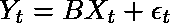

Linear regression Matrix Form

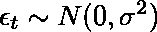

Normally distributed error

他们将从收集每个变量的适当数据开始，并形成下面的可能性函数。然后，他们会试图找到使该函数最大化的 B 和σ:

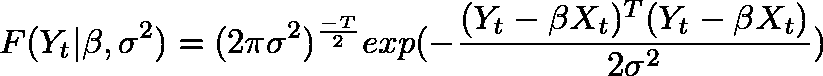

Likelihood Function

在这种情况下，通过取该函数的**对数**的**导数**，并在导数等于零的地方找到 B 的值，可以找到最佳参数。如果我们真的做了数学计算，我们会发现答案是下面的 **OLS 估计量**。我不会去推导，但[在这里](https://www.youtube.com/watch?v=fb1CNQT-3Pg)是一个非常好的视频推导 OLS 估计的细节。我们也可以把这个估计量想象成 X 和 Y 的**协方差**除以 X 的**方差**。

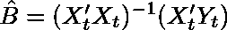

OLS estimator

方差的最佳值将等于

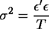

variance

其中 T 是数据集中的行数。经典频率主义方法和贝叶斯方法之间的主要区别在于，模型的参数仅基于数据中包含的信息，而贝叶斯方法允许我们通过使用**先验**来整合其他信息。下表总结了频率主义者和贝叶斯方法之间的主要区别。

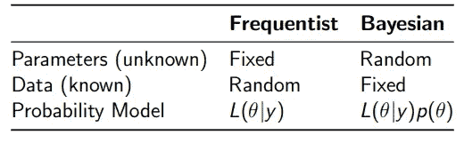

那么我们如何利用这些先验信息呢？这就是贝叶斯法则发挥作用的时候了。记住贝叶斯规则的公式是:

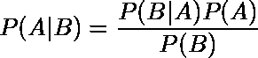

Bayes Rule

[这里的](https://betterexplained.com/articles/an-intuitive-and-short-explanation-of-bayes-theorem/)是一个非常清晰的解释和使用贝叶斯规则的例子。它展示了我们如何将我们的先验知识与证据结合起来，用一个医学例子来形成后验概率。

现在，让我们将贝叶斯规则应用于我们的回归问题，看看我们会得到什么。下面是我们参数的后验分布。记住，这最终是我们要计算的。


Bayes Rule expressed using our model and data

我们还可以更进一步，用更简洁的方式描述 ***后验分布*** 。

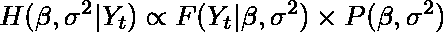

Posterior Distribution

这个等式表明，以我们的数据为条件的我们的参数的后验分布与我们的 ***似然函数*** (我们假设它是正态的)乘以我们的系数的 ***先验分布*** (它也是正态的)成比例。分母中的边际密度或 F(Y )(相当于贝叶斯规则中的 P(B ))是一个归一化常数，以确保我们的分布积分为 1。还要注意，它不依赖于我们的参数，所以我们可以忽略它。

为了计算后验分布，我们需要分离出这个后验分布中与每个系数相关的部分。这涉及到计算边际分布，这在实践中通常很难通过分析来完成。这就是被称为 ***吉布斯采样*** 的数值方法派上用场的地方。Gibbs sampler 是**Markov Chain Monte Carlo(MCMC)**的一个例子，它让我们利用条件分布来近似联合边际分布。接下来是如何工作的快速概述。

# 吉布斯采样

假设我们有 N 个变量的联合分布:

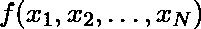

我们想找到每个变量的边际分布。然而，如果这些变量的形式未知，可能很难解析地计算出必要的积分(*积分很难！！*)。在这种情况下，我们采取以下步骤来实现吉布斯算法。首先，我们需要初始化变量的初始值，

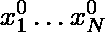

接下来，我们根据其他 N-1 个变量的当前值对第一个变量进行采样。即

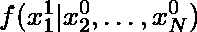

然后，我们对第二个变量进行抽样，条件是所有其他变量

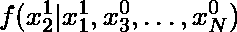

，重复这一过程，直到我们对每个变量进行了采样。这结束了吉布斯采样算法的一次迭代。当我们多次重复这些步骤时，来自条件分布的样本收敛到联合边际分布。一旦我们运行了 M 次吉布斯采样器，我们保留的样本的平均值可以被认为是后验分布平均值的近似值。下面是取样器在两个变量作用下的可视化。您可以看到，算法最初是如何从分布之外的点开始采样，但经过一些步骤后开始收敛到分布。

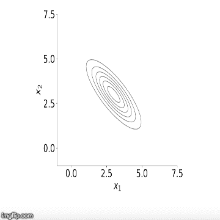

Source: Coursera: Bayesian Methods for Machine learning

既然我们已经讨论了理论，让我们看看它在实践中是如何工作的。下面是使用 Gibbs sampler 实现线性回归的代码。特别是，我将对美国季度国内生产总值(GDP)的同比增长进行 AR(2)模型估计。然后，我将使用这个模型，用贝叶斯框架来预测 GDP 增长。使用这种方法，我们可以使用来自后验密度的分位数，即来自我们算法的保留抽取的分位数，围绕我们的预测构建可信区间。

# 模型

我们的模型将具有以下形式:

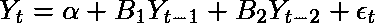

AR(2) Model

我们也可以通过定义下面的矩阵，用矩阵的形式来表达。

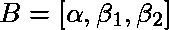

上面是一个系数向量，下面是数据矩阵 X。

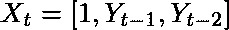

这给出了上面等式 1 中的形式。正如我已经说过的，我们的目标是近似我们系数的后验分布:

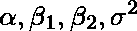

coefficients

我们可以通过计算吉布斯抽样框架内的条件分布来做到这一点。好了，现在这个理论已经过时了，让我们开始用 r 编写代码。

# 密码

我们需要做的第一件事是载入数据。我从圣路易斯美联储的网站下载了美国的 GDP 增长。我选择 **p=2** 作为我想要使用的滞后数。这种选择是相当随意的，有正式的测试，如 **AIC** 和 **BIC** 我们可以用来选择最佳数量的滞后，但我没有使用它们进行分析。那句老话是什么？照我说的做，不要照我做的做。我认为这适用于这里。😄

```
library(ggplot)Y.df <- read.csv('USGDP.csv', header =TRUE)
names <- c('Date', 'GDP')
Y <- data.frame(Y.df[,2])p = 2
T1 = nrow(Y)
```

接下来，我们定义 **regression_matrix** 函数来创建包含 p 滞后 GDP 变量和一个常数项的 X 矩阵。该函数接受三个参数，数据、滞后次数以及真或假，这取决于我们是否需要一个常量。我还在下面创建了另一个辅助函数，它将模型中的系数矩阵转换成一个伴随矩阵。这个函数， **ar_companion_matrix** 实质上转换一个系数矩阵，如下所示(注意不包括常数项):


matrix of coefficients

转换成一个 ***n*n 矩阵*** ，其系数位于顶行，其下是一个(n-1)*(n-1)单位矩阵。以这种方式表达我们的矩阵允许我们计算我们的模型 的 ***稳定性，这将是我们的吉布斯采样器的重要部分。当我们看到相关的代码时，我会在后面的文章中详细讨论这个问题。***

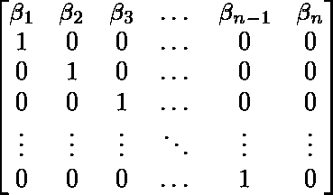

Companion form of matrix

```
regression_matrix  <- function(data,p,constant){
    nrow <- as.numeric(dim(data)[1])
    nvar <- as.numeric(dim(data)[2])

    Y1 <- as.matrix(data, ncol = nvar)
    X <- embed(Y1, p+1)
    X <- X[,(nvar+1):ncol(X)]
    if(constant == TRUE){
        X <-cbind(rep(1,(nrow-p)),X)
    }
    Y = matrix(Y1[(p+1):nrow(Y1),])
    nvar2 = ncol(X)
    return = list(Y=Y,X=X,nvar2=nvar2,nrow=nrow) 
}################################################################ar_companion_matrix <- function(beta){
    **#check if beta is a matrix**
    if (is.matrix(beta) == FALSE){
        stop('error: beta needs to be a matrix')
    }
    **# dont include constant**
    k = nrow(beta) - 1
    FF <- matrix(0, nrow = k, ncol = k)

   ** #insert identity matrix**
    FF[2:k, 1:(k-1)] <- diag(1, nrow = k-1, ncol = k-1)

    temp <- t(beta[2:(k+1), 1:1])
    **#state space companion form
    #Insert coeffcients along top row**
    FF[1:1,1:k] <- temp
    return(FF)
}
```

我们的下一段代码实现了我们的**回归矩阵函数**，并从结果列表中提取矩阵和行数。我们还建立了贝叶斯分析的先验。

```
results = list()
results <- regression_matrix(Y, p, TRUE)X <- results$X
Y <- results$Y
nrow <- results$nrow
nvar <- results$nvar**# Initialise Priors**
B <- c(rep(0, nvar))
B <- as.matrix(B, nrow = 1, ncol = nvar)
sigma0 <- diag(1,nvar)T0 = 1 **# prior degrees of freedom**
D0 = 0.1 **# prior scale (theta0)****# initial value for variance**
sigma2 = 1 
```

我们在这里所做的基本上是为我们的 ***贝塔系数*** 设置一个正态先验，其均值= 0，方差= 1。对我们来说，我们有前科:

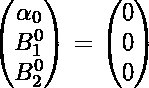

对于我们的方差，我们有先验:

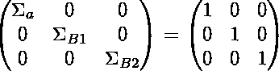

对于 ***方差参数*** ，我们设置了一个**逆伽玛先验(共轭先验)。**这是用于方差的标准分布，因为它只为正数定义，这对于方差来说是理想的，因为它只能是正的。

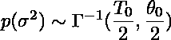

Inverse Gamma Prior

对于这个例子，我们任意选择 T0 = 1 和θ0 = 0.1(D0 是我们的代码)。如果我们想测试这些先验的选择，我们可以通过改变我们的初始先验来做稳健性测试，看看它是否显著改变后验概率。如果我们尝试想象改变θ0 的值会产生什么影响，我们会发现，较高的值会给我们一个更宽的分布，我们的系数更可能呈现较大的绝对值，类似于我们的β具有较大的先验方差。

```
reps = 15000
burn = 4000
horizon = 14
out = matrix(0, nrow = reps, ncol = nvar + 1)
colnames(out) <- c(‘constant’, ‘beta1’,’beta2', ‘sigma’)
out1 <- matrix(0, nrow = reps, ncol = horizon)
```

上面我们设置了我们的预测范围，并初始化了一些矩阵来存储我们的结果。我们创建了一个名为 **out** 的矩阵来存储我们所有的抽奖。它需要的行数等于我们的采样器的抽取数，在本例中等于 15，000。我们还需要创建一个矩阵来存储我们的预测结果。因为我们通过迭代以下形式的方程来计算我们的预测:

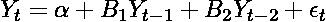

AR(2) Model

我们将需要最后两个可观测期来计算预测。这意味着我们的第二个矩阵 **out1** 的列数将等于预测周期数加上滞后数，在本例中为 14。

# 吉布斯采样的实现

好了，接下来是一段看起来很复杂的代码，但我会一步一步地看，希望之后会更清楚。

```
gibbs_sampler <- function(X,Y,B0,sigma0,sigma2,theta0,D0,reps,out,out1){for(i in 1:reps){
    if (i %% 1000 == 0){
    print(sprintf("Interation: %d", i))
        }
    M = solve(solve(sigma0) + as.numeric(1/sigma2) * t(X) %*% X) %*%
        (solve(sigma0) %*% B0 + as.numeric(1/sigma2) * t(X) %*% Y)

    V = solve(solve(sigma0) + as.numeric(1/sigma2) * t(X) %*% X)

    chck = -1
    while(chck < 0){   # check for stability

        B <- M + t(rnorm(p+1) %*% chol(V))

        **# Check : not stationary for 3 lags**
        b = ar_companion_matrix(B)
        ee <- max(sapply(eigen(b)$values,abs))
        if( ee<=1){
            chck=1
        }
    }
    **# compute residuals**
    resids <- Y- X%*%B
    T2 = T0 + T1
    D1 = D0 + t(resids) %*% resids

    **# keeps samples after burn period**
    out[i,] <- t(matrix(c(t(B),sigma2)))

    **#draw from Inverse Gamma**
    z0 = rnorm(T1,1)
    z0z0 = t(z0) %*% z0
    sigma2 = D1/z0z0

    **# keeps samples after burn period**
    out[i,] <- t(matrix(c(t(B),sigma2)))

    **# compute 2 year forecasts**
    yhat = rep(0,horizon)
    end = as.numeric(length(Y))
    yhat[1:2] = Y[(end-1):end,]
    cfactor = sqrt(sigma2)
    X_mat = c(1,rep(0,p))for(m in (p+1):horizon){
            for (lag in 1:p){
           ** #create X matrix with p lags**
                X_mat[(lag+1)] = yhat[m-lag]
    }
            **# Use X matrix to forecast yhat**
            yhat[m] = X_mat %*% B + rnorm(1) * cfactor
    } out1[i,] <- yhat
}
    return = list(out,out1)
    }results1 <- gibbs_sampler(X,Y,B0,sigma0,sigma2,T0,D0,reps,out,out1)**# burn first 4000**
coef <- results1[[1]][(burn+1):reps,]
forecasts <- results1[[2]][(burn+1):reps,]
```

首先，我们的函数需要以下参数。我们的初始变量，在这种情况下，GDP 增长(Y)。我们的 X 矩阵，只是 Y 滞后了 2 个周期，并附加了一列 1。我们还需要我们之前定义的所有先验，迭代算法的次数(reps ),最后，我们的 2 个输出矩阵。

主循环是我们在这里最需要注意的。这是所有主要计算发生的地方。前两个方程 ***M 和 V*** 描述了以 B 和σ为条件的正态分布的 ***后验均值和方差*** 。我不会在这里推导这些，但如果你感兴趣，它们可以在 Hamilton (1994)的时间序列分析或 ***Bishop 模式识别和机器学习第 3 章*** (尽管符号略有不同)中找到。明确地说，我们的后验参数β的平均值定义为:

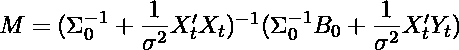

我们的后验参数β的方差定义为:

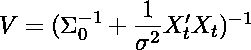

如果我们稍微考虑一下 M 中的第二项，我们可以用最大似然估计来代替 Y_t，这样我们就可以得到

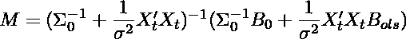

本质上，这个等式表明 ***M 只是我们的先验均值和β的最大似然估计的加权平均值。我直觉地认为这很有意义，因为我们正试图结合我们先前的信息以及来自我们数据的证据。让我们考虑一下之前的方差，尝试改进我们对这个等式的解释。如果我们分配一个小的先验方差(sigma0)，本质上我们对我们的先验选择是有信心的，并认为我们的后验将接近它。在这种情况下，分布将会非常紧密。相反，如果我们在 Beta 参数上设置了一个高方差，情况正好相反。在这种情况下，βOLS 参数的权重将更大。***

但是我们还没有完成。我们仍然需要从正确的分布中随机抽取，但我们可以使用一个简单的技巧来做到这一点。要从均值为 M、方差为 V 的正态分布中获取随机变量，我们可以从标准正态分布中抽取一个向量，并使用以下等式对其进行转换。

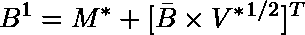

Draw of B from conditional posterior distribution

本质上，我们通过后验方差(标准差)的平方根来添加我们的条件后验均值和标度。这给了我们来自条件后验分布的样本 B。下一段代码也有一个检查，以确保系数矩阵是稳定的，即我们的变量是稳定的，确保我们的模型是动态稳定的。通过将我们的 AR(2)重铸为 AR(1)(伴式)，我们可以检查 ***特征值的绝对值是否小于 1(只需要检查最大的特征值是< |1|)*** 。如果是的话，那就意味着我们的模型是动态稳定的。如果有人想更详细地了解这一点，我推荐《数理经济学的基本方法》第 17 章，或者阅读[这篇](https://davegiles.blogspot.com/2013/06/when-is-autoregressive-model.html?_sm_au_=iVVj7sWRNPW1PkqF)博客文章作为快速入门。

现在我们有了 B 的绘制，我们根据 B 从反向伽马分布中绘制 sigma。从具有自由度的反向伽马分布中采样一个随机变量

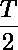

和规模


我们可以从标准正态分布 z0 ~ N(0，1)中抽取 T 个变量，然后进行如下调整

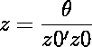

z 现在是从正确的反向伽马分布中提取的。

下面的代码将我们提取的系数存储到 out 矩阵中。然后，我们使用这些绘图来创建我们的预测。该代码实际上创建了一个名为 yhat 的矩阵，用于存储我们对未来 12 个时期的预测(因为我们使用季度数据，所以是 3 年)。我们预测提前一步的等式可以写成

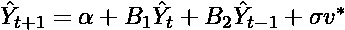

Forecast equation

一般来说，我们需要一个大小为 ***n+p*** 的矩阵，其中 n 是我们希望预测的周期数，p 是 AR 中使用的滞后数。预测只是一个 AR(2)模型，每个周期都有随机冲击，这是基于我们对 sigma 的提取。好了，这就是 Gibbs 抽样器代码。

现在我们可以开始看看算法产生了什么。下面的代码提取了我们需要的系数，这些系数对应于 coef 矩阵的列。每一行都给出了吉布斯采样器每次采样的参数值。 ***计算这些变量中每一个的平均值给我们提供了每个系数*** 分布的后验平均值的近似值。这种分布对于假设检验等其他统计技术非常有用，也是采用贝叶斯方法建模的另一个优势。下面我用 ggplot2 绘制了系数的后验分布。我们可以看到，它们非常类似于正态分布，这在我们定义了正态先验和似然函数的情况下是有意义的。我们参数的后验均值如下:

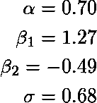

Posterior Means of Parameters

```
const <- mean(coef[,1])
beta1 <- mean(coef[,2])
beta2 <- mean(coef[,3])
sigma <- mean(coef[,4])qplot(coef[,1], geom = "histogram", bins = 45, main = 'Distribution of Constant',
      colour="#FF9999")
qplot(coef[,2], geom = "histogram", bins = 45,main = 'Distribution of Beta1',
      colour="#FF9999")
qplot(coef[,3], geom = "histogram", bins = 45,main = 'Distribution of Beta2',
      colour="#FF9999")
qplot(coef[,4], geom = "histogram", bins = 45,main = 'Distribution of Sigma',
      colour="#FF9999")
```

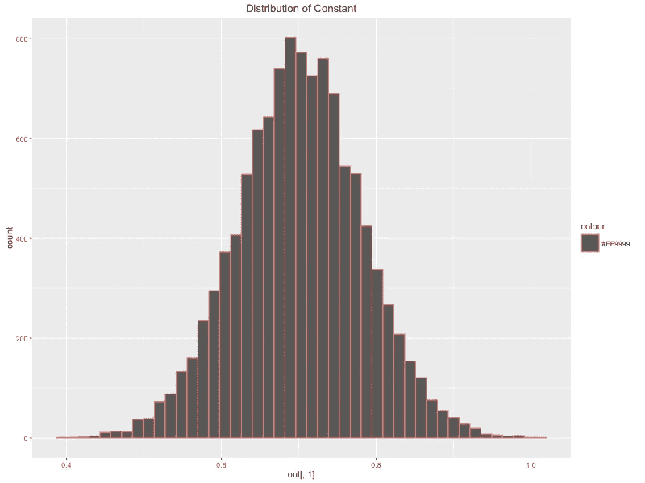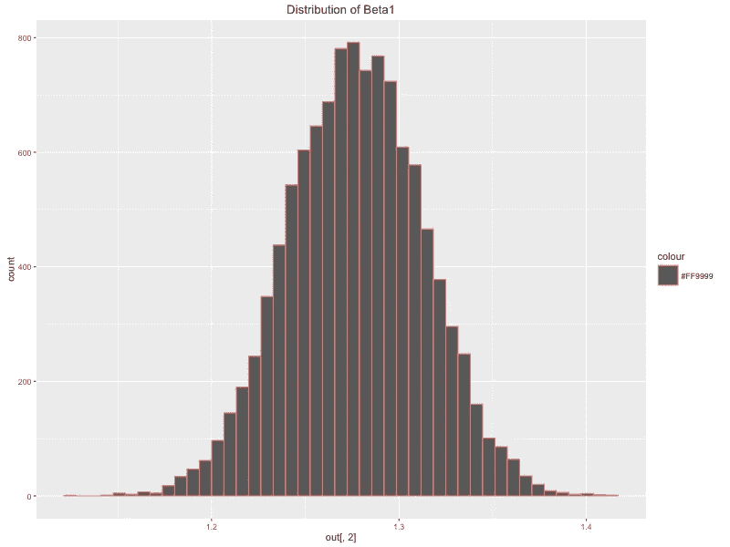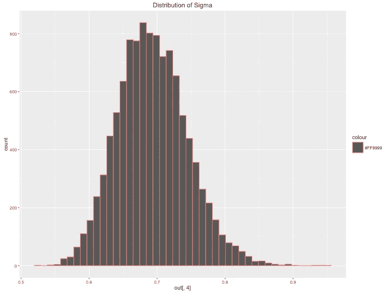

接下来我们要做的是使用这些参数来绘制我们的预测，并围绕这些预测构建我们的可信区间。

# 绘制我们的预测

以下是对 3 年 GDP 同比增长的预测。请注意，使用贝叶斯分析使我们能够创建具有可信区间的预测，这对于突出我们预测的不确定性非常有用。请注意，这不同于置信区间，其解释略有不同。如果我们采用频率主义的方法，例如运行一个实验 100 次，我们会期望我们的真实参数值在 100 个实验中有 95 个在这个范围内。相比之下，贝叶斯方法被解释为真正的参数值以 95%的概率包含在这个范围内。这种差异很微妙，但非常重要。

```
library(matrixStats); library(ggplot2); library(reshape2)**#uantiles for all data points, makes plotting easier** post_means <- colMeans(coef)
forecasts_m <- as.matrix(colMeans(forecasts))**#Creating error bands/credible intervals around our forecasts**
error_bands <- colQuantiles(forecasts,prob = c(0.16,0.84))
Y_temp = cbind(Y,Y)error_bands <- rbind(Y_temp, error_bands[3:dim(error_bands)[1],])
all <- as.matrix(c(Y[1:(length(Y)-2)],forecasts_m))forecasts.mat <- cbind.data.frame(error_bands[,1],all, error_bands[,2])
names(forecasts.mat) <- c('lower', 'mean', 'upper')**# create date vector for plotting**
Date <- seq(as.Date('1948/07/01'), by = 'quarter', length.out = dim(forecasts.mat)[1])data.plot <- cbind.data.frame(Date, forecasts.mat)
data_subset <- data.plot[214:292,]
data_fore <- data.plot[280:292,]ggplot(data_subset, aes(x = Date, y = mean)) + geom_line(colour = 'blue', lwd = 1.2) + geom_ribbon(data = data_fore,
aes(ymin = lower, ymax = upper , colour = "bands", alpha = 0.2))
```

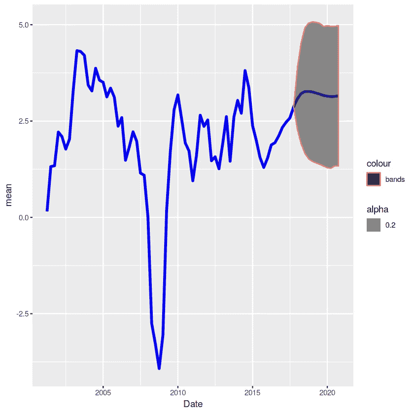

GDP Forecast

上面的代码计算了我们预测的 16 和 84 个百分点，用作可信区间。我们将这些列与我们的预测相结合，然后使用 ggplot 和 geom_ribbon 绘制数据子集，以绘制预测的间隔。上面的情节看起来相当不错，但我想让这个更漂亮一点。

我发现了一个非常有用的[博客](https://gjabel.wordpress.com/2013/04/24/bank-of-england-fan-charts-in-r/)帖子，它创建了与英国央行通胀报告非常相似的粉丝图表。我使用的库叫做**扇形图**，它可以让你绘制出我们预测分布的不同百分位数，看起来比上一张图好一点。

```
library(fanplot)
forecasts_mean <- as.matrix(colMeans(out2))
forecast_sd <- as.matrix(apply(out2,2,sd))
tt <- seq(2018.25, 2021, by = .25)
y0 <- 2018.25
params <- cbind(tt, forecasts_mean[-c(1,2)], forecast_sd[-c(1,2)])
p <- seq(0.10, 0.90, 0.05)**# Calculate Percentiles**
k = nrow(params)
gdp <- matrix(NA, nrow = length(p), ncol = k)
for (i in 1:k) 
    gdp[, i] <- qsplitnorm(p, mode = params[i,2], 
                           sd = params[i,3])**# Plot past data**
Y_ts <- ts(data_subset$mean, frequency=4, start=c(2001,1))
plot(Y_ts, type = "l", col = "tomato", lwd = 2.5, 
     xlim = c(y0 - 17, y0 + 3), ylim = c(-4, 6), 
     xaxt = "n", yaxt = "n", ylab="")**# background and fanchart**
rect(y0-0.25, par("usr")[3] - 1, y0 + 3, par("usr")[4], 
     border = "gray90", col = "gray90")
fan(data = gdp, data.type = "values", probs = p, 
    start = y0, frequency = 4, 
    anchor = Y_ts[time(Y_ts) == y0-.25], 
    fan.col = colorRampPalette(c("tomato", "gray90")), 
    ln = NULL, rlab = NULL)**# BOE aesthetics**
axis(2, at = -2:5, las = 2, tcl = 0.5, labels = FALSE)
axis(4, at = -2:5, las = 2, tcl = 0.5)
axis(1, at = 2000:2021, tcl = 0.5)
axis(1, at = seq(2000, 2021, 0.25), labels = FALSE, tcl = 0.2)
abline(h = 0)
abline(v = y0 + 1.75, lty = 2) #2 year line
```

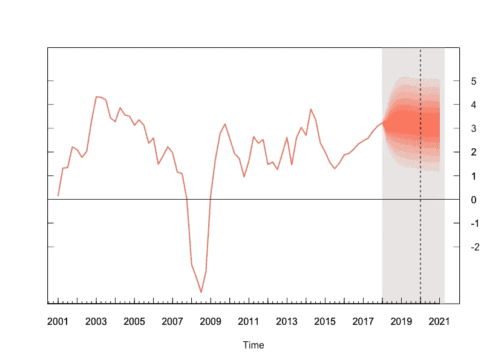

GDP Forecasts

# 结论

我们的预测似乎相当乐观，平均预测到 2021 年，年增长率在 3%左右。似乎还有相当大的上行风险，95%的可信区间将升至近 5%。图表显示，在这段时间内出现负增长的可能性极小，这很有意思，从美国目前的扩张性经济政策来看，这可能是正确的。正如你所看到的，置信区间相当大，表明在预测期内 GDP 增长值的分布范围很广。我们可以使用许多其他类型的模型来代替，并可能获得更准确的预测，如贝叶斯 VAR 或使用许多其他经济变量的动态因素模型。虽然可能更准确，但这些模型更复杂，也更难编码。为了介绍贝叶斯回归并获得对这种方法的直观理解，AR 模型是完全合理的。

我认为重要的是要说明为什么我选择从头开始做这种模型，而做这种类型的预测显然有更容易和更少痛苦的方法。我倾向于发现，对我来说，学习像这样复杂的东西的绝对最好的方法是尝试从头开始复制算法。这确实强化了我在理论上所学到的东西，并迫使我将它应用到实际环境中，如果我没有完全理解这个主题，这可能会非常困难。我还发现，这种方法让事情在我脑海中停留的时间更长。实际上，我可能不会使用这段代码，因为它很容易出错，而且很难调试(正如我已经发现的那样)，但我认为这是一种非常有效的学习方法。虽然这显然比仅仅找到一个 R 或 Python 的包要花更多的时间，但花时间一步一步地完成它的好处最终会更大，我会向任何试图学习或理解不同模型和算法如何工作的人推荐它。

好了，伙计们，这篇文章到此结束。我希望你们都喜欢它，并了解了一些贝叶斯统计以及我们如何在实践中使用它。如果您有任何问题，欢迎在下面发帖或通过 LinkedIn 与我联系。

下面的课程很好地概述了机器学习中使用的贝叶斯方法，我推荐给任何想提高这方面知识的人。

*推荐课程:* [*贝叶斯机器学习方法*](https://click.linksynergy.com/link?id=z2stMJEP3T4&offerid=759505.11503135374&type=2&murl=https%3A%2F%2Fwww.coursera.org%2Flearn%2Fbayesian-methods-in-machine-learning)

链接到 Kaggle 内核:[https://www.kaggle.com/dfoly1/bayesian-regression-blog-post](https://www.kaggle.com/dfoly1/bayesian-regression-blog-post)

*注意:这篇文章中的一些链接是附属链接。*