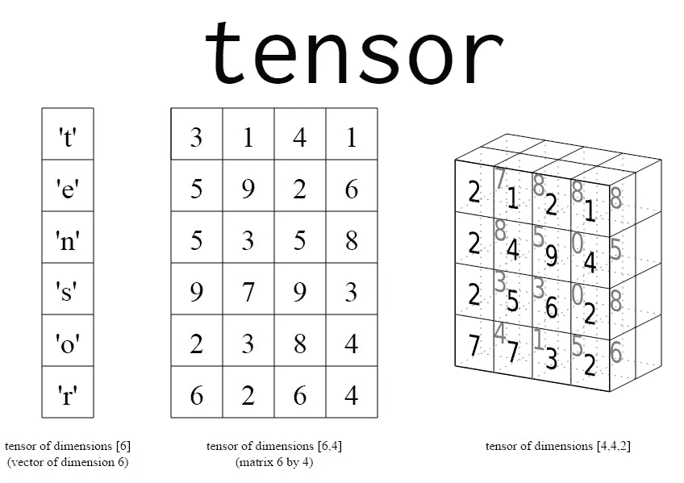
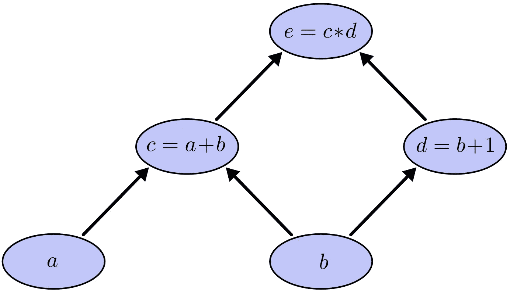
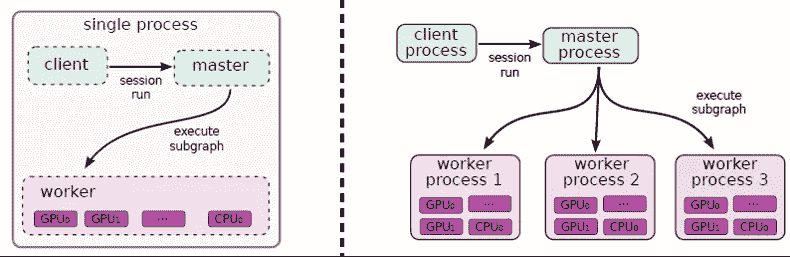
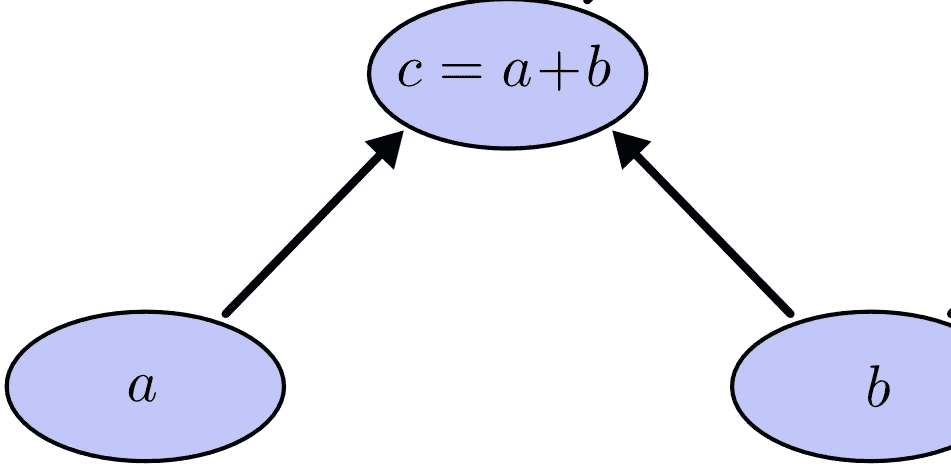
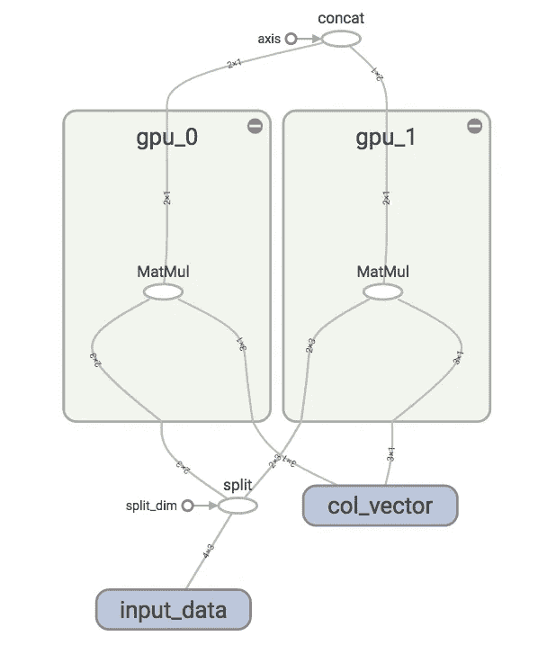
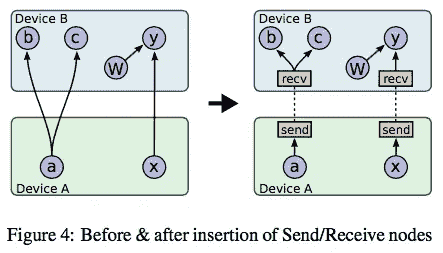

# 张量流入门(第 1 部分)

> 原文：<https://towardsdatascience.com/a-beginner-introduction-to-tensorflow-part-1-6d139e038278?source=collection_archive---------0----------------------->

Tensorflow 是广泛用于实现机器学习和其他涉及大量数学运算的算法的库之一。Tensorflow 由 Google 开发，是 GitHub 上最受欢迎的机器学习库之一。Google 使用 Tensorflow 在几乎所有应用程序中实现机器学习。例如，如果你正在使用谷歌照片或谷歌语音搜索，那么你正在间接使用张量流模型，它们在谷歌硬件的大型集群上工作，在感知任务中非常强大。

这篇文章的主要目的是向初学者友好地介绍 TensorFlow，我假设你已经了解一点 python。TensorFlow 的核心组件是计算图和通过边在所有节点间遍历的张量。下面我们就来简单介绍一下其中的每一个。

## 张量:

数学上，张量是一个 N 维向量，这意味着张量可以用来表示 N 维数据集。上图很难理解。我们将看看它的简化版本

上图显示了一些具有最小维数的简化张量。随着维度的不断增加，数据表示变得越来越复杂。例如，如果我们取一个(3x3)形式的张量，那么我可以简单地称它为 3 行 3 列的矩阵。如果我选择另一个形式的张量(1000x3x3)，我可以称它为一个向量或 1000 个 3x3 矩阵的集合。这里我们称(1000x3x3)为结果张量的形状或维度。张量可以是常数，也可以是变量。

## 计算图表(流程):

现在我们理解了张量的真正含义，是时候理解流动了。这个流程指的是计算图或简单的图，图不可能是循环的，图中的每个节点代表一个操作，如加、减等。并且每个操作导致新张量的形成。

上图显示了一个简单的计算图表。计算图形具有以下属性:

上图的表达式:

## e = (a+b)x(b+1)

*   叶顶点或开始顶点总是张量。也就是说，一个操作永远不会出现在图的开始，因此我们可以推断图中的每个操作应该接受一个张量并产生一个新的张量。同样，张量不能作为非叶节点出现，这意味着它们应该始终作为操作/节点的输入。
*   计算图总是以层次顺序表示复杂的操作。上述表达式可以用分层的方式组织，将 a+b 表示为 c，b+1 表示为 d。因此，我们可以将 e 写成:

**e = (c)x(d)其中 c = a+b，d = b+1。**

*   以相反的顺序遍历图导致子表达式的形成，这些子表达式被组合以形成最终表达式。
*   当我们向前遍历时，我们遇到的顶点总是成为下一个顶点的依赖，例如没有 a 和 b 就不能得到 c，同样地，没有 c 和 d 的解就不能得到 e。
*   **同级节点中的操作相互独立。**这是计算图的重要性质之一，当我们以图中所示的方式构造一个图时，很自然地，同一层中的节点(例如 c 和 d)是相互独立的，这意味着在计算 d 之前不需要知道 c，因此它们可以并行执行。

## 计算图形中的并行性；

上面提到的最后一个属性当然是最重要的属性之一，它清楚地表明同一级别的节点是独立的，这意味着在 c 求值之前没有必要闲置，当 c 仍在求值时，您可以并行计算 d。Tensorflow 很好地利用了这一特性。

## 分布式执行:

Tensorflow 允许用户利用并行计算设备更快地执行操作。计算的节点或操作被自动调度用于并行计算。这一切都发生在内部，例如在上面的图中，操作 c 可以在 CPU 上调度，而操作 d 可以在 GPU 上调度。下图显示了分布式执行的两种前景:

第一种是单系统分布式执行，其中单个 Tensorflow 会话(将在后面解释)创建单个工作进程，该工作进程负责在各种设备上调度任务；第二种情况下，有多个工作进程，它们可以在同一台机器上或不同的机器上，每个工作进程在其自己的上下文中运行，在上图中，工作进程 1 在单独的机器上运行，并在所有可用的设备上调度操作。

## 计算子图:

子图是主图的一部分，本质上是计算图。例如，在上图中，我们可以获得许多子图，其中一个如下所示

上图是主图的一部分，从性质 2 我们可以说一个子图总是代表一个子表达式，因为 c 是 e 的子表达式。子图也满足最后一个性质。同一层的子图也是相互独立的，可以并行执行。因此，可以在单个设备上调度整个子图。

上图解释了子图的并行执行。这里有两个矩阵乘法运算，因为它们都在同一级，它们相互独立，这适用于最后一个属性。这些节点被调度在不同的设备 gpu_0 和 gpu_1 上，这是因为它们具有独立性。

## 工人之间交换数据:

现在我们知道 Tensorflow 将其所有操作分布在由工人管理的不同设备上。更常见的是，在工作者之间交换张量形式的数据，例如在 e =(c)*(d)的图中，一旦计算出 c，就希望将其进一步传递给过程 e，因此张量从节点向上流到节点。这种移动如图所示:

这里，来自设备 A 的张量被传递到设备 b，这导致了分布式系统中的一些性能延迟。延迟取决于一个重要的性质，即张量的大小。设备 B 处于理想模式，直到它从设备 a 接收到输入。

## 压缩需求:

很明显，在计算图形中，张量在节点之间流动。在流到达可以处理它的节点之前，减少由流引起的延迟是很重要的。减小尺寸的一个这样的想法是通过使用有损压缩。

张量的数据类型起着重要作用，让我们来理解为什么，很明显，我们在机器学习操作中追求更高的精度，例如，如果我们使用 float32 作为张量的数据类型，那么每个值都使用 32 位浮点数表示，因此每个值占用 32 位的大小，这同样适用于 64 位。假设一个形状为(1000，440，440，3)的张量，可以包含在该张量中的值的数量将是 1000*440*440*3。如果数据类型是 32 位，那么它是这个大数字的 32 倍，它在内存中占据了相当大的空间，因此造成了流的延迟。可以使用压缩技术来减小大小。

## 有损压缩:

有损压缩处理压缩数据的大小，并不关心它的值，这意味着它的值可能会在压缩过程中损坏或不准确。但是，如果我们有一个 32 位浮点数，如 1.01010e-12，那么最低有效位的重要性就会降低。更改或删除这些值不会对我们的计算产生太大影响。因此，Tensorflow 通过忽略所有可忽略的数字，自动将 32 位浮点数转换为 16 位表示，这将大小减少近一半，如果是 64 位数字，压缩到 16 位将导致大小减少近 75%。因此张量占据的空间可以最小化。

一旦张量到达节点，16 位表示就可以通过添加 0 恢复到原始形式。因此，32 或 64 位表示在到达节点进行处理后被买回。

张量流介绍的第 1 部分到此结束，编程和构造简单的子图将在下一部分解释。

谢谢☺