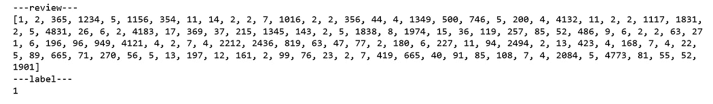
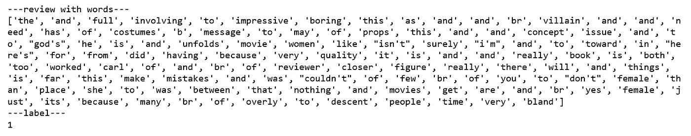
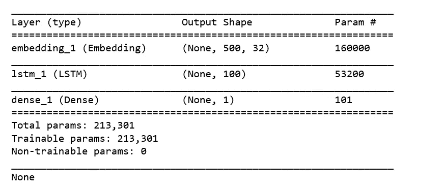
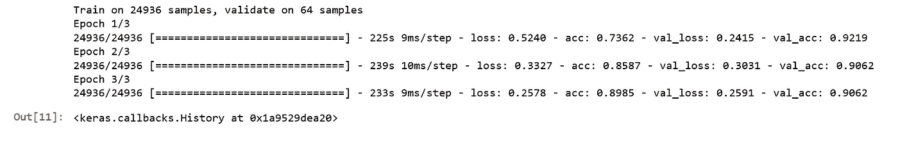

# RNN 情感分析初学者指南

> 原文：<https://towardsdatascience.com/a-beginners-guide-on-sentiment-analysis-with-rnn-9e100627c02e?source=collection_archive---------4----------------------->


Photo Credit: Unsplash

[情感分析](https://en.wikipedia.org/wiki/Sentiment_analysis)大概是[自然语言处理](https://en.wikipedia.org/wiki/Natural-language_processing)中最常见的应用之一。客户服务工具情绪分析变得有多重要，我就不用强调了。所以在这里，我们将使用[递归神经网络](https://en.wikipedia.org/wiki/Recurrent_neural_network)在 [IMDB 数据集](http://ai.stanford.edu/~amaas/data/sentiment/)中训练一个分类器电影评论。如果你想深入深度学习进行情感分析，这是一篇很好的[论文](https://arxiv.org/ftp/arxiv/papers/1801/1801.07883.pdf)。

# 数据

我们将使用递归神经网络，特别是[lstm](https://en.wikipedia.org/wiki/Long_short-term_memory)，在 [Keras](https://keras.io/) 中执行情感分析。方便的是，Keras 有一个内置的 IMDb 电影评论数据集，我们可以使用。

```
from keras.datasets import imdb
```

设置训练和测试数据中的词汇大小和负载。

```
vocabulary_size = 5000(X_train, y_train), (X_test, y_test) = imdb.load_data(num_words = vocabulary_size)
print('Loaded dataset with {} training samples, {} test samples'.format(len(X_train), len(X_test)))
```

***加载了 25000 个训练样本的数据集，25000 个测试样本***

检查样本评论及其标签。

```
print('---review---')
print(X_train[6])
print('---label---')
print(y_train[6])
```



Figure 1

注意，评论被存储为一个整数序列。这些是预先分配给单个单词的单词 id，标签是一个整数(0 表示负，1 表示正)。

我们可以用`imdb.get_word_index()`返回的字典把复习映射回原来的单词。

```
word2id = imdb.get_word_index()
id2word = {i: word for word, i in word2id.items()}
print('---review with words---')
print([id2word.get(i, ' ') for i in X_train[6]])
print('---label---')
print(y_train[6])
```



Figure 2

最大评论长度和最小评论长度。

```
print('Maximum review length: {}'.format(
len(max((X_train + X_test), key=len))))
```

***最大评论长度:2697***

```
print('Minimum review length: {}'.format(
len(min((X_test + X_test), key=len))))
```

***最小审核长度:14***

# **焊盘序列**

为了将这些数据输入到我们的 RNN 中，所有输入文档必须具有相同的长度。我们将通过截断较长的评论并用空值(0)填充较短的评论，将最大评论长度限制为 max_words。我们可以使用 Keras 中的 pad_sequences()函数来实现这一点。现在，将 max_words 设置为 500。

```
from keras.preprocessing import sequencemax_words = 500
X_train = sequence.pad_sequences(X_train, maxlen=max_words)
X_test = sequence.pad_sequences(X_test, maxlen=max_words)
```

# **设计一个用于情感分析的 RNN 模型**

我们开始在下面的代码单元中构建我们的模型架构。我们从 Keras 中导入了一些你可能需要的层，但是你可以随意使用任何你喜欢的层/转换。

记住我们的输入是最大长度= max_words 的单词序列(技术上是整数单词 id)，我们的输出是二元情感标签(0 或 1)。

```
from keras import Sequential
from keras.layers import Embedding, LSTM, Dense, Dropoutembedding_size=32
model=Sequential()
model.add(Embedding(vocabulary_size, embedding_size, input_length=max_words))
model.add(LSTM(100))
model.add(Dense(1, activation='sigmoid'))print(model.summary())
```



Figure 3

总之，我们的模型是一个简单的 RNN 模型，具有 1 个嵌入层、1 个 LSTM 层和 1 个致密层。总共需要训练 213，301 个参数。

# **训练和评估我们的模型**

我们首先需要通过指定我们在训练时想要使用的损失函数和优化器，以及我们想要测量的任何评估指标来编译我们的模型。指定适当的参数，包括至少一个度量“准确性”。

```
model.compile(loss='binary_crossentropy', 
             optimizer='adam', 
             metrics=['accuracy'])
```

一旦编译完成，我们就可以开始培训过程了。我们必须指定两个重要的训练参数——批量大小和训练时期的数量，它们与我们的模型架构一起决定了总的训练时间。

训练可能需要一段时间，所以喝杯咖啡，或者去跑步更好！

```
batch_size = 64
num_epochs = 3X_valid, y_valid = X_train[:batch_size], y_train[:batch_size]
X_train2, y_train2 = X_train[batch_size:], y_train[batch_size:]model.fit(X_train2, y_train2, validation_data=(X_valid, y_valid), batch_size=batch_size, epochs=num_epochs)
```



Figure 4

一旦我们训练了我们的模型，就该看看它在看不见的测试数据上表现如何了。

如果我们通过度量=['accuracy']，scores[1]将对应于准确性

```
scores = model.evaluate(X_test, y_test, verbose=0)
print('Test accuracy:', scores[1])
```

***测试精度:0.86964***

# 摘要

有几种方法可以用来建立我们的模型。我们可以通过试验不同的架构、层和参数来继续尝试和提高我们模型的准确性。如果不花太多时间训练，我们能有多好？我们如何防止过度拟合？

源代码可以在 [Github](https://github.com/susanli2016/NLP-with-Python/blob/master/Sentiment%20Analysis%20with%20RNN.ipynb) 找到。期待听到反馈或问题。

参考: [Udacity — NLP](https://www.udacity.com/course/natural-language-processing-nanodegree--nd892)