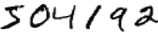
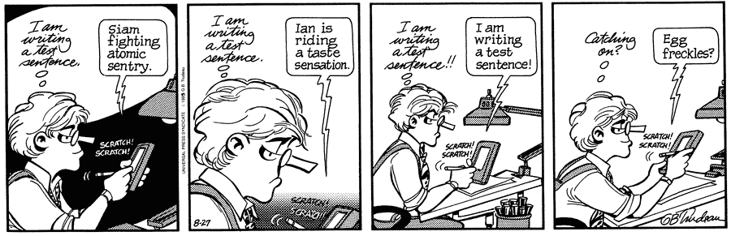
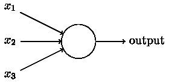
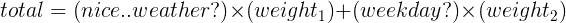
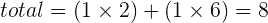
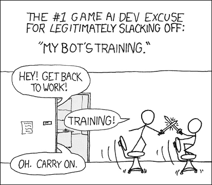

# 神经网络初学者指南:第一部分

> 原文：<https://towardsdatascience.com/a-beginners-guide-to-neural-networks-b6be0d442fa4?source=collection_archive---------1----------------------->

## 神经网络背后的动机，以及最基本的网络背后的架构:感知器。

人类是难以置信的模式识别机器。我们的大脑处理来自世界的“输入”,对它们进行分类(那是一只蜘蛛；那是冰淇淋)，然后生成一个‘输出’(逃离蜘蛛；品尝冰淇淋)。我们自动地、快速地做到这一点，不费吹灰之力。这和*感觉到*有人在生我们的气，或者在我们加速经过时不由自主地读出停车标志是同一个系统。心理学家将这种思维模式称为“系统 1”(由 Keith Stanovich 和 Richard West 创造)，它包括我们与其他动物共有的先天技能，如感知和恐惧。(还有一个“系统 2”，如果你想了解更多这方面的内容，可以看看丹尼尔·卡内曼的 [*思考，快与慢*](https://www.amazon.com/Thinking-Fast-Slow-Daniel-Kahneman/dp/0374533555))。

那么这和神经网络有什么关系呢？我马上就到。

你毫不费力地认出了上面的数字，对吗？你刚刚*知道*第一个数字是 5；你不必真的去想它。当然，你的大脑不会说，“啊，那看起来像两条正交的线连接着一个旋转的，没有根据的半圆，所以那是一个 5。”设计识别手写数字的规则是不必要的复杂，这就是为什么历史上计算机程序很难识别它们。

Oh, Apple Newton. (Source: Gary Trudeau for Doonesbury)

神经网络粗略地模拟了我们大脑解决问题的方式:接受输入，处理它们并生成输出。像我们一样，他们*学习*识别模式，但他们是通过*在标记数据集上训练*来做到这一点的。在我们进入学习部分之前，让我们看看最基本的人工神经元:感知机，以及它如何处理输入和产生输出。

# 感知器

感知器是由科学家弗兰克·罗森布拉特在 20 世纪 50-60 年代开发的，他受到了沃伦·麦卡洛克和沃尔特·皮茨早期工作的启发。虽然今天我们使用人工神经元的其他模型，但它们遵循感知机设定的一般原则。

那它们到底是什么？感知器接受几个二进制输入: *x1，x2，…，*并产生一个二进制输出:

Perceptron with 3 inputs. (Source: [Michael Nielsen](http://neuralnetworksanddeeplearning.com/chap1.html))

让我们用一个例子来更好地理解这一点。假设你骑自行车去上班。你有两个因素来做出你去上班的决定:天气一定不能坏，而且一定是工作日。天气没什么大不了的，但是周末工作是一个大禁忌。输入必须是二进制的，所以让我们把条件提议为是或否的问题。天气很好？1 代表是，0 代表否。今天是工作日吗？1 是，0 否。

记住，我不能告诉神经网络这些条件；它必须自己去学习。它如何知道哪些信息对决策最重要？它与叫做**的权重**有关。记得我说过天气没什么大不了的，但周末才是？权重只是这些偏好的数字表示。较高的权重意味着神经网络认为该输入比其他输入更重要。

对于我们的示例，让我们特意为天气设置合适的权重 2，为工作日设置合适的权重 6。现在我们如何计算产量？我们简单地将输入与其各自的权重相乘，并对所有输入的所有值求和。例如，如果是一个晴朗的工作日，我们将进行如下计算:

这种计算被称为**线性组合**。8 是什么意思？我们首先需要定义**阈值。**如果线性组合的值大于阈值，则确定神经网络的输出，0 或 1(呆在家里或去工作)。假设阈值是 5，这意味着如果计算得出的数字小于 5，你可以呆在家里，但如果它等于或大于 5，那么你就得去工作。

您已经看到了重量是如何影响产量的。在本例中，我将权重设置为特定的数字，以使示例正常工作，但实际上，我们将权重设置为随机值，然后网络根据使用之前的权重产生的输出误差来调整这些权重。这叫做**训练**神经网络。

(Source: Panagiotis Peikidis. Based on [XKCD comic ‘Compiling’](https://xkcd.com/303/))

回到手写数字识别问题，一个简单的单节点网络(如上图所示)无法做出如此复杂的决定。为了实现这一点，我们需要更复杂的网络，有更多的节点和*隐藏层*，使用诸如 *sigmoid 激活函数*之类的技术来做出决策，并使用*反向传播*来学习。第二部中的一切！

## 接下来:

 [## 神经网络初学者指南:第二部分

### #2.偏置、激活函数、隐藏层以及构建更高级的前馈神经网络架构。

medium.com](https://medium.com/@nehaludyavar/a-beginners-guide-to-neural-networks-part-two-bd503514c71a) 

## 资源

1.  [*利用神经网络识别手写数字*](http://neuralnetworksanddeeplearning.com/chap1.html) 迈克尔尼尔森(Michael Nielsen)著(同级更详细解释)。
2.  [*深度学习书籍*](http://www.deeplearningbook.org/) 作者伊恩·古德菲勒、约舒阿·本吉奥和亚伦·库维尔(更高级的&技术，假设本科水平的数学知识)。
3.  [*Udacity 深度学习纳米学位基础*](https://www.udacity.com/course/deep-learning-nanodegree-foundation--nd101) (17 周项目化课程；难度在 1 的中间。第二。)
4.  [*TensorFlow 神经网络游乐场*](http://playground.tensorflow.org) (有趣、互动的可视化神经网络在行动)