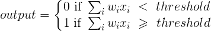
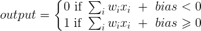
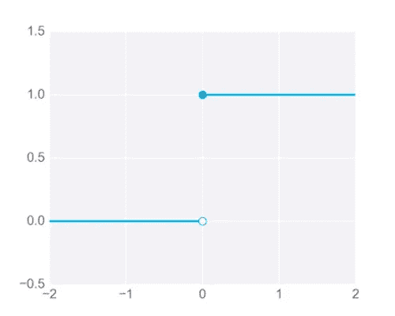
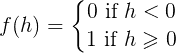
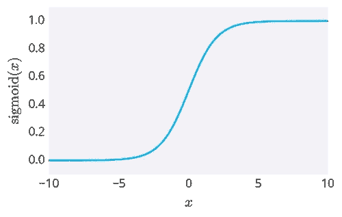
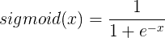
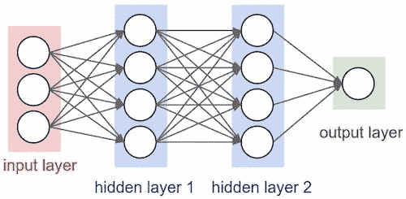

# 神经网络初学者指南:第二部分

> 原文：<https://towardsdatascience.com/a-beginners-guide-to-neural-networks-part-two-bd503514c71a?source=collection_archive---------0----------------------->

## 偏置、激活函数、隐藏层以及构建更高级的前馈神经网络架构。

在 [第一部分，](https://medium.com/luminous-ai/a-beginners-guide-to-neural-networks-b6be0d442fa4#.24wy4o50n)我解释了感知器如何接受输入，应用线性组合，如果线性组合大于或小于某个阈值，则分别产生 1 或 0 的输出。在数学语言中，它看起来像这样:

在上面的公式中，希腊字母适马∑用于表示**求和**，下标 *i* 用于迭代输入( *x)* 和权重( *w)* 配对。

为了让后面的*训练*简单一点，我们对上面的公式做一个小的调整。让我们将*阈值*移动到[不等式](https://www.mathsisfun.com/algebra/inequality.html)的另一边，并用神经元的*偏差来代替它。*现在我们可以将等式改写为:

有效，*偏差= —阈值。*你可以把*偏置*想象成让神经元输出 1 有多容易——如果偏置非常大，神经元输出 1 就很容易，但如果偏置非常负，那就很难了。

[Source: SMBC Comics](http://smbc-comics.com/index.php?id=4105)

在定义中做这个小改动有几个原因(稍后还会有一些改动；很高兴看到做出这些改变背后的直觉)。正如我在第一部分中提到的，我们随机分配权重数字(我们事先不知道正确的数字)，随着神经网络*训练*，它对这些权重进行增量更改，以产生更准确的输出。类似地，我们不知道正确的*阈值*，并且像权重一样，网络将需要改变阈值以产生更精确的输出。现在有了*偏差*，我们只需要对等式的左边进行修改，而右边可以保持不变为零，很快，你就会明白为什么这是有用的。

为输出神经元的决策转换值或陈述条件的函数被称为**激活函数**。上面的数学公式只是深度学习中使用的几个激活函数之一(也是最简单的)，它被称为 **Heaviside 阶跃函数。**

General formula (*h* being the condition) and graph of the Heaviside step function. The solid circle is the y-value you take (1.0 for x=0 in this case) , not the hollow circle. The line the hollow and solid circles are on is the ‘step’. (Source: Udacity)

其他激活功能包括 *sigmoid* 、 *tanh* 和 *softmax* 功能，它们各有其用途。(在这篇文章中，我将只解释 sigmoid 函数，但我会在其他函数出现时进行解释)。

## Sigmoid 函数

即使在处理绝对数(1 和 0；yes 和 nos)，让输出给出一个中间值是有益的。这有点像在被问到一个你不知道的是或否的问题时回答“也许”，而不是猜测。这实质上是 sigmoid 函数优于 Heaviside 函数的地方。

The graph and formula of the sigmoid function. Source: Udacity

像亥维赛阶梯函数一样，sigmoid 的值在 0 和 1 之间。但是这一次，没有*步*；它已经被平滑，以创建一个*连续*线。因此，输出可以被认为是成功的*概率*(1)，或者是肯定的。在日常生活中，0.5 的输出意味着网络不知道它是肯定的还是否定的，而 0.8 的输出意味着网络“非常肯定”它是肯定的。

拥有这一特性对于网络的学习能力尤为重要，我们将在以后的文章中看到这一点。现在，只要把它想象成更容易*教会*一个网络逐步走向正确答案，而不是直接从 0 跳到 1(反之亦然)。

## 隐藏层

到目前为止，我们已经探索了感知器(最简单的神经网络模型)的架构，并看到了两个激活函数:Heaviside 阶跃函数和 sigmoid 函数。(要了解感知机如何用于计算逻辑功能，如 AND、OR 和 NAND，请查看迈克尔·尼尔森在线书籍中的[第 1 章)。](http://neuralnetworksanddeeplearning.com/chap1.html)

现在让我们使我们的网络稍微复杂一点。在这里，以及所有的神经网络图中，最左边的层是输入层(即你馈入的数据)，最右边的层是输出层(网络的预测/答案)。这两层之间的任意数量的层被称为**隐藏层**。层数越多，决策能得到的*细致入微*就越多。

(Source: [Stanford CS231n](http://cs231n.github.io/neural-networks-1/))

网络通常有不同的名称:*深度前馈网络、前馈神经网络、*或*多层感知器(MLP)。*(为了使事情不那么混乱，我将坚持使用前馈神经网络)。它们被称为*前馈*网络，因为信息在一个总的(正向)方向上流动，在每个阶段都应用了数学函数。事实上，它们之所以被称为“网络”*是因为这个功能链的*(第一层功能的输出是第二层的输入，第三层的输出也是第三层的输入，依此类推)。那条链的长度给出了模型的*深度*，这实际上就是深度学习中的术语“*deep”*的来源！

Not quite the same ‘hidden’. (Source: Bill Watterson)

添加隐藏层可以让神经网络做出更复杂的决定，但更多的是，以及神经网络如何通过第三部分(即将推出)中的*反向传播、*过程进行学习！

## 资源

1.  [*利用神经网络识别手写数字*](http://neuralnetworksanddeeplearning.com/chap1.html) 迈克尔尼尔森。
2.  [*神经网络第一部分:搭建架构*，](http://cs231n.github.io/neural-networks-1/)斯坦福 CS231n。
3.  [*深度学习书籍*](http://www.deeplearningbook.org/) 伊恩·古德菲勒、约舒阿·本吉奥和亚伦·库维尔。