# 绘制“五个三十八”可视化效果的初学者指南

> 原文：<https://towardsdatascience.com/a-beginners-guide-to-plotting-fivethrityeight-like-visualizations-5b63d3f3ddd0?source=collection_archive---------9----------------------->

## 在这里，我将向你展示我是如何从 FiveThirtyEight 的文章 [**中重现乔恩·斯图尔特在《每日秀》**](https://fivethirtyeight.com/features/every-guest-jon-stewart-ever-had-on-the-daily-show/) 中的每一位嘉宾的形象的。

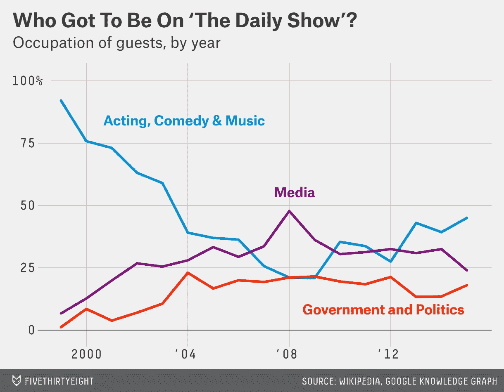

Source: FiveThirtyEight’s article “Who Got to Be On ‘The Daily Show’?”

您可能已经使用 Matplotlib 和 Seaborn 进行了可视化，但是您可能希望提高绘图的美观性。你可以在这里从 [FiveThirtyEight 的 Github](https://github.com/fivethirtyeight) 获得数据集的 csv 文件[。](https://raw.githubusercontent.com/fivethirtyeight/data/master/daily-show-guests/daily_show_guests.csv)

# **那么，让我们开始吧……**

首先，进入你喜欢的编码环境。我更喜欢使用 Jupyter 笔记本(以防你不知道它或者想要帮助下载它，[这里有一个我找到的教程](https://www.dataquest.io/blog/jupyter-notebook-tutorial/))。另外，另一个不错的选择是[谷歌合作实验室](https://colab.research.google.com/)。

一旦您的环境准备好了，加载适当的库，读取文件并显示前五行。

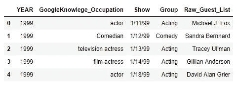

First five rows of dataset

现在让我们重命名“YEAR”和“Raw_Guest_List ”,以减少我们的输入，因为我们很快就会用到它们。

现在我们需要将“组”列中所有客人的职业浓缩为三类。这将有助于在图表中绘制我们的三条线。为此，我们定义了一个循环遍历“Group”列并创建一个新的“Occupations”列的函数。

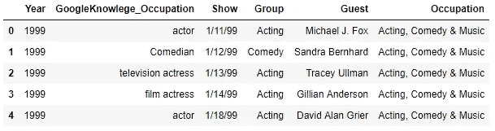

See added ‘Occupation’ column combining occupations into three categories

接下来，根据每年的职业创建一个客人百分比表。为此，我们将使用 Pandas 的[交叉表函数](http://pandas.pydata.org/pandas-docs/stable/reshaping.html#cross-tabulations)，这将帮助我们简化计算。

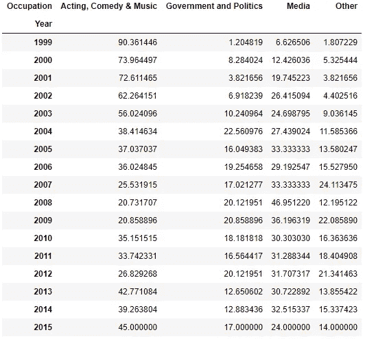

Table with percentage of guests by occupation each year

默认情况下，上面的交叉表函数会计算每年每个类别的客人数量。但是请注意包含的“正常化”参数*。这将调整我们的计算，给出一个比例。*此外，将 normalize 设置为*“index”会将此规范化应用于每一行，而不是每一列。然后我们可以乘以 100 ( **100* )把这些比例变成百分比。*

*接下来，如果我们想要清理我们的表，我们也可以删除“Other”列，它不会在我们的图中使用。*

*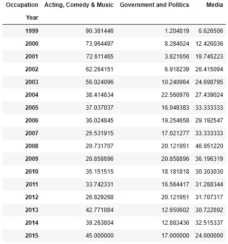*

*Same table without ‘Other’ column*

*为了方便绘图，我们将在表格中列出所有年份。*

# *是时候做我们一直以来真正想做的事情了！*

*这里有一个代码要点，它将为我们提供粗略的草稿。自定义线条颜色和线条粗细，以匹配文章中的图表…*

*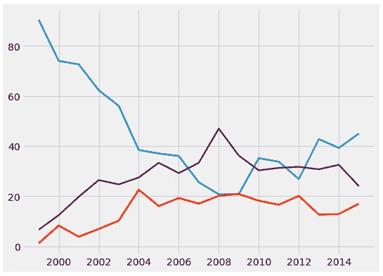*

*Here’s our initial plot*

*沿 y 轴增加网格线的长度，并在图的基线处添加一条水平线。*

*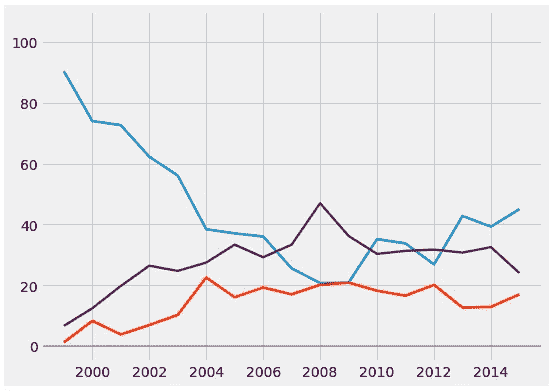*

*Grid line along y-axis increased and horizontal line at baseline added*

*调整显示的 x 和 y 标签，再次调整字体颜色和大小。*

*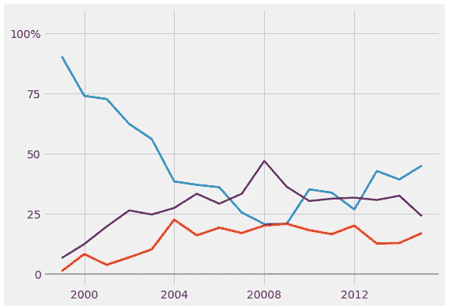*

*Reduced number of grid lines and changed x & y axis labels*

*设置图形标题和副标题(*不使用传统的 plt.title()* ，因为它限制了文本放置)。请注意，下面的 x 和 y 参数根据 x 和 y 坐标确定文本的位置。*

*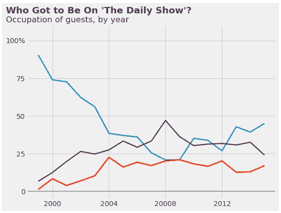*

*Title & subtitle aligned with ‘100%’ label on plot*

*使用自定义字体大小和颜色为绘图中的每一行添加文本标签。*

*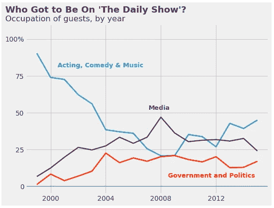*

*Adding labels here takes a lot of playing with x & y coordinates*

*我们的最后一点是，在我们图表的底部有一个自定义的签名框。这里你必须在文本中获得正确的间距(见*的*参数中的文本),以使其适合图表的宽度。*

*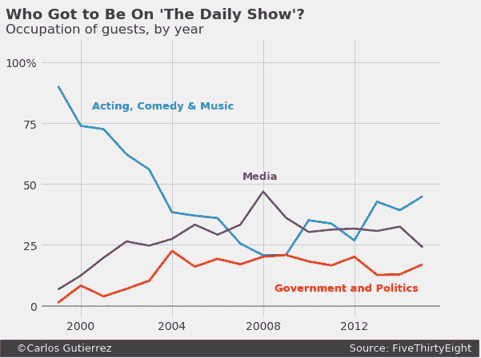*

*Voila!… Our finalized ‘FiveThirtyEight like’ visualization*

*就是这样。*

*自己制作出像这样好看又干净的知识性剧情，感觉不是很好吗？不得不承认我感觉很好:)*

*现在，您可以利用 FiveThirtyEight 提供的数据了。走吧。是时候让你看看一些有趣的文章，尝试自己去重现其他的情节了。*