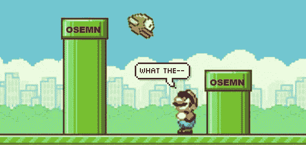
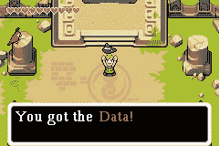
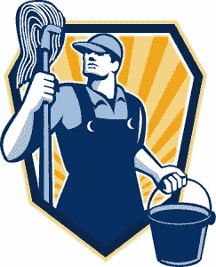
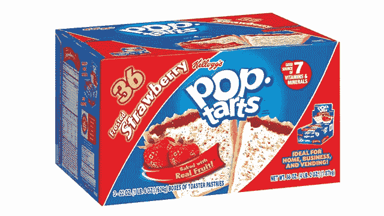
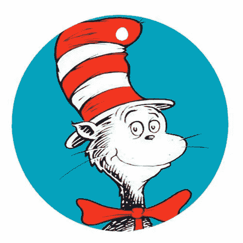
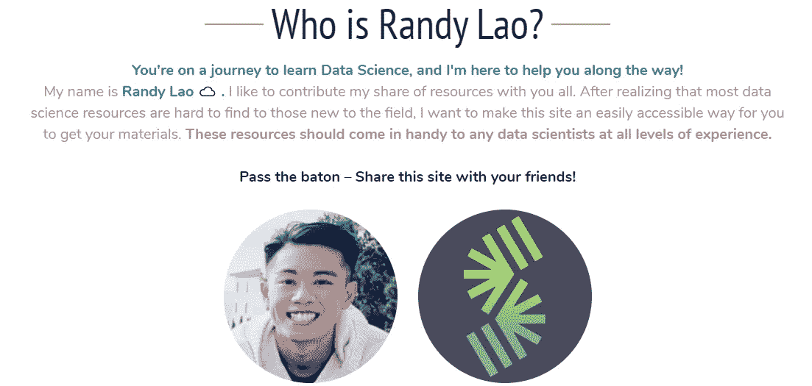

# 数据科学管道初学者指南

> 原文：<https://towardsdatascience.com/a-beginners-guide-to-the-data-science-pipeline-a4904b2d8ad3?source=collection_archive---------0----------------------->

> “信不信由你，你和数据没什么区别。设身处地为 Data 想想，你就会明白为什么了。”

从前有一个叫数据的男孩。在他的一生中，他总是试图理解他的目的是什么。我有什么价值观？ **我能对这个世界产生什么影响？** **数据从哪里来？**看到你和数据有什么相似之处吗？这些问题总是在他的脑海中，幸运的是，通过纯粹的运气，数据最终找到了解决方案，并经历了巨大的转变。

这一切都是从数据沿着行移动时开始的，当时他遇到了一个奇怪但有趣的管道。一端是一根有入口的管子，另一端是出口。管子上还标有五个不同的字母:“ **O.S.E.M.N.** ”。尽管他很好奇，但数据决定进入管道。长话短说… **进来的是数据，出来的是洞察力。**

**提醒:**本文将简要概述典型数据科学管道中的预期内容。从构建您的业务问题到创造可行的见解。不要担心，这很容易读懂！

# 数据科学是一门学问

你真棒。我很棒。数据科学是 **OSEMN** 。你可能会问，为什么数据科学“很棒”？嗯，作为一名有抱负的数据科学家，你有机会磨练你作为一名**巫师**和一名**侦探**的能力。我说的巫师是指拥有自动预测事物的能力！通过侦探，它有能力在你的数据中发现未知的模式和趋势！

理解数据科学管道如何工作的典型工作流程是理解业务和解决问题的关键一步。如果你对数据科学管道的工作方式感到害怕，那就不要再说了。这篇文章送给你！我从希拉里·梅森和克里斯·维金斯那里找到了一个非常简单的缩写词，你可以在你的数据科学管道中使用。那就是**o s e m n**

# OSEMN 管道

*   **O —** 获取我们的数据
*   **S** —擦洗/清理我们的数据
*   **E —** 探索/可视化我们的数据将使我们能够发现模式和趋势
*   **M —** 对我们的数据进行建模将赋予我们作为向导的预测能力
*   **N —** 解读我们的数据

# 商业问题

因此，在我们甚至开始 **OSEMN** 管道之前，我们必须考虑的最关键和最重要的一步是理解我们试图解决的**问题**。**我们再说一遍**。在我们开始用“数据科学”做任何事情之前，我们必须首先考虑我们试图解决什么问题。如果你有一个想要解决的小问题，那么你最多只能得到一个小的解决方案。如果你有一个*大*问题要解决，那么你就有一个*大*解决方案的可能性。

**扪心自问:**

*   我们如何将**数据**转化为**美元**？
*   我想用这些数据产生什么影响？
*   我们的模式带来了什么商业价值？
*   什么能为我们节省很多钱？
*   怎样做才能让我们的业务更有效率？

> “把钱给我看看！”

了解这一基本概念将带你走得更远，并引领你朝着成为一名“数据科学家”迈出更大的成功步伐(从我所相信的来看…抱歉我不是一名数据科学家！)但尽管如此，这仍然是你必须做的非常重要的一步！无论你的模型预测得有多好，无论你获得了多少数据，无论你的渠道有多广，你的解决方案或可操作的洞察力只会和你为自己设定的问题一样好。

> “好的数据科学更多的是关于你对数据提出的问题，而不是数据管理和分析。”——赖利·纽曼

# 获取您的数据

作为一名数据科学家，如果没有任何数据，你什么也做不了。作为一条经验法则，在获取数据时，有些事情你必须考虑。你必须**识别**你所有可用的数据集(可以来自互联网或外部/内部数据库)。你必须将数据提取成可用的格式。csv、json、xml 等..)

**所需技能**:

*   数据库管理:MySQL，PostgresSQL，MongoDB
*   **查询关系数据库**
*   **检索非结构化数据**:文本、视频、音频文件、文档
*   **分布式存储** : Hadoops，Apache Spark/Flink

# 擦除/清理您的数据

清理第五列！**管道的这个阶段应该需要最多的时间和精力。**因为你的机器学习模型的结果和输出只和你投入进去的东西一样好。基本上，垃圾进垃圾出。

**目标:**

*   **检查数据**:理解你正在处理的每一个特性，识别错误、丢失的值和损坏的记录
*   **清除数据:**丢弃、替换和/或填充缺失值/错误

**所需技能:**

*   **脚本语言** : Python，R，SAS
*   **数据角力工具** : Python 熊猫，R
*   **分布式处理** : Hadoop、Map Reduce / Spark

> “有准备的人已经成功了一半。”——米格尔·德·塞万提斯

# 探索(探索性数据分析)

现在，在探索阶段，我们试图**理解**我们的数据具有什么样的模式和价值。我们将使用不同类型的**可视化**和**统计测试**来支持我们的发现。在这里，我们将能够通过各种图表和分析得出数据背后隐藏的含义。出去探索吧！

> "停泊在港口的船只是安全的——但这不是建造船只的目的。"约翰·谢德。

**目标:**

*   通过可视化和图表在数据中寻找模式
*   通过使用统计数据识别和测试重要变量来提取特征

**所需技能:**

*   **Python** : Numpy，Matplotlib，Pandas，Scipy
*   **R** : GGplot2，Dplyr
*   **推断统计**
*   **实验设计**
*   **数据可视化**

**提示:**做分析时有你的*【蜘蛛感官】*刺痛。有意识地发现奇怪的模式或趋势。时刻关注有趣的发现！

**设计考虑**:大多数时候，人们会直接想到视觉上的“让我们完成它”。这都是关于最终用户谁将解释它。关注你的听众。

# 建模(机器学习)

现在有趣的部分来了。模型是统计学意义上的一般规则。把机器学习模型想象成你工具箱里的工具。你将有机会接触到许多算法，并用它们来完成不同的业务目标。您使用的功能越好，您的预测能力就越强。在清理你的数据并找到什么特征是最重要的之后，使用你的模型作为预测工具只会增强你的商业决策。

> 预测分析正在成为游戏规则的改变者。而不是回头分析“发生了什么？”预测分析帮助高管回答“下一步是什么？”以及“我们应该做些什么？”(《福布斯》杂志，2010 年 4 月 1 日)

**预测能力的例子**:沃尔玛的供应链就是一个很好的例子。沃尔玛能够预测他们将在飓风季节在他们的一个商店销售所有的**草莓馅饼**。通过数据挖掘，他们的历史数据显示，飓风发生前最受欢迎的商品是**果馅饼**。虽然听起来很疯狂，但这是一个真实的故事，并提出了不要低估预测分析能力的观点。

**目标:**

*   **深入分析:**创建预测模型/算法
*   **评估并细化模型**

**所需技能:**

*   **机器学习**:监督/非监督算法
*   **评估方法**
*   **机器学习库**:Python(Sci-kit Learn)/R(CARET)
*   **线性代数&多元微积分**

> “模型是嵌入在数学中的观点”——凯西·奥尼尔

# 解释(数据叙事)

故事时间到了！这个过程中最重要的一步是理解并学会如何通过交流来解释你的发现。讲故事是关键，不要小看它。这是关于和人们联系，说服他们，帮助他们。理解你的受众并与他们联系的艺术是数据故事最好的部分之一。

> “我相信讲故事的力量。故事打开了我们的心扉，打开了我们的思想，这往往会导致行动”——梅林达·盖茨

**情绪**在数据讲故事中起着很大的作用。人们不会神奇地理解你的发现。产生影响的最好方法是通过情感讲述你的故事。作为人类，我们自然会受到情绪的影响。如果你能挖掘你的观众的情绪，那么你，我的朋友，就在控制之中。当你展示数据时，请记住心理学的力量。理解你的受众并与他们联系的艺术是数据故事最好的部分之一。

**最佳实践:**我强烈建议，增强您的数据叙述能力的一个好实践是反复排练。如果你是父母，那对你来说是个好消息。不要在睡前给孩子读典型的**苏斯博士**的书，试着用你的数据分析结果哄他们入睡！因为如果一个孩子能理解你的解释，那么任何人都可以，尤其是你的老板！

> "如果你不能向一个六岁的孩子解释，那你自己也不明白。"——阿尔伯特·爱因斯坦

**目标**:

*   **识别业务洞察力**:回到业务问题
*   **相应地想象你的发现**:保持简单和优先驱动
*   **讲述一个清晰可行的故事**:有效地与非技术观众沟通

**所需技能:**

*   **商业领域知识**
*   **数据可视化工具** : Tablaeu，D3。JS，Matplotlib，GGplot，Seaborn
*   **沟通**:陈述/发言&汇报/写作

# 更新您的模型

别担心，你的故事不会就此结束。由于您的模型正在生产中，因此根据您接收新数据的频率，定期更新您的模型非常重要。您收到的数据越多，更新就越频繁。**假设你是** **亚马逊**，你为顾客推出了一个购买“鞋类特色”的新功能。您的旧型号没有此功能，现在您必须更新包括此功能的型号。如果不是这样，你的模型将会随着时间的推移而退化，表现不佳，让你的业务也退化。新功能的引入将通过不同的变化或可能与其他功能的相关性来改变模型性能。

# 结论

**综上所述，**

*   形成你的业务问题
*   获取你的数据

**获取**您的数据，**清理**您的数据，**用可视化方式探索**您的数据，**用不同的机器学习算法对**您的数据建模，**通过评估解释**您的数据，**更新**您的模型。

> 记住，我们和数据没什么不同。我们都有价值观、目标和存在于这个世界的理由。

事实上，你将面临的大多数问题都是工程问题。即使有一个伟大的机器学习大神的所有资源，大部分影响也会来自伟大的功能，而不是伟大的机器学习算法。所以，基本的方法是:

1.  确保您的管道端到端是稳固的
2.  从一个合理的目标开始
3.  直观地理解您的数据
4.  确保你的管道保持稳固

这种方法有望赚很多钱和/或让很多人长期快乐。

**所以……下次有人问你什么是数据科学的时候。告诉他们:**

> “数据科学是一门学问”

我希望你们今天学到了一些东西！如果你们对这篇文章有什么想补充的，请随时留言，不要犹豫！非常感谢任何形式的反馈。不要害怕分享这个！谢谢！

# 商务化人际关系网

在 LinkedIn 上联系我:[*https://www.linkedin.com/in/randylaosat*](https://www.linkedin.com/in/randylaosat)

# 想要更多免费资源？

访问我的网站: [ClaoudML](http://www.claoudml.com) 。com