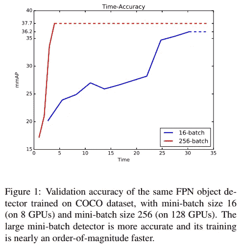
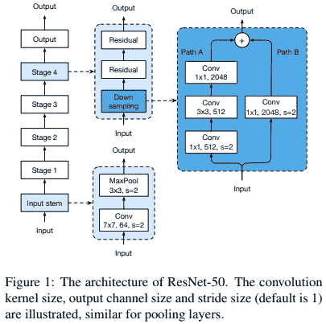
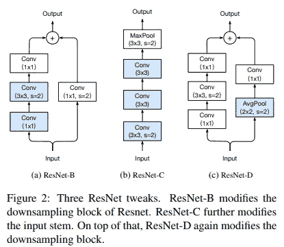
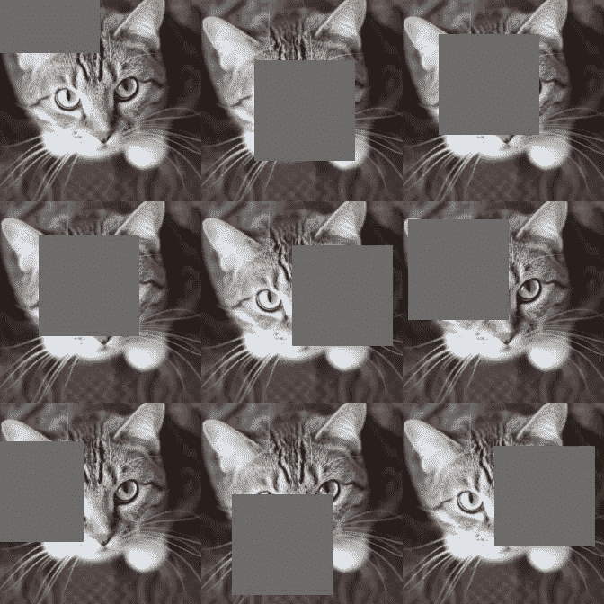

# 图像分类的锦囊妙计

> 原文：<https://towardsdatascience.com/a-big-of-tricks-for-image-classification-fec41eb28e01?source=collection_archive---------8----------------------->

## 来拿你的深度学习好东西吧

> 想获得灵感？快来加入我的 [**超级行情快讯**](https://www.superquotes.co/?utm_source=mediumtech&utm_medium=web&utm_campaign=sharing) 。😎

你上次在深度学习中看到理论 *100%* 匹配实践是什么时候？这很少发生！研究论文说了一件事，但现实世界中的结果往往大相径庭。

这不完全是这项研究的错。科学研究的很大一部分是实验——基于这些特定的环境，通过这个数据集，我们得到了这些结果。一旦你真正尝试并应用这些模型，处理嘈杂和无序数据的挑战就出现了。该理论并不总是与现实世界中实际发生的事情一致，但它确实提供了一个不错的基线。

那么造成这种理论与实践差距的原因是什么呢？它不完全来自新的数据！这种差异很大程度上来自深度学习专家用来给他们的模型提供额外推动的“技巧”。这些是隐藏的交易技巧，你只能通过大量的模型实验，或者只是从有经验的人那里学习。[亚马逊研究小组最近的研究](https://arxiv.org/pdf/1812.01187v2.pdf)对此进行了量化，表明这些技巧可以让你在相同的模型上获得高达 **4%的准确性提升**。

在这篇文章中，你将了解这项研究，以及专家们用来给他们的深度学习模型提供额外推动的最重要的诀窍。我会给你一些实用的观点，旨在实际应用这些技巧。

# (1)大批量

理论上，更大的小批量应该有助于网络收敛到更好的最小值，从而获得更好的最终精度。人们通常会因为 GPU 内存而陷入困境，因为人们可以购买的最大消费级 GPU 在云上只能达到 12GB(对于 Titan X)和 16GB(对于 V100)。有两种方法可以解决这个问题:

**(1)** **分布式训练:**将你的训练拆分到多个 GPU 上。在每个训练步骤中，您的批次将在可用的 GPU 之间进行拆分。例如，如果您的批处理大小为 8 和 8 个 GPU，那么每个 GPU 将处理一个图像。然后你将在最后合并所有的渐变和输出。您确实会受到 GPU 之间数据传输的小影响，但仍然可以从并行处理中获得很大的速度提升。许多深度学习库中都支持这一功能，包括 [Keras](https://www.pyimagesearch.com/2017/10/30/how-to-multi-gpu-training-with-keras-python-and-deep-learning/) 。

**(2)在训练期间改变批次和图像大小:**许多研究论文能够报告使用如此大的批次大小的部分原因是许多标准研究数据集具有不是很大的图像。例如，当在 ImageNet 上训练网络时，大多数最先进的网络使用 200 到 350 之间的作物；当然，他们可以有这么小的图像尺寸大批量！在实践中，由于目前的相机技术，大多数时候我们都在处理 1080p 的图像，或者至少不会太远。

为了避开这个小障碍，您可以从较小的图像和较大的批量开始训练。通过对训练图像进行缩减采样来实现这一点。然后你就可以把更多的放入一批中。有了大批量+小图片，你应该已经能够得到一些不错的结果。要完成网络的训练，请使用较小的学习速率和较小批量的大图像进行微调。这将使网络重新适应更高的分辨率，并且较低的学习速率防止网络从从大批量中找到的好的最小值跳开。因此，您的网络能够从大批量训练中获得良好的最小值，并通过微调在高分辨率图像上工作良好。

The effects of large mini-batch training on object detectors, from the [MegDet paper](https://arxiv.org/pdf/1711.07240.pdf)

# (2)迷你模型调整

研究论文并不总是告诉你完整的故事。作者通常会在论文中链接到他们的官方代码，这可能是比论文本身更好的学习算法的资源！当您阅读代码时，您可能会发现他们忽略了几个小的模型细节，而这些细节实际上造成了很大的准确性差异。

我鼓励大家看看研究论文的官方代码，这样你就可以看到研究人员用来获得他们的结果的确切代码。这样做还会给你一个很好的模板，这样你就可以很快做出自己的小调整和修改，看看它们是否能改进模型。探索模型的一些公共重新实现也是有帮助的，因为这些可能有其他人已经试验过的代码，最终改进了原始模型。查看下面的 ResNet 架构和在一些公共代码中发现的 3 处改动。它们看起来很小，但每一个都在运行时间几乎没有变化的情况下提供了不可忽略的精度提升；ResNet-D 在 Top-1 精度方面提升了整整 1%。

The original ResNet-50 architecture; from the [Bag of Tricks paper](https://arxiv.org/pdf/1812.01187.pdf)

Altered and improved versions of the ResNet-50 architecture; from the [Bag of Tricks paper](https://arxiv.org/pdf/1812.01187.pdf)

# (3)精细化训练方法

如何训练一个深度网络通常根据手边的应用和实际设置训练的研究团队而变化！知道如何正确训练你的网络可以让你的准确率提高 3-4 %!这是一种从深层网络知识和简单的实践中获得的技能。不幸的是，大多数人不太重视培训，并期望网络能神奇地给他们带来巨大的成果！

尽量注意最新研究中使用的具体训练策略。你会经常看到，他们中的大多数人不会使用 Adam 或 RMSProp 这样的自适应方法来默认单一的学习速率。他们使用诸如热身训练、速率衰减和优化方法的组合来获得他们可能挤出的最高精确度。

这是我个人最喜欢的。

亚当优化器超级容易使用，并且倾向于自己设定一个好的学习速度。另一方面，SGD 通常比 Adam 高出 1-2 %,但是很难调整。所以，从亚当开始:只要设定一个不太高的学习率，通常默认为 0.0001，你通常会得到一些非常好的结果。然后，一旦你的模型开始被 Adam 饱和，以较小的学习速率微调 SGD，以获得最后一点精度！

# (4)迁移学习

除非你正在做前沿研究，并试图打破基本的艺术状态，迁移学习应该是默认的实践方法。根据新数据从头开始训练网络具有挑战性，非常耗时，有时需要一些额外的领域专业知识才能真正做到正确。

迁移学习提供了一种既能加快训练速度又能提高准确性的简单方法。有大量的研究和实践证据表明，迁移学习使模型更容易训练，并且比从头开始训练更准确。这将完全简化事情，让你更容易得到一些像样的基线结果。

一般来说，精确度更高的模型(相对于同一数据集上的其他模型)更适合迁移学习，并能获得更好的最终结果。另一件需要注意的事情是，根据你的目标任务选择你的预训练网络进行迁移学习。例如，在医学成像数据集上使用为自动驾驶汽车预先训练的网络就不是一个好主意；这是领域之间的巨大差距，因为数据本身非常不同。你最好从零开始训练，不要带着对与医学成像完全不同的数据的偏见开始你的网络！

The main idea behind Transfer Learning ([original](https://www.slideshare.net/xavigiro/transfer-learning-d2l4-insightdcu-machine-learning-workshop-2017))

# (5)奇特的数据增强

数据增强是另一大准确性助推器。大多数人坚持经典的旋转和翻转，这很好。如果你有时间等待这些额外图像的训练，它们可能会给你几个百分点的额外精度提升，而且几乎是免费的！

但是最先进的技术不止于此。

一旦你开始更深入地阅读这项研究，你会发现更先进的数据增强，为深度网络提供最后的推动力。缩放，即增加图像像素的颜色或亮度值，将使网络暴露于比原始数据集更多样化的训练图像。它有助于说明这种变化，特别是，例如，基于房间或天气的不同照明条件，这在现实世界中变化相当频繁。

另一个现在在最新的 ImageNet 模型上普遍使用的技术是*。尽管名为 cutout，但它实际上可以被看作是增加数据以处理遮挡的一种形式。遮挡是现实世界应用中极其常见的挑战，尤其是在机器人和自动驾驶汽车的热门计算机视觉领域。通过对训练数据应用某种形式的遮挡，我们有效地调整了我们的网络，使其更加健壮。*

**

*Cutout regularisation / augmentation*

# *喜欢学习？*

*在[推特](https://twitter.com/GeorgeSeif94)上关注我，我会在那里发布所有最新最棒的人工智能、技术和科学！*