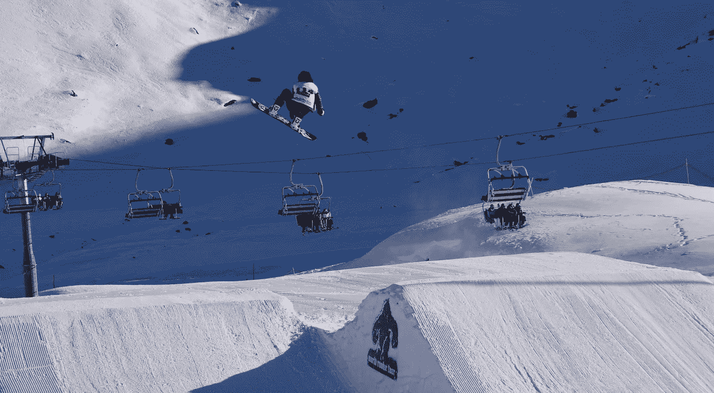
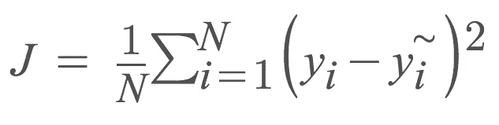
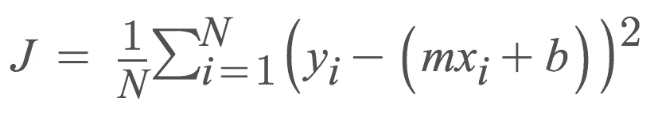
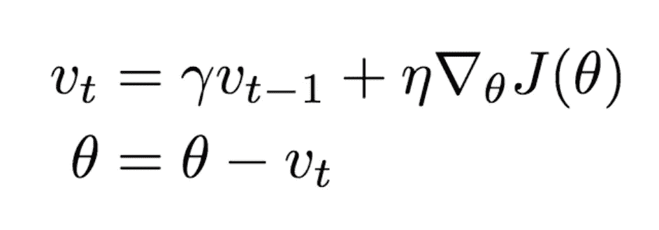
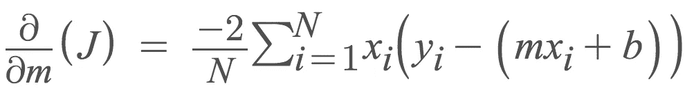
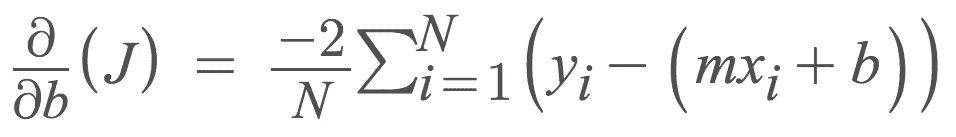
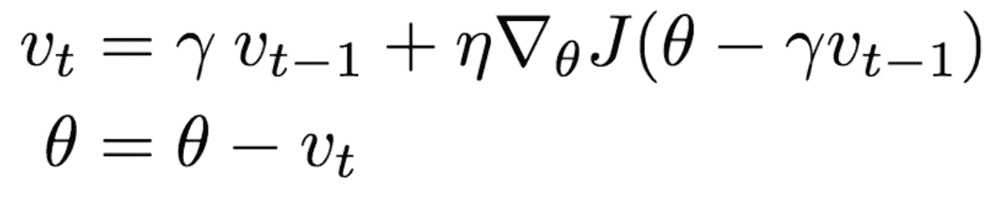
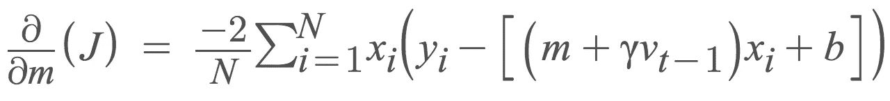

# 有点超越梯度下降:小批量，势头，和一些纨绔子弟命名为尤里内斯特罗夫

> 原文：<https://towardsdatascience.com/a-bit-beyond-gradient-descent-mini-batch-momentum-and-some-dude-named-yuri-nesterov-a3640f9e496b?source=collection_archive---------4----------------------->



[上一次](/linear-regression-using-gradient-descent-in-10-lines-of-code-642f995339c0)，我讨论了梯度下降如何在线性回归模型上工作，用十行 python 代码编写了它。这样做是为了展示梯度下降的原则，当涉及到自我实现时，它将给予读者洞察力和实际知识。有大量的库可以通过简单的即插即用为我们完成这项工作。然而，我相信学习这些方法如何在内部工作对于研究人员和实践数据科学家同样重要。

为了让读者更顺利地过渡到深度学习，我努力讨论了梯度下降。当研究深度学习时，理解如何对成本函数求导并使用它来更新权重和偏差是很重要的，因为它会重复显示自己(参见[反向传播](https://en.wikipedia.org/wiki/Backpropagation))。花时间去学习这些东西。

我们将再次探索我们的基本线性回归模型与我们的均方误差成本函数，通过优化技术超越梯度下降导航。在继续阅读之前，你自己想想，梯度下降会给我们带来什么潜在的问题？

最后，回想一下，我们的成本函数是下面给出的均方误差:



Average of all real values minus predicted values squared.

解开上述线性回归方程，我们得到:



m is the slope and b is the bias term

**查看我的**[**GitHub repo**](https://github.com/jsphbtst/linear-regression-optimization-technique)**包含完整算法。我对我们将要讨论的所有方法进行了基准测试。**

# 小批量梯度下降

当我们使用普通梯度下降(我们的普通老伙伴梯度下降的另一个术语)时，我们面临的一个问题是内存问题。我们的计算机只能处理这么多，那么如果我们要处理数百万，甚至更常见的数十亿的数据呢？幸运的是，顾名思义，小批量梯度下降使用与普通梯度下降相同的方法，但规模更小。我们根据训练数据创建批次，并在较小的批次上训练我们的模型，同时更新我们的斜率和偏差项。它看起来会像这样:

```
for epoch in range(number_of_epochs):
     for j in range(0, length_of_input_array, batch_size):
          batch_train_X = train_X[j:j+batch_size]
          batch_train_y = train_y[j:j+batch_size]
          ...
          m = m - learning_rate * m_gradient
          b = b - learning_rate * b_gradient
```

对于每个时期，我们每批训练我们的模型。这将导致我们创建一个嵌套的 for 循环。在我看来，这是必要的牺牲，而不是完全满足庞大的数据集。小批量梯度下降的一个问题是，高方差参数更新数量的增加会导致成本函数的波动。有时，这将导致我们的梯度由于过冲而跳到较低的局部最小值，这使它优于普通梯度下降，因为小批量梯度下降只是不停留在局部最小值的区域内，它可以超越该区域找到其他较低的局部最小值。其他时候，我们可能达不到更低的局部最小值，因为的*过冲。*

我们可以做得更好。我们借用一下物理学。

# 动力

还记得物理学中的动量吗？动量方程是 **p** =m **v** ，其中 **p** 是动量，m 是质量，而 **v** 是速度——p**和 **v** 都是矢量。对动量的直观理解，可以用一个滚下山坡的球来画。它的质量一路不变，但是因为引力的作用，它的速度( **v** )随着时间增加，使得动量( **p** )增加。同样的概念也可以应用于成本最小化！当前一个时间步长的梯度“指向”与我们当前时间步长相同的方向时，当我们“下山”时，我们增加“速度”**

在改善小批量梯度下降方面，这允许我们在某个方向上增加我们的“速度”。当方向改变时，我们会稍微慢一点，因为我们的动量“中断了”当我们的球滚下山时，它不断增加动量，但当另一个球击中它(或任何真正击中它的东西)时，它会减速，然后试图恢复动量。物理学允许我们进行直观的类比！

我们将不得不做一些改变。参考下面的等式:



This is our new parameter update.

这里只是我们相对于时间的“速度”。那个看起来像“y”的符号就叫做动量项，通常取值为 0.9。看起来像字母“n”的符号是我们的学习率，乘以成本函数的导数。我们仍然采用与普通梯度下降法和小批量梯度下降法相似的导数，如下所示:



你计算出 **v** 并从我们之前的参数中减去它，瞧，这就是你的参数更新！

在代码中，它看起来像这样:

```
for epoch in range(number_of_epochs):
     for j in range(0, length_of_input_array, batch_size):
          batch_train_X = train_X[j:j+batch_size]
          batch_train_y = train_y[j:j+batch_size] if epoch == 0:
               v_m = 0
               v_b = 0 m_gradient = -(2/N) * sum(X[j:j+batch_size] * (y[j:j+batch_size] - y_current))
          b_gradient = -(2/N) * sum(y[j:j+batch_size] - y_current) v_m = mu * v_m + learning_rate * m_gradient
          v_b = mu * v_b + learning_rate * b_gradient m_current = m_current - v_m
          b_current = b_current - v_b
```

再次，参考我的 [GitHub repo](https://github.com/jsphbtst/linear-regression-optimization-technique) 了解完整的实现细节。

# 内斯特罗夫加速梯度

只有动量的问题是它不够动态。当然，它会放大速度，以便更快地达到收敛，但一位名叫尤里·内斯特罗夫的研究人员观察到，当梯度达到局部最小值时，动量的值仍然很高。

当我们到达局部最小值时，上面的方法没有办法让我们减慢我们的参数更新。超调的问题再次出现。想象我们的球又滚下山了。在我们的动量法中，球在下落的时候肯定滚得更快，但是它不知道它要去哪里，所以它知道什么时候减速，并在下一个上坡之前最终稳定下来。我们需要一个更聪明的球。

内斯特罗夫加速梯度(NAG)是一个预先更新，防止我们走得“太快”，当我们不应该已经。参考下面的等式，看看你是否注意到了一个与动量相比发生了变化的东西。提示:检查成本函数。



在成本函数中，我们从权重/斜率中减去了一个新项！这是预先的行动。通过从上一个时间步取梯度，我们预测我们可能去的地方，而你最终加入的项是我们所做的修正。这使得 NAG 更具动态性，因为我们的更新会根据误差函数的斜率进行调整。


Source: [http://cs231n.github.io/assets/nn3/nesterov.jpeg](http://cs231n.github.io/assets/nn3/nesterov.jpeg)

我们新的斜率和偏置梯度看起来会有所不同。对于 NAG，你所要做的就是将新项插入到成本函数中，然后像我们之前所做的那样进行求导。对于我们的具有均方误差成本函数的线性回归示例，它看起来如下所示:



Derivative of the cost function with respect to the slope term


Derivative of the cost function with respect to the bias term

我们需要对之前的代码做一些调整。再次，检查我的 [GitHub repo](https://github.com/jsphbtst/linear-regression-optimization-technique) 了解完整的实现细节。它看起来像下面这样:

```
for epoch in range(number_of_epochs):
     for j in range(0, length_of_input_array, batch_size):
          batch_train_X = train_X[j:j+batch_size]
          batch_train_y = train_y[j:j+batch_size] if epoch == 0:
               v_m = 0
               v_b = 0 y_nesterov_m = (m_current - mu * v_m) * X[j:j+batch_size] + b_current
          y_nesterov_b = (b_current - mu * v_b) * X[j:j+batch_size] + b_current m_gradient = -(2/N) * sum(X[j:j+batch_size] * (y[j:j+batch_size] - y_nesterov_m))
          b_gradient = -(2/N) * sum(y[j:j+batch_size] - y_nesterov_b) v_m = mu * v_m + learning_rate * m_gradient
          v_b = mu * v_b + learning_rate * b_gradient m_current = m_current - v_m
          b_current = b_current - v_b
```

# 还有吗？

当然有！到目前为止，我们已经讨论了:1)使我们的计算机更容易进行计算；以及 2)基于误差函数的斜率实现自适应梯度步骤。**我们可以更进一步**。为什么不让所有其他的东西都适应呢？比如说，适应性学习率？如果我们使这些自适应学习率的更新类似于我们用 NAG 进行更新的方式，会怎么样呢？

有很多资源讨论这些问题。一个简单的谷歌搜索将带你到一个等待被学习的信息宝库。下次我会试着简单地解释给你听。到时候见！