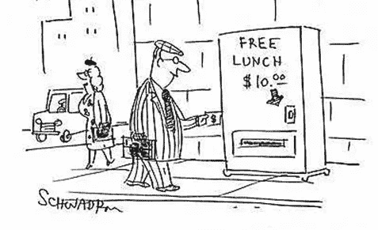
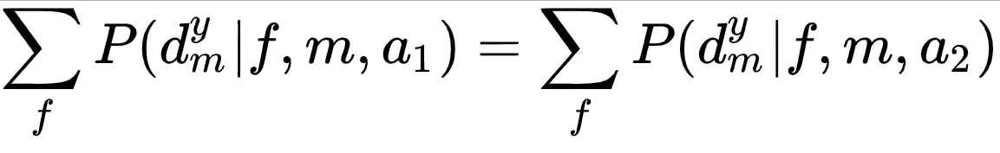

# 一个关于午餐和数据科学的博客——为什么没有免费的午餐

> 原文：<https://towardsdatascience.com/a-blog-about-lunch-and-data-science-how-there-is-no-such-a-thing-as-free-lunch-e46fd57c7f27?source=collection_archive---------25----------------------->

如果你已经开始阅读关于食物的文章，你会失望地发现这篇文章实际上是关于古老的数学。对于一个真正好的午餐创意美食博客，我强烈推荐[food52.com](https://food52.com/)；然而，如果你对免费食物和数据科学如何携手共进感兴趣，我会给你一个没有免费午餐定理的概述，以及它如何应用于数据科学的世界。

“天下没有免费的午餐”这句话传达了这样一种思想，即你不能不劳而获，即使有些东西看起来是免费的，也总是有代价的。这个短语起源于 19 世纪，当时酒吧试图用免费食物吸引更多的顾客，条件是这些顾客会点饮料和他们的食物一起吃；然而，工薪阶层的消费者通常不会喝醉，而且他们的钱还在口袋里。

虽然人们可以将这句话视为生活的智慧，但它也适用于数据科学领域。没有免费的午餐定理(NFLT)，意味着一个算法，创造了最好的解决方案，并不普遍优于任何其他算法。

正如 David Wolpert 和 William G. Macready 所说，“如果一个算法在某类问题上比随机搜索表现得更好，那么它在其余问题上的表现一定比随机搜索差。”对我来说，这意味着如果一个算法特别擅长解决一类问题，那么这个算法就适合于识别这个特殊问题的模式。Al 算法适用于特定的数据集，因为它对该数据集的独特质量做出响应，但是，另一个数据集可能有其他独特的挑战，这些挑战无法用相同的算法解决。

the trade-off between performance and problem type for a general-purpose algorithm and a specialized algorithm

现在，知道了 NFLT 如何适应我的生活和流程，下面的公式证明了两种学习算法的性能，一种不比另一种好。

该公式显示了从函数 ***f*** 上的算法***a***run***m***次获得给定成本值序列的条件概率的两个部分。对于下面等式中的一对算法 **a1** 和 **a2** ，该定理证明了给定算法在一个类问题上的收益，它同样被其在其余问题上的性能所抵消。

For any algorithms *a*1 and *a*2, at iteration step *m*

本质上，这意味着当所有函数 *f* 都有相同的可能性时，在搜索过程中观察到任意序列的 *m* 值的概率不依赖于搜索算法。NFLT 也适用于搜索优化，你可以在这里阅读更多关于它的[。](https://en.wikipedia.org/wiki/No_free_lunch_in_search_and_optimization)

关于 NFLT 值得一提的是，该定理假设人们试图解决的问题是正态分布和随机的。这意味着没有一种类型的问题会取代另一种类型的问题，这种关系同样可以用分类和回归问题来解释。

此外，在优化器迭代的搜索空间将是有限的，并且可能的成本值的空间也将是有限的条件下，NFLT 是真实的。请放心，优化器在计算机上运行时会自动满足这些条件。因为空间的大小是有限的，这意味着所有可能的问题的集合的大小是有限的。

作为一名数据科学家，我一直在采用“全部尝试”的方法，因为没有一个适用于所有问题的主算法。实际上，考虑到时间和资源的现实限制，退一步考虑手头的任务和我可用的数据是最佳策略。计算是昂贵的，所以在运行任何算法之前，重要的是考虑我的目标是什么。

在科学数据的真实世界中，我们关注的是解决我们试图解决的问题的工程特性和解决方案。因此，NFLT 给我们的直觉是，为了找到最好的学习算法，我们应该专注于手头的特定问题和我们可用的数据。算法的表现如何取决于机器和我们的问题之间的一致性。

正如 Wolpert 和 Macready 所阐明的，对于给定的成本函数，一个好的解决方案是确定它的某些显著特征，然后构造一个搜索算法，a，专门定制来匹配这些特征。“人脑是一个无限的空间，可以处理各种不同的问题，并根据一些输入做出决定，但是，学习算法只能接受有限的输入，以便做出最适合这些输入的决定。学习是一种非常人性化的行为，所以让一个复杂的数学公式像人脑一样做同样的事情有点牵强。

模型本质上是基于假设和偏见的现实的简化，因此，没有一个模型在所有情况下都是最好的。最终，随机选择一个算法而不对问题做任何结构性假设就像大海捞针一样。考虑问题和数据，设计最适合任务的解决方案是值得的。

资源:

 [## 没有免费的午餐——维基百科

### “天下没有免费的午餐”(或者，“天下没有免费的午餐”或其他…

en.wikipedia.org](https://en.wikipedia.org/wiki/There_ain%27t_no_such_thing_as_a_free_lunch)