# 使用 Tableau 的数据可视化简介:UNICEF 数据

> 原文：<https://towardsdatascience.com/a-brief-introduction-to-data-visualization-using-tableau-9917fc1244f?source=collection_archive---------7----------------------->

我们人类是视觉生物。当有人说**大象**时，我们的大脑想到的是大象的图片，而不是单词
T5“E L E P H A N T”的字母。

这就是为什么以视觉美感的方式呈现任何信息是最重要的，这样每个人都可以很容易地理解甚至非常复杂的信息。

## 数据可视化在数据科学项目中的重要性

在每一个数据科学/机器学习项目中， ***探索性数据分析(EDA)*** 是理解手中数据的至关重要的一步。项目的这一阶段处于早期阶段，就在获得数据之后。在设计统计模型之前，使用图形和绘图将数据可视化，以便更好地理解数据并创建一些假设。
同样，当你需要向**非数据科学人士**展示你所获得的见解时，可视化展示要比展示复杂的数据表好得多。

## 手中的数据

 [## 儿童死亡率数据-儿童基金会数据

### 儿童基金会数据:监测儿童和妇女的状况

data.unicef.org](https://data.unicef.org/resources/dataset/child-mortality/) 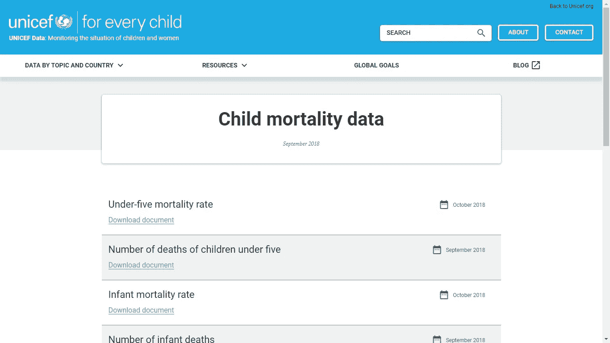

UNICEF DataSet Page

儿童基金会的数据是公开的，它们是真实世界的数据集。我们从上面的链接中得到了数据。我们用的是最后一个文件，名为**“死因-2017”**。
直接下载链接:[https://data . UNICEF . org/WP-content/uploads/2017/10/Cause-of-Death-2017 . xlsx](https://data.unicef.org/wp-content/uploads/2017/10/Cause-of-Death-2017.xlsx)

## 数据预览

该数据集包含 195 个国家和儿童死亡率的列表(<5 years) in them according to causes of death, for two census years — 2000 & 2016\. The excel file looks like this.

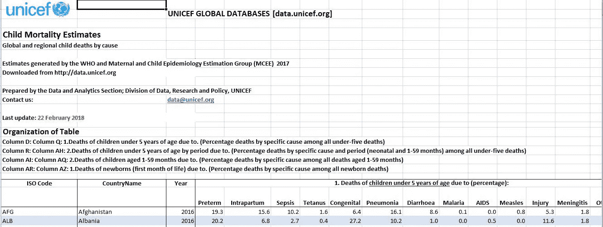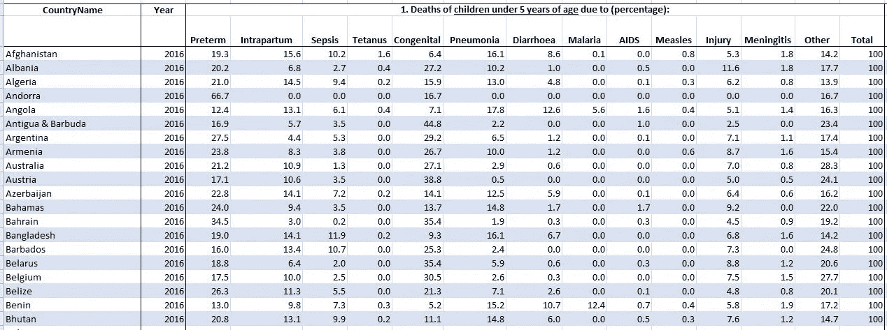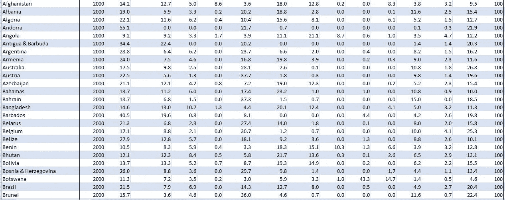

## Tableau : A brilliant tool for creating beautiful Dashboards

Tableau is an extremely powerful tool for visualizing massive sets of data very easily. It has an easy to use drag and drop interface. You can build beautiful visualizations easily and in a short amount of time.

## Importing data into Tableau

Tableau supports a wide array of data sources. Here we have used an excel file.

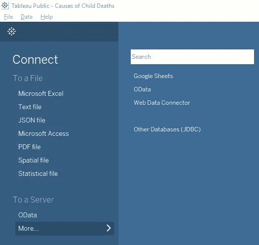

Before importing, it is necessary to format the data in a manner that Tableau can understand. After data preparation our data set looks like this.

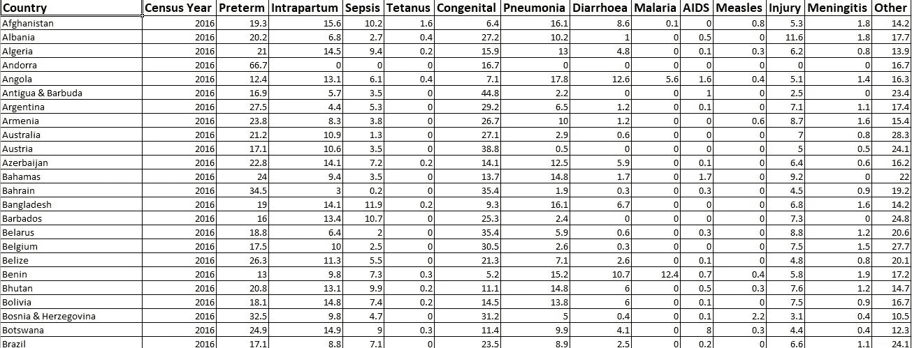

## Preview of Data Imported into Tableau

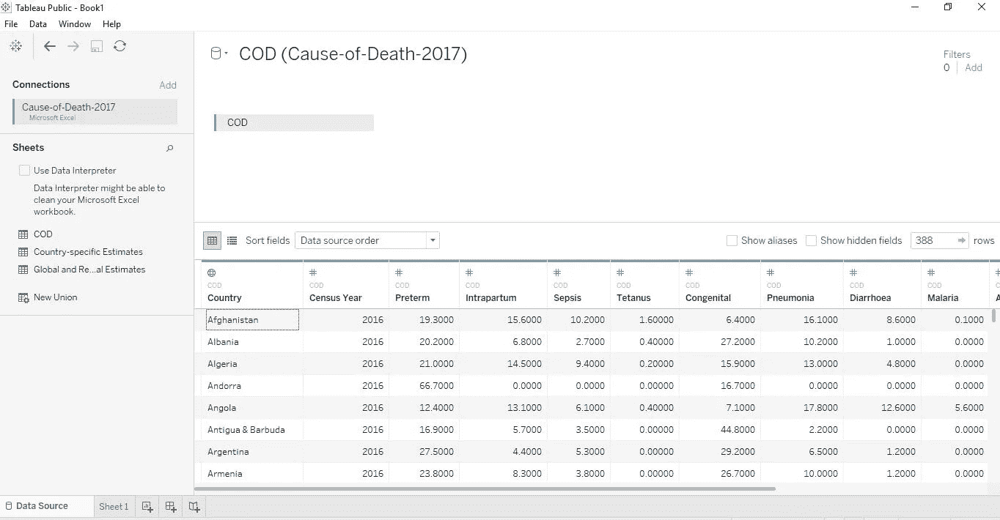

## Designing Worksheets

I have designed **三个工作表**使用我们的数据集，最后将它们组合在一起创建了一个 ***交互式仪表盘*** )。

## 第一个工作表:按死亡原因和人口普查年份筛选的所有国家数据

***1。死亡原因:早产和常年***

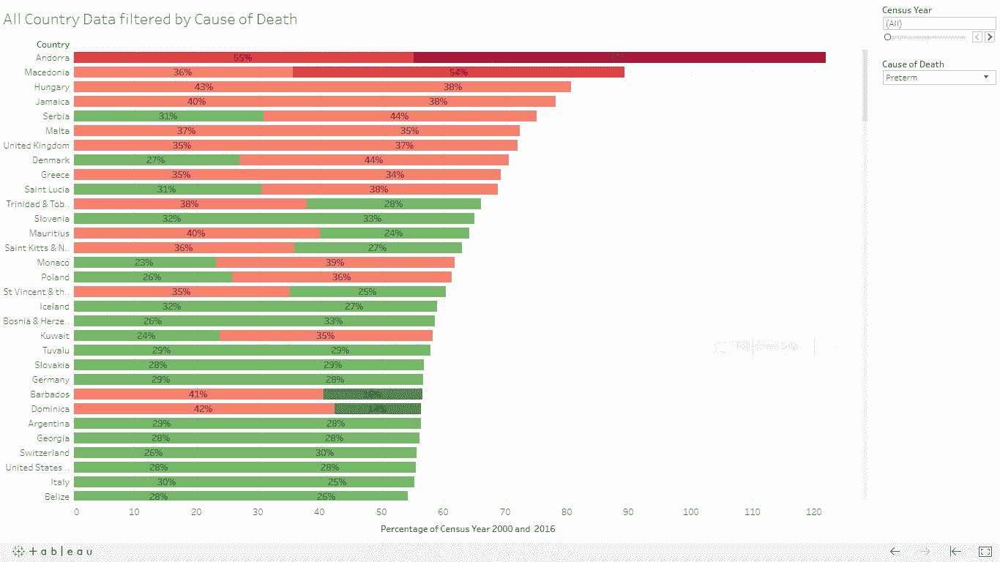

Cause of Death : Preterm and for All Years

***2。死亡原因:艾滋病*和常年**

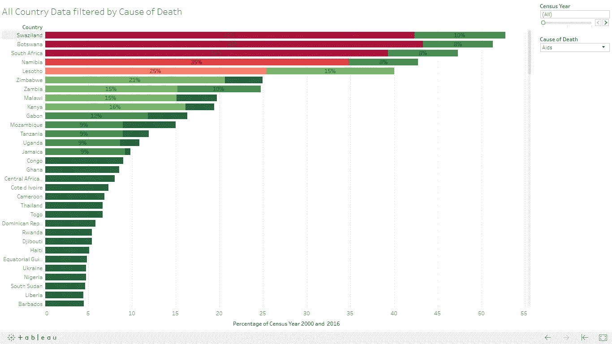

Cause of Death : Aids and for All Years

***3。按年份过滤:2000*T3**

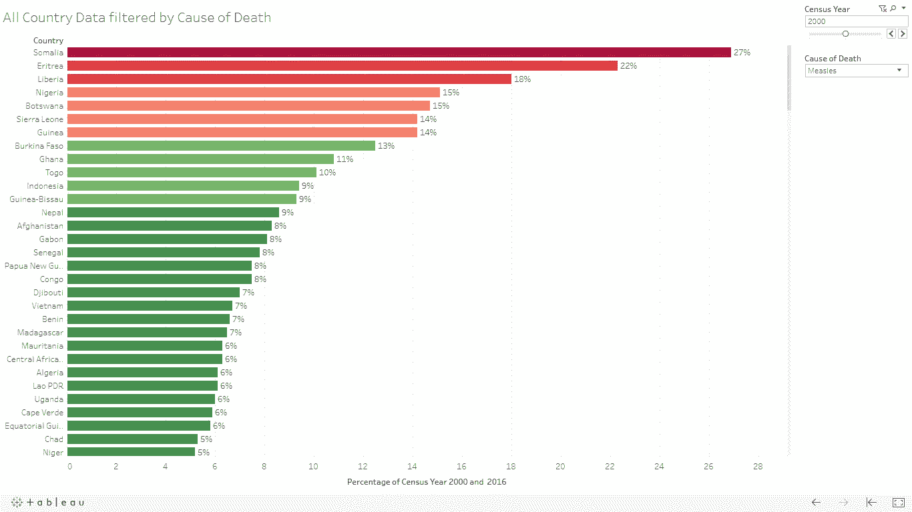

FILTERED BY YEAR : 2000

***4。按年份过滤:2016***

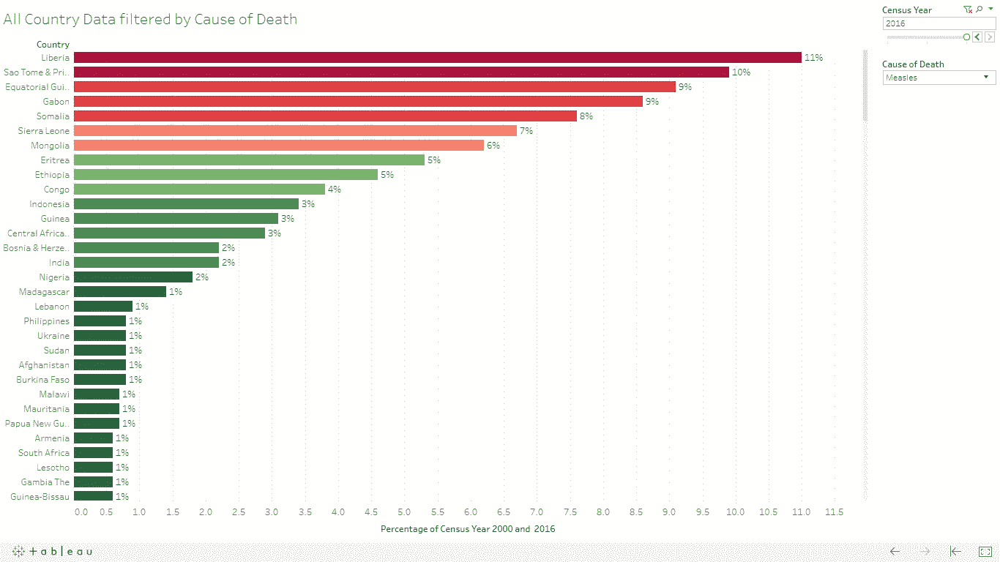

FILTERED BY YEAR : 2016

## 第二个工作表:按每个国家筛选的所有死亡原因

你可以从第一张工作表中看到，在博茨瓦纳，很大比例的儿童死于艾滋病。可以使用此工作表以特定于国家/地区的方式进行进一步调查。

## 博茨瓦纳

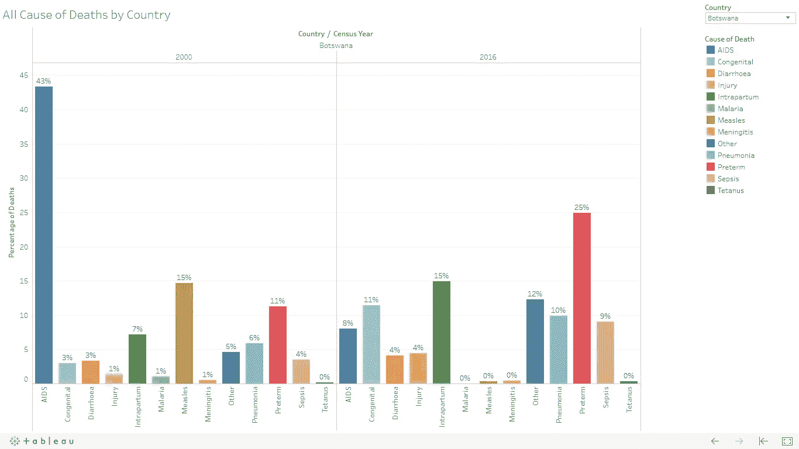

BOTSWANA

这里有一个维基百科参考，证明我们的发现是正确的，博茨瓦纳确实受到艾滋病的严重影响

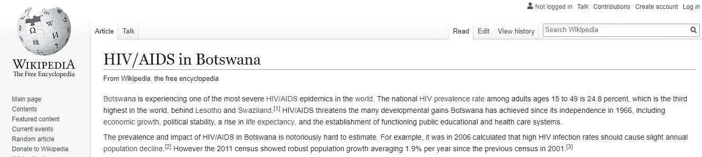

## 印度

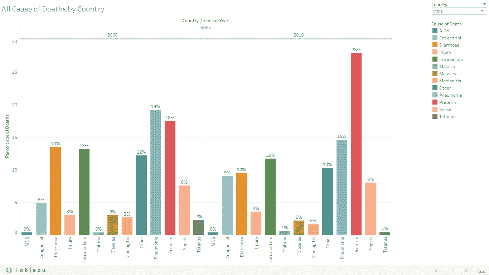

INDIA

## 美利坚合众国

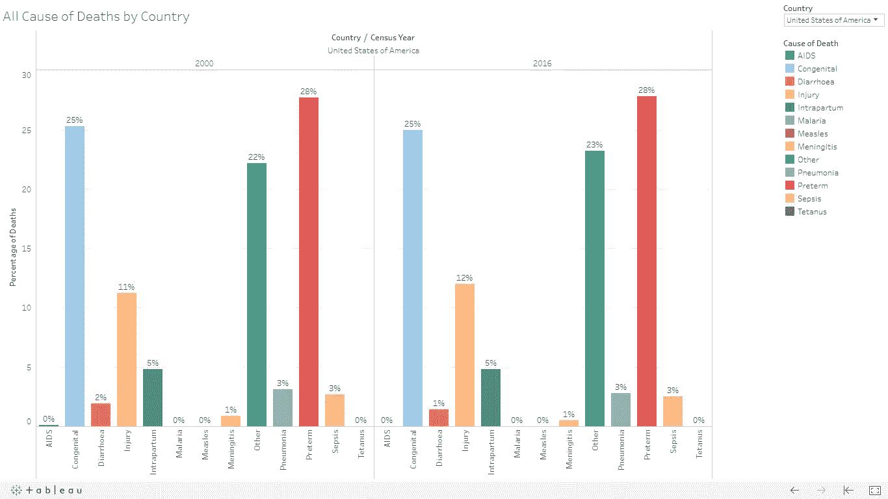

USA

## **第三张工作表:世界地图**

Tableau 可以通过简单的拖放操作创建我们数据集中所有国家的地图。在这里。

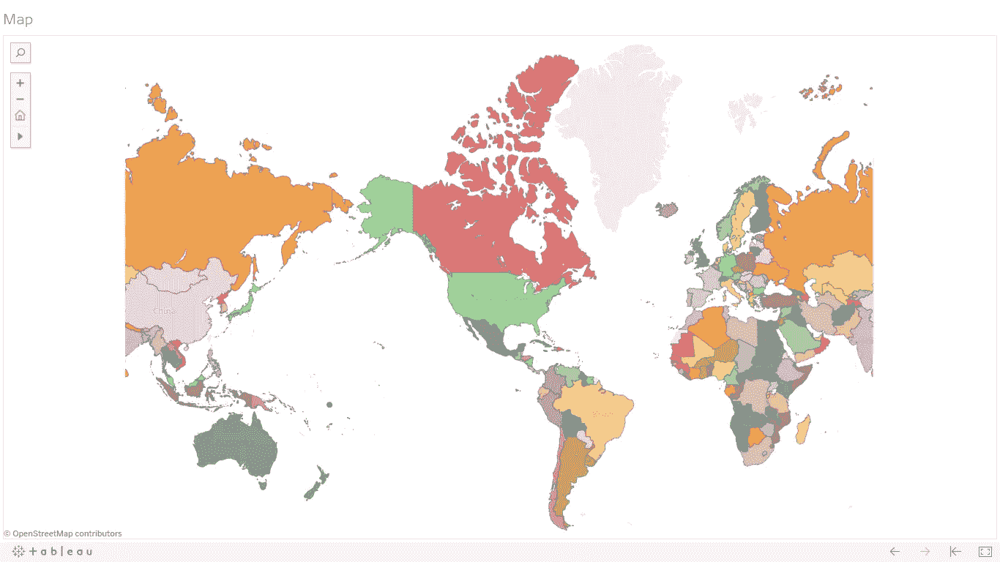

World Map built using Tableau

## 控制板:合并所有工作表

最终的结果是一个漂亮的交互式仪表板，它将所有工作表的功能集中到一个地方。

*   通过点击地图可以选择任何国家，相关图表显示在我们的国家特定工作表中
*   普查年过滤器适用于仪表板中的所有工作表。
*   死亡原因过滤器、人口普查年份过滤器和国家过滤器一起工作，使我们能够轻松理解数据，hep us 正在直观地分析手头的数据。

我通过给出仪表板的快照来结束这篇博客。

## 国家—俄罗斯，脑膜炎，全年

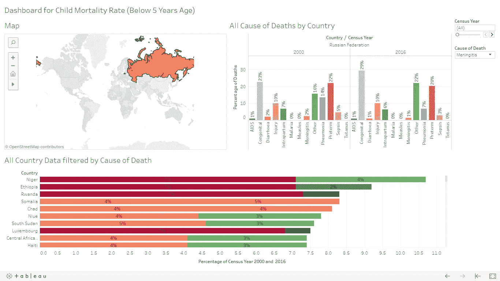

Country — Russia , COD- Meningitis, Year — ALL

## 国家—巴西，鳕鱼腹泻，2016 年

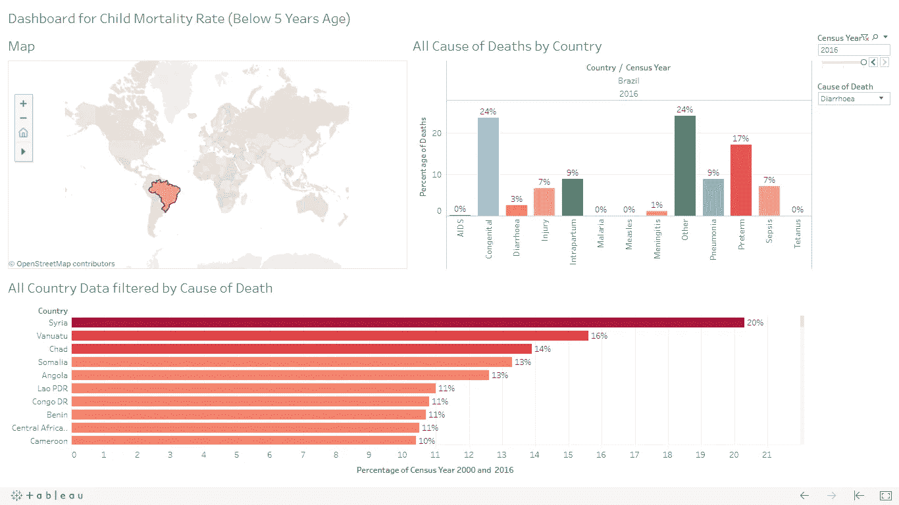

Country — Brazil , COD- Diarrhoea, Year —2016

***查看现场仪表盘:***[https://public.tableau.com/profile/sourav.kajuri#!/viz home/causesofchildresses/Dashboard](https://public.tableau.com/profile/sourav.kajuri#!/vizhome/CausesofChildDeaths/Dashboard)

 [## Tableau 公共

### 编辑描述

public.tableau.com](https://public.tableau.com/profile/sourav.kajuri#!/vizhome/CausesofChildDeaths/Dashboard) 

# 致所有读者

谢谢你浏览我的博客。希望我合理地利用了你的时间。我相信，当我的知识对他人有用时，它真的会激励我

> 获得知识是走向智慧的第一步，分享知识是走向人性的第一步