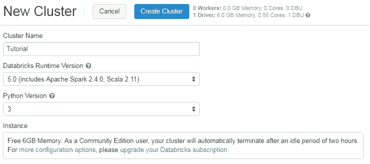
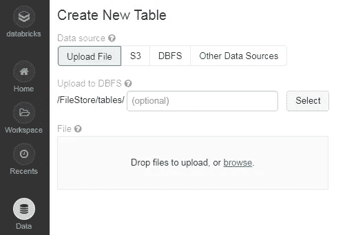
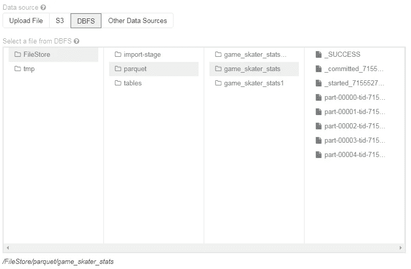
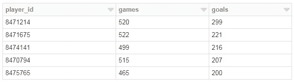
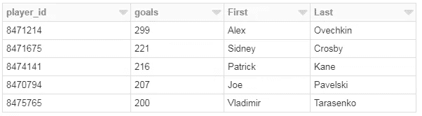
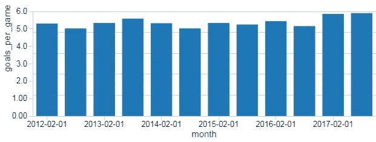
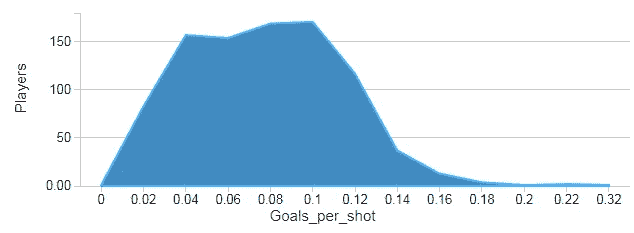
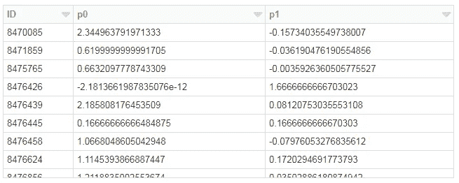

# PySpark 简介

> 原文：<https://towardsdatascience.com/a-brief-introduction-to-pyspark-ff4284701873?source=collection_archive---------0----------------------->


Source: Wikimedia (Vienna Technical Museum)

## 面向数据科学的 PySpark 入门

PySpark 是一种很好的语言，可以进行大规模的探索性数据分析，构建机器学习管道，为数据平台创建 ETL。如果您已经熟悉 Python 和 Pandas 之类的库，那么为了创建更具可伸缩性的分析和管道，PySpark 是一种很好的学习语言。这篇文章的目标是展示如何使用 PySpark 并执行常见任务。

[](https://www.kaggle.com/martinellis/nhl-game-data) [## NHL 游戏数据

### 游戏、团队、玩家和游戏信息，包括 x、y 坐标

www.kaggle.com](https://www.kaggle.com/martinellis/nhl-game-data) 

我们将为 Spark 环境使用 Databricks，并将 Kaggle 的 NHL 数据集作为分析的数据源。这篇文章展示了如何在 Spark 数据帧中读写数据，创建这些帧的转换和聚合，可视化结果，以及执行线性回归。我还将展示如何使用 Pandas UDFs 以可伸缩的方式将常规 Python 代码与 PySpark 混合。为了简单起见，我们将把重点放在批处理上，避免流数据管道带来的一些复杂性。

这篇文章的完整笔记本可以在 github 上找到。

## 环境

使用 Spark 有许多不同的选项:

*   **自托管:**你可以使用裸机或虚拟机自己建立一个集群。Apache Ambari 是这个选项的一个有用的项目，但是它不是我推荐的快速启动和运行的方法。
*   **云提供商:**大多数云提供商都提供 Spark 集群:AWS 有 EMR，GCP 有 DataProc。我曾经在博客上写过关于 DataProc 的文章，你可以比自托管更快地进入交互式环境。
*   **供应商解决方案:**包括 Databricks 和 Cloudera 在内的公司提供 Spark 解决方案，使 Spark 的启动和运行变得非常容易。

要使用的解决方案因安全性、成本和现有基础架构而异。如果你正在尝试建立一个学习环境，那么我建议你使用 Databricks [社区版](https://community.cloud.databricks.com)。



Creating a PySpark cluster in Databricks Community Edition.

在这种环境下，很容易启动并运行 Spark 集群和笔记本电脑环境。对于本教程，我用 Spark 2.4 运行时和 Python 3.0 创建了一个集群。要运行本文中的代码，您至少需要 Spark 版的 Pandas UDFs 功能。

## 火花数据帧

PySpark 中使用的关键数据类型是 Spark 数据帧。这个对象可以被认为是一个分布在集群中的表，其功能类似于 R 和 Pandas 中的数据帧。如果您想使用 PySpark 进行分布式计算，那么您需要对 Spark 数据帧执行操作，而不是其他 python 数据类型。

在使用 Spark 时，也可以使用 Pandas 数据帧，方法是在 Spark 数据帧上调用 *toPandas()* ，这将返回一个 Pandas 对象。但是，除非使用小数据帧，否则通常应避免使用此函数，因为它会将整个对象拉入单个节点的内存中。

Pandas 和 Spark 数据帧之间的一个关键区别是急切执行和懒惰执行。在 PySpark 中，操作被延迟，直到管道中实际需要一个结果。例如，您可以指定从 S3 加载数据集的操作，并将一些转换应用到数据帧，但是这些操作不会立即应用。相反，转换的图形被记录下来，一旦实际需要数据，例如当将结果写回 S3 时，转换就作为单个流水线操作被应用。这种方法用于避免将完整的数据帧放入内存，并在机器集群中实现更有效的处理。有了 Pandas dataframes，所有东西都被放入内存，每个 Pandas 操作都被立即应用。

一般来说，如果可能的话，最好避免在 Spark 中进行急切的操作，因为这限制了可以有效分布的管道数量。

## 读取数据

使用 Spark 时，要学习的第一步是将数据集加载到数据帧中。一旦数据被加载到 dataframe 中，您就可以应用转换、执行分析和建模、创建可视化以及持久化结果。在 Python 中，您可以使用 Pandas 直接从本地文件系统加载文件:

```
import pandas as pd
pd.read_csv("dataset.csv")
```

在 PySpark 中，加载 CSV 文件稍微复杂一些。在分布式环境中，没有本地存储，因此需要使用分布式文件系统(如 HDFS、数据块文件存储(DBFS)或 S3)来指定文件的路径。

一般来说，使用 PySpark 时，我在 S3 处理数据。许多数据库都提供了卸载到 S3 的功能，也可以使用 AWS 控制台将文件从本地机器移动到 S3。在这篇文章中，我将使用 Databricks 文件系统(DBFS)，它以 */FileStore* 的形式提供路径。第一步是上传您想要处理的 CSV 文件。



Uploading a file to the Databricks file store.

下一步是将 CSV 文件读入 Spark 数据帧，如下所示。这段代码片段指定了 CSV 文件的路径，并将一些参数传递给 *read* 函数来处理文件。最后一步显示加载的数据帧的子集，类似于 Pandas 中的`df.head()`。

```
file_location = "/FileStore/tables/game_skater_stats.csv"df = spark.read.format("csv").option("inferSchema", 
           True).option("header", True).load(file_location)display(df)
```

在使用 Spark 时，我更喜欢使用 parquet 格式，因为这是一种包含关于列数据类型的元数据的文件格式，提供文件压缩，并且是一种专为使用 Spark 而设计的文件格式。AVRO 是另一种适合 Spark 的格式。下面的代码片段显示了如何从过去的代码片段中提取数据帧，并将其保存为 DBFS 上的拼花文件，然后从保存的拼花文件中重新加载数据帧。

```
df.write.save('/FileStore/parquet/game_skater_stats',  
               format='parquet')df = spark.read.load("/FileStore/parquet/game_skater_stats")
display(df)
```

这一步的结果是一样的，但是执行流程有显著的不同。当将 CSV 文件读入数据帧时，Spark 以急切模式执行操作，这意味着在下一步开始执行之前，所有数据都被加载到内存中，而当读取 parquet 格式的文件时，则使用惰性方法。通常，在使用 Spark 时，您希望避免急切的操作，如果我需要处理大型 CSV 文件，我会在执行管道的其余部分之前，首先将数据集转换为 parquet 格式。

通常，您需要处理大量文件，比如位于 DBFS 某个路径或目录下的数百个 parquet 文件。使用 Spark，您可以在路径中包含通配符来处理文件集合。例如，您可以从 S3 载入一批拼花文件，如下所示:

```
df = spark.read .load("s3a://my_bucket/game_skater_stats/*.parquet")
```

如果您每天有一个单独的拼花文件，或者如果您的管道中有一个输出数百个拼花文件的在先步骤，那么这种方法非常有用。

如果您想从数据库中读取数据，比如 Redshift，那么在用 Spark 处理数据之前，最好先将数据卸载到 S3。在 Redshift 中， [unload](https://docs.aws.amazon.com/redshift/latest/dg/t_Unloading_tables.html) 命令可用于将数据导出到 S3 进行处理:

```
unload ('select * from data_to_process') 
to 's3://my_bucket/game_data'  
iam_role 'arn:aws:iam::123:role/RedshiftExport';
```

还有数据库库，如[火花红移](https://github.com/databricks/spark-redshift)，使这个过程更容易执行。

## 写入数据

类似于用 Spark 读取数据，使用 PySpark 时不建议将数据写入本地存储。相反，你应该使用分布式文件系统，如 S3 或 HDFS。如果要用 Spark 处理结果，那么 parquet 是保存数据帧的好格式。下面的代码片段显示了如何将数据帧保存到 DBFS 和 S3 作为拼花。

```
**# DBFS (Parquet)** df.write.save('/FileStore/parquet/game_stats',format='parquet')**# S3 (Parquet)** df.write.parquet("s3a://my_bucket/game_stats", mode="overwrite")
```

以拼花格式保存数据帧时，通常会将它分成多个文件，如下图所示。



The parquet files generated when saving the dataframe to DBFS.

如果您需要 CSV 文件中的结果，那么需要一个稍微不同的输出步骤。这种方法的一个主要区别是，在输出到 CSV 之前，所有数据都将被拉至单个节点。当您需要保存一个小的数据帧并在 Spark 之外的系统中处理它时，推荐使用这种方法。以下代码片段显示了如何在 DBFS 和 S3 上将数据帧保存为单个 CSV 文件。

```
**# DBFS (CSV)** df.write.save('/FileStore/parquet/game_stats.csv', format='csv')**# S3 (CSV)** df.coalesce(1).write.format("com.databricks.spark.csv")
   .option("header", "true").save("s3a://my_bucket/game_sstats.csv")
```

Spark 脚本的另一个常见输出是 NoSQL 数据库，如 Cassandra、DynamoDB 或 Couchbase。这超出了本文的范围，但我过去见过的一种方法是向 S3 写一个数据帧，然后启动一个加载过程，告诉 NoSQL 系统从 S3 上的指定路径加载数据。

我还省略了写入流输出源，如 Kafka 或 Kinesis。当使用火花流时，这些系统更有用。

## 转换数据

可以在 Spark 数据帧上执行许多不同类型的操作，就像可以在 Pandas 数据帧上应用的各种操作一样。对 Spark 数据帧执行操作的一种方式是通过 Spark SQL，这使得数据帧可以像表一样被查询。下面的片段显示了如何在数据集中找到得分最高的球员。

```
df.createOrReplaceTempView("stats")display(spark.sql("""
  select player_id, sum(1) as games, sum(goals) as goals
  from stats
  group by 1
  order by 3 desc
  limit 5
"""))
```

结果是球员 id、出场次数和在这些比赛中的总进球数的列表。如果我们想显示球员的名字，那么我们需要加载一个额外的文件，使它作为一个临时视图可用，然后使用 Spark SQL 连接它。



Top scoring players in the data set.

在上面的代码片段中，我使用了 display 命令来输出数据集的样本，但是也可以将结果分配给另一个 dataframe，这可以在管道的后续步骤中使用。下面的代码显示了如何执行这些步骤，其中第一个查询结果被分配给一个新的 dataframe，然后该 data frame 被分配给一个临时视图，并与一组球员姓名连接。

```
top_players = spark.sql("""
  select player_id, sum(1) as games, sum(goals) as goals
  from stats
  group by 1
  order by 3 desc
  limit 5
""")top_players.createOrReplaceTempView("top_players")
names.createOrReplaceTempView("names")display(spark.sql("""
  select p.player_id, goals, _c1 as First, _c2 as Last
  from top_players p
  join names n
    on p.player_id = n._c0
  order by 2 desc  
"""))
```

这一过程的结果如下所示，根据 Kaggle 数据集，确定 Alex Ovechkin 为 NHL 的顶级得分球员。



The output of the process joining dataframes using Spark SQL.

Spark dataframe 操作适用于常见任务，例如添加新列、删除列、执行连接以及计算聚合和分析统计数据，但是在开始使用 Spark SQL 时，执行这些操作可能会更容易。此外，如果您已经在使用诸如 [PandaSQL](https://pypi.org/project/pandasql/) 或 [framequery](https://pypi.org/project/framequery/) 之类的库来使用 SQL 操作 Pandas 数据帧，那么将代码从 Python 移植到 PySpark 会更容易。

像 Spark 数据帧上的大多数操作一样，Spark SQL 操作是以延迟执行模式执行的，这意味着 SQL 步骤在需要结果之前不会被评估。Spark SQL 提供了一种深入研究 PySpark 的好方法，而无需首先学习一个新的数据帧库。

如果您正在使用数据块，您也可以直接在笔记本中创建可视化，而无需显式使用可视化库。例如，我们可以使用下面的 Spark SQL 代码绘制每场比赛的平均进球数。

```
display(spark.sql("""
  select cast(substring(game_id, 1, 4) || '-' 
    || substring(game_id, 5, 2) || '-01' as Date) as month
    , sum(goals)/count(distinct game_id) as goals_per_goal
  from stats
  group by 1
  order by 1
"""))
```

Databricks 笔记本中显示的初始输出是一个结果表，但是我们可以使用绘图功能将输出转换为不同的可视化形式，例如下面显示的条形图。这种方法并不支持数据科学家可能需要的每一种可视化，但它确实使在 Spark 中执行探索性数据分析变得更加容易。如果需要，我们可以使用 *toPandas()* 函数在驱动程序节点上创建一个 Pandas 数据帧，这意味着任何 Python 绘图库都可以用于可视化结果。但是，这种方法应该只用于小数据帧，因为所有数据都被急切地提取到驱动程序节点的内存中。



Average goals per game during February and March.

我也看了平均每杆进球数，至少有 5 个进球的球员。

```
display(spark.sql("""
  select cast(goals/shots * 50 as int)/50.0 as Goals_per_shot
      ,sum(1) as Players 
  from (
    select player_id, sum(shots) as shots, sum(goals) as goals
    from stats
    group by 1
    having goals >= 5
  )  
  group by 1
  order by 1
"""))
```

这种转换的结果如下图所示。大多数至少有 5 个进球的球员完成投篮的概率大约是 4%到 12%。



Goals per shot for players in the Kaggle data set.

## MLlib

对于数据科学家来说，Python 的一个常见用例是构建预测模型。虽然 scikit-learn 在处理 pandas 时很棒，但它不能扩展到分布式环境中的大型数据集(尽管有办法用 Spark 对它进行[并行化](https://github.com/databricks/spark-sklearn))。当使用 PySpark 和海量数据集构建预测模型时， [MLlib](http://spark.apache.org/docs/2.0.0/api/python/pyspark.mllib.html) 是首选库，因为它本来就在 Spark 数据帧上操作。并不是 scikit-learn 中的每个算法都可以在 MLlib 中使用，但是有各种各样的选项涵盖了许多用例。

为了使用 MLib 中的一种监督算法，您需要使用一个要素矢量和一个标量标注来设置数据帧。一旦做好准备，您就可以使用*拟合*功能来训练模型。下面的代码片段展示了如何使用一个 *VectorAssembler* 将 dataframe 中的几个列组合成一个单独的 *features* vector。我们使用生成的数据帧来调用 *fit* 函数，然后为模型生成汇总统计数据。

```
**# MLlib imports** from pyspark.ml.feature import VectorAssembler
from pyspark.ml.regression import LinearRegression**# Create a vector representation for features** assembler = VectorAssembler(inputCols=['shots', 'hits', 'assists', 
    'penaltyMinutes','timeOnIce','takeaways'],outputCol="features")
train_df = assembler.transform(df)**# Fit a linear regression model** lr = LinearRegression(featuresCol = 'features', labelCol='goals')
lr_model = lr.fit(train_df)**# Output statistics** trainingSummary = lr_model.summary
print("Coefficients: " + str(lr_model.coefficients))
print("RMSE: %f" % trainingSummary.rootMeanSquaredError)
print("R2: %f" % trainingSummary.r2)
```

该模型根据射门次数、比赛时间和其他因素来预测球员的进球数量。然而，该模型的性能很差，其结果是均方根误差(RMSE)为 0.375，R 平方值为 0.125。具有最大值的系数是*发射*列，但是这并没有提供足够的信号使模型精确。

使用 PySpark 构建 ML 管道时，需要考虑许多额外的步骤，包括训练和测试数据集、超参数调整和模型存储。上面的代码片段只是开始使用 MLlib 的一个起点。

## 熊猫 UDF

Spark 中我最近一直在使用的一个特性是 Pandas 用户定义函数(UDF ),它使您能够在 Spark 环境中使用 Pandas 数据帧执行分布式计算。这些 UDF 的一般工作方式是，首先使用 *groupby* 语句对 Spark 数据帧进行分区，然后每个分区被发送到一个 worker 节点，并被转换成 Pandas 数据帧，该数据帧被传递给 UDF。然后，UDF 返回转换后的 Pandas 数据帧，该数据帧与所有其他分区组合，然后转换回 Spark 数据帧。最终结果是非常有用的，你可以使用需要 Pandas 的 Python 库，但是现在可以扩展到大规模数据集，只要你有一个好的方法来划分你的数据帧。熊猫 UDF 是在 Spark 2.3 中引入的，我将在 [Spark Summit 2019](https://databricks.com/sparkaisummit/north-america/sessions-single-2019?id=113) 期间谈论我们如何在 Zynga 使用这一功能。

曲线拟合是我作为数据科学家执行的一项常见任务。下面的代码片段显示了如何执行曲线拟合来描述玩家在游戏过程中记录的射门次数和命中次数之间的关系。该代码片段显示了我们如何通过对过滤到单个玩家的数据集调用 *toPandas()* 来为单个玩家执行这个任务。这一步的输出是两个参数(线性回归系数)，试图描述这些变量之间的关系。

```
**# Sample data for a player** sample_pd = spark.sql("""
  select * from stats
  where player_id = 8471214
""").toPandas()**# Import python libraries** from scipy.optimize import leastsq
import numpy as np**# Define a function to fit** def fit(params, x, y):
    return (y - (params[0] + x * params[1] ))**# Fit the curve and show the results** 
result = leastsq(fit, [1, 0], 
                 args=(sample_pd.shots, sample_pd.hits))
print(result)
```

如果我们想为每个玩家计算这条曲线，并且有一个庞大的数据集，那么 *toPandas()* 调用将会由于内存不足异常而失败。我们可以通过在 *player_id* 上调用 *groupby()* ，然后应用如下所示的熊猫 UDF，将这个操作扩展到整个数据集。该函数将描述单个玩家游戏统计数据的 Pandas 数据帧作为输入，并返回一个包括 *player_id* 和拟合系数的汇总数据帧。然后，每个 summary Pandas 数据帧被组合成一个 Spark 数据帧，显示在代码片段的末尾。使用 Pandas UDFs 的另一项设置是为生成的数据帧定义模式，其中模式描述了从应用步骤生成的 Spark 数据帧的格式。

```
**# Load necessary libraries** from pyspark.sql.functions import pandas_udf, PandasUDFType
from pyspark.sql.types import *
import pandas as pd**# Create the schema for the resulting data frame** schema = StructType([StructField('ID', LongType(), True),
                     StructField('p0', DoubleType(), True),
                     StructField('p1', DoubleType(), True)])**# Define the UDF, input and outputs are Pandas DFs** [@pandas_udf](http://twitter.com/pandas_udf)(schema, PandasUDFType.GROUPED_MAP)
def analyze_player(sample_pd): **# return empty params in not enough data**    if (len(sample_pd.shots) <= 1):
        return pd.DataFrame({'ID': [sample_pd.player_id[0]], 
                                   'p0': [ 0 ], 'p1': [ 0 ]})

 **# Perform curve fitting**    result = leastsq(fit, [1, 0], args=(sample_pd.shots, 
                                  sample_pd.hits)) **# Return the parameters as a Pandas DF**    return pd.DataFrame({'ID': [sample_pd.player_id[0]], 
                       'p0': [result[0][0]], 'p1': [result[0][1]]})**# perform the UDF and show the results** player_df = df.groupby('player_id').apply(analyze_player)
display(player_df)
```

这个过程的输出如下所示。我们现在有了一个数据框架，总结了每个球员的曲线拟合，并可以在一个巨大的数据集上运行这个操作。当处理大型数据集时，选择或生成分区键以在数据分区的数量和大小之间取得良好的平衡是很重要的。



Output from the Pandas UDF, showing curve fits per player.

## 最佳实践

我已经介绍了使用 PySpark 的一些常见任务，但是还想提供一些建议，以便更容易地从 Python 过渡到 PySpark。以下是我根据在这些环境之间移植一些项目的经验收集的一些最佳实践:

*   **避免使用字典，使用数据框架:**使用字典等 Python 数据类型意味着代码可能无法在分布式模式下执行。不要使用键来索引字典中的值，可以考虑向 dataframe 中添加另一列来用作过滤器。
*   **少用*toPandas*:**调用 *toPandas()* 会导致所有数据被加载到驱动节点的内存中，并阻止操作以分布式方式执行。当数据已经聚合并且您想要使用熟悉的 Python 绘图工具时，使用此函数是很好的，但是它不应该用于大型数据帧。
*   **避免 for 循环:**如果可能，最好使用 groupby-apply 模式重写 for 循环逻辑，以支持并行代码执行。我注意到，专注于在 Python 中使用这种模式也导致了更容易翻译成 PySpark 的代码的清理。
*   **尽量减少急切操作:**为了让您的管道尽可能地可伸缩，最好避免将完整数据帧拉入内存的急切操作。我注意到在 CSV 中读取是一个急切的操作，我的工作是将数据帧保存为 parquet，然后从 parquet 重新加载它，以构建更具可伸缩性的管道。
*   **使用 framequery/pandasql 使移植更容易:**如果您正在使用其他人的 Python 代码，那么破译一些 Pandas 操作正在实现的功能可能会很棘手。如果您计划将代码从 Python 移植到 PySpark，那么使用 Pandas 的 SQL 库可以使这种转换更容易。

我发现花时间在 PySpark 上写代码也因 Python 编码技巧而有所提高。

## 结论

PySpark 是数据科学家学习的一门好语言，因为它支持可扩展的分析和 ML 管道。如果您已经熟悉 Python 和 Pandas，那么您的许多知识都可以应用于 Spark。我已经展示了如何用 PySpark 执行一些常见的操作来引导学习过程。我还展示了 Pandas UDFs 的一些最新 Spark 功能，这些功能使 Python 代码能够以分布式模式执行。有很好的环境使 Spark 集群很容易启动和运行，现在是学习 PySpark 的好时机！

本·韦伯是 Zynga 的首席数据科学家。我们正在[招聘](https://www.zynga.com/careers/positions/categories)！