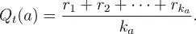
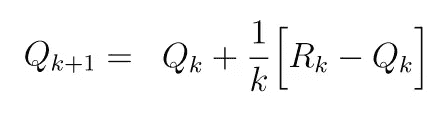
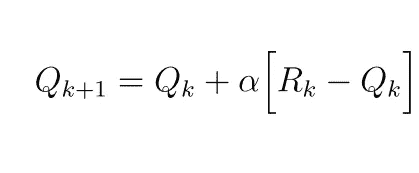
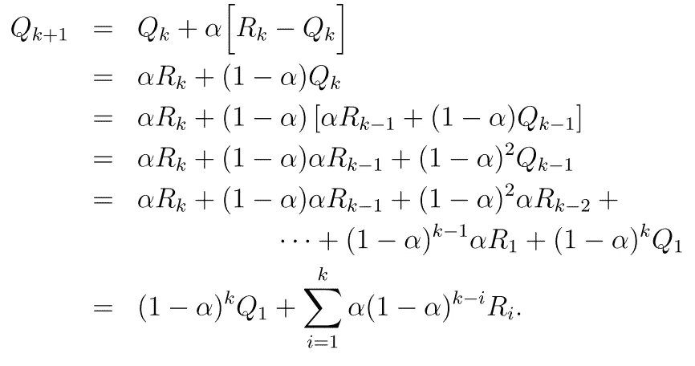

# 强化学习与价值函数简介

> 原文：<https://towardsdatascience.com/a-brief-introduction-to-reinforcement-learning-and-value-functions-8aa0919fc02e?source=collection_archive---------8----------------------->

在我之前的帖子中，我已经讨论了 n 臂土匪问题，我希望我已经给了你关于强化学习的基本直觉。在这篇文章中，我计划深入研究并正式定义强化学习问题。但是首先，有几个更重要的概念要介绍…

# **价值函数**

在之前的帖子中，我解释了拉动老虎机的 n 个臂的每一个被认为是不同的动作，并且每个动作都有我们不知道的值。我们所能观察到的只是吃角子老虎机在我们执行一个动作(拉手臂)后给我们的奖励。

我们的主要目标是最大化回报。如果我们知道每个动作的值，这就很容易做到，因为我们总是可以用最大值来执行动作。

**但问题是——我们永远无法找到一个行为的实际价值，但我们可以很精确地估计它。**

那么我们如何评估一个行为的价值呢？

在 n 个武装匪徒的问题中，有一种方法可以做到这一点，那就是不断执行动作，并保存一份我们得到的所有奖励的列表，然后对每个动作的奖励进行平均。这将会给我们一个行动价值的估计，但是我们估计的好坏取决于我们执行行动的次数。我们执行一个动作的次数越多，我们对它的价值的估计就越准确。

这在数学上可以写成-

其中， *Qt(a)* 是在第 *t* 次播放时动作*‘a’*的估计值。 *r1，r2，…* 是获得的奖励。 *ka* 是动作 *a* 已经执行的次数。

很简单，对吧？

但是用这种方法发现行动的价值需要我们维护一个行动和回报的列表，并且随着我们不断地执行行动，这个列表会无限制地增长。这是一个严重的问题，因为这样的列表会占用太多的内存。

下面的等式解决了这个问题，因为它只需要我们跟踪两个变量- Qk 和 k。

到目前为止一切顺利。我们有一个 n 臂强盗，每个臂都有不同的值(平均奖励)，我们可以拉任何一个臂。直到现在，土匪的手臂的价值是不变的，也就是说，我们正在处理一个稳定的问题。但是如果手臂的值随着时间慢慢变化，而我们不知道如何变化呢？在这种情况下，我们会怎么做？

价值函数随时间变化的这类问题称为非平稳问题。在这种情况下，与旧的奖励相比，我们更重视最近的奖励是有意义的。这可以使用下面的等式来完成

其中，α是步长参数。它是一个介于 0 和 1 之间的常数。你可能会注意到，上面的等式与前面的等式非常相似。这两个方程的唯一区别是，在前一个方程中，步长随 k 变化，而在后一个方程中，步长是常数。

现在，如果我们插入 Qk 的值，我们得到

你可以在上面的等式中看到，Qk+1 取决于(1-α)^(k-i).由于(1-α)<1，Ri 的权重随着 I 的增加而降低。这意味着我们对较老的奖励给予较少的权重。

请记住，上述方法只适用于价值函数变化缓慢的非平稳问题。

# 乐观的初始值

这种方法就像一个小黑客，鼓励代理在开始时探索。

Q0 的值可以设置为某个较高的正值，例如 30。现在，由于最高奖励只有 10，我们的值 Q0 是非常乐观的。无论代理选择哪一个行动，它都会得到比价值估计值少的奖励，因此，它会继续探索其他行动。

请注意，这种黑客攻击的效果只是暂时的，在开始时大多可以注意到。

这就完成了强化学习的第二章:简介。干杯。✌ ️😁