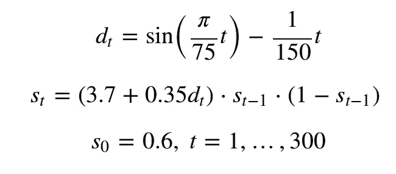
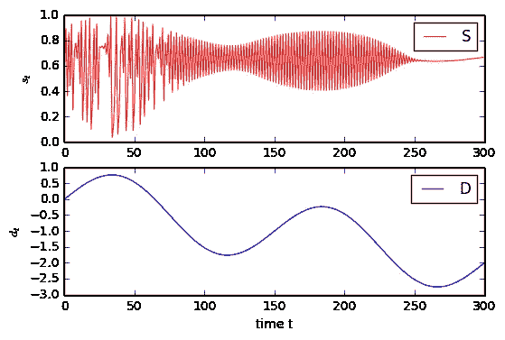
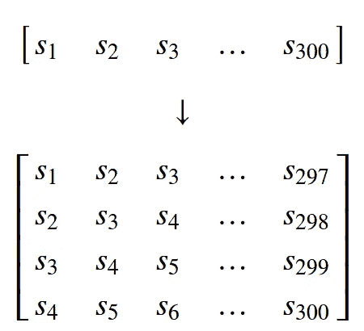
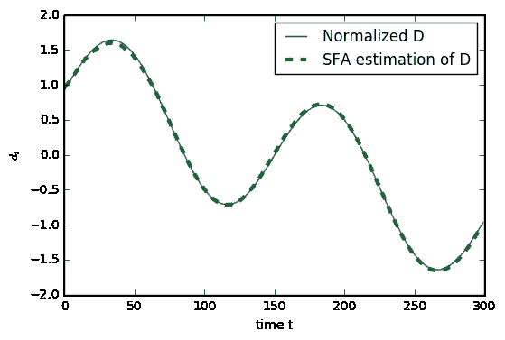
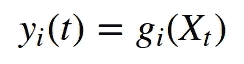
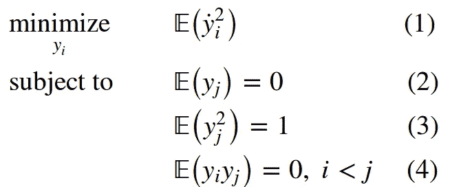
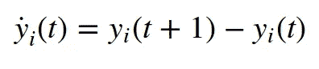
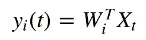
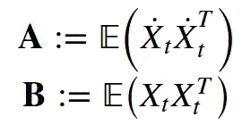

# 慢速特征分析快速介绍

> 原文：<https://towardsdatascience.com/a-brief-introduction-to-slow-feature-analysis-18c901bc2a58?source=collection_archive---------0----------------------->

[Photograph](https://en.wikipedia.org/wiki/File:Grapevinesnail_01.jpg) by [Jürgen Schoner](https://de.wikipedia.org/wiki/Benutzer:Heliodor) / [CC BY-SA 3.0](https://creativecommons.org/licenses/by-sa/3.0/deed.en)

## 使用 python 和数学的面向应用的 SFA 介绍

我最近开始在波鸿鲁尔大学攻读机器学习的博士学位。我加入的小组的一个主要研究课题叫做慢特征分析(SFA)。为了了解一个新的话题，在让自己沉浸在数学的严谨中之前，如果可能的话，我喜欢看例子和直观的解释。我写这篇博文是为了那些喜欢以类似方式研究主题的人，因为我相信 SFA 是非常强大和有趣的。

在这篇文章中，我将以一个应用 SFA 的代码示例开始，来帮助激发这种方法。然后，我将更详细地介绍该方法背后的数学原理，最后提供该材料中其他优秀资源的链接。

## 1.确定平滑潜变量

SFA 是一种无监督学习方法，从时间序列中提取最平滑(最慢)的底层函数或*特征*。这可以用于降维、回归和分类。例如，我们可以有一个高度不稳定的序列，它是由一个行为更好的潜在变量决定的。

让我们从生成时间序列 *D* 和 *S:* 开始

这就是所谓的逻辑地图。通过绘制系列 *S* ，我们可以考察它的混沌本质。驱动上述曲线行为的基本时间序列 *D* 要简单得多:

我们如何从不稳定的时间序列中确定简单的潜在驱动力？

我们可以用 SFA 来确定一个函数变化最慢的特征。在我们的例子中，我们将从像 *S* 这样的数据开始，以 *D* 结束，而不必事先知道 *S* 是如何生成的。

SFA 的实现旨在找到输入的特征，这些特征是线性的。但是从我们的例子可以看出，驱动力 *D* 是高度非线性的！这可以通过首先对时间序列 *S* 进行非线性扩展来弥补，然后找到扩展数据的线性特征。通过这样做，我们发现了原始数据的非线性特征。

让我们通过堆叠 *S* 的时间延迟副本来创建一个新的多元时间序列:

接下来，我们对数据进行立方扩展，并提取 SFA 特征。三次展开将一个四维向量[ *a* 、 *b* 、 *c* 、*d*]ᵀ]变成 34 个元素向量，其中元素 *t* *、t v、tvu、t* *、tv、t* 为不同的 *t、u、v* ∈{a、b、c、d}。

请记住，添加时间延迟副本的最佳数量因问题而异。或者，如果原始数据维数过高，则需要进行降维，例如使用[主成分分析](https://en.wikipedia.org/wiki/Principal_component_analysis)。

因此，考虑以下是该方法的超参数:维度扩展(缩减)的方法、扩展(缩减)后的输出维度以及待发现的慢特征的数量。

现在，添加时间延迟副本后，时间序列的长度从 300 变为 297。因此，慢特征时间序列的相应长度也是 297。为了更好的可视化，我们将第一个值添加到它前面，并将最后一个值添加两次，从而将它的长度变为 300。SFA 发现的特征具有零均值和单位方差，因此在可视化结果之前，我们也对 *D* 进行归一化。

即使只考虑 300 个数据点，SFA 特性也能几乎完全恢复底层源代码——这令人印象深刻！

## 2.引擎盖下到底发生了什么？

理论上，SFA 算法接受一个(多变量)时间序列 ***X*** 和一个整数 *m* 作为输入，该整数表示要从该序列中提取的特征的数量，其中 *m* 小于时间序列的维数。该算法确定了 *m 个*函数

使得每个 *yᵢ* 的两个连续时间点的时间导数的平方的平均值最小化。直觉上，我们希望最大化这些特性的缓慢性:

其中点表示时间导数，在离散情况下:

目标函数(1)测量特征的慢度。零均值约束(2)使得特征的二阶矩和方差相等，并简化了符号。单位方差约束(3)丢弃常数解。

最后的约束(4)使我们的特征去相关，并导致它们的慢度排序。这意味着我们首先找到最慢的特征，然后我们找到下一个最慢的特征，它与前一个特征正交，依此类推。对特征进行去相关可以确保我们捕捉到最多的信息。

在接下来的内容中，我浏览了重要的细节并跳过了一些步骤，但是为了完整起见，我想把它包括进来。我建议也看看下面的链接，以获得更全面的解释。

让我们只考虑线性特征:

时间序列 X 可以是“原始数据”或其非线性扩展，见上例。请记住，即使这些是扩展数据的线性特征，它们也可能是原始数据的非线性特征。

假设零均值*，通过求解[广义特征值问题](https://en.wikipedia.org/wiki/Eigendecomposition_of_a_matrix#Generalized_eigenvalue_problem)***AW***=***bwλ***找到线性特征。我们确定 *m 个*特征值-特征向量元组( *λᵢ* ， *Wᵢ* )使得***a****wᵢ*=*λᵢ****b****我们有**

****

**标量 *λᵢ* 表示特征的慢度，即 *λᵢ* 越小，相应的 *yᵢ* 变化越慢。如果你熟悉广义特征值问题，注意这里的特征值是增加的——而不是减少的。最后，特征向量 *Wᵢ* 是定义我们学习特征的变换向量。**

## **3.进一步阅读**

**原文：<https://www.ini.rub.de/PEOPLE/wiskott/Reprints/WiskottSejnowski-2002-NeurComp-LearningInvariances.pdf>**

**SFA 在分类中的应用:[http://cogprints.org/4104/1/Berkes2005a-preprint.pdf](http://cogprints.org/4104/1/Berkes2005a-preprint.pdf)**

**以上例子改编自:[http://MDP-toolkit . SourceForge . net/examples/log map/log map . html](http://mdp-toolkit.sourceforge.net/examples/logmap/logmap.html)**

**—
在[推特](https://twitter.com/hlynurd)上关注我**

****