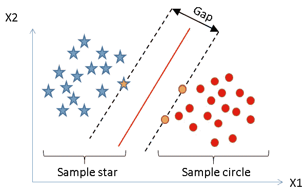
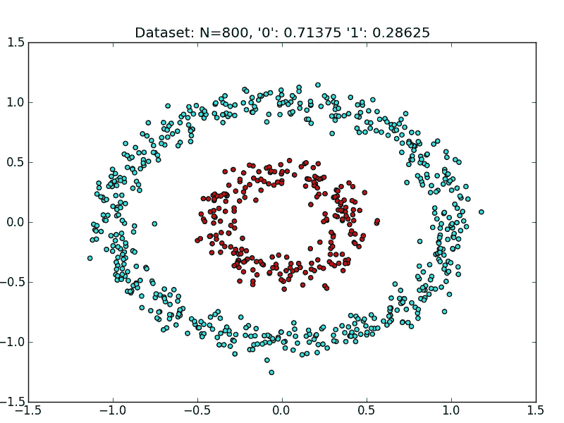
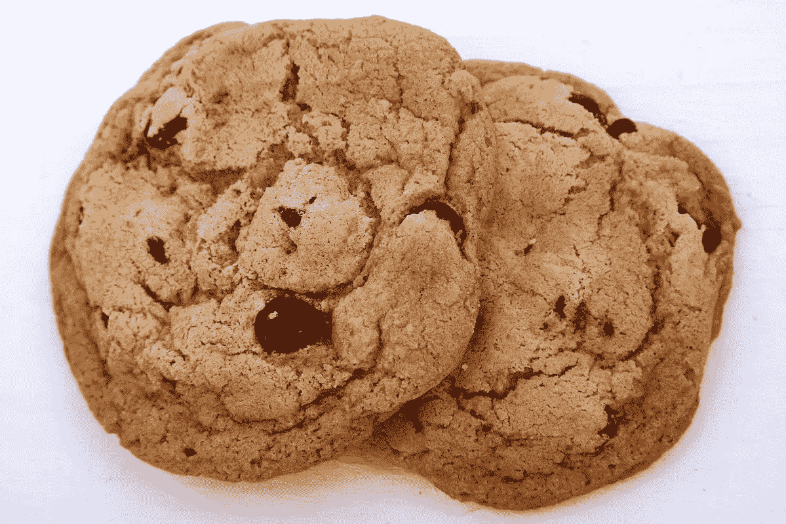

# 支持向量机简介

> 原文：<https://towardsdatascience.com/a-brief-introduction-to-support-vector-machine-adf0f103a80f?source=collection_archive---------14----------------------->


支持向量机(SVM)是最流行的机器学习分类器之一。它属于监督学习算法的范畴，并使用边缘的概念在类之间进行分类。它给出了比 KNN，决策树和朴素贝叶斯分类器更好的准确性，因此非常有用。

# 谁应该阅读这篇文章

任何对机器学习概念有所了解并对学习 SVM 感兴趣的人。如果你是这个领域的初学者，先浏览一下[这篇](/machine-learning-for-beginners-d247a9420dab)文章。

读完这篇文章，你会知道:

1.  SVM 到底是什么
2.  如何使用 Sklearn (Python)的 SVM 分类器
3.  调整其参数以获得更好的结果

所以让我们开始吧！

# 什么是 SVM？

如前所述，SVM 属于用于分类的监督算法类别。让我们从两个类的例子开始:

给定类 X1 和 X2，我们想要找到最好地分离这两个类的判定边界，即具有最小误差。

SVM 用一个 ***【超平面】*** 做到了这一点。这个超平面在二维数据的情况下可以是一条直线，在三维数据的情况下可以是一个平面。



不用深入幕后的数学，让我们了解一些基本的功能。

支持向量机使用了***‘支持向量*’**的概念，支持向量是离超平面最近的点。

在上面的例子中，红线表示分隔两个类(蓝色星形和红色圆形)的决策边界，连字符线表示我们的'***' Margin '***，即我们想要的两个类的支持向量之间的差距。

> 界限很重要

边缘是在支持向量的帮助下定义的(因此得名)。在我们的示例中，黄色的星星和黄色的圆圈是定义边距的支持向量。间隙越大，分类器工作得越好。因此，支持向量在开发分类器中起着重要的作用。

测试数据中的每一个新数据点都将根据这个余量进行分类。如果它位于它的右侧，它将被归类为红色圆圈，否则被归类为蓝色星星。

最棒的是，SVM 还可以对非线性数据进行分类。



在非线性数据的情况下，事情变得有点棘手。这里 SVM 使用了**K*ernel-trick*’**，它使用一个核函数将非线性数据映射到更高维度，这样它就变成线性的，并在那里找到决策边界。

无论是线性数据还是非线性数据，SVM 总是使用核函数，但当数据以其当前形式不可分时，它的主要功能就会发挥作用。这里，核函数为分类问题增加了维度。

现在让我们看一些代码。

# 使用支持向量机

在 Sklearn 的帮助下，您只需几行代码就可以利用 SVM 分类器的强大功能。

```
from sklearn import svm #Our linear classifier
clf = svm.SVC(kernel='linear') ''' 
X_train is your training data y_train are the corresponding labels y_pred are the predicted samples of the test data X_test 
'''#Training our classifier on training set with labels
clf.fit(X_train, y_train)#Predicting output on the Test set 
y_pred = clf.predict(X_test) #Finding the Accuracy 
print("Accuracy:",metrics.accuracy_score(y_test, y_pred))
```

在这种情况下，我们使用的是线性内核，如你所见。根据问题的不同，您可以使用不同类型的内核函数:

*   线性的
*   多项式
*   径向基函数
*   高斯的
*   拉普拉斯（侯爵）

…以及更多。选择正确的核函数对于构建分类器非常重要。在下一节中，我们将调整超参数，使我们的分类器更好。

你可以在这里访问完整的代码[。](https://github.com/aditya1994/Machine-Learning-Data-Science-Scripts/blob/master/SVM.py)

如果你觉得无聊，这里有一只可爱的猫！


# 调谐参数

**内核**:我们已经讨论过内核函数有多重要。根据问题的性质，必须选择正确的核函数，因为核函数定义了为问题选择的超平面。[这里的](https://data-flair.training/blogs/svm-kernel-functions/)是最常用的内核函数列表。

正规化:听说过过度拟合这个词吗？如果你没有，我认为你应该从这里的[学习一些基础知识。在 SVM，为了避免过度拟合，我们选择软边界，而不是硬边界，即我们故意让一些数据点进入我们的边界(但我们仍然惩罚它)，这样我们的分类器就不会过度拟合我们的训练样本。这里有一个重要的参数γ(γ),它控制 SVM 的过拟合。伽玛越高，超平面尝试匹配训练数据的程度越高。因此，选择最佳伽马值以避免过拟合和欠拟合是关键。](https://machinelearningmastery.com/overfitting-and-underfitting-with-machine-learning-algorithms/)

**误差罚分:**参数 C 代表对 SVM 错误分类的误差罚分。它保持了更平滑的超平面和错误分类之间的折衷。如前所述，为了避免分类器过拟合，我们允许一些错误分类。

这些是用于调整 SVM 分类器的最重要的参数。

总的来说，SVM 具有许多优点，因为它提供高精度，具有低复杂性，并且对于非线性数据也非常有效。缺点是，与朴素贝叶斯等其他算法相比，它需要更多的训练时间。

这就是支持向量机！如果你有任何问题，请在评论中告诉我。

恭喜你坚持到帖子的最后！

这是给你的饼干



> 如果你喜欢这篇文章，别忘了加上*掌声*！

*原载于 2018 年 11 月 2 日*[*【adityarohilla.com】*](https://adityarohilla.com/2018/11/02/a-brief-introduction-to-support-vector-machine/)*。*