# FlowNet 简介

> 原文：<https://towardsdatascience.com/a-brief-review-of-flownet-dca6bd574de0?source=collection_archive---------1----------------------->

## 最近，细胞神经网络已经成功地用于估计光流。与传统方法相比，这些方法在质量上有了很大的提高。在此，我们将对以下论文进行简要回顾。

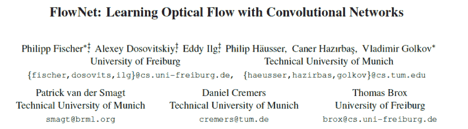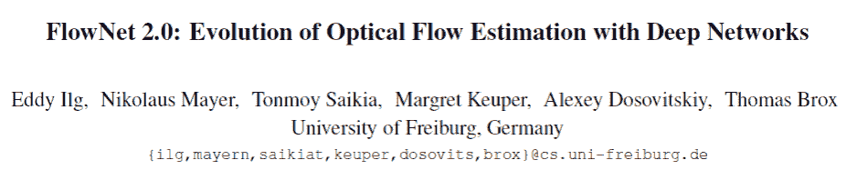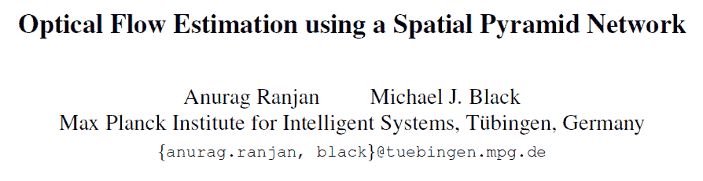

# 概观

卷积神经网络(CNN)在各种计算机视觉任务中做出了巨大贡献。最近，细胞神经网络已经成功地用于估计光流。与传统方法相比，这些方法在质量上有了很大的提高。在此，我们将对以下论文进行简要回顾。

FlowNet1.0 和 FlowNet2.0 都是端到端架构。FlowNet2.0 由 FlowNetCorr 和 FlowNet 堆叠而成，比 FlowNetCorr 和 flownet 都有好得多的结果。FlowNetS 简单地将两个顺序相邻的图像堆叠起来作为输入，而在 FlowNetCorr 中，两个图像被分别卷积，并通过一个相关层组合在一起。在空间金字塔网络中，作者为每一层独立训练一个深度网络来计算流量更新。SPyNet 和 FlowNet2.0 都以由粗到细的方式估计大的运动。FlowNet2.0 在这些架构中性能最好，SPyNet 的模型参数最少。

# FlowNet:用卷积网络学习光流

在 FlowNet1.0 中，本文提出并比较了两种架构:FlowNetSimple 和 FlowNetCorr。这两种架构都是端到端的学习方法。在 FlowNetSimple 中，如图 1 所示，作者简单地将两个顺序相邻的输入图像堆叠在一起，并通过网络传送它们。与 FlowNetSimple 相比，FlowNetCorr(图 2)首先分别产生两幅图像的表示，然后在“相关层”将它们结合在一起，一起学习更高的表示。这两种架构都有用于上采样分辨率的改进。

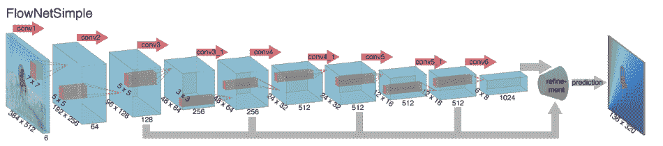

相关层用于在两个特征图之间执行乘法面片比较。更具体地，给定两个多通道特征图 f1、f2，其中 w、h 和 c 是它们的宽度、高度和通道数量。以第一个图中的 x1 和第二个图中的 x2 为中心的两个补片的“相关性”定义为:

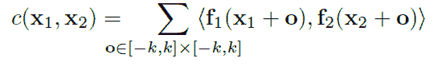

其中 x1 和 x2 分别是第一地图和第二地图的中心，并且大小为 K = 2k+1 的正方形空间面片。此外，出于计算原因，作者限制了最大位移。具体来说，对于每个位置 x1，作者通过计算大小为 D = 2d+1 的邻域中的相关性来限制 x2 的范围，D 是给定的最大位移。输出的大小是(w*h*D)。然后，作者将使用卷积层从 f1 提取的特征图与输出连接。

然而，在一系列卷积层和汇集层之后，分辨率已经降低。因此，作者通过“向上进化”层改进了粗略的池化表示，包括取消池化和向上进化。对特征图进行上变换后，作者将其与相应的特征图和上采样的粗流量预测连接起来。如图 3 所示

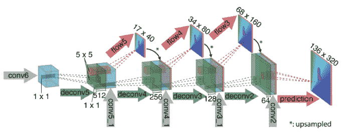

实际上，作者在 Github 上提供的模型与上图略有不同。图 3 的第二个框不仅包括来自 deconv5 和 con5_1 的特征图，还包括由以下流生成的流 6。

con V6—-(conv)—> con V6 _ 1—(conv)→predict _ flow 6—-(conv)—> flow 6

表 1。显示不同数据集上不同方法的平均终点误差(以像素为单位)。

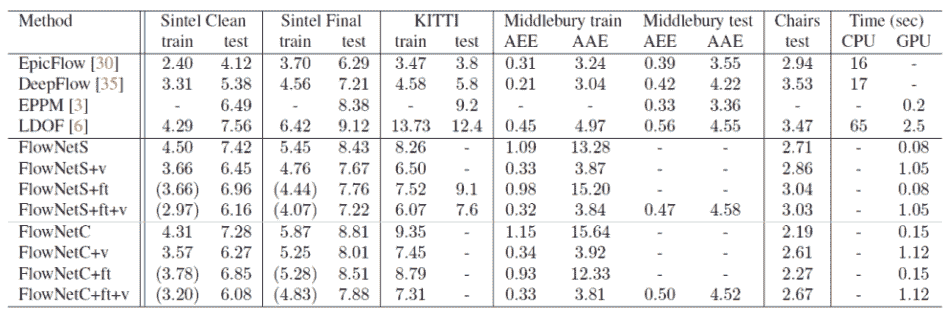

# FlowNet 2.0:深度网络光流估计的发展

# 简介和贡献

FlowNet2.0 比 FlowNet1.0 好得多，与 FlowNet1.0 相比，FlowNet2.0 在质量和速度上都有很大的提高。主要架构如图 7 所示。本文有四个主要贡献:

1.呈现数据的时间表在培训进度中很重要
2。提出了堆叠架构
3。介绍了一个专门研究小动作的子网络
4。提出了融合架构

# 数据测试计划

在实验中，不仅训练数据的种类对性能很重要，而且它在训练期间呈现的顺序也很重要。作者分别在椅子和 Things3D 上测试了 FlowNetS 和 FlowNetCorr。图 5 显示了使用不同学习速率表的两个数据集样本的等量混合。S_short、S_long 和 S_fine 是不同的学习速率表，如图 6 所示。图 5 中的数字表示 Sintel 数据集的终点误差。从图 5 中，我们可以知道最好的结果是先在椅子上训练，然后在 Things3D 上微调。

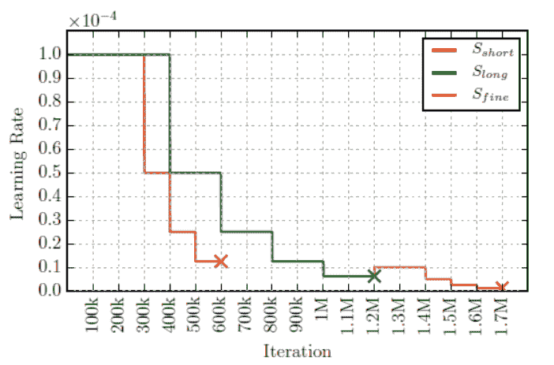

# 堆叠网络

为了计算光流的大位移，作者叠加了流网和流网校正，如图 7 所示。表 3 显示了叠加流网的效果，其中应用了图 5 中的最佳流网。第一流网获取图像 I1 和 I2 作为输入，第二流网获取图像 I1、由第一流网计算的流 wi、由流 wi 扭曲的图像 I2 以及由流 wi 扭曲的图像 I1 和图像 I2 之间的亮度差误差。

在训练栈结构中有两种方法:固定第一网络的权重，或者与第二网络一起更新它们。结果如表 3 所示，从中我们可以看出，当固定 Net1 并用 warping 训练 Net2 时，在 Sintel 上获得了最好的结果。

此外，作者确实对堆叠多个不同的网络进行了实验，他们发现多次堆叠具有相同权重的网络，并对这种循环的过去进行微调不会改善结果。因此，他们添加了不同权重的网络，每个新网络首先在椅子上进行训练，并在 Things3D 上进行微调。最后，他们通过平衡网络精度和运行时间来实施 FlowNet2-CSS。FlowNetCorr 是 FlowNet2-CSS 的第一个网络，后面是两个 FlowNet，如图 7 所示的第一个流

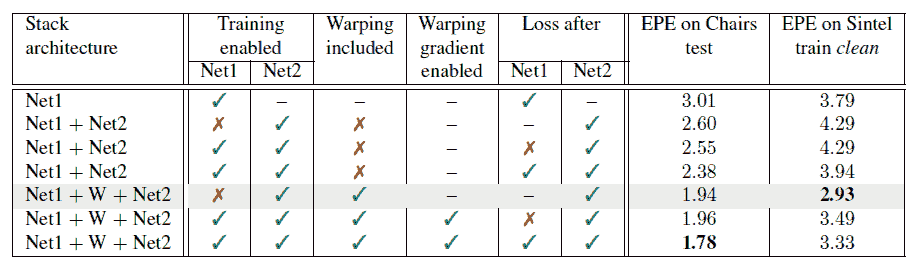

# 小位移网络与融合

但是，对于小排量，FlowNet2-CSS 并不可靠。因此，作者创建了一个具有小位移的小数据集，并在该数据集中训练 FlowNetSD。FlowNetSD 与 FlowNetS 略有不同。他们用多个 3*3 内核替换了开头的 7*7 和 5*5 内核，去掉了第一层的 stride 2。最后，作者引入了一个小而简单的深度网络(Fusion)来融合 FlowNet2-CSS 和 FlowNet2-SD 的输出，如图 7 所示。

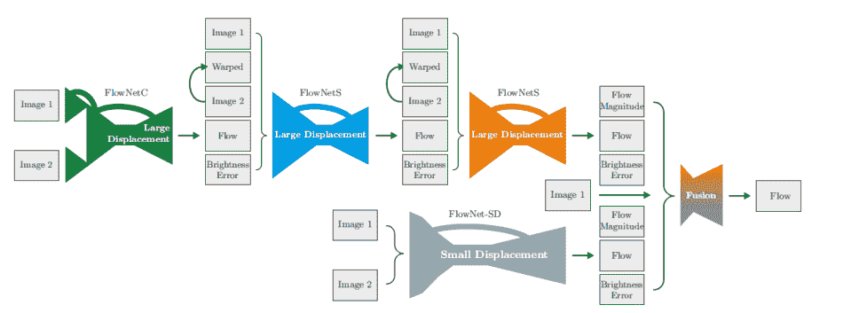

# 表演

表 4 显示了不同基准测试的性能。AEE:平均终点误差；Fl-all:流量估计误差为 3 个像素和 5%的像素比率。在 Sintel、Sintel final 和 Middlebury 中，FlowNet2 在准确率上超越了所有其他参考方法，在其他准确率相对较高的数据集上也表现良好。

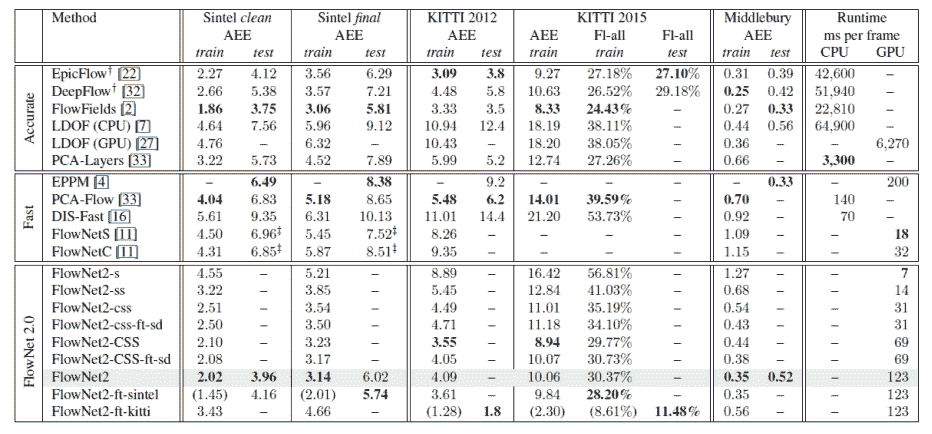

# 使用空间金字塔网络的光流估计

# 介绍

将经典的空间金字塔模型与深度学习相结合，提出了一种新的光流方法。这是一种由粗到细的方法。在空间金字塔的每一层，作者训练一个深度神经网络来估计流量，而不是只训练一个深度网络。这种方法对于任意大的运动是有益的，因为每个网络要做的工作较少，并且每个网络上的运动变得较小。与 FlowNet 相比，SPyNet 要简单得多，在模型参数方面要小 96%。此外，对于一些标准基准，SPyNet 比 FlowNet1.0 更准确。

# 体系结构

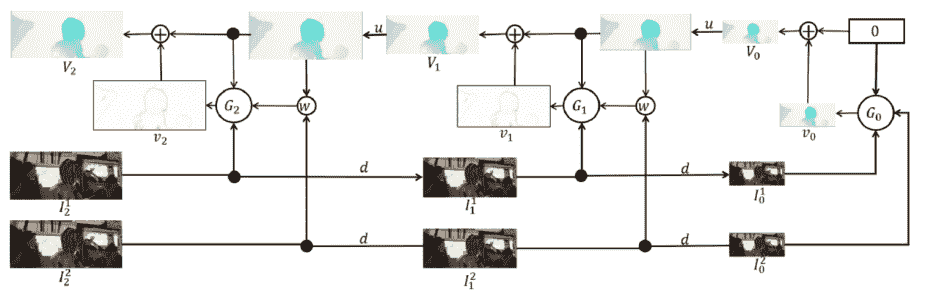

图 8 显示了一个三级金字塔网络:

*   d()是将 m*n 图像 I 减小到 m/2*n/2 的下采样函数
*   u()是重采样光流场的重采样函数
*   w(I，V)用于根据光流场 V 扭曲图像 I
*   { G0，…，GK }是一组经过训练的卷积神经网络
*   v_k 是由 convnet Gk 在第 k 个金字塔级计算的剩余流量

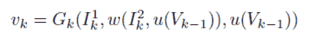

在第 k 个金字塔等级，剩余流量 v_k 由 G_k 使用 I_k1(来自前一个金字塔的上采样流量)和 I_k2 计算，I _ k2 由上采样流量补偿。那么，流量 V_k 可以表示为

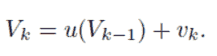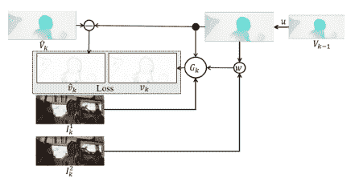

修道院{ G0，…GK }被独立地训练以计算残差流 v_k。此外，地面真实残差流 V^_k 是通过减去下采样地面真实流 v^_k 和 u(V_k-1)获得的。如图 6 所示，作者通过最小化剩余流 v_k 上的平均端点误差(EPE)损失来训练网络

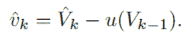

# 表演

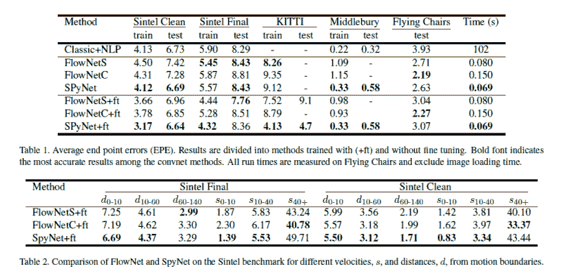

# 个人观点

与 Flownet 1.0 相比，Flownet 2.0 的精度更高的原因是，通过使用堆叠结构和融合网络，网络模型更大。对于堆叠结构，它通过用中间光流扭曲每一层的第二图像，以由粗到细的方式估计大的运动，并计算流更新。因此，这种方法降低了每一级学习任务的难度，为大位移做出了贡献。对于融合网络，作者引入了 FlowNet2-CSS 和 FlowNet2-SD 来分别估计大位移和小位移。然后，融合网络旨在更好地融合从上述两个网络学习到的两种光流，期望提高最终预测光流的整体质量。

从我的角度来看，重复使用特征映射对 FlowNet1.0 和 FlowNet2.0 的良好性能产生了影响。作者将估计流量和输入连接在一起，这些流量和输入在当前层中被上采样为特征映射，从与当前层的上采样输入相同分辨率的前层获得，作为下一个去卷积层的输入，因此这些特征映射可以重复使用，在设计概念上与 DenseNet 有点类似。

SPyNet 也是一个堆叠网络。它也适合通过使用由粗到细的方法来处理大位移，类似于 FlowNet2.0。flownet 2.0 和 SPyNet 的区别在于，SPyNet 比 flownet 2.0 小得多，SPyNet 的每一层都是独立训练的深度网络。SPyNet 的模型参数比 FlowNet 少很多，因为它是直接使用 warping 函数，女修道院不需要学习。

总的来说，FlowNet2.0 的性能最好，而 SPyNet 要轻量得多，参数更少，速度更快，可以在移动终端上使用。

FlowNet:用卷积网络学习光流链接:
[https://arxiv.org/pdf/1504.06852](https://arxiv.org/pdf/1504.06852) FlowNet 2.0 论文链接:
[https://lmb . informatik . uni-freiburg . de/Publications/2017/imk db 17/Paper-FlowNet _ 2 _ 0 _ _ cvpr . pdf](https://lmb.informatik.uni-freiburg.de/Publications/2017/IMKDB17/paper-FlowNet_2_0__CVPR.pdf)
利用空间金字塔网络的光流估计链接:
[https://arxiv.org/pdf/1611.00850.pdf](https://arxiv.org/pdf/1611.00850.pdf)

**作者**:李子云| **编辑**:杨| **由 Synced 全球团队本地化**:陈翔