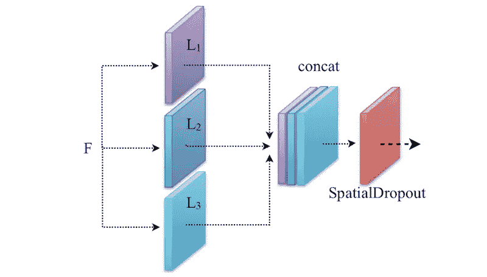
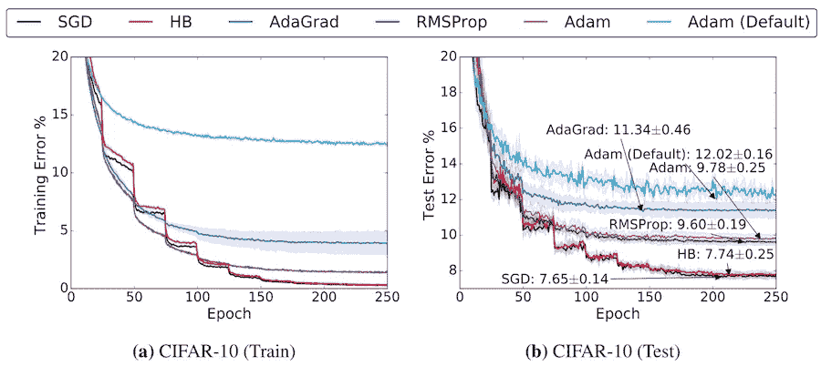

# 一堆训练深度神经网络的技巧和窍门

> 原文：<https://towardsdatascience.com/a-bunch-of-tips-and-tricks-for-training-deep-neural-networks-3ca24c31ddc8?source=collection_archive---------3----------------------->

I took this nice photo in GüvenPark

训练深度神经网络是困难的。它需要知识和经验，以便正确地训练和获得最佳模型。在这篇文章中，我想分享我在训练深度神经网络中所学到的东西。以下提示和技巧可能对您的研究有益，可以帮助您加快网络架构或参数搜索的速度。

哦，让我们开始吧…

**①。**在开始构建您的网络架构之前，您需要做的第一件事是验证您输入到网络中的数据是否与标签(y)相对应。在密集预测的情况下，请确保地面实况标签(y)被正确编码为标签索引(或一次性编码)。如果没有，培训就没有效果。

**2)。**决定是使用预先训练好的模型还是从头开始训练你的网络？

*   如果您的问题域中的数据集与 [ImageNet 数据集](http://www.image-net.org/challenges/LSVRC/2012/)相似，请对该数据集使用预训练模型。使用最广泛的预训练模型有 [VGG](https://arxiv.org/abs/1409.1556) 网、[雷斯网](https://arxiv.org/abs/1512.03385)、[丹森网](https://arxiv.org/abs/1608.06993)或[例外](https://arxiv.org/abs/1610.02357)等。有许多层结构，例如，VGG (19 和 16 层)，雷斯网(152，101，50 层或更少)，DenseNet (201，169 和 121 层)。**注意**:不要尝试使用更多的层网络来搜索超参数(例如*VGG-19、ResNet-152 或 DenseNet-201 层网络，因为其计算成本很高*)，而是使用更少的层网络(*例如 VGG-16、ResNet-50 或 DenseNet-121 层*)。选择一个预训练的模型，您认为它可以提供您的超参数的最佳性能(*比如 ResNet-50 层*)。获得最佳超参数后，只需选择相同但更多的层网(*如 ResNet-101 或 ResNet-152 层*)来提高精度。
*   微调几个层或只训练分类器，如果你有一个小数据集，你也可以尝试在你要微调的卷积层后插入 [Dropout](http://jmlr.org/papers/v15/srivastava14a.html) 层，因为它可以帮助对抗网络中的过度拟合。
*   如果您的数据集与 [ImageNet 数据集](http://www.image-net.org/challenges/LSVRC/2012/)不相似，您可以考虑从头开始构建和训练您的网络。

**③。**在您的网络中始终使用标准化图层。如果你用一个大的*批量*(比如 10 或更多)来训练网络，使用[批量标准化](https://arxiv.org/abs/1502.03167)层。否则，如果你用一个小的*批量*(比方说 1)训练，用[实例规范化](https://arxiv.org/abs/1607.08022)层代替。请注意，主要作者发现，如果增加*批处理大小*，批处理标准化会提高性能，而当*批处理大小*小时，它会降低性能。然而，如果他们使用小的*批处理大小*，实例规范化会稍微提高性能。或者你也可以尝试[分组规范化](https://arxiv.org/abs/1803.08494)。

**4)。**如果你有两个或更多的卷积层(*比如李*)在同一个输入(*比如 F* )上操作，那么在一个特征拼接之后使用[空间删除](https://arxiv.org/abs/1411.4280)。由于这些卷积层对相同的输入进行操作，因此输出特征很可能是相关的。因此，空间丢失会移除那些相关的特征，并防止网络中的过度拟合。**注**:多用于低层而非高层。

SpatialDropout use-case

**5)。**为了确定你的网络能力，试着用一小部分训练样本来充实你的网络。如果它没有超载，增加你的网络容量。过度拟合后，使用正则化技术，如 [L1](https://keras.io/regularizers/) 、 [L2](https://keras.io/regularizers/) 、[辍学](http://jmlr.org/papers/v15/srivastava14a.html)或其他技术来对抗过度拟合。

**6)。**另一个正则化技术是约束或限制你的网络权重。这也有助于防止网络中的梯度爆炸问题，因为权重总是有界的。与在损失函数中惩罚高权重的 L2 正则化相反，该约束直接正则化您的权重。可以在 Keras 中轻松设置权重约束:

**7)。**从数据中平均减法有时会给出非常差的性能，尤其是从灰度图像中减法(*我个人在前景分割领域面临这个问题*)。

**⑧。**总是打乱你的训练数据，训练前的*和训练中的*和*，以防你没有从时间数据中获益。这可能有助于提高网络性能。*

***9)。**如果您的问题域与密集预测相关(*例如语义分割*，我建议您使用[扩张残差网络](https://arxiv.org/abs/1705.09914)作为预训练模型，因为它针对密集预测进行了优化。*

***10)** 。要捕获对象周围的上下文信息，请使用多尺度要素池模块。这可以进一步帮助提高准确性，这一思想已成功用于[语义分割](https://arxiv.org/abs/1802.02611)或[前景分割](https://arxiv.org/abs/1808.01477)。*

***11)。**从损失或准确性计算中剔除无效标签(或模糊区域)(如果有)。这可以帮助你的网络在预测时更加自信。*

***12)。**如果您有高度*不平衡数据问题*，请在训练期间应用*类别权重*。换句话说，给稀有类更多的权重，给主要类更少的权重。使用 [sklearn](http://scikit-learn.org/stable/modules/generated/sklearn.utils.class_weight.compute_class_weight.html) 可以轻松计算类别权重。或者尝试使用[过采样和欠采样技术](https://en.wikipedia.org/wiki/Oversampling_and_undersampling_in_data_analysis)对训练集进行重新采样。这也有助于提高你预测的准确性。*

***13)。**选择合适的优化器。有许多流行的自适应优化器，如[亚当](https://arxiv.org/abs/1412.6980)、[阿达格拉德](http://www.jmlr.org/papers/volume12/duchi11a/duchi11a.pdf)、[阿达德尔塔](https://arxiv.org/abs/1212.5701)或 [RMSprop](http://www.cs.toronto.edu/~tijmen/csc321/slides/lecture_slides_lec6.pdf) 等。 [SGD+momentum](http://cs231n.github.io/neural-networks-3/#sgd) 广泛应用于各种问题域。有两件事需要考虑:F **首先**，如果你关心快速收敛，使用 Adam 之类的自适应优化器，但它可能会以某种方式陷入局部最小值，并提供较差的泛化能力(如下图)。**第二个**， *SGD+momentum* 可以实现找到一个全局最小值，但是它依赖于健壮的初始化，并且可能比其他自适应优化器需要更长的时间来收敛(下图)。我推荐你使用 *SGD+momentum* ，因为它会达到更好的效果。*

**

*This image borrowed from [https://arxiv.org/abs/1705.08292](https://arxiv.org/abs/1705.08292)*

***14)。**有三个学习率起点(即 1e-1、1e-3 和 1e-6)。如果对预训练模型进行微调，可以考虑小于 1e-3 的低学习率(*说 1e-4* )。如果你从头开始训练你的网络，考虑学习率大于或等于 1e-3。你可以试试这些起点，调整一下，看看哪个效果最好，挑那个。还有一件事，你可以考虑通过使用[学习率调度器](https://keras.io/callbacks/#learningratescheduler)来降低学习率。这也有助于提高网络性能。*

***15)。**除了随着时间降低学习率的[学习率计划表](https://keras.io/callbacks/#learningratescheduler)之外，还有另一种方法，如果*验证损失*在某些时期(*说 5* )停止改善，并且如果*验证损失*在某些时期(*说 10* )停止改善，我们可以通过某些因素降低学习率(*说 10* )。这可以通过在 Keras 中使用[减速板](https://keras.io/callbacks/#reducelronplateau)和[提前停止](https://keras.io/callbacks/#earlystopping)轻松完成。*

***16)。**如果您在密集预测领域工作，如[前景分割](https://en.wikipedia.org/wiki/Foreground_detection)或[语义分割](https://en.wikipedia.org/wiki/Image_segmentation)，您应该使用[跳过连接](https://arxiv.org/abs/1505.04597)，因为最大池操作或步长卷积会丢失对象边界或有用信息。这也可以帮助你的网络容易地学习从特征空间到图像空间的特征映射，并且可以帮助缓解网络中的消失梯度问题。*

***17)。**更多的数据胜过巧妙的算法！总是使用数据增强，如水平翻转，旋转，缩放裁剪等。这有助于大幅提高精确度。*

***18)。**你必须有一个用于训练的高速图形处理器，但这有点昂贵。如果你希望使用免费的云 GPU，我推荐使用 [Google Colab](https://colab.research.google.com/notebooks/welcome.ipynb#recent=true) 。如果你不知道从哪里开始，可以看看我的[上一篇](/a-comprehensive-guide-on-how-to-fine-tune-deep-neural-networks-using-keras-on-google-colab-free-daaaa0aced8f)或者尝试各种云 GPU 平台，比如 [Floydhub](https://www.floydhub.com) 或者 [Paperspace](https://www.paperspace.com) 等等。*

***19)。**在 [ReLU](https://en.wikipedia.org/wiki/Rectifier_(neural_networks)) 之前使用 Max-pooling 以节省一些计算。因为 ReLU 阈值为零:`f(x)=max(0,x)`和最大池仅最大激活:`f(x)=max(x1,x2,...,xi)`，所以使用`Conv > MaxPool > ReLU`而不是`Conv > ReLU > MaxPool`。*

***例如**假设我们有两个来自`Conv`的激活(即 0.5 和-0.5):*

*   *所以`MaxPool > ReLU = max(0, max(0.5,-0.5)) = 0.5`*
*   *和`ReLU > MaxPool = max(max(0,0.5), max(0,-0.5)) = 0.5`*

*看到了吗？这两个操作的输出仍然是`0.5`。在这种情况下，使用`MaxPool > ReLU`可以为我们省去一个`max`操作。*

***20)。**考虑使用[深度方向可分离卷积](https://arxiv.org/abs/1610.02357)运算，与普通卷积运算相比，该运算速度快，并大大减少了参数数量。*

***21)。最后但同样重要的是，不要放弃💪。相信自己，你能行！如果你仍然没有达到你所期望的高精度，调整你的超参数、网络架构或训练数据，直到你达到你所期望的精度👏。***

# *最后的话…*

*如果你喜欢这个帖子，请随意鼓掌或分享给全世界。如果你有任何问题，请在下面留言。你可以在 [LinkedIn](http://www.linkedin.com/in/longang-snow) 上联系我，或者在 [Twitter](https://twitter.com/LongAngLim1) 上关注我。过得愉快🎊。*