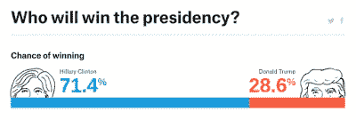
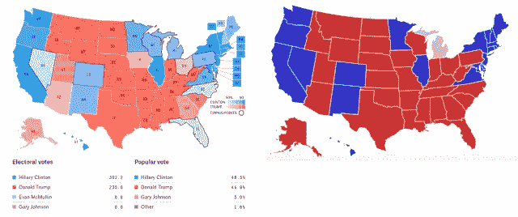
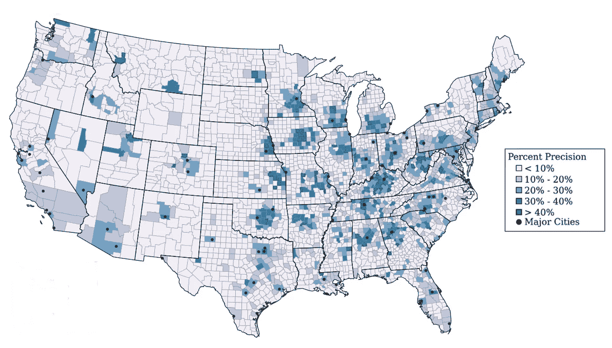

# 与艾伦·唐尼关于数据科学的坦诚对话

> 原文：<https://towardsdatascience.com/a-candid-conversation-about-data-science-with-allen-downey-a147d39bc38c?source=collection_archive---------1----------------------->

*我们在这里讨论 1)对非技术受众的态度如何影响数据科学家的工作，以及 2)如何定义算法偏差，以及在解决这些问题时需要注意数据科学管道的哪些部分。*

Listen to my podcast conversation with Allen Downey, CS professor at Olin College and author of open source textbooks like *Think Stats, Think Bayes, Think Complexity, and Think Python.*

*欢迎来到坦诚的机器学习对话。我是 Ryan Louie，我采访了机器学习从业者，了解他们职业背后的思考。*

本周，我和[艾伦·唐尼](http://www.allendowney.com/wp/)聊天，他是奥林学院的计算机科学教授。他教授贝叶斯统计、数据科学、建模与仿真、复杂性科学和软件系统的本科课程。在课堂之外，他是一名作家和博客作者。他的开源教材系列“Think X”被奥林大学和其他学校的许多班级使用。“Think X”系列试图通过采用计算方法来使科学或工程主题更容易理解，这种方法更倾向于用代码来演示概念，而不是编写数学。他还通过他关于统计学的博客“[可能想多了](http://allendowney.blogspot.com/)”展示了数据探索，并解释了可能不会写进他的书里的概念

# 有趣的视角

与艾伦的交谈让我对自己的几个问题有了新的认识。

# 1.数据科学家如何与非技术受众进行互动？共情在一个数据科学家的工作中是如何发挥作用的？

我读了艾伦写的关于 2016 年选举概率预测的[问题陈述的博文。在写这篇评论时，艾伦小心翼翼地避免了他所谓的“统计唠叨”](http://allendowney.blogspot.com/2016/11/problematic-presentation-of.html)

> “我认为统计学作为一个领域受到……这种几乎对立的关系的困扰。“每个人都是白痴，我们知道如何做好事情，但没有人会听我们的，他们不断犯同样的愚蠢错误，我们的工作就是大声斥责他们，”—艾伦·唐尼

受到批评的选举预测是 FiveThirtyEight 和《纽约时报》发布的“结果”，这两家网站使用选举日之前几个月的民意调查统计分析来预测谁将赢得总统大选。

([Image Source](http://allendowney.blogspot.com/2016/11/problematic-presentation-of.html)) The numbers presented by FiveThirtyEight here represent the probability that a simulation would result in a Hillary or Trump win. Problem #1: People better understand the results if rephrased as “Trump has little less than 1 in 3 chance of winning” if the frequency hypothesis is true. Problem #2: reporting probabilities of victory can be confused with proportions of the vote. Problem #3: presenting numbers with 3 significant digits might be misinterpreted as a false sense of precision.

([Image Source](http://allendowney.blogspot.com/2016/11/problematic-presentation-of.html)) There’s a convention of showing predictive maps with swing states colored light blue, “Leaning Democrat,” and pink “Leaning Republican”. Problem #4: The results don’t look like the predictions because in the results all the states are either dark red or dark blue. There is no pink in the electoral college. This visual mismatch between forecasts and actual results is a reason for readers to be unhappy.

艾伦的博客帖子没有统计学家素以唠叨著称的语气，他提出的在选举季期间发布不同选举预测模拟的解决方案是有充分理由的，同时也不是对抗性的。他指出了现状可视化遭受的原则性问题，然后解释了为什么选举模型的替代呈现通过避免这些陷阱使预测更容易理解。

> “我试图首先表现出同情。我没有说这是因为人们是白痴而出错，它也没有因为提出预测的人犯了严重的错误而出错。它之所以出错，是因为很难(让数据呈现清晰易懂)，我们可以做一些事情来帮助解决这个问题。”—艾伦·唐尼

我很欣赏 Allen 意识到在从事统计、设计、工程或数据科学时，傲慢会成为一个问题。从 Allen 的观点来看，这种对待外行人的不良态度的“经典工程师错误”对摆在分析消费者或软件产品用户面前的创作有不利影响。

> “同样，我们设计用户界面，利用我们擅长的东西，避免踩上我们不擅长的地雷——数据可视化也是如此，呈现概率也是如此——利用我们的优势，比如我们的视觉系统，它非常擅长快速吸收大量信息，但避免呈现小概率，因为人们无法使用它们。”—艾伦·唐尼

Allen 从用户界面设计方法和实现有效数据可视化所需的思考之间的类比中得到了一些深刻的东西。

*   对于面向大量观众的可视化来说，测试可视化将如何被解释是非常重要的。用户界面设计的类似物是纸上原型或交互式模型。
*   用户将试图根据他们的直觉与创作互动。艾伦指出，“我们无法修复人们的直觉。”如果浏览者的直觉导致他们在数据分析中得出错误的结论，这应该是分析的创造者的错误。如果用户的直觉导致他们在软件上按了错误的按钮，设计者有责任让它更容易使用。

我与 Allen 的谈话加深了我对数据科学家对非技术受众的态度如何影响他们工作的理解。他对选举预测读者的态度是宽容的。他把理解概率预测的困难归结为数据消费者可以理解的经历的许多问题。艾伦提出的呈现选举预测模型的解决方案将这些问题作为用户洞察，并将其转化为贯穿其设计的需求。

当然，包容的态度表明，作为数据科学家，我们渴望与任何有兴趣倾听的人分享见解。我希望，如果更多的从业者采取这种态度，数据科学作为一个领域可以向前迈进，打破它和受实践影响的每个人之间的墙。

# 2.偏见是一个被过度使用的术语，用来描述数据科学家必须小心的许多问题

我用来获取 Allen 对某个主题的意见的一种方法是阅读一段我与其他数据科学从业者交谈时引用的话。一句话警告说，根据有偏差的数据训练的预测模型将模仿我们当前世界中存在的同样的偏差。

> “有一种危险是，机器学习模型可能会增加另一层……惰性。因为如果你有一个根据历史训练数据训练的模型，你用这个模型来做关于未来的决策，它会做出与它看到的历史数据一致的决策。因此，如果在训练集中输入歧视的例子，它可能会强化现有的偏见或歧视的例子。如果我们有机器学习模型来做这些决定，这可能会让社会变革变得更加困难。”—麦迪逊·梅

艾伦同意这个非常真实的警告:“当你把一个预测模型放入一个系统时，它会改变这个系统，你需要考虑这会产生什么影响。”在深入研究他是如何将这个想法与自己的工作联系起来之前，他试图通过使用*这个词来消除他所看到的多重含义*

1.  ***输入中的偏差**:训练数据的样本不能代表总体——这是总体中有偏差的样本。*
2.  ***结果偏差** **( *“差异影响”* )** :预测系统中的错误会对一个非常可识别的群体产生不良后果。*

> *“你输入的统计偏差会在世界上造成不同的影响”——艾伦·唐尼*

*在我的探索过程中，我发现[学术工作在调查抽样偏差和差异影响如何与社交媒体平台上农村和城市用户的案例研究相关联](http://www.brenthecht.com/publications/chi17_urbanruralgeolocationbias.pdf)。作者研究了应用于 Twitter 等社交媒体数据的地理位置推断算法中存在的算法偏差。推断社交媒体用户的地理位置很重要，因为大量使用 Twitter 数据的研究和应用需要地理数据；然而，只有大约 2%的 Twitter 数据被明确地理标记，剩下的 98%有待推断。*

*社交媒体用户中的人口偏见可能会影响地理定位算法的工作效果。更多城市用户相对于农村用户的倾斜导致代表不足的农村阶层的地理位置预测较差。这一结果符合这样一种观点，即输入中的偏差会对可识别的人群产生不同的影响。*

*事实上，研究的问题是“算法偏差存在吗？”在本案例研究中得到证实。该算法的输入数据显示了明显的人口偏差:与基于美国人口普查的真实人口数字相比，210%的城市用户代表过多，45%的农村用户代表不足。基于文本的地理定位算法通过从“文本(在推文中找到的)中找到某个区域的词汇特征和概念”(例如，运动队、地区方言、城镇名称)中找到模式来工作*

**

*([Image Source](http://www.brenthecht.com/publications/chi17_urbanruralgeolocationbias.pdf)) **The status quo of how geolocation models trained on population-biased input data reveal differential impacts for rural social media users**. The authors’ description of the figure: “Text-based geolocation baseline precision by county (percentage of tweets originating from each county correctly geolocated to within 100km of each tweet’s true location).”*

*两个阶层之间的不平衡——在这个案例研究中是农村和城市——是机器学习实践中经常出现的问题。通常提供的答案是对类进行过采样，以应对输入中的总体偏差。如果农村用户一直被预测为比城市用户更差的程度，你最好收集更多关于农村用户的数据。*

*论文中提出的其他研究问题— *“是由于人口偏差导致的观察偏差”*和*“我们可以通过过采样来修正偏差吗”*试图通过调整输入训练数据中城市和农村用户的分布来对抗不公平的预测。他们的发现对我作为数据科学家从业者被告知的建议提出了质疑。通过修正农村人口偏差以与美国人口普查保持一致，该算法的差异影响并未得到解决。用城市和农村用户数量相等的输入数据对算法进行重新训练，并没有产生公平的预测。*

*老实说，我仍在思考如何理解这一切，以及如何努力防止算法偏差。描绘出导致算法偏差的组成部分很有启发性，我已经在用艾伦对*算法偏差*的重新表述作为*差异影响*来更清楚地说明我强调的问题。*

*阅读算法偏差文献的论文帮助我认识到，我没有意识到识别和纠正有偏差算法的不同影响的细微差别。我接触过的网上资源([此处](http://machinelearningmastery.com/tactics-to-combat-imbalanced-classes-in-your-machine-learning-dataset/)和[此处](https://svds.com/learning-imbalanced-classes/))确实对数据不平衡的问题做了深入的技术解释；然而，他们很少迫使我批判性地思考阶级失衡如何与伦理问题和数据科学中不同影响的其他原因相关联。*

*我渴望成为一名工程师，认识到与公平和我的算法的不同影响相关的问题。这些问题往往在团队的待办事项列表中被推到较低的位置，以利于其他任务，如快速部署和增加模型的整体准确性。然而，我认为，通过更多地了解对抗差异影响的各种方法，解决这些重要问题就变得不那么像一门艺术，而更像一门科学。通过更好地理解过采样等方法在修复输入数据中的总体偏差时的优劣，我可以在我的团队中更有效地发表意见，通过系统的工程流程来确定优先级和解决差异影响。*