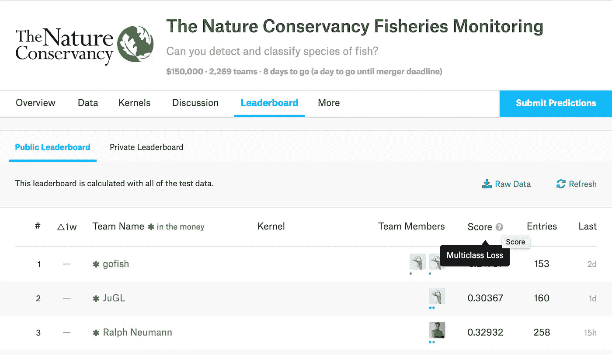
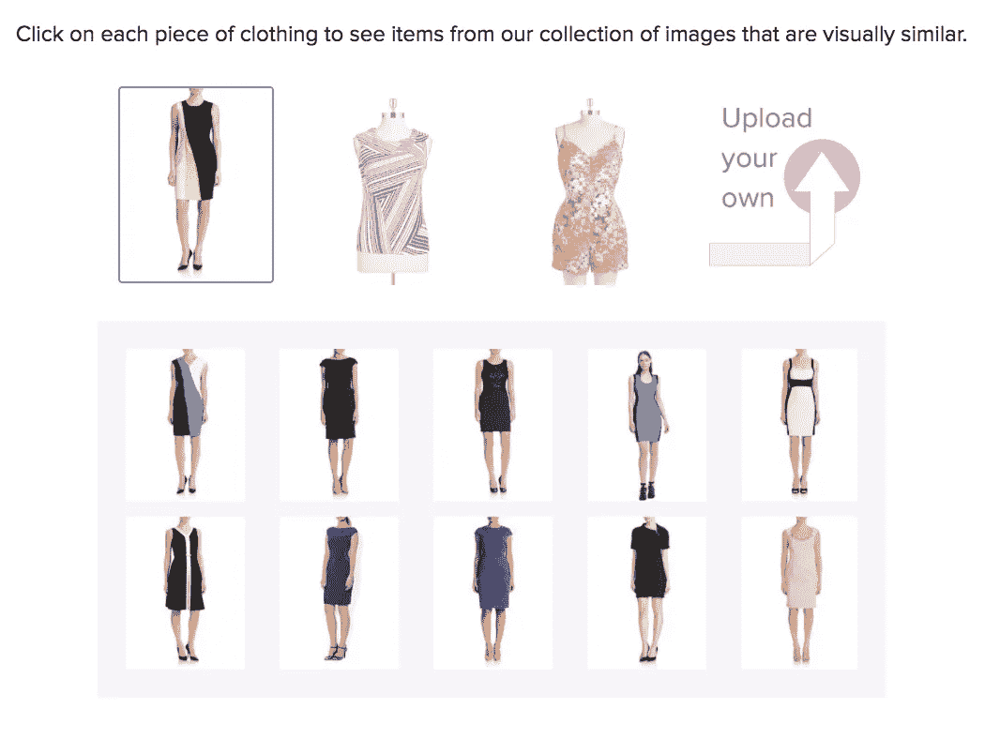

# 与麦迪逊·梅关于机器学习的坦诚对话

> 原文：<https://towardsdatascience.com/a-candid-conversation-about-machine-learning-with-madison-may-fdfd1dd60b22?source=collection_archive---------5----------------------->

欢迎来到坦诚的机器学习对话。我是 Ryan Louie，我采访了机器学习从业者，了解他们职业背后的思考。

My full conversation with Madison May, a machine learning practitioner and CTO of text/image machine learning startup indico

自 2014 年秋季以来，麦迪逊·梅一直是总部位于波士顿的机器学习初创公司 [indico](https://indico.io/) 的首席技术官。在 Madison 在 indico *(是的，那是小写的“I”)*工作之前，他是一名本科计算机科学学生，就读于[奥林学院](http://www.olin.edu/)。对于不熟悉奥林学院社区的读者来说， [indico 是学院最成功的创业故事之一](http://www.olin.edu/news-events/2014/olin-college-startup-indico-announces-funding/)。麦迪逊描述他如何与 indico 扯上关系的方式是对他是什么样的人的坦率看法。

Please listen as Madison describes how he got to where he is today — as CTO of machine learning startup indico.

我有幸在 2015 年夏天在 indico 实习，因此我对 indico 作为一家公司以及 Madison 作为 CTO 在其中的角色非常熟悉。我们没有花太多时间就开始进行有意义的讨论，讨论在部署机器学习模型供世界使用时需要的深思熟虑。

现在，我将讨论我们谈话中出现的一些亮点。

# **1。你如何衡量一个 ML 模型的成功？您如何知道何时部署“足够好”呢？**

当我问麦迪逊 indico 如何衡量他们的模型的成功时，他承认这个问题实际上是一个具有挑战性的问题。

> “理想情况下，作为一名数据科学家，你希望将事情转化为一种格式，在这种格式中，你有一个可以优化的误差指标或损失。但有时，你得不到训练集，得不到真正的标签，得不到足够多的数据来准确衡量你的表现。”—麦迪逊·梅

“什么？没有真正的验证数据来报告数字吗？”有人可能会惊呼。麦迪逊说，这种情况似乎足以不容忽视。最常见的选择是“吸收并标记更多数据”——该团队已经建立了内部工具来更有效地完成标记图像和文本数据的任务。

但是在现实中，另一种方法是**随机引入一个不熟悉项目的团队成员，向他们展示两个模型的输出，并让他们提供一个关于哪个更好的定性评估。**这种比较评估是衡量进展的另一种方式。

他说这话的时候我有点喘不过气来。

我认为有几种标准的方法来评估模型的性能。这些是误差度量(或准确度分数，误差的重新表述)和损失。它们来自 Kaggle 主办的数据科学竞赛对不同模型的普遍比较，以及 ML 研究论文中的表格，这些表格详细说明了如何为一些基准数据集设置新的最先进的方法，并与一系列替代方法进行比较。使用定性比较来评估哪个模型表现更好并不是这种常见做法的一部分。

I took this screenshot from an active data science competition hosted on Kaggle.com. The competition is an image classification task for different species of fish — and every competitor is being accessed by the **Multiclass Loss** of the training dataset. See, now there’s a ***quantitative measure*** by which to rank competitors.

然而，当我开始思考这个问题时，我意识到在某些情况下，定性评估是必要的，或者作为一种呈现结果的方式可能更自然。作为一个例子，我在 indico 的 frontpage 上找到了一个服装相似性应用程序的演示用例，它依赖于 indico 的图像特征产品。

In this clothing similarity example, a machine learning model finds which photos in a clothing dataset looks most similar to a query image, highlighted by the purple box. (Screenshot taken from the “Clothing Similarity” example on [https://indico.io](https://indico.io/))

一个定性的演示告诉我很多关于图像功能产品背后的力量。相似的颜色、剪裁和图案都是产品似乎要捕捉的维度。作为一个用户，看到例子的多样性有助于我判断在寻找相似性的过程中幕后发生了什么。

我可以想象用一种更严格、更量化的方式来建立服装相似性。将时尚相似性功能与业务指标联系起来——如果发布服装相似性功能有助于客户发现他们在其他情况下不会发现的相似风格的服装，并且购买量增加，这是应该部署该产品的良好量化证据。我认为这是许多网站在推出新功能时会做的事情——他们会使用 A/B 测试功能的方法，衡量包含该功能的效果，并评估这一新功能是否有利于更多用户参与或购买。

但我不得不再次提出，进入 A/B 测试新算法产品的阶段需要一些初步验证——该算法实际上完成了寻找服装视觉相似性的基本任务。我认为，可视化的、定性的演示对于传达可视化匹配是否如预期的那样工作是必要的。我们可以为每一件商品(如印花、深色、过膝连衣裙)创建手工标签，并计算在相似性搜索中检索到多少课堂内外的例子。虽然我认为这是一种明确的方式，但我不知道这比让几个熟悉时尚的同事评估模型是否做出足够合理的预测来部署更有价值。

不管怎样，Madison 分享了一个令人惊讶的轶事，帮助我理解了定性模型评估的一些局限性。最近的一个“机器学习出错”的故事警告数据科学家，在你通过机器学习算法解决任务之前，要评估一项任务是否是人类可以解决的。

Listen to Madison talk about his humorous story of machine learning gone wrong. Thankfully, the mistake was caught and the model prevented from deploying!

在这项任务中，麦迪逊和他的团队试图从一段文字中预测性格类型。只有几个标记的示例将文本映射到 16 种 Myer-Brigg 的人格类型，通过正常的错误度量进行评估本来就很困难(即，对于特定个人创作的更多作品，经过训练的模型是否预测了相同的 Myer-Brigg 的人格类型？)

当 Madison 求助于“**引入一名团队成员，向他们展示两种模型的输出，并让他们提供一个关于哪一种更好的定性评估时，**他发现人类对这项任务的定性反馈并不是成功的可靠衡量标准。

当显示两个模型之间的比较时，

1.  一个复杂的自然语言处理模型，在数据集上将段落映射到 Myer-Brigg 的性格类型
2.  **随机输出 16 种迈尔-布里格性格类型之一的模型**

该团队成员对随机模型竖起了“大拇指”,表示该产品已经可以交付给客户了！如果随机输出对于人类来说是不可区分的，那么人类的评估肯定不能被用来决定一个模型是否成功。

# **2。你认为你的机器学习研发会出什么问题？**

> “indico 很久以前就表明了立场(当时我们正在讨论我们现在和未来可以建设什么)。我们放弃了根据文字预测人口统计信息的想法，比如年龄、性别和种族背景。这种类型的信息通常用于定向广告，因此即使没有提供直接的标签，我们也有社交媒体领域的人对这些信息感兴趣。我们……决定这不是我们想要跨越的一条线——我们不想产生一种可能导致歧视的算法。”—麦迪逊·梅

如果我只是想听听麦迪逊作为一名实践数据科学家是如何表现出深思熟虑的，那么这句话就能满足我的需求。在很多层面上，它都是令人放松、鼓舞和美妙的。但我将进一步解释为什么这个故事支持了我的信念，即 indico 团队具有伟大的道德。

## **算法可能具有歧视性，并对他人产生完全不同的影响。**

我认为首先要说的是，indico 的工程师承认算法可能具有歧视性，并将其视为一个问题。

并非每个人都持有反对算法偏见的坚定立场。反驳这一点的讨论点往往会落入这些可预测的模式中，正如算法公平博文[《种族主义算法》和习得性无助](https://algorithmicfairness.wordpress.com/2016/04/06/racist-algorithms-and-learned-helplessness/)所强调的。

*   *算法不可能有偏见或种族主义，因为它们从根本上是中立的，它们不知道什么是种族主义。*
*   *算法只在历史上的歧视性数据上训练，它们从我们固有的种族主义世界的数据中学习。*

有很多保护算法的无助位置，其目的是不要成为种族主义者。然而，人们并没有充分关注这样一个事实，即无论歧视的意图来自哪里，算法应用所产生的“不同影响”(一个实际的法律术语[与艾伦·唐尼用来描述算法偏差的影响](https://medium.com/@ryanlouie/a-candid-conversation-about-data-science-with-allen-downey-a147d39bc38c#cc05)非常接近)才是问题所在。最后一层问题是“放大”效应，当一种算法被部署在广泛触及如此多类型的人的系统上时，就会出现这种效应。

> “即使‘一个算法所做的一切’是反映和传递社会固有的偏见，它也在比你友好的邻居种族主义者更大的范围内放大和延续这些偏见。这是更大的问题。”— [Suresh Venkat](https://medium.com/u/625446a11ee7?source=post_page-----fdfd1dd60b22--------------------------------) ，算法公平的作者

## 使用人口统计学作为预测特征的系统坐在一个道德滑坡上。

对于创建自动决策系统的数据科学家来说，使用人口统计信息作为预测特征可能是一个潜在的问题。我对艾伦·唐尼的采访实际上深入探讨了这个话题。

> “当你做预测时，很多时候，出于道德原因，有些因素你不应该包括在内，尽管它们可能会使预测更好。如果你试图做出好的预测——关于人——你几乎总是会发现，如果你包括种族、宗教、年龄、性别……它们几乎总是会让你的预测更好……你的准确率会上升。但在很多情况下，比如刑事司法，我们会故意决定排除相关信息，因为使用这些信息是不道德的……作为一个社会，我们已经决定不包括这些信息。”—艾伦·唐尼

I cut to the conversation with Allen Downey where we discuss factors that should not be included, for ethical reasons, in a model. When making predictions about people, these factors include race, religion, gender, age — all sorts of demographic information.

我很欣赏 indico——尽管他们的位置离使用人口统计信息进行预测的过程只有一步之遥——很清楚他们的预测 API 可以发现自己是更大管道的一部分，而*确实使用* *人口统计信息*进行预测。

## 设计师、工程师、数据科学家——你们是技术关键持有者，可以决定技术的使用和误用

有了一个可以从用户的社交媒体档案或文本中推断人口统计信息的工具，广告商就可以利用这些特征来驱动他们的模型。不开发这个工具将会把人口统计学排除在广告商使用的算法之外。

我在 indico 决定不开发人口统计文本预测 API 和[消息服务 Whatsapp 决定加密所有消息之间看到了哲学上的相似之处，结果是任何有兴趣窃听对话的政府都不可能这样做。](https://www.wired.com/2016/04/forget-apple-vs-fbi-whatsapp-just-switched-encryption-billion-people/)

I draw a parallel, in response to indico’s refusal to build an inherently discriminatory algorithm based on demographic information, with how messaging service Whatsapp uses their development powers to express their view that all users deserve privacy.

> “我们是技术关键持有者，我们想明确地说，‘我们不想公开那些特性。我们不想让它们被滥用。(这是我们的)决定，不要建造可能被用于那种用途的东西。”—瑞安·路易

我想请挑剔的读者想出更多的例子，即使是在数据科学领域之外，在这个领域中，由工程师的道德来决定世界上应该建立什么和不应该建立什么。对于不仅仅是数据科学家的设计师和工程师来说，在决定什么是道德的方面有着丰富的智慧。下面是一个链接，从伦理的角度讲述了值得努力的事情。

 [## 道德和支付租金

### 不可避免的是，当我提起设计师职业道德的话题时，有人会带着“那是……

deardesignstudent.com](https://deardesignstudent.com/ethics-and-paying-rent-86e972ce9015)