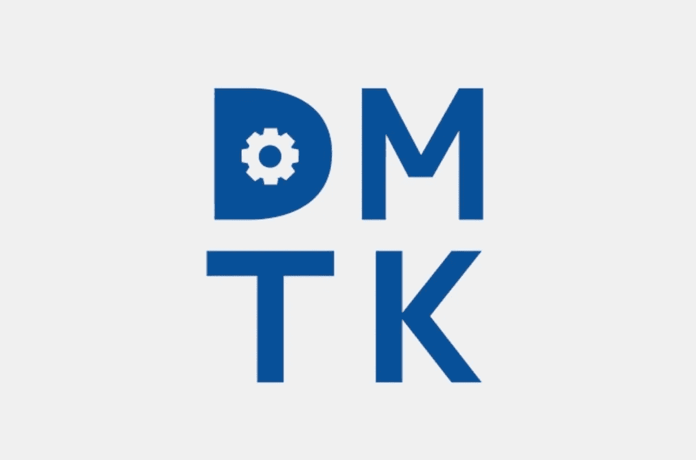

# LightGBM 的案例

> 原文：<https://towardsdatascience.com/a-case-for-lightgbm-2d05a53c589c?source=collection_archive---------2----------------------->

Microsoft’s Distributed Machine Learning Toolkit

正如任何活跃的 [Kaggler](https://www.kaggle.com/) 所知，梯度推进算法，特别是 XGBoost，主导着竞赛排行榜。然而，在 2016 年 10 月，[微软](https://medium.com/u/940e606ec51a?source=post_page-----2d05a53c589c--------------------------------)的 DMTK 团队开源了它的 [*LightGBM*](https://github.com/Microsoft/LightGBM) 算法(附带 Python 和 R 库)，它肯定会占据优势。因此，社区已经开始比较鲜为人知的 LightGBM 和 XGBoost 的性能。

在这篇文章中，我认为提及我使用 LightGBM 而不是 XGBoost 的情况以及我在它们之间经历的一些权衡是有价值的。

# 使用

我对这两种算法的使用都是通过它们的 Python、Scikit-Learn 包装器。我通常选择使用算法的 Scikit-Learn 包装器，因为它创建了一个在相同数据上实现和评估各种算法的标准。它还允许通过 Scikit 创建预处理管道，然后可以通过多种算法轻松应用该管道。

除了每个平台的特定超参数之外，这两种算法的实现几乎完全相同。但是，任何熟悉典型 SKLearn 流程的人都可以使用 LightGBM。

# 装置

安装 LightGBM 的 CPU 版本轻而易举，可以通过 pip 安装。我希望我可以说，GPU 版本是轻而易举的，但可悲的是，还有更多额外的步骤要采取。您必须安装 Cuda、Boost、CMake、MS Build 或 Visual Studio 和 MinGW。在路径中添加了一些东西之后，我很幸运能够通过运行以下命令来安装 GPU 实现:

> pip 安装灯 GBM-install-option =-GPU

# 速度

对我来说，这是 LightGBM 真正闪耀的地方。使用默认参数，我发现我的 XGBoost 基线通常会超过 LightGBM，但是 LightGBM 运行的速度非常快。它已经针对最大并行化运行进行了优化，这意味着它在 CPU 和 GPU 上都可以真正运行。

在优化模型时，这种加速允许更快的超参数搜索。对我来说，这就是 LightGBM 如此强大的原因。它允许开发人员在更短的时间内随机/网格搜索参数范围，与在相同时间段内使用 XGBoost 相比，允许测试更多可能的组合。这种速度还允许添加交叉验证测试，以获得更准确的模型泛化度量。我相信，快速优化的能力在很大程度上超过了默认性能的权衡。

如果你对阅读更多关于 LightGBM 的性能感兴趣， [Laurae](https://medium.com/u/1ff412f60adb?source=post_page-----2d05a53c589c--------------------------------) 有一篇很棒的[深度文章](https://medium.com/implodinggradients/benchmarking-lightgbm-how-fast-is-lightgbm-vs-xgboost-15d224568031)将它与 XGBoost 进行了比较。

# 分类特征支持

使用 LightGBM 的另一个好处是它通过指定列而不是使用一键编码(OHE)来支持分类特性。OHE 可能很重，因为它可以显著增加数据集的维度，这取决于类别+选项的数量。在微软的结果中，他们看到了高达 8 倍的训练速度提升。这个特性使它更适合 GPU 训练，因为它利用了更有效的方法来处理分类数据。这种支持最酷的部分可能是它有一个自动模式来检测 Pandas 数据帧中指定的分类列，大大减少了转换数据所需的预处理量。

# 包装东西

随着梯度推进算法越来越受欢迎(由 Kaggle 社区提供)，我认为与鲜为人知的库分享一些见解是有价值的。我相信在某些情况下，它对开发人员来说比其他库有着巨大的潜力，并建议每个数据科学家下次开始 ML 项目时都尝试一下。