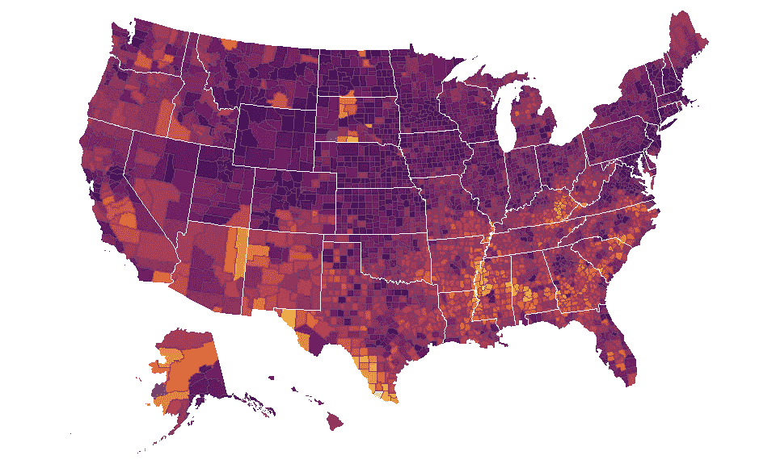
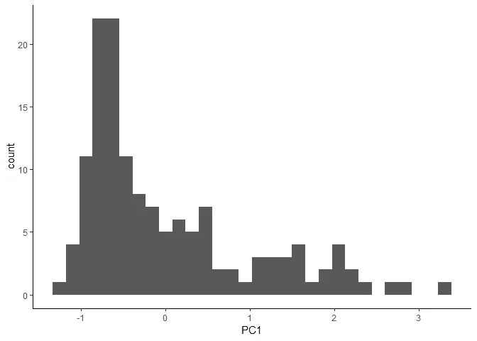
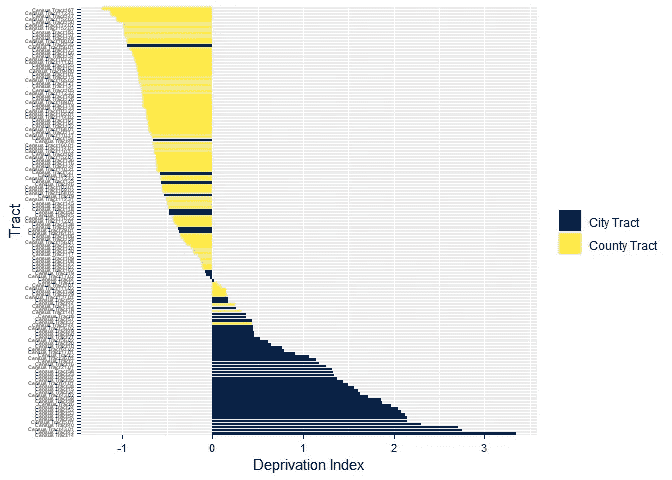
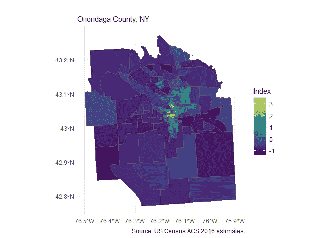
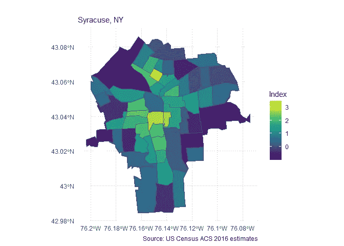
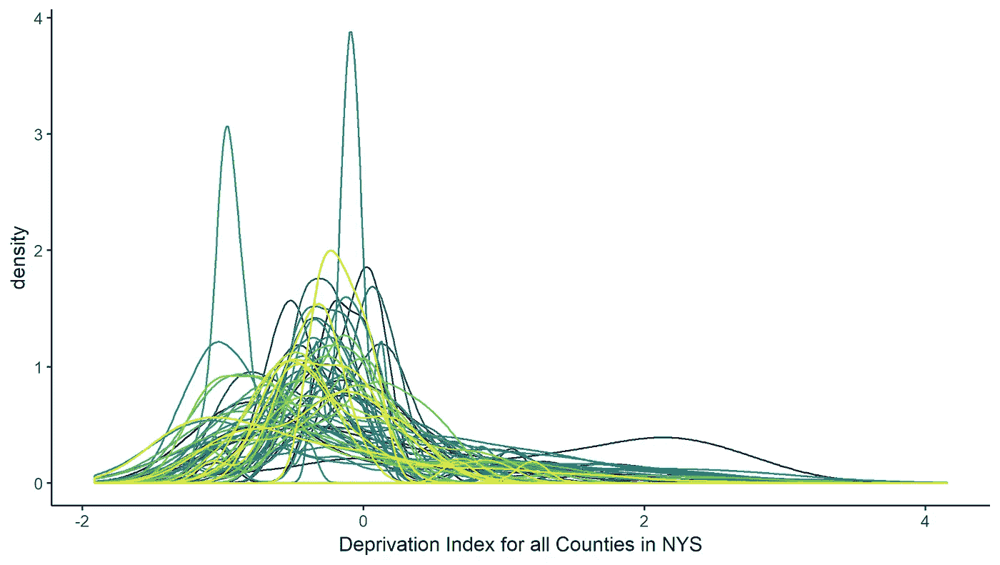
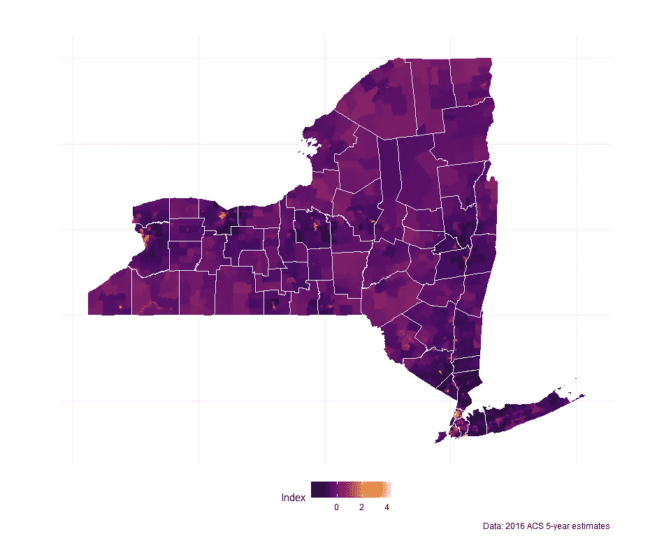

# 基于人口普查的贫困指数

> 原文：<https://towardsdatascience.com/a-census-based-deprivation-index-using-r-7aa738da697c?source=collection_archive---------9----------------------->



Area deprivation scores at the county-level. Brighter colors represent higher deprivation relative to all counties in the U.S.

你住在哪里对你的健康有重大影响；更具体地说，生活在贫困地区的人健康状况更差。因此，剥夺指数经常用于健康研究。为了估计邻里层面的剥夺，大多数研究人员依赖于人口普查数据，但是，收集和清理这样的数据需要相当多的时间和精力。在这里，我展示了一个 R 函数，它收集数据并不费吹灰之力就创建了一个标准化的贫困指数。

要运行这个功能，你需要[tidysensus](https://walkerke.github.io/tidycensus/)和 [psych](https://personality-project.org/r/psych/) 软件包。所有代码都发布在 [GitHub](https://github.com/iecastro/deprivation-index) 中。

**工作原理**

该指数是基于刀子乐队和他的同事们的方法论。简而言之，他们发现从八个特定变量中提取的主成分最能代表邻里层面的剥夺。按照他们的方法，普查区一级需要以下变量:

不到 HS 学位的百分比(25 岁及以上)

低于贫困线的百分比

有 18 岁以下子女的女户主家庭百分比

%从事管理、科学和艺术职业

拥挤家庭中的百分比(每个房间超过 1 人)

%有公共援助或食品券

失业百分比(16-64 岁劳动力)

家庭年收入低于 3 万英镑的百分比

该功能收集普查估计值，转换变量，然后执行主成分分析(PCA)。对于给定的县，在区域级别收集估计值。由于该指数已在以前的研究中得到验证，PCA 仅提取一个成分。

**使用函数:countyND()**

该函数通过输入参数 *State* 和 *County 来工作。*输出变量“PC1”是分析中每个相应人口普查区(ct)的剥夺指数得分。较高的指数分数代表较高的剥夺感。这些分数可以单独使用，也可以导出用于统计模型。

# **例题**

这是纽约州奥农达加县人口普查区的贫困分布情况。

```
NDI <-countyND("NY","Onondaga")
ggplot(NDI, aes(PC1)) + geom_histogram() + theme_classic()
```



我通过分类进一步探索剥夺分数的分布。通过根据锡拉丘兹市内外的地理位置对人口普查区进行分类，可以清楚地看出，大多数城区的邻里贫困程度高于县城。

```
NDI$type[as.numeric(NDI$GEOID) < 36067006104] <- "City Tract"
NDI$type[as.numeric(NDI$GEOID) >= 36067006104] <- "County Tract"

ggplot(NDI, aes(reorder(Tract, -PC1), PC1)) + geom_col(aes(fill = type)) + coord_flip() +
  theme(axis.text.x = element_text(size = 8, color = "black"), 
        axis.text.y = element_text(size = 4, color = "black")) +
  scale_fill_viridis_d(option = "cividis") + 
  labs(fill = "", x = "Tract", y = "Deprivation Index")
```



**专题制图**

该指数可通过其空间分布进行进一步研究。绘制剥夺分数图显示，高度剥夺集中在锡拉丘兹市。



然而，仅绘制锡拉丘兹市的剥夺分数，一些变化仍然是显而易见的。



此外，通过省略*县*参数，该函数将返回给定州中所有县的贫困指数。

```
NYND <- countyND("NY")ggplot(NYND, aes(PC1, color = County)) + geom_density() + 
  theme_classic() +  guides(colour=FALSE) + 
  scale_color_viridis_d() +
  labs(x = "Deprivation Index for all Counties in NYS")
```



纽约贫困的空间分布:



Neighborhood-level deprivation across New York

所有的代码和更多的例子可以在 [GitHub](https://github.com/iecastro/deprivation-index) 上找到。我为自己的分析编写了这个函数；但是，也许其他人也会发现它很有用。