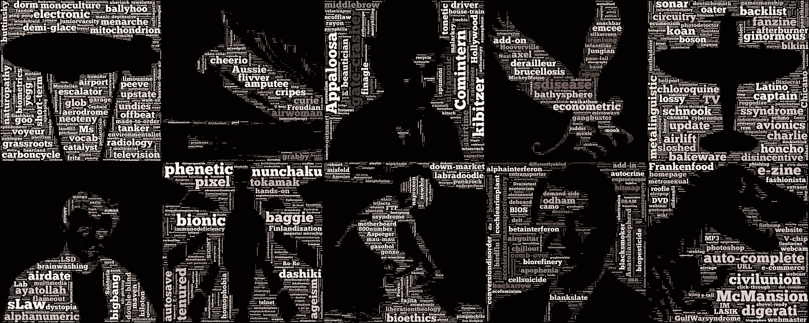
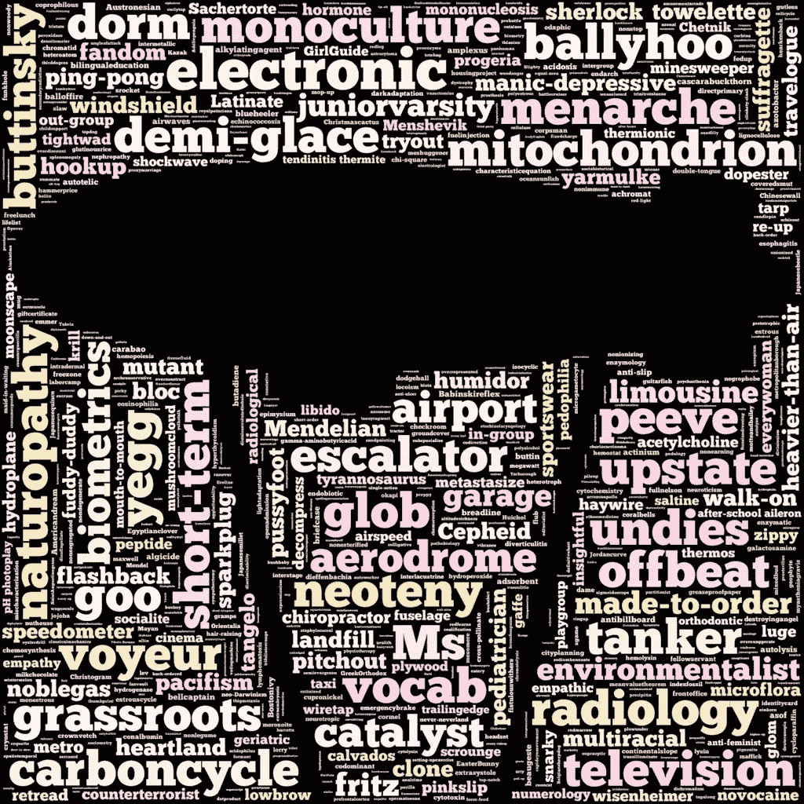
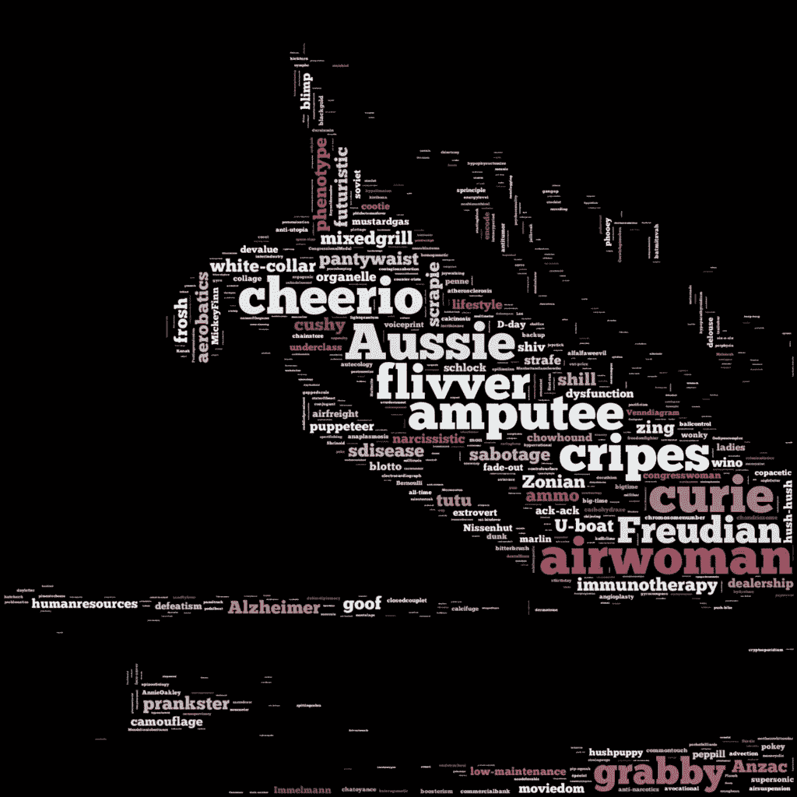
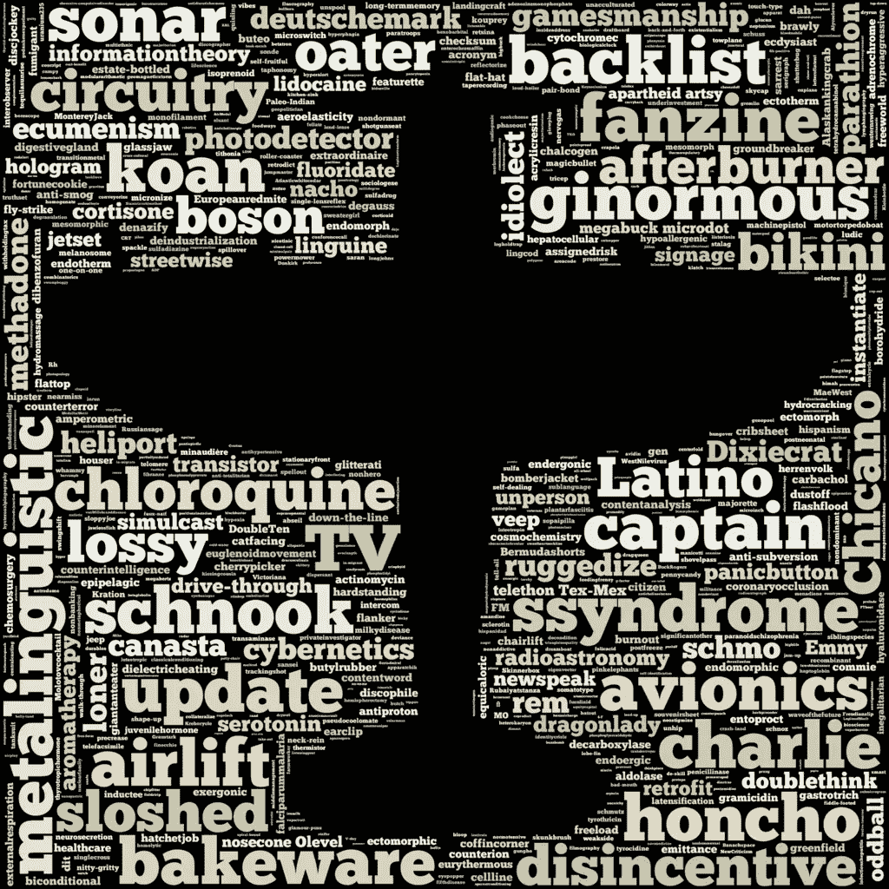
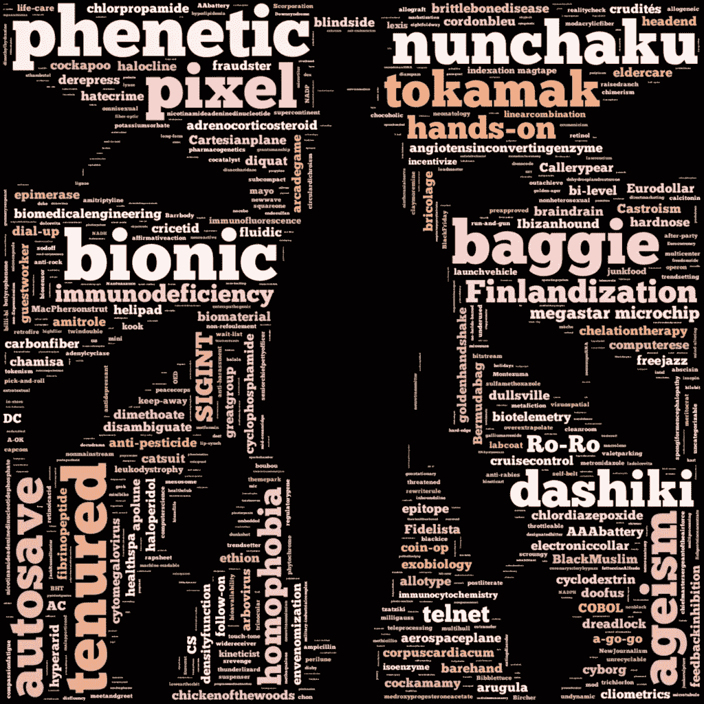
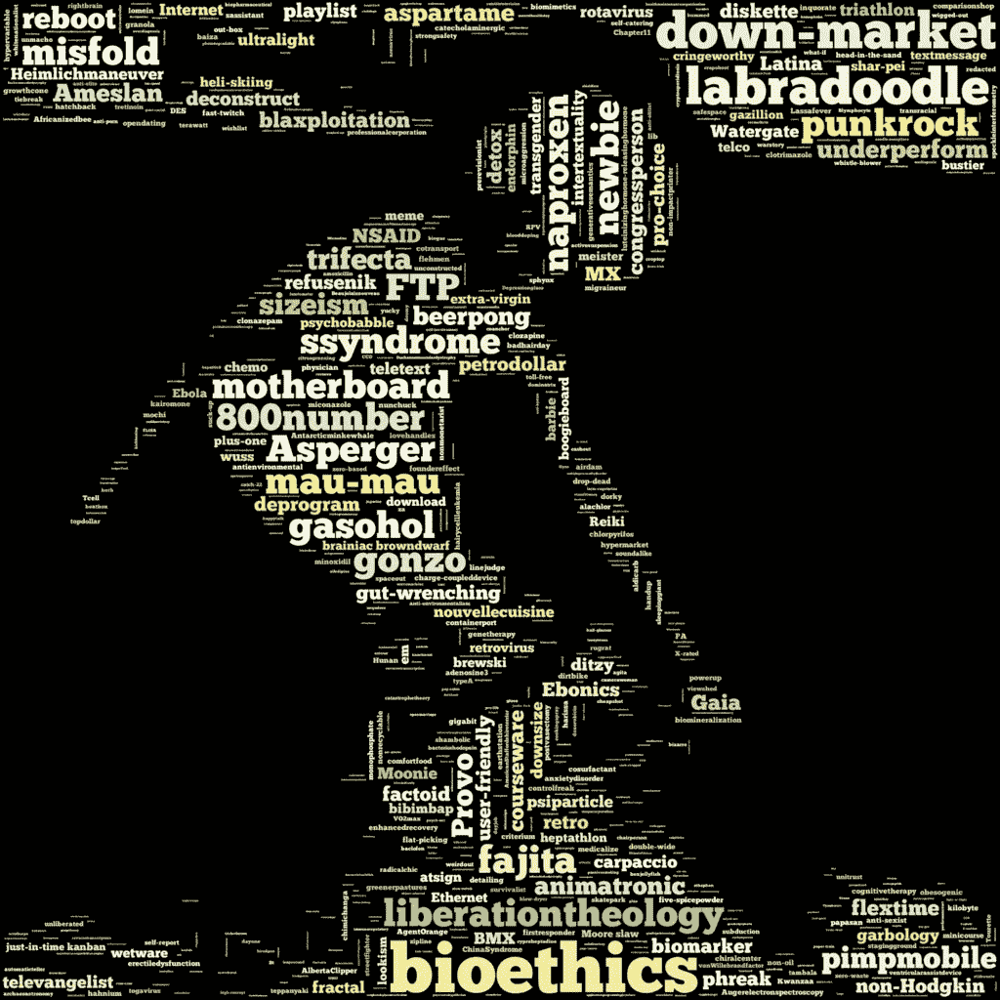
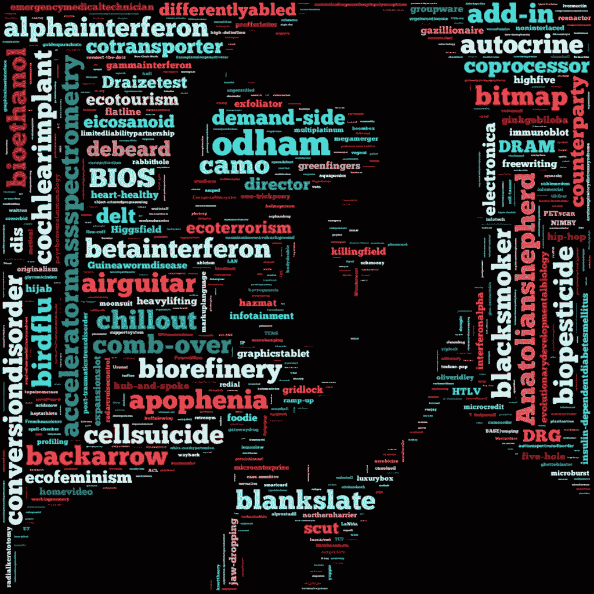
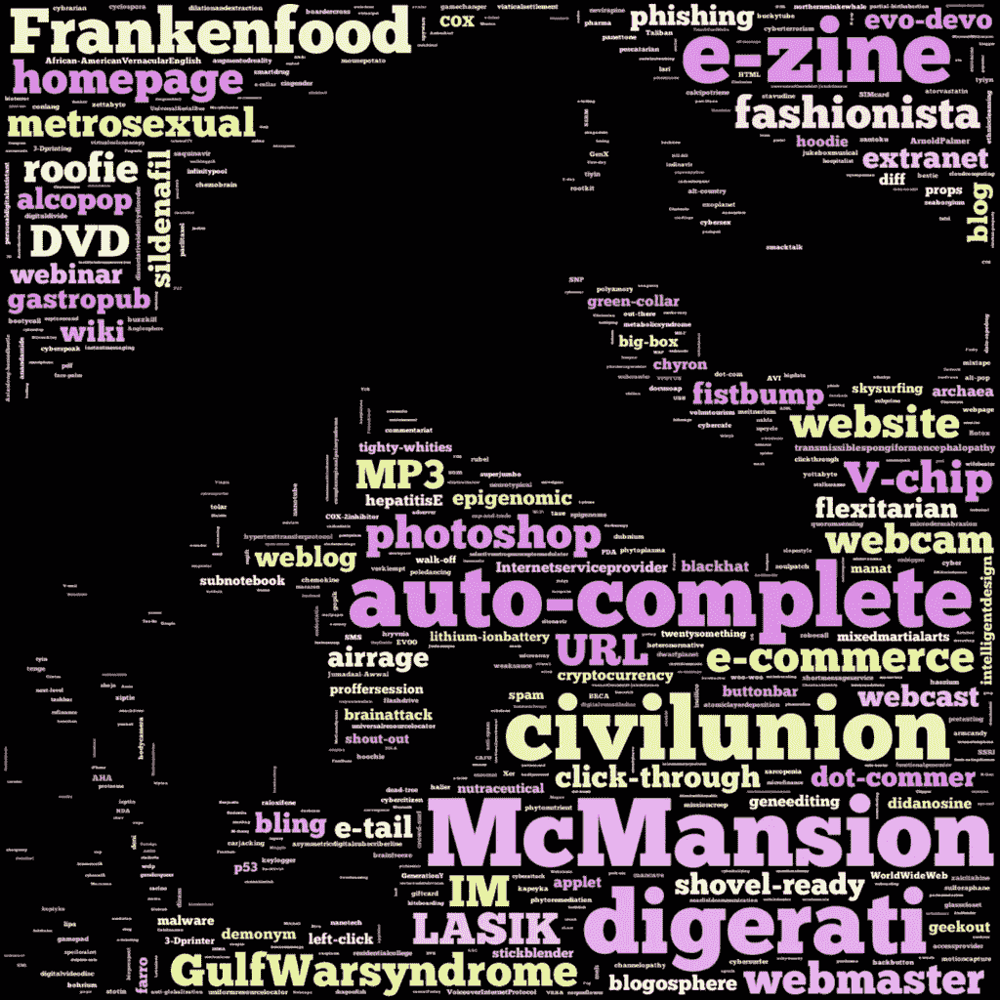
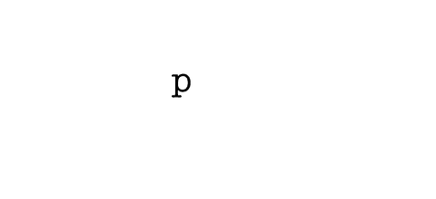

# 单词云的一个世纪

> 原文：<https://towardsdatascience.com/a-century-in-wordclouds-72be5f5ca391?source=collection_archive---------10----------------------->

由于缺乏作为可视化工具的精确性，云受到了 T2 的批评。但是它们看起来很有趣。

接下来是一系列的单词云，分别代表 20 世纪的每一个十年。每个十年的词云中的每个词都在那个十年的某个时候出现在《韦氏词典》或《牛津英语词典》中。

不过，不要让我知道具体是哪一年，因为两本词典在增加单词的时间上有所不同(因为一本反映了美国英语，另一本反映了英国英语)。每个人都可能在一个词进入流通领域后很久才加上这个词。有些词可能在某个特定的十年中出现，不是因为新造的，而是因为获得了新的含义。

我想你会同意，虽然这些词中的大多数以某种方式结合，抓住了特定十年的要点。他们抓住了它的俚语(是的， *mook* 听起来像 30 年代的 slam)，它的重大事件(两次世界大战分别发生在十几岁和四十多岁的年轻人身上)，以及它的技术进步(计算机术语甚至在 20 世纪 50 年代就开始出现，并且每十年变得更加流行)。

你还会注意到，很多看起来很现代的词出现的时间比你想象的要早得多(例如，*迅猛龙*，早在 20 年代就首次出现了)。

滚动愉快。。。

# 1900

# 1910

# 20 世纪 20 年代

# 20 世纪 30 年代

# 二十世纪四十年代

## 制作单词云的注意事项

我想把这些整合到一个 D3.js 可视化中——看着单词从一个 wordcloud 到下一个 word cloud 以 SVG 的形式动态显示会很酷——但是我找不到一个简单的方法来做屏蔽(不用写很多代码)。

我选择使用这个 Python repo ，它很棒，支持遮罩和自定义颜色。(遗憾的是，你不能让它输出 SVG，我可以将 SVG 加载到 D3.js 中，然后嵌入动画等。)

[这篇博客文章](https://www.yourhomeonlybetter.com/a-color-story-by-decade/)有助于选择十年看起来合适的颜色(尽管我在这里和那里调整了她的调色板，以使每个十年都不同)。