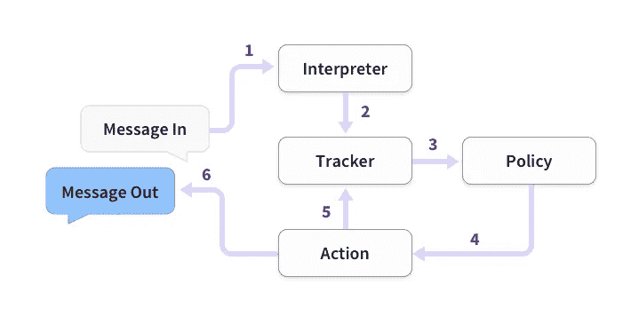

# 来自未来的聊天机器人:用 Rasa 构建端到端的对话助手

> 原文：<https://towardsdatascience.com/a-chatbot-from-future-building-an-end-to-end-conversational-assistant-with-rasa-ai-51a1c93dabf2?source=collection_archive---------4----------------------->


Figure1: A Chatbot from future! by [rawpixel](https://unsplash.com/@rawpixel?utm_source=medium&utm_medium=referral) on [Unsplash](https://unsplash.com?utm_source=medium&utm_medium=referral)

Y 你可能已经在我的[上一篇文章](/automate-the-boring-task-chatbots-in-enterprise-software-dc83cc8f09d8)中看到，我一直在使用 [Rasa](https://rasa.com/) 构建聊天机器人。你会在 Rasa 上找到很多使用 Rasa APIs 构建聊天机器人的教程。但是我没有发现任何关于这些 API 的细节，不同的 API 参数是什么，这些参数是什么意思等等。在这篇文章中，我不仅会分享如何使用 Rasa 构建聊天机器人，还会讨论使用的 API 以及如何使用 Rasa 模型作为服务从 NodeJS 应用程序进行通信。

# 什么是 Rasa

Rasa 是一个开源的对话式人工智能框架。我喜欢 Rasa 的一点是，你不必拘泥于预先构建的模型或用例(Dialogflow 等)。).因此，您可以根据您的使用情形对其进行定制，这可以成为一项市场优势。Rasa 不是一个基于规则的框架(如僵尸工具)，你不需要像 Dialogflow、Microsoft LUIS 或 Amazon Lex 那样担心将你的数据放在别人的云中。

Rasa 有两个主要组件— [Rasa NLU](https://nlu.rasa.ai/) 和 [Rasa 核心](https://core.rasa.ai/)。

NLU 是*自然语言理解者*。假设用户说“`I want to order a book`”。NLU 的工作就是接受这个输入，理解用户的*意图*并在输入中找到*实体*。例如，在上面的句子中，意图是*订购*，实体是*图书*。Rasa NLU 内部使用`Bag-of-Word (BoW)`算法寻找意图，使用`Conditional Random Field (CRF)`寻找实体。尽管您可以使用其他算法通过 Rasa 来查找意图和实体。为此，您必须创建一个自定义管道。关于定制管道的细节超出了本文的范围。如果你有兴趣，可以查看[这个链接](https://rasa.com/docs/nlu/master/choosing_pipeline/)。

Rasa 核心的工作主要是为聊天机器人生成回复消息。它采用 Rasa NLU ( *意图*和*实体*)的输出，并应用机器学习模型来生成回复。我们将在稍后的 API 讨论中讨论更多可能的机器学习模型。



Figure2: Basic steps of Rasa app internally works to reply a message. Reference [here](https://rasa.com/docs/core/architecture/).

如上图所示，输入消息由一个`Interpreter`解释以提取`intent`和`entity`。然后，它被传递给跟踪对话当前状态的`Tracker`。`Policy`应用机器学习算法来确定什么应该是回复，并相应地选择`Action`。`Action`更新`Tracker`以反映当前状态。

# **打造聊天机器人**

假设我们正在构建一个客户服务聊天机器人。创建一个名为`customer_bot`的目录，并在其中创建一个名为`data`的目录。还要创建一个名为`config_spacy.yml`的配置文件

```
$mkdir customer_bot
$cd customer_bot
$mkdir data
$vi config_spacy.yml
```

将[中的`config_spacy.yml`文件内容复制到此处](https://github.com/nahidalam/customer_bot/blob/master/config_spacy.yml)。在配置文件中，我们指定了用于构建各种模型的管道类型。在这种情况下，我们使用`Spacy`和`Scikit-learn`来构建管道，并且仅支持如下配置中指定的`English`语言:

```
language: "en" 
pipeline: "spacy_sklearn"
```

您可以使用 Rasa 支持的其它管线类型，也可以创建自定义模型管线并在配置中指定它。

## **建立 NLU 模型**

首先，我们需要建立 NLU 模型。拉莎·NLU 使用监督学习模型工作。因此，您需要训练数据来训练 NLU 模型。在训练数据中，我们需要指定该数据的`intent`和`entity`是什么。例如，如果机器人的输入文本是' *hi* ，您可以将意图定义为' *greet* '。在这种情况下没有实体。因此，训练数据集如下所示

```
{        
 "text": "hi",        
 "intent": "greet",        
 "entities": []     
}
```

你可以使用我的 github 复制粘贴整个[训练数据](https://github.com/nahidalam/customer_bot/blob/master/data/data.json)用于代码中。将其命名为`data.json`并放入`data`文件夹中。

手动创建这些 trining 数据非常耗时。因此，相反，你可以使用这个[网络用户界面](https://rasahq.github.io/rasa-nlu-trainer/)来创建数据来训练拉沙 NLU。

现在使用`data.json`和`config_spacy.yml`，我们需要训练一个 NLU 模型。创建`nlu_model.py`并放在`customer_bot`文件夹下。NLU 模特培训代码如下:

我们可以像下面这样调用上面的`train_nlu`方法:

```
if __name__ == '__main__': 
    model_directory = train_nlu('./data/data.json', 'config_spacy.yml', './models/nlu')
```

让我们看看这是怎么回事。我们正在使用`load_data`加载训练数据。`load_data`函数读取训练数据并返回一个`TrainingData`对象。然后我们使用通过`config_spacy.yml`传递的配置创建一个`Trainer`对象。现在使用那个`trainer`对象，我们实际上可以训练数据来创建一个机器学习模型——在这种情况下，Rasa NLU 模型如图`trainer.train(training_data)`所示。一旦模型被训练，我们需要将模型保存在一个目录中。我们通过调用`Trainer`类的`persist`方法来实现。正如您在上面看到的，在`trainer.persist`中，我们指定了保存模型的目录，并为我们的模型指定了一个名称— `customernlu`。

既然我们已经训练并保存了模型，我们可以像下面这样运行 NLU 模型:

```
def run_nlu(model_directory): 
      interpreter = Interpreter.load(model_directory)
```

## **建立对话管理模式**

对话管理是 Rasa 核心的工作。在构建对话模型之前，我们需要定义我们希望对话如何流动。实质上，我们正在为对话模型创建一组训练示例。我们将创建一个文件`stories.md`并将其放在`data`文件夹中。让我们来看看`stories.md`的一组样本数据。

## 使用 stories.md 训练对话模型

```
## story_001
* greet
   - utter_greet
* order_product
   - utter_ask_product_name
* order_product[router=829]
   - slot{"router": "829"}
   - action_order_product
* goodbye
   - utter_goodbye
```

假设我们想要一个当用户说`Hi`时开始的对话。我们可以将意图定义为`greet`。当机器人发现一个`greet`意图时，它会回复`utter_greet`。`utter_greet`的内容将在后面的`domain`文件中定义。

## 插槽和动作

我们再举一个例子。假设用户说“`I want to order an 829 router`”。机器人明白这是一个`order_product`意图，实体是`router`。实体的值是 829，这意味着有不同产品 ID 的路由器，但是用户只对 829 感兴趣。因此路由器及其值 829 在这里被定义为时隙的一部分`slot{“router”: “829”}`。插槽本质上是你的机器人的内存，被定义为一个键值对。更多关于插槽的信息可以在这里找到[。有时，来自机器人的回复消息不是静态消息。相反，机器人可能需要调用一些服务或执行一些其他计算来创建回复消息的内容。如上文`action_order_product`所示，这些通过`action`定义。在`action_order_product`中实际发生的事情将在`actions.py`中定义。](https://rasa.com/docs/core/slots/)

这个项目的`stories.md`文件可以在[这里](https://github.com/nahidalam/customer_bot/blob/master/data/stories.md)找到。

关于`stories`数据格式的详细说明是[这里的](https://rasa.com/docs/core/stories/)。

## 定义域

我们将为名为`customer_domain.yml`的域创建一个`yml`文件，并将其放在`customer_bot`目录中。域文件指定了`slots`、`intent`、`entities`、`actions`和`templates`(例如在`utter_greet`对不同话语的示例回复)。这个项目的域文件可以在这里找到[。](https://github.com/nahidalam/customer_bot/blob/master/customer_domain.yml)

## actions.py

如果您的 bot 的回复消息都是静态消息，您不需要任何操作。但最有可能的情况并非如此。任何真实的机器人应用程序都会与一些其他服务进行通信，或者至少为它的一些回复进行实时计算。在我们的项目中，一旦产品被订购，机器人应该回复一个确认号。对于不同的用户/产品，此确认号码会有所不同。因此，产品订购流程将成为行动的一部分。为了简单起见，在我们当前的代码中，我们显示了一个硬编码的确认号，假设产品订单是成功的。

How to write an action in Rasa

你可以在这里找到这个项目[的`actions.py`文件。](https://github.com/nahidalam/customer_bot/blob/master/actions.py)

## 训练对话模型

为了训练对话模型，我们将编写一个函数`train_dialogue`。该函数需要 3 个参数——域文件、故事文件和训练后保存对话模型的路径。在 Rasa 中，我们使用代理类来训练对话模型。您通过传递`domain`文件并指定一个`policy`来创建一个`agent`对象。政策本质上是模型。例如`KerasPolicy`内部使用 [LSTM](https://colah.github.io/posts/2015-08-Understanding-LSTMs/) 网络。在你的训练数据中记忆对话。根据您使用的 Rasa 核心版本，您可能有不同类型的可用策略。更多关于政策[这里](https://rasa.com/docs/core/policies/)。

我们必须使用`agent`对象的`train`方法来训练使用`stories.md`文件。如上图所示，您可以指定`epochs`、`batch_size`和`validation_split`。我们将使用`agent.persist`保存模型。

要运行对话模型，我们需要一个如`run_customer_bot`方法所示的`interpreter`对象。解释器做它所说的——解释输入给机器人的文本。凭直觉，您可能会理解，您需要之前创建的`NLU model`来创建一个`interpreter`对象。因为 NLU 的工作是解释传入的文本——理解`intent`和`entity`。然后您需要创建一个`agent`对象，它接受`interpreter`对象和您刚刚通过`train_dialogue`方法创建的`dialogue model`。一旦有了代理对象，就可以使用`agent.handle_channel()`来运行将进行对话的机器人。在这种情况下，我们使用 Mac 终端作为输入/输出网关，因此我们将`ConsoleInputChannel()`作为`agent.handle_channel`的参数传递。Rasa 核心支持一些其他的输入通道或者你可以创建你自己的自定义通道。更多关于`interpreter`的信息可以在这里找到[。](https://rasa.com/docs/core/api/interpreter/)

你们中的一些人可能已经注意到`dialogue_management_model.py`不是图 2 的 100%反映。例如，`dialogue_management_model.py`中没有使用`Tracker`对象。这是因为图 2 反映了内部发生的事情，而不一定是您用代码编写的内容。您仍然可以使用`tracker`功能来了解对话的当前状态。关于追踪器更多的是[这里](https://rasa.com/docs/core/api/tracker/)。

# 怎么跑

本教程是在 MacBook 上完成的。按照 Rasa 文件安装 [Rasa NLU](https://rasa.com/docs/nlu/installation/) 和 [Rasa 核心](https://rasa.com/docs/core/installation/)。对于本教程，我使用了 NLU 版本`0.12.3`和核心版本`0.9.0a6`

从我的 github 下载[完整代码](https://github.com/nahidalam/customer_bot)。

创建 NLU 模式

```
$python nlu_model.py
```

创建对话模型。*注释*出`__main__`里面的`run_customer_bot()`方法。然后运行下面的命令。

```
$python dialogue_management_model.py
```

现在*取消`__main__`处`run_customer_bot()`方法的*注释，*注释掉`train_dialogue()`方法的*。然后再往下面跑。

```
$python dialogue_management_model.py
```

现在，您应该已经在终端中运行了 bot。

# 将模型作为服务使用

一旦您准备好了 NLU 和对话模型，您就可以将 Rasa 核心作为服务器运行，并从服务器应用程序与它通信

```
$cd customer_bot
$python -m rasa_core.server -d models/dialogue -u models/nlu/default/customernlu/ --debug -o out.log --cors *
```

Rasa 核心服务器默认运行在端口`5005`上。假设用户说`hello`。这个用户输入来自 NodeJS 服务器中的前端到后端。NodeJS 服务器希望与运行在端口`5005`上的 Rasa 核心服务器通信，并希望从 Rasa bot 获得回复。下面的示例 NodeJS 代码可以做到这一点。

```
var messageToRasa = 'hello'
request.post(
      '[http://localhost:5005/conversations/default/respond'](http://localhost:5005/conversations/default/respond'),
      { json: { 'query': messageToRasa} },
      function (error, response, body) {
          if (!error && response.statusCode == 200) { //body[0].text is the reply from Rasa
              console.log(body[0].text)
              }
          else{
            console.log(`Error: \n${error}`);
          }
      }
  );
```

# 参考:

1.  Justina 关于如何使用 Rasa 构建一个简单聊天机器人的优秀教程
2.  使用 Rasa 时的一些有趣的[提示](https://hackernoon.com/building-a-chatbot-using-rasa-stack-intro-and-tips-c6d1057d8536)。
3.  揭开拉莎·NLU 的神秘面纱。
4.  条件随机场[简介](http://blog.echen.me/2012/01/03/introduction-to-conditional-random-fields/)。
5.  自然语言处理从业者指南[这里](/a-practitioners-guide-to-natural-language-processing-part-i-processing-understanding-text-9f4abfd13e72)。
6.  带插图的 LSTM 指南。
7.  更多关于 Rasa 核心[政策](https://medium.com/@souvikghosh_archidev/contextual-conversational-engine-the-rasa-core-approach-part-1-1acf95b3d237)的信息。