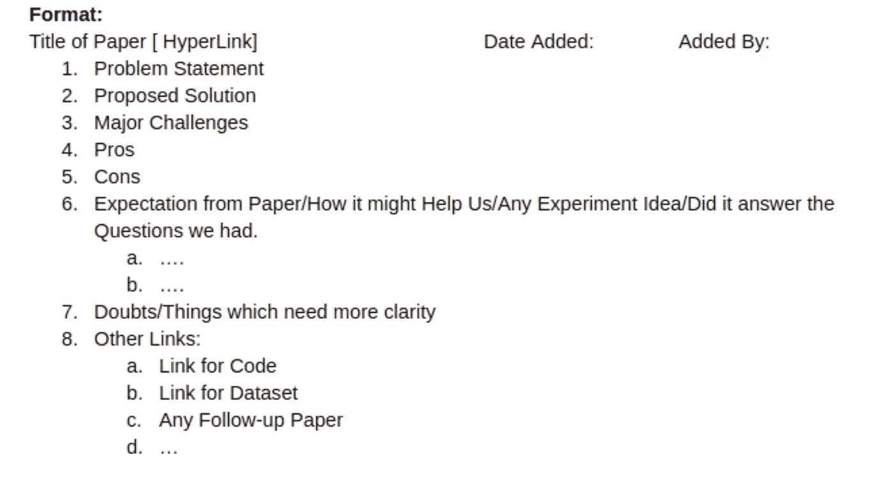

# 处理复杂 ML 问题的清单

> 原文：<https://towardsdatascience.com/a-checklist-for-working-with-complex-ml-problems-3ea729362db0?source=collection_archive---------15----------------------->

很多时候，我们会遇到复杂的机器学习问题，这些问题很难分解为简单的子问题。那些在创业公司工作的人会想到这样一个事实，当我们试图解决如此复杂的用例时，我们经常有从一个实验跳到另一个实验的习惯。

在[小队](http://squadplatform.com/)，我们的机器学习团队遇到了类似的挑战。尽管做了初步研究，我们有时会忘记我们的实验和方法。我们认识到，为了避免频繁的错误并在处理复杂的业务问题时保持清晰，我们必须有一个标准的清单。清单应该确保我们在解决任何复杂问题时不会遗漏关键要素。

在这篇博文中，我们将分享一个 ***三阶段清单*** ，它可以用来处理复杂的 ML 问题。每个阶段都有一些检查点，可以帮助系统地解决问题。

## **第一阶段:问题发现和需求收集**

**检查点 1:了解业务问题**

1.  了解问题的相关背景。
2.  用*[***第一原理思维技巧***](https://fs.blog/2018/04/first-principles/) 把一个复杂的问题分解成单元问题。*
3.  *需要解决什么？*
4.  *为什么需要这样做？*

***检查点 2:探索性数据分析***

1.  *将数据转换成有用的格式，以进行过滤、合并和其他数据操作。*
2.  *对几个项目进行抽样以了解数据的变化。*
3.  *积累所有可能的统计数据，了解数据的特性，例如，数据集中不同类别之间的类别分布重叠、数据偏斜度、名义变量。*
4.  *进行数据清理和分析，以消除任何异常值。创建相关的可视化。*
5.  *找到一个好的在这里读上[***EDA***](https://machinelearningmastery.com/understand-problem-get-better-results-using-exploratory-data-analysis/)。*

***检查点 3:定义目标***

1.  *准确定义每个单元问题的目标。*
2.  *准备相应的假设、约束和边缘案例。*
3.  *列出并确定可接受的指标，如给定问题的错误率/准确度/精确度/召回数。*

***关卡 4:澄清疑点***

1.  *消除相关团队/客户的所有疑虑。*
2.  *验证目标、约束、边缘情况、假设和前提。*

***检查点 5:详尽的文献列表/过去的研究***

1.  *阅读博客/文章，熟悉类似的问题和最新发展*
2.  *查找在线发表的研究论文和调查论文。*
3.  *探索类似问题的 Github 库。*

***检查点 6:选择有前途的文献***

1.  *浏览每一篇文献，仔细阅读引言、建议的工作、图表。*
2.  *尝试从高层次理解事物。*
3.  *检查研究的目的是否与用例或相关阻碍因素相匹配。*
4.  *核实文章是否介绍了现代研究，而不是历史工作。*
5.  *直观地验证，如果提出的算法和提到的数据集似乎很好地解决了你的问题。*

***关卡 7:文学深潜***

1.  *深入研究承诺的文献/可用的实现。*
2.  *从文献中收集见解:寻找预处理步骤、特征、提议的管道和算法/架构、数据集、超参数、评估标准、其他细微差异、挑战、所用技术的利弊。*
3.  *在开始执行之前，阅读 4-5 篇文献，也许可以从 2 篇或更多的文献中为你的实验寻找灵感。*
4.  *我们在文学深度挖掘班遵循的一种格式是*

**

*Format used for Literature Summary while doing an exercise on literature deep-dive.*

***检查点 8:设计实验和流水线/算法***

1.  *基于各种预处理、特征、分类层和从文献深度挖掘中获得的其他见解的组合，创建潜在方法的列表。*
2.  *根据上面的列表为你的目标设计相关的实验。*
3.  *过滤掉直觉上没有意义的实验。*
4.  *根据 a)简单、直观且易于构建的 [***常识基线***](/first-create-a-common-sense-baseline-e66dbf8a8a47) 对其余实验进行排序，b)根据数据集要求、实施和执行时间对实验的投资回报进行排序。*

***检查点 9:数据集估计和采集***

1.  *基于文献调查，我们可以收集相关的公共数据集或要求内部数据集。*
2.  *对不同实验所需的训练、验证和测试数据集的估计。*
3.  *考虑到数据中的错误/异常值，可能会要求比你需要的多 20-25%的数据。*
4.  *为数据集准备所需的模板(如果要由其他部门/客户共享)*
5.  *遵循此处的数据验证核对表以避免差距:*

*   *注释模板(id、标签、时间等。)*
*   *每个类别的训练集的样本数*
*   *每个类别验证集的样本数*
*   *每个类别测试集的样本数*
*   *整个训练/验证和测试集的最小和最大样本，考虑异常值。*

*6.准备两套:*

*   *一个 ***虚拟集*** ，用于在流水线实现过程中快速验证代码片段。*
*   *一个 ***最终设定*** 为最终实验岗位流水线实现。*

## ***第二阶段:实施和实验***

***检查点 10:执行代码***

1.  *为预处理、特征、特征提取器、提取特征的后处理、最终特征向量形状、模型系列、架构、评估方法和度量标准定义不同的步骤。*
2.  *为数据集和结果设计输入和输出格式。*
3.  *基于 EDA 创建培训、验证和测试集。使用各种采样程序，如平衡集、分层集和其他采样技术。*
4.  *设计和评估您的管道，同时考虑所有的边缘情况和限制。*
5.  *为再现性和调试在每个步骤实现记录器。*
6.  *使用虚拟数据集进行模拟运行，以验证管道的每个部分。捕捉 bug，修复，重新迭代。*
7.  *从功能和代码两个角度进行验证。*
8.  *一旦一切就绪，就开始实施。*
9.  *配置您的系统，以便您可以轻松快速地重复实验。*

***检查点 11:数据准备***

1.  *清理数据并移除异常值。验证此步骤后留下的数据是否足以用于训练和测试。*
2.  *了解是否需要平衡数据或不平衡数据。*
3.  *为所有父类和子类随机选择数据点。*
4.  *形成最终的数据集，好好洗牌。*
5.  *拆分数据并创建培训、验证和测试文件。*
6.  *如果可能，保存上述文件，可能有助于以后重复实验。*
7.  *训练集和验证集应该是测试集的近似副本，并且应该有足够的变化以有助于泛化。*
8.  *如果测试集与生产过程中预期的不同，尝试消除选择偏差。*
9.  *始终在管道中使用数据 id，即使在提供原始文件的不同排列时，也可以使用数据 id 将数据点特征映射回原始数据点。*
10.  *如果使用扩充数据集，请确保验证集和训练集不包含同一数据点基本样本的不同扩充样本，因为这可能会提高验证准确性。*

***检查点 12:超参数优化***

1.  *列出在选定的算法/管道上进行实验时可以改变的参数。*
2.  *从博客、文献综述中找到上述参数的最佳值。*
3.  *使用参数的默认值运行第一个实验，然后根据结果开始微调，以确定最佳值。*
4.  *如果模型经过训练，则分析验证数据的性能。*
5.  *如果有巨大的偏差，对超参数进行网格搜索。网格搜索可能会持续一段时间。拿杯咖啡！*
6.  *如果你得到了一个相关的模型，进行 K-fold-cross-validation 以确保模型不会过度拟合。*
7.  *来自 [***Andrew NG 在他的 DL 专业化课程***](https://www.coursera.org/lecture/neural-networks-deep-learning/welcome-Cuf2f) 中的一些提示，a)总是在试图平衡训练和验证准确性之前过度拟合模型。b)让训练精度首先膨胀，在第一次迭代中去除漏失/ L2 正则化或任何其他过拟合减少方法。c)在训练任何深度学习模型时，使用*模型检查点*、*学习速率衰减*和*提前停止*。*
8.  *此外，找到一个关于从[深度学习专业化课程](/deep-learning-specialization-by-andrew-ng-21-lessons-learned-15ffaaef627c)中学到的经验教训的博客。*

***检查点 13:定量和定性分析***

1.  *我们应该分配足够的时间来分析实验。*
2.  *检查在测试集上获得的模型的定性和定量结果。*
3.  *如果在测试集上表现不好，就找原因。a)可能测试数据与预期完全不同。b)可能测试数据中存在噪声。c)可能需要处理测试集。d)可能评价方法存在根本性错误。e)可能模型有问题。*
4.  *如果在先前实验的结果之后需要迭代，那么对实验失败的可能原因进行批判性分析。*
5.  *在这里从各方面获得感悟，尝试打破自己的设计，找到漏洞。*
6.  ***检查预处理数据:**预处理算法可能给出不正确的输出，这意味着我们的模型正在错误的数据上进行训练。*
7.  ***特征形状:**检查生成的特征和特征向量形状。*
8.  ***混洗数据:**在发送给模型进行训练之前，确保标签和数据点被混洗。*
9.  ***使用偏移裁剪特征值:**如果我们知道特征处理过程中的某些特定操作可能会使任何特征的任何字段的值为无穷大，那么我们应该考虑使用偏移。*
10.  *根据上述步骤决定可能的后续步骤，以获得好的和坏的结果。*
11.  *基于分析，重复或移动到下一组实验。*

***检查点 14:管理实验***

1.  *一个人可以按照电子表格来管理实验的一切，这样在后期就很容易比较了。*
2.  *每个实验应记录的细节，a)实验标识符/名称，b)管道标识符，c)数据集标识符，d)管道组件和超参数(可以分开用于预处理、特征、分类)，e)训练日志/模型日志，f)状态(成功、失败)，g)失败/成功的原因，h)跟进问题。*
3.  *做 ***根本原因分析*** 对于你的实验来说，哪些管用，哪些没用。记录失败和成功的原因。*
4.  *在这里找到关于计划和运行实验[的参考。](https://machinelearningmastery.com/plan-run-machine-learning-experiments-systematically/)*

## ***第三阶段:准备生产和后续步骤***

***检查点 15:整合***

1.  *弄清楚如何整合模型。为生产环境准备实施管道。*
2.  *让同行评审*
3.  *在生产环境中使用虚拟数据集测试模型。*
4.  *用最终设置测试模型，以检查生产结果与实验结果之间的任何差异。*

***检查点 16:采样***

1.  *根据误差率估计抽样规模。您可以使用 [SurveyMonkey](https://www.surveymonkey.com/mp/sample-size-calculator/) 计算器获得具有统计显著性的样本量。*
2.  *为您的模型进行必要的采样。*

***检查点 17:优化***

1.  *现在是时候进一步优化流水线的速度、自动化、精度/召回率和可扩展性了。*
2.  *选择下一个最佳渠道，重复或继续下一个业务问题:)*

*最后但同样重要的是，一旦你完成了你的研究/实验，做一个回顾。回顾和反思总是好的*

1.  **什么进展顺利？**
2.  **哪里出了问题？**
3.  **重要经验！**

*尽管数据科学问题本质上几乎是循环的，上面的检查点没有固定的顺序。我们希望上述清单可以帮助您更全面地解决下一个数据科学问题。*

*班里的 ML 团队一直在使用上面的检查表来解决各种问题。感谢 [Vedvasu Sharma](https://www.linkedin.com/in/ved-vasu-sharma-34588ba2/) 、 [Aniket Bhatnagar](https://www.linkedin.com/in/aniket-bhatnagar-a323a7117/) 、 [Medha Katehar](https://www.linkedin.com/in/medhakatehara/) a、 [Pragya Jaiswal](https://www.linkedin.com/in/pragya-jaiswal-61016172/) 为清单的清晰化所做的贡献。*