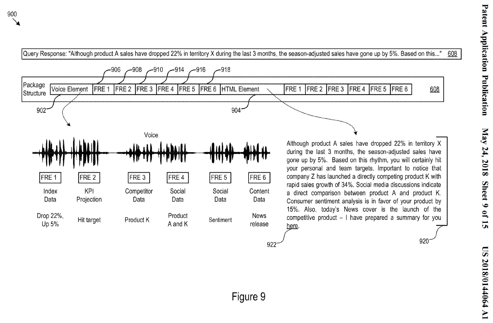
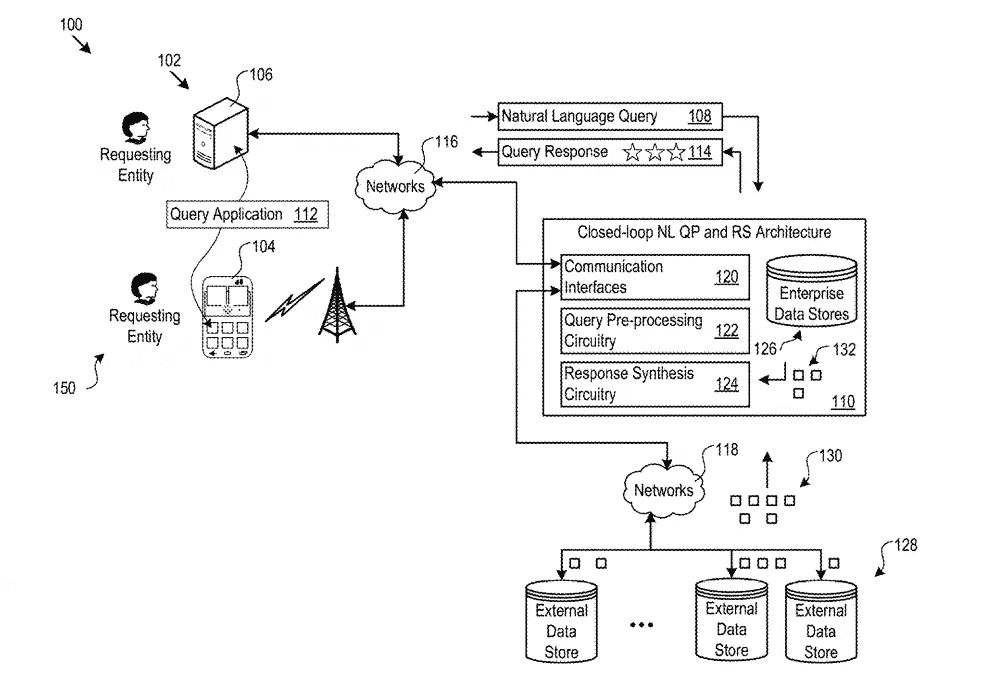
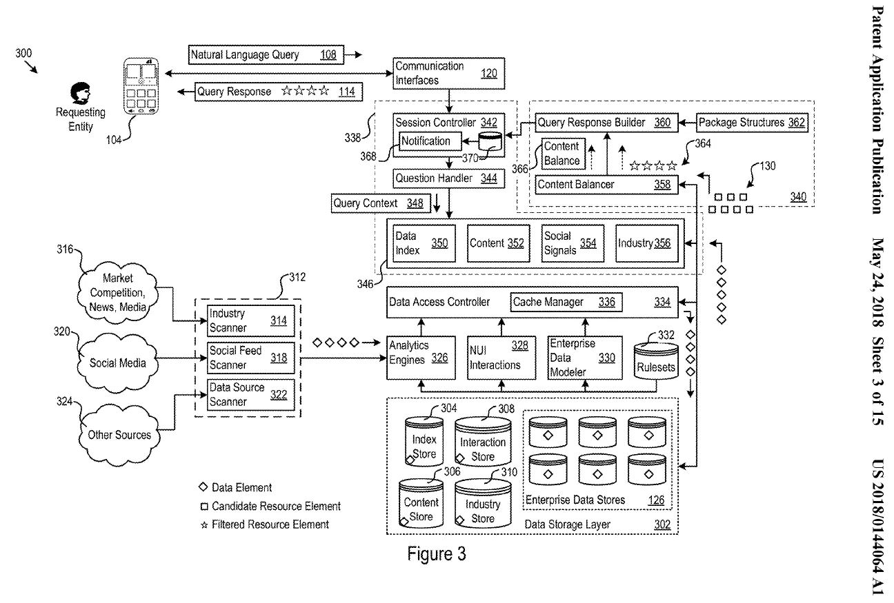

# 闭环 NLP 查询预处理器和响应合成器

> 原文：<https://medium.com/innovation-machine/a-closed-loop-nlp-query-pre-processor-and-response-synthesizer-16a72eb186d2?source=collection_archive---------12----------------------->

## 一项关于合成准确、引人入胜、上下文相关和个性化查询响应的专利申请

> 闭环自然语言查询预处理器和响应合成器架构接受自然语言查询并动态合成查询结果。查询结果可以是数据故事的形式。

*该架构识别、选择候选响应元素，并将其组合成一致且有意义的查询结果。该体系结构还实现了可适应的传递机制，该机制响应连接带宽、查询源偏好、查询源特征和其他因素。来自多个来源的反馈调整了处理后续查询的架构*

该体系结构实现了对自动生成有意义的查询响应领域中的许多困难技术问题的技术解决方案，假定手动搜索潜在相关信息的数据存储广泛且不可能。下面总结了一些技术解决方案的例子。该架构提供了用于回答问题的个性化机制，例如，响应于:提问者的角色和视角；时机考虑；语境；会话历史，包括先前的查询和响应，来自与查询实体具有相似特征的其他人的查询和响应历史，例如其他企业工程师或经理；和其他因素。该架构还可以标识输入查询中显式和隐式引用的实体，并在其搜索候选响应元素时使用所标识的实体。

该体系结构还实现查询预测，以在给定起始输入查询或输入查询序列和上下文的情况下，预先确定可能的后续查询。

该架构理解哪些度量、关键性能指标(KPI)和其他数据与输入查询的实质相关，响应于可配置的本体和其他模型，其内容为输入查询的实质提供预定义的上下文。例如，上下文可以描述一个特定的企业、它的市场、它的产品、工作流、度量以及它的企业活动。

该体系结构还识别输入查询中提出的问题类型，并将输入查询和候选响应元素与企业活动、目标、计划和其他目标相关联。该架构中的技术解决方案进一步标识输入查询中的时间参考框架、其在例如企业或竞争企业的预定义财政年度内的定位以及其他定时数据。该体系结构响应企业结构数据，例如组织结构和企业动态，以区分查询响应。

该体系结构的技术实现还实现了推荐引擎，用于在输入查询和查询结果的会话之后建议智能动作。推荐引擎提供了进一步的好处，即通过任何给定的查询和响应之后的建议、问题和数据故事来鼓励额外的交互会话。

[专利申请](http://appft.uspto.gov/netacgi/nph-Parser?Sect1=PTO2&Sect2=HITOFF&p=1&u=%2Fnetahtml%2FPTO%2Fsearch-bool.html&r=1&f=G&l=50&co1=AND&d=PG01&s1=krasadakis&OS=krasadakis&RS=krasadakis)